# 1. Product introduction  

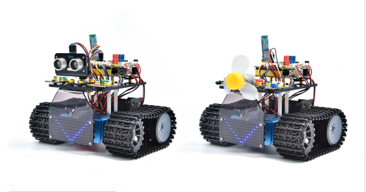

## 1.1 Introduction

This STEM educational V3.0 tank robot is newly upgraded, adding an line-tracking and a fire- extinguishing function. It vigorously enhances the relationship between kids and parents, and sparks children’s imagination through programming and coding.

In the course of assembly process, you can see its multiple functions like light following, line tracking, IR and BT remote control, speed adjustment and so on. Additionally, there are some small parts that can help you assemble the robot car. 

There are basic sensors and modules, such as a flame sensor, a BT sensor, an obstacle avoidance sensor, an line tracking sensor and an ultrasonic sensor are included.

The two tutorials for C language code of Arduino IDE and KidsBlock graphical programming are also suitable for the enthusiasts at different ages.

It is really the best choice for you.

## 1.2 Features

1. Multiple functions：Confinement, line tracking, fire extinguishing, light following, IR and BT remote control, speed control and so on.

2. Easy to build: assemble the robot with some parts.

3. High tenacity: Aluminum alloy brackets, metal motors, high quality wheels

4. High extension: connect many sensors and modules through motor driver shield and LEGO parts

5. Multiple controls: IR remote control, App control(iOS and Android system)

6. Basic programming：C language code of Arduino IDE and KidsBlock graphical programming.

## 1.3 Parameters

- Working voltage: 5v

- Input voltage: 6-9V

- Maximum output current: 1.5A

- Maximum power dissipation: 32W

- Motor speed: 5V 200 rpm / min

- Motor drive mode: dual H bridge drive(HR8833)

- Ultrasonic induction angle: \<15°

- Ultrasonic detection distance: 2cm-300cm

- Infrared remote control distance: 10 meters (measured)

- BT remote control distance: 30 meters (measured)

## 1.4 Kit List

| No.  |                             Name                             | QTY  |                       Picture                       |
| ---- | :----------------------------------------------------------: | ---- | :-------------------------------------------------: |
| 1    |                      Tank Robot Chassis                      | 1    |               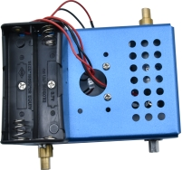                |
| 2    |  Keyestudio V4.0 development board (compatible Arduino UNO)  | 1    |   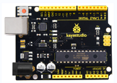   |
| 3    |         Keyestudio 8833 Motor Driver Expansion Board         | 1    |  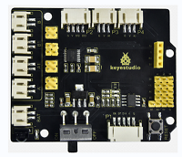   |
| 4    |                  DX-BT24 V5.1 BLE BT Module                  | 1    |  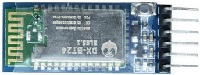  |
| 5    |                  HC-SR04 Ultrasonic Sensor                   | 1    |   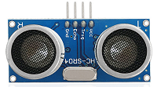   |
| 6    |                  Keyestudio 8\*16 LED Panel                  | 1    |   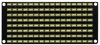   |
| 7    |                      Yellow LED Module                       | 1    |  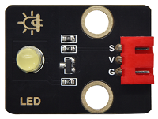   |
| 8    |                         Flame Sensor                         | 2    |     |
| 9    |                       130 Motor Module                       | 1    |  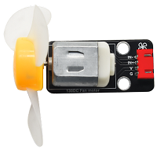   |
| 10   |                        Photoresistor                         | 2    |  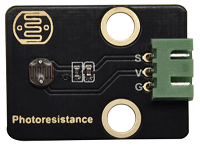   |
| 11   |              Acrylic Board for 8\*16 LED Panel               | 1    |  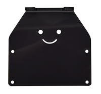   |
| 12   |                      Top Acrylic Board                       | 1    |  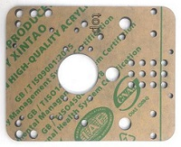   |
| 13   |                        Acrylic Board                         | 1    |       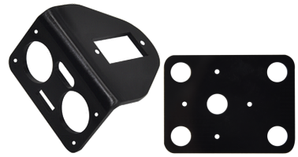        |
| 14   | Keyestudio JMFP-4 17-Key Remote Control (Batteries in KS0555F) | 1    |    |
| 15   |                  Keyestudio 9G 180 ° Servo                   | 1    |   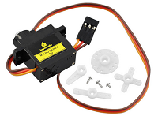   |
| 16   |                          USB Cable                           | 1    |   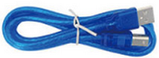   |
| 17   |                         Winding Pipe                         | 1    |   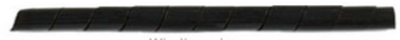   |
| 18   |                    3.0\*40MM Screwdriver                     | 1    |   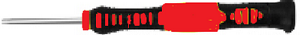   |
| 19   |                        3\*100MM Ties                         | 5    |   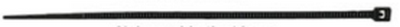   |
| 20   |                      L Type M2.5 Wrench                      | 1    |   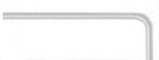   |
| 21   |                       L Type M3 Wrench                       | 1    |      |
| 22   |                      L Type M1.5 Wrench                      | 1    |      |
| 23   |                          Cardboard                           | 1    |      |
| 24   |  4P M-F PH2.0mm to 2.54 Dupont Wire (Green-Blue-Red-Black)   | 1    |   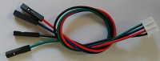   |
| 25   |        4P HX-2.54 Dupont Wire (Black-Red-White-Brown)        | 1    |  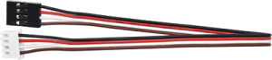   |
| 26   |                  5P JST-PH2.0MM Dupont Wire                  | 1    |   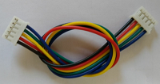   |
| 27   |     3P-3P XH2.54 to 2.54 Dupont Wire（Yellow-Red-Black)      | 1    |  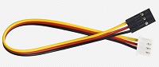   |
| 28   |     3P-3P XH2.54 to PH2.0 Dupont Wire（Yellow-Red-Black)     | 2    | 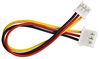 |
| 29   |     4P-3P XH2.54 to PH2.0 Dupont Wire（Yellow-Red-Black)     | 2    |  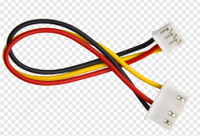  |
| 30   |    4P XH2.54 to PH2.0 Dupont Wire（Green-Blue-Red-Black)     | 1    |  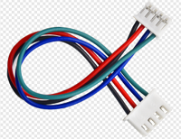   |
| 31   |                 M1.4\*8MM Round-head Screws                  | 6    |      |
| 32   |                          M1.4 Nuts                           | 6    |   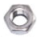   |
| 33   |                           M2 Nuts                            | 8    |      |
| 34   |                  M2\*8MM Round-head Screws                   | 8    |      |
| 35   |                 M1.2\*5MM Round-head Screws                  | 6    |   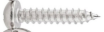   |
| 36   |                  M3\*6MM Round-head Screws                   | 18   |      |
| 37   |                  M3\*10MM Round-head Screws                  | 3    |      |
| 38   |                           M3 Nuts                            | 3    |      |
| 39   |               M3\*10MM Dual-pass Copper Pillar               | 4    |      |
| 40   |               M3\*40MM Dual-pass Copper Pillar               | 4    |  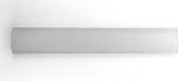   |
| 41   |       43093 Blue Technic Axle Pin with Friction Ridges       | 11   |   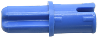   |
| 42   |                      4265c Technic Bush                      | 11   |      |
| 43   |                       Blue Jumper Cap                        | 4    |      |
| 44   |                        Red Jumper Cap                        | 4    |   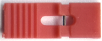   |
| 45   |                           spanner                            | 1    |               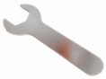                |
| 46   |                    chassis driving wheel                     | 2    |               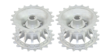                |
| 47   |                    chassis bearing wheel                     | 2    |               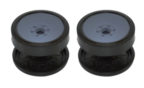                |
| 48   |                 M4*12MM hexagon socket screw                 | 2    |                               |
| 49   |                 M4*12MM hexagon socket screw                 | 2    |               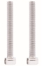                |
| 50   |                          belt track                          | 2    |               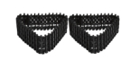                |

## 1.5Keyestudio V4.0 Development Board

You need to know that keyestudio V4.0 development board is the core of this smart car.

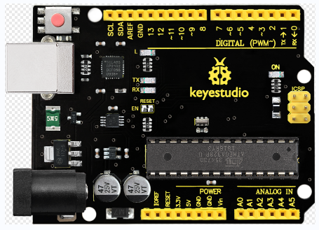

Keyestudio V4.0 development board is based on ATmega328P MCU, and with a CP2102 Chip as a UART-to-USB converter.

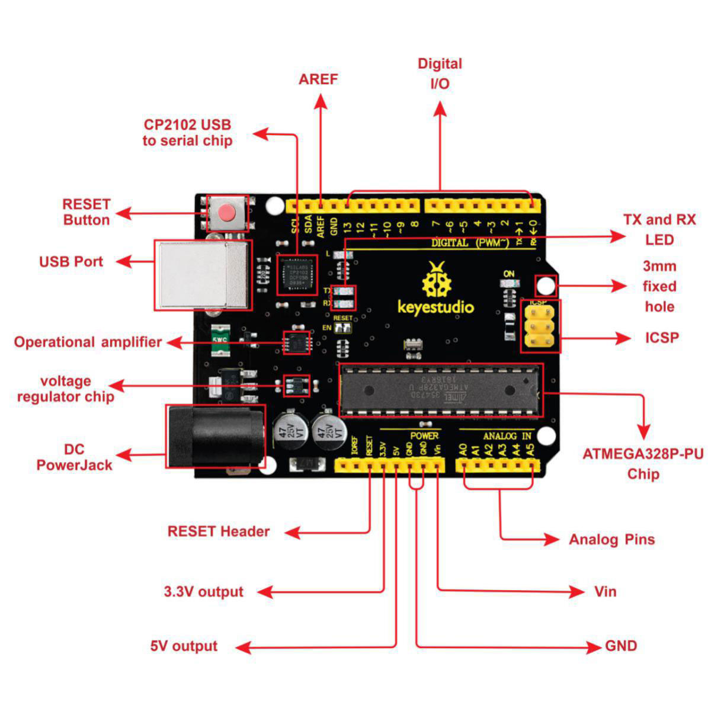

It has 14 digital input/output pins (of which 6 can be used as PWM outputs), 6 analog inputs, a 16 MHz quartz crystal, a USB connection, a power jack, 2 ICSP headers and a reset button.

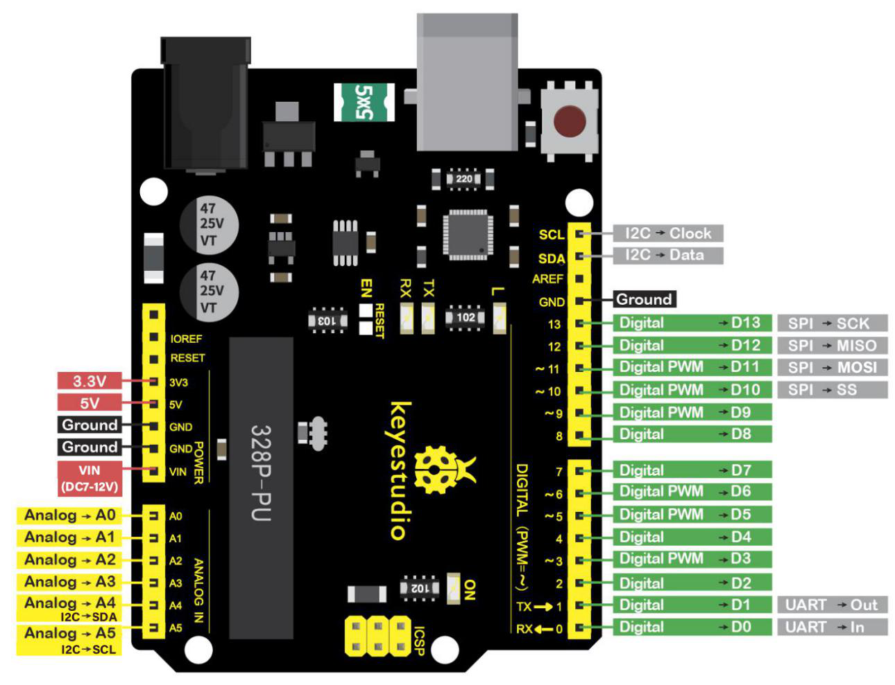

We can power it with a USB cable, the external DC power jack (DC 7-12V) or female headers Vin/ GND(DC 7-12V)

|      Micro controller       |                      ATmega328P-PU                       |
| :-------------------------: | :------------------------------------------------------: |
|      Operating Voltage      |                            5V                            |
| Input Voltage (recommended) |                         DC7-12V                          |
|      Digital I/O Pins       |       14 (D0-D13)  (of which 6 provide PWM output)       |
|    PWM Digital I/O Pins     |               6 (D3, D5, D6, D9, D10, D11)               |
|      Analog Input Pins      |                        6 (A0-A5)                         |
|   DC Current per I/O Pin    |                          20 mA                           |
|   DC Current for 3.3V Pin   |                          50 mA                           |
|        Flash Memory         | 32 KB (ATmega328P-PU) of which 0.5 KB used by bootloader |
|            SRAM             |                   2 KB (ATmega328P-PU)                   |
|           EEPROM            |                   1 KB (ATmega328P-PU)                   |
|         Clock Speed         |                          16 MHz                          |
|         LED_BUILTIN         |                           D13                            |
