# 5. Kidsblock Tutorial

## 5.1 Data download

Scratch information contains project ,please click to download for follow-up study.

Data download：[Data download](./Kidsblock.7z)

## 5.2 Software installation of Windows System

1. Download kidsblock:https://wiki.kidsbits.cc/projects/KidsBlock/en/latest/ 

   

2. software installation

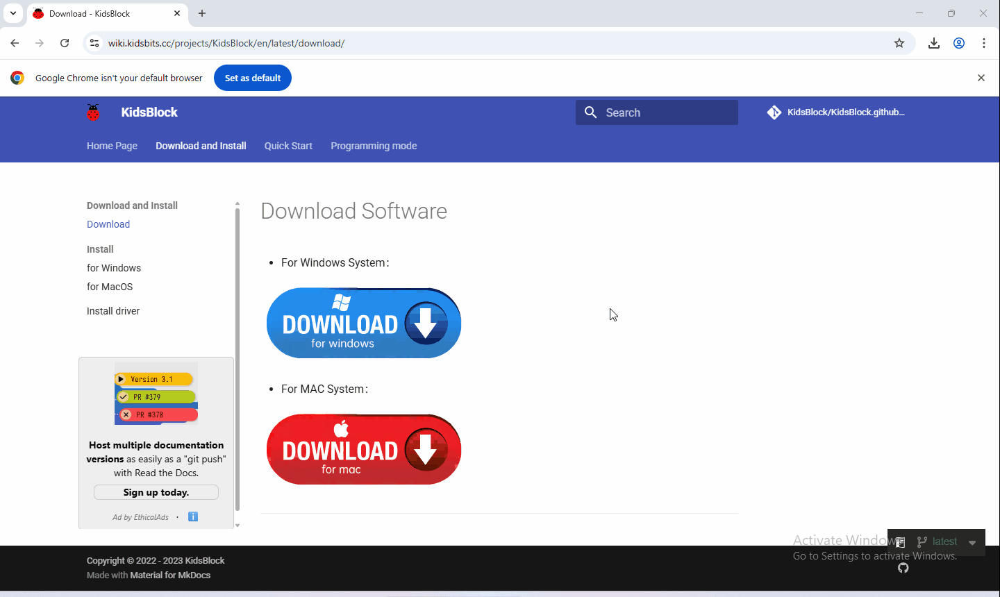

3. operating software

First connect the development board to the computer

If you encounter the error shown below during the installation of KidsBlock, a reinstallation may resolve the issue. Please refer to the video tutorial and follow the steps provided.

<iframe width="951" height="536" src="https://www.youtube.com/embed/ZOIm0tTaBeQ" title="KidsBlock Error Resolution" frameborder="0" allow="accelerometer; autoplay; clipboard-write; encrypted-media; gyroscope; picture-in-picture; web-share" referrerpolicy="strict-origin-when-cross-origin" allowfullscreen></iframe>

## 5.3 Software installation of Mac System

1.Download kidsblock: https://xiazai.keyesrobot.cn/KidsBlock.dmg Desktop 2.0.4.dmg.

2.Click KidsBlock, and  drag KidsBlock Desktop into Applications. 

3.Wait for installing. KidsBlock icon will show up in Launchpad if it is installed successfully.

## 5.4 Projects

In this section, we will start from a single sensor to complex experiments to introduce you how the tank robot works.

Note: (G), marked on each sensor and module, is the negative pole and connected to“G”, ”-”or “GND”on the sensor shield or control board ; (V) is the positive pole and linked with V , VCC, + or 5V on the sensor shield or control board.

### Project 1: LED Blinks

#### (1)Description：

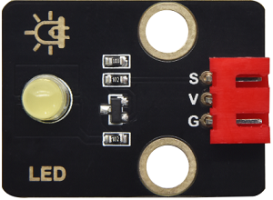

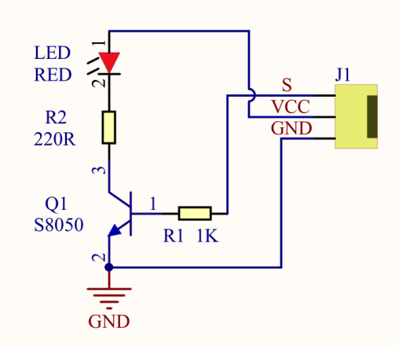

For starters and enthusiasts, LED Blink is a fundamental program. LED, the abbreviation of light emitting diodes, consists of Ga, As, P, N chemical compounds and so on. The LED can flash in diverse colors by altering the delay time in the test code. When in control, power on GND and VCC, the LED will be on if S end is in high level; nevertheless, it will go off.

#### **(2)Parameters:**

- Control interface: digital port
- Working voltage: DC 3.3-5V
- Pin spacing: 2.54mm
- LED display color: yellow

#### (3)Components Required:

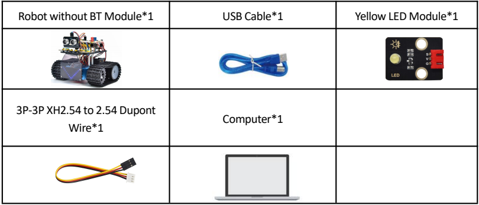

#### **(4)8833 Motor Driver Expansion Board:**

The Keyestudio 8833 motor driver expansion board is compatible with the Arduino UNO development board. Just stack it onto the development board when using it.

#### **(5)Connection Diagram:**

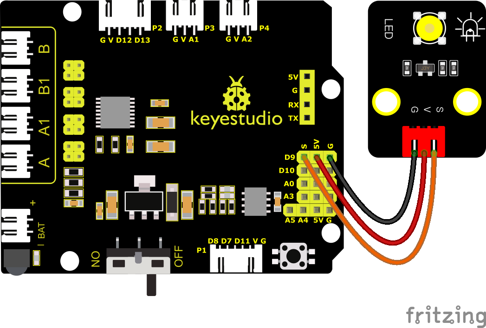

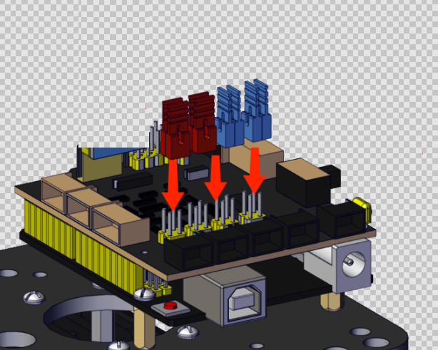

NOTE: LED is connected to D9 port, and remember to install jumper caps onto the shield.

#### **(6)Test Code:**

You can also drag blocks to edit your code, as shown below.

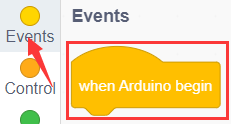

**Complete Test Code**

(Note: Do not connect the Bluetooth module before uploading the code, because the uploading of the code also uses serial communication, and there may be conflicts with the serial communication of the Bluetooth, which can cause the uploading of the code to fail.)

#### **(7)Test Results:**

Upload the program, LED blinks at the interval of 1s.

#### **(8)Extension Practice:**

We have known how to control the LED, then let's change the frequency of the LED.

We can the frequency of the LED without changing the pin of the LED. Let's modify the code.

You can also drag blocks to edit your code, as shown below.

**Complete Test Code**

(Note: Do not connect the Bluetooth module before uploading the code, because the uploading of the code also uses serial communication, and there may be conflicts with the serial communication of the Bluetooth, which can cause the uploading of the code to fail.)

The test result shows that the LED flashes faster. Therefore, we can draw a conclusion that pins and time delaying affect flash frequency.

### Project 2: Adjust LED Brightness

#### **(1)Description:**

In previous lesson, we control LED on and off and make it blink.

In this project, we will control LED’s brightness through PWM simulating breathing effect. Similarly, you can change the step length and delay time in the code so as to demonstrate different breathing effects.

PWM is a means of controlling the analog output via digital means. Digital control is used to generate square waves with different duty cycles (a signal that constantly switches between high and low levels) to control the analog output. 

In general, the input voltages of ports are 0V and 5V. What if the 3V is required? Or a switch among 1V, 3V and 3.5V? We cannot change resistors constantly. For this reason, we resort to PWM. 

For Arduino digital port voltage outputs, there are only LOW and HIGH levels, which correspond to the voltage outputs of 0V and 5V respectively. You can define LOW as“0”and HIGH as“1’, and let the Arduino output five hundred‘0’or‘1’within 1 second. If output five hundred‘1’, that is 5V; if all of which is‘0’,that is 0V; if output 250 01 pattern, that is 2.5V. 

This process can be likened to showing a movie. The movie we watch are not completely continuous. Actually, it generates 25 pictures per second, which cannot be told by human eyes. Therefore, we mistake it as a continuous process. PWM works in the same way. To output different voltages, we need to control the ratio of 0 and 1. The more‘0’or‘1’ output per unit time, the more accurate the control.

#### **(2)Parameters:**

- Control interface: Digital port 3

- Working voltage: DC 3.3-5V

- Pin spacing: 2.54mm

- LED display color: yellow

#### **(3)Wiring Diagram**

PWM pins of the Arduino are connected to 3, 5, 6, 9, 10 and 11.Keep the pin9 unchanged.

#### **(4)Test Code:**

You can also drag blocks to edit your code, as shown below

**Complete Test Code**

(Note: Do not connect the Bluetooth module before uploading the code, because the uploading of the code also uses serial communication, and there may be conflicts with the serial communication of the Bluetooth, which can cause the uploading of the code to fail.)

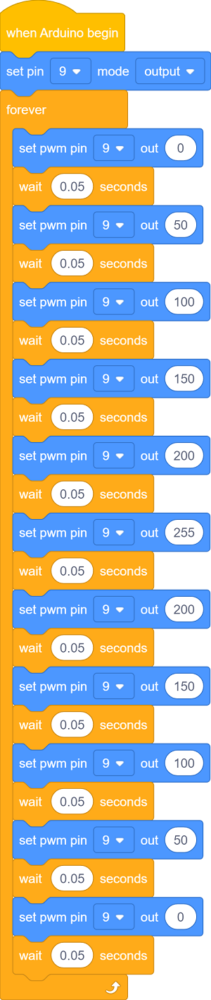

#### **(5)Test Results**

Upload test code successfully, LED gradually changes from bright to dark, like human’s breath, rather than turning on and off immediately.

#### **(6)Extension Practice:**

Let’s modify the value of delay and remain the pin unchanged, then observe how LED changes.

**Complete Test Code**

(Note: Do not connect the Bluetooth module before uploading the code, because the uploading of the code also uses serial communication, and there may be conflicts with the serial communication of the Bluetooth, which can cause the uploading of the code to fail.)

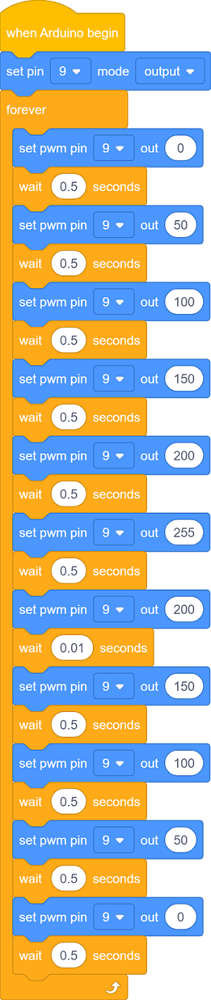

Upload the code to development board, LED flashes more slowly.

### Project 3: Photoresistor

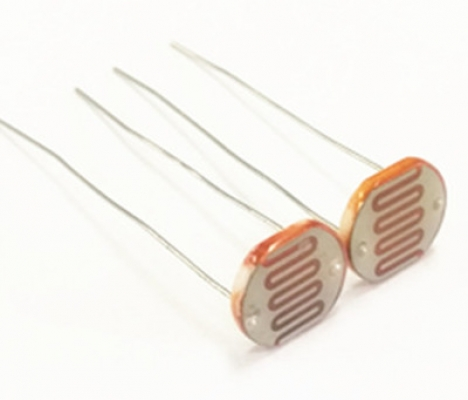

#### **(1)Description:**

The photosensitive resistor is a special resistor made of a semiconductor material such as a sulfide or selenium, and a moisture-proof resin is also coated with a photoconductive effect. The photosensitive resistance is most sensitive to the ambient light, different illumination strength, and the resistance of the photosensitive resistance is different. We use the photosensitive resistance to design the photosensitive resistor module. 

The module signal is connected to the microcontroller analog port. When the light intensity is stronger, the larger the analog port voltage, that is, the simulation value of the microcontroller is also large; in turn, when the light intensity is weaker, the smaller the analog port voltage, that is, the simulation value of the microcontroller is also small. 

In this way, we can read the corresponding analog value using the photosensitive resistor module, and the intensity of the light in the inductive environment.

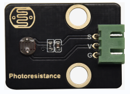

#### **(2)Parameters:**

- Photosensitive resistance resistance value: 5K Ou-0.5m

- Interface type: simulation port A0, A1

- Working voltage: 3.3V-5V

- Pin spacing: 2.54mm

#### **(3)Connection Diagram:**

What we are going to test next isthe photoresistor module on the leftside ofthe robot.

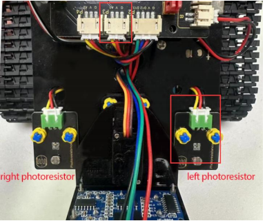

The left photoresistoris connected to A1/P3 of the motor drive shield.

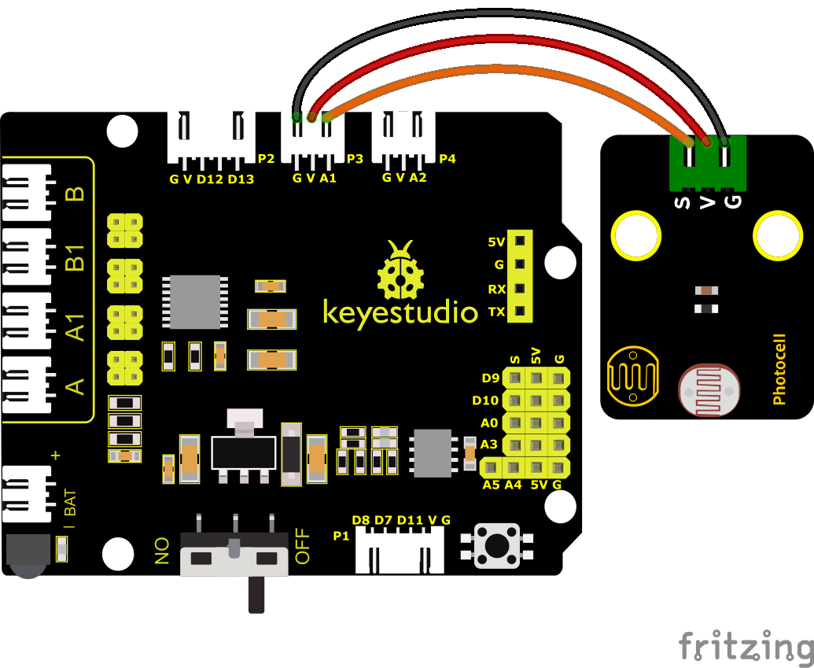

#### **(4)Test Code:**

You can also drag blocks to edit your code, as shown below.

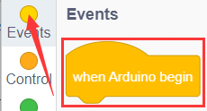

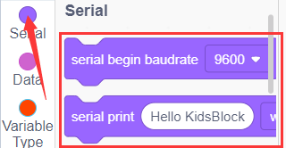

**Complete Test Code**

(Note: Do not connect the Bluetooth module before uploading the code, because the uploading of the code also uses serial communication, and there may be conflicts with the serial communication of the Bluetooth, which can cause the uploading of the code to fail.)

#### **(5)Test Results:**

Upload the code to the development board. Click  to set baud rate 9600.When covering it with your hand, the value gets smaller; if not, the value gets larger.

#### **(6)Extension Practice:**

The above code just reads the value of the photoresistor. We can make the photosensitive and LED combine to change the LED.How about controlling the LED’s brightness by it?

PWM can change the light brightness, that is, LED should be connected to the PWM of the development board.

Connect the LED to D9 and keep other pins unchanged, then we edit code.

You can also drag blocks to edit your code, as shown below.

**Complete Test Code**

(Note: Do not connect the Bluetooth module before uploading the code, because the uploading of the code also uses serial communication, and there may be conflicts with the serial communication of the Bluetooth, which can cause the uploading of the code to fail.)

Upload the code to the development board, we press the photoresistor to see if the brightness of the LED light has changed.

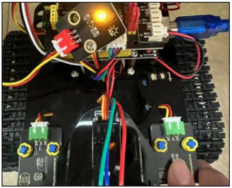

### Project 4: Line Tracking Sensor

#### **(1)Description:**

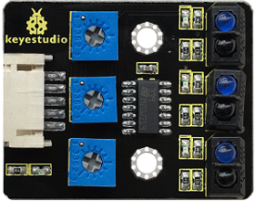

The tracking sensor is actually an infrared sensor. The component used here is the TCRT5000 infrared tube.

Its working principle is to use different reflectivity of infrared light to colors, then convert the strength of the reflected signal into a current signal.

During the process of detection, black is active at HIGH level while white is active at LOW level. The detection height is 0-3 cm.

Keyestudio 3-channel line tracking module has integrated 3 sets of TCRT5000 infrared tube on a single board, which is more convenient for wiring and control.

If the Line Tracking Sensor does not work as expected, you will need to use a screwdriver to adjust its potentiometerto make it more sensitive. When yourfinger is close to the sensor, its on-board LED light turns on, and when yourfinger moves away, its on-board LED light turns off. At thistime, itssensitivity isrelatively good.

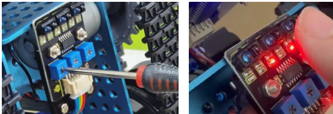

#### **(2)Parameters:**

- Operating Voltage: 3.3-5V (DC)
- Interface: 5PIN
- Output Signal: Digital signal
- Detection Height: 0-3 cm

Special note: before testing,rotate the potentiometer on the sensor to adjust the detection sensitivity. When adjust the LED at the threshold between ON and OFF, the sensitivity is the best.

Note: the line tracking sensor is installed under the bottom of the robot.

#### **(3)Connection Diagram:**

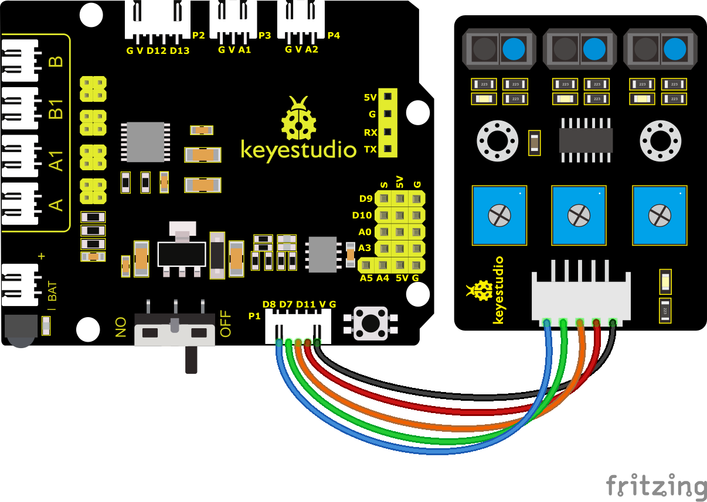

#### **(4)Test Code:**

You can also drag blocks to edit your code, as shown below.

**Complete Test Code**

(Note: Do not connect the Bluetooth module before uploading the code, because the uploading of the code also uses serial communication, and there may be conflicts with the serial communication of the Bluetooth, which can cause the uploading of the code to fail.)

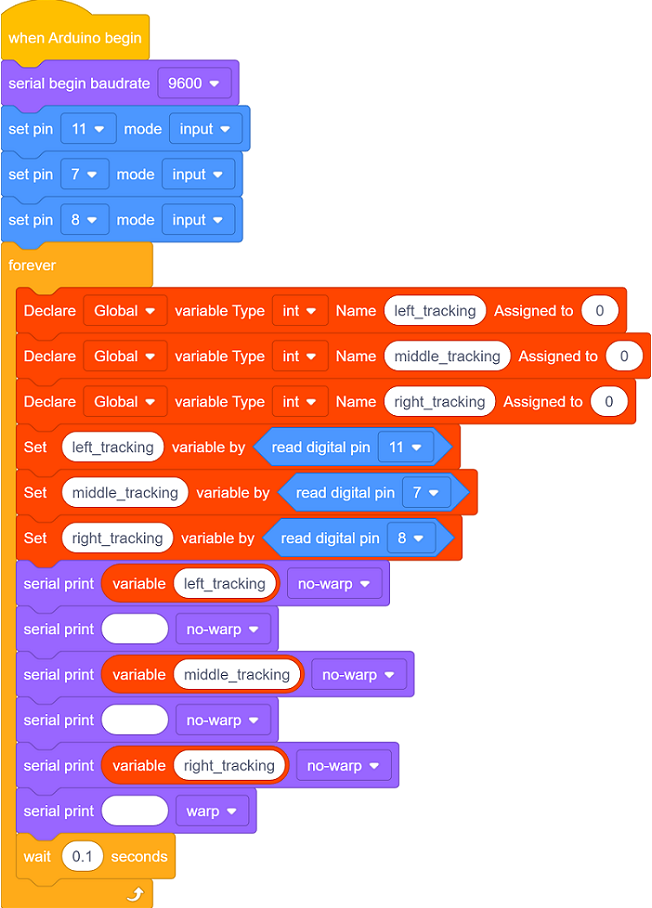

#### **(5)Test Results:**

Upload the code to the development board, open serial monitor to 9600 and check line tracking sensors. And the displayed value is 1(high level) when no signals are received. The value shifts into 0 when the sensor is covered with paper.

#### **(6)Extension Practice:**

We can control an LED with this sensor. The LED is connected to D9. If we cover it , the LED will light up.

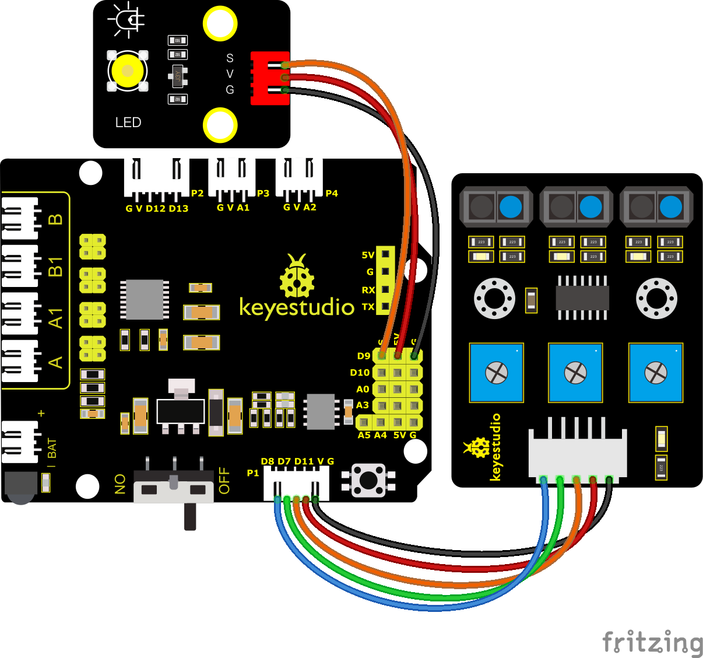

You can also drag blocks to edit your code, as shown below.

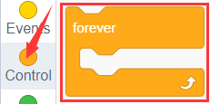

**Complete Test Code**

(Note: Do not connect the Bluetooth module before uploading the code, because the uploading of the code also uses serial communication, and there may be conflicts with the serial communication of the Bluetooth, which can cause the uploading of the code to fail.)

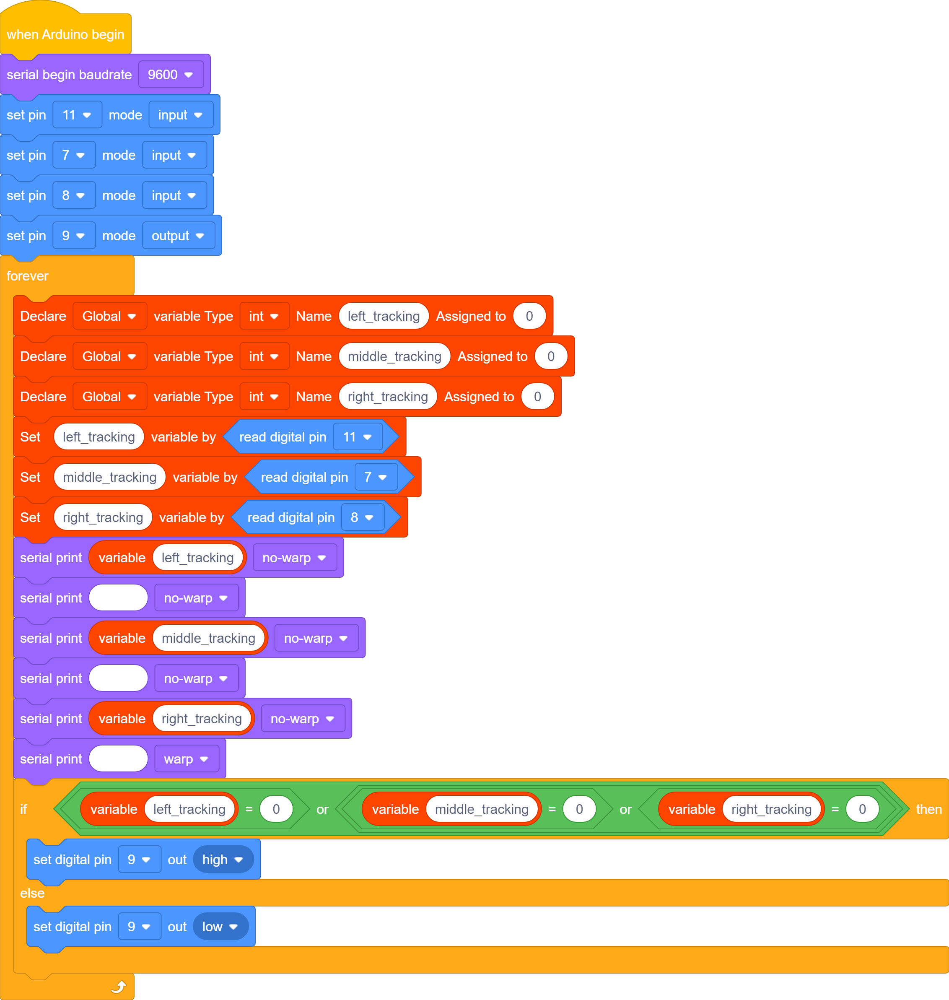

When an object (such as paper or finger) approaches the line-following sensor, the sensor detects the return signal emitted by itself, and the LED module lights up. When the sensor does not detect any return signal, and the LED module turns off.

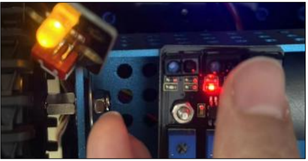

### Project 5: Servo Control

#### **(1)Description:**

Servo motor is a position control rotary actuator. It mainly consists of a housing, a circuit board, a core-less motor, a gear and a position sensor. Its working principle is that the servo receives the signal sent by MCU or receiver and produces a reference signal with a period of 20ms and width of 1.5ms, then compares the acquired DC bias voltage to the voltage of the potentiometer and obtain the voltage difference output.

When the motor speed is constant, the potentiometer is driven to rotate through the cascade reduction gear, which leads that the voltage difference is 0, and the motor stops rotating. Generally, the angle range of servo rotation is 0° --180 °.

The rotation angle of servo motor is controlled by regulating the duty cycle of PWM (Pulse-Width Modulation) signal. The standard cycle of PWM signal is 20ms (50Hz). Theoretically, the width is distributed between 1ms-2ms, but in fact, it's between 0.5ms-2.5ms. The width corresponds the rotation angle from 0° to 180°. But note that for different brand motors, the same signal may have different rotation angles.  

In general, servo has three lines in brown, red and orange. The brown wire is grounded, the red one is a positive pole line and the orange one is a signal line.

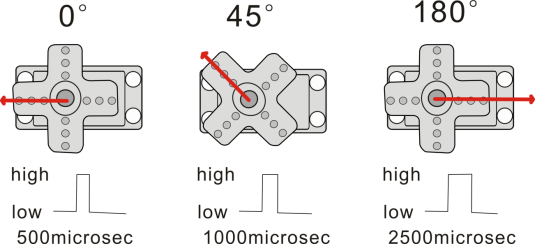

The angle of the servo:

#### **(2)Parameters:**

- Working voltage: DC 4.8V \~ 6V

- Operating angle range: about 180 ° (at 500 → 2500 μsec)

- Pulse width range: 500 → 2500 μsec

- No-load speed: 0.12 ± 0.01 sec / 60 (DC 4.8V) 0.1 ± 0.01 sec / 60 (DC 6V)

- No-load current: 200 ± 20mA (DC 4.8V) 220 ± 20mA (DC 6V)

- Stopping torque: 1.3 ± 0.01kg · cm (DC 4.8V) 1.5 ± 0.1kg · cm (DC 6V)

- Stop current: ≦ 850mA (DC 4.8V) ≦ 1000mA (DC 6V)

- Standby current: 3 ± 1mA (DC 4.8V) 4 ± 1mA (DC 6V)

#### **(3)Connection Diagram:**

Note: The brown, red and orange wire of the servo are respectively attached to Gnd(G), 5v(V) and D10 of the shield. Remember to connect an external power because of the high current of the servo. If not, the development board will be burnt out.

#### **(4)Test Code:**

You can also drag blocks to edit your code, as shown below

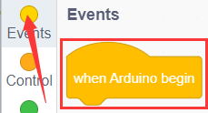

**Complete Test Code**

(Note: Do not connect the Bluetooth module before uploading the code, because the uploading of the code also uses serial communication, and there may be conflicts with the serial communication of the Bluetooth, which can cause the uploading of the code to fail.)

#### **(6)Test Results:**

Upload code, plug in power and servo moves in the range of 0° and 180°.

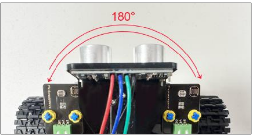

### Project 6: Ultrasonic Sensor

#### **(1)Description:**

The HC-SR04 ultrasonic sensor uses sonar to determine distance to an object like what bats do. It offers excellent non-contact range detection with high accuracy and stable readings in an easy-to-use package. It comes complete with ultrasonic transmitter and receiver modules.

The HC-SR04 or the ultrasonic sensor is being used in a wide range of electronics projects for creating obstacle detection and distance measuring application as well as various other applications. Here we have brought the simple method to measure the distance with Arduino and ultrasonic sensor and how to use ultrasonic sensor with Arduino.

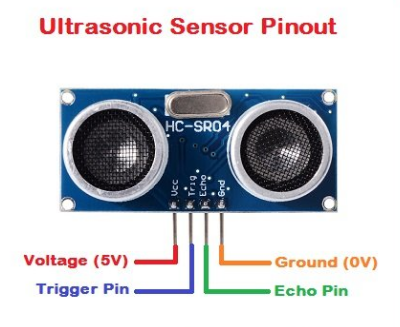

#### **(2)Parameters:**

- Power Supply :+5V DC

- Quiescent Current : \<2mA

- Working Current: 15mA

- Effectual Angle: \<15°

- Ranging Distance : 2cm – 400 cm

- Resolution : 0.3 cm

- Measuring Angle: 30 degree

- Trigger Input Pulse width: 10uS

#### **(3)The principle of ultrasonic sensor:**

As the above picture shown, it is like two eyes. One is transmitting end, the other is receiving end.

The ultrasonic module will emit the ultrasonic waves after triggering a signal. When the ultrasonic waves encounter the object and are reflected back, the module outputs an echo signal, so it can determine the distance of the object from the time difference between the trigger signal and echo signal. 

The t is the time that emitting signal meets obstacle and returns. And the propagation speed of sound in the air is about 343m/s, and distance = speed * time. However, the ultrasonic wave emits and comes back, which is 2 times of distance. Therefore, it needs to be divided by 2, the distance measured by **ultrasonic wave = (speed * time)/2**.

1. Use method and timing chart of ultrasonic module:

2. Setting the delay time of Trig pin of SR04 to 10μs at least, which can trigger it to detect distance.

3. After triggering, the module will automatically send eight 40KHz ultrasonic pulses and detect whether there is a signal return. This step will be completed automatically by the module.

4. If the signal returns, the Echo pin will output a high level, and the duration of the high level is the time from the transmission of the ultrasonic wave to the return.

Circuit diagram of ultrasonic sensor:

#### **(4)Connection Diagram:**

Wiring Note: The VCC pin of the ultrasonic sensor module is connected to the 5v(V) of the Keyestudio 8833 motor drive expansion board, the Trig pin is connected to digital D12, the Echo pin is connected to digital D13, and the Gnd pin is connected to Gnd(G);

#### **(5)Test Code:**

You can also drag blocks to edit your code, as shown below.

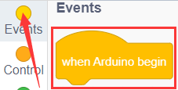

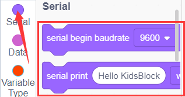

**Complete Test Code**

(Note: Do not connect the Bluetooth module before uploading the code, because the uploading of the code also uses serial communication, and there may be conflicts with the serial communication of the Bluetooth, which can cause the uploading of the code to fail.)

#### **(6)Test Results:**

Upload test code on the development board, open serial monitor and set baud rate to 9600. The detected distance will be displayed, and the unit is cm and inch. Hinder the ultrasonic sensor by hand, the displayed distance value gets smaller.

#### **(7)Extension Practice:**

We have just measured the distance displayed by the ultrasonic. How about controlling the LED with the measured distance? Let's try it and connect an LED light module to the D9 pin.

You can also drag blocks to edit your code, as shown below

**Complete Test Code**

(Note: Do not connect the Bluetooth module before uploading the code, because the uploading of the code also uses serial communication, and there may be conflicts with the serial communication of the Bluetooth, which can cause the uploading of the code to fail.)

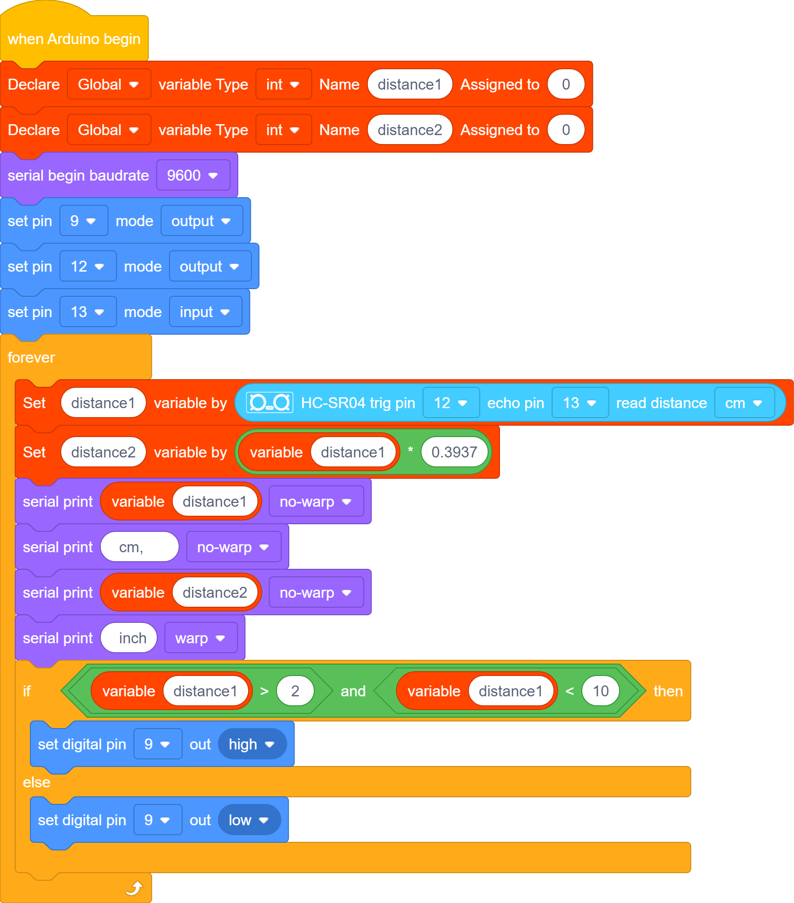

Upload test code to development board and move your hand and close to the ultrasonic sensor, then check if the LED is on.

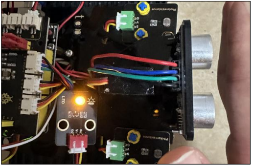

### Project 7: IR Reception

#### **(1)Description:**

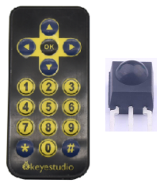

There is no doubt that infrared remote control is ubiquitous in daily life. It is used to control various household appliances, such as TVs, stereos, video recorders and satellite signal receivers. Infrared remote control is composed of infrared transmitting and infrared receiving systems, that is, an infrared remote control and infrared receiving module and a single-chip microcomputer capable of decoding.   

The 38K infrared carrier signal emitted by remote controller is encoded by the encoding chip in the remote controller. It is composed of a section of pilot code, user code, user inverse code, data code, and data inverse code. The time interval of the pulse is used to distinguish whether it is a 0 or 1 signal and the encoding is made up of these 0, 1 signals. 

The user code of the same remote control is unchanged while the data code can distinguish the key.

When the remote control button is pressed, the remote control sends out an infrared carrier signal. When the IR receiver receives the signal, the program will decode the carrier signal and determines which key is pressed. The MCU decodes the received 01 signal, thereby judging what key is pressed by the remote control.

Infrared receiver we use is an infrared receiver module. Mainly composed of an infrared receiver head, which is a device that integrates reception, amplification, and demodulation. Its internal IC has completed demodulation, and can achieve from infrared reception to output and be compatible with TTL signals. Additionally, it is suitable for infrared remote control and infrared data transmission. The infrared receiving module made by the receiver has only three pins, signal line, VCC and GND. It is very convenient to communicate with Arduino and other microcontrollers.

#### **(2)Parameters:**

- Operating Voltage: 3.3-5V（DC）
- Interface: 3PIN
- Output Signal: Digital signal
- Receiving Angle: 90 degrees
- Frequency: 38khz
- Receiving Distance: 10m

Infrared receiver integrated on motor drive board：

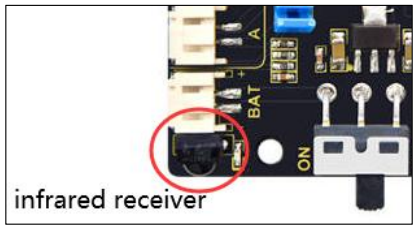

Note: Since the IR receiver is integrated in the Keyestudio 8833 motor drive expansion board, no additional wiring is required. The pins of the IR receiver on the Keyestudio 8833 motor drive expansion board are G (GND), V (VCC) and D3.

#### **(4)Test Code:**

You can also drag blocks to edit your code, as shown below

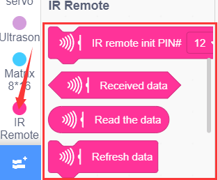

**Complete Test Code**

(Note: Do not connect the Bluetooth module before uploading the code, because the uploading of the code also uses serial communication, and there may be conflicts with the serial communication of the Bluetooth, which can cause the uploading of the code to fail.)

#### **(5)Test Results:**

Upload the code to the development board, click to set the baud rate to 9600, take out the remote control, aim at the infrared receiving sensor to send the signal, you can see the key value of the corresponding key, if the key time is too long, garbled FFFFFFFF will easily appear.

Below we have listed out each key value of keyestudio remote control. So you can keep it for reference.

#### **(6)Extension Practice:**

We just decoded the key values of the IR remote If you control an LED light on and off. We need to connect an LED light module to the D9 pin, and the pin position of the infrared receiver remains unchanged. When the OK button on the remote control is pressed, the LED connected to D9 will light up, and when the OK button is pressed again, the LED will be off.

You can also drag blocks to edit your code, as shown below

（1）

（2）

（3）

(4) 

（5）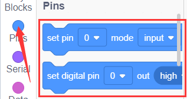

（6）

（7）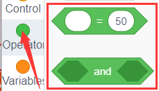

**Complete Test Code**

(Note: Do not connect the Bluetooth module before uploading the code, because the uploading of the code also uses serial communication, and there may be conflicts with the serial communication of the Bluetooth, which can cause the uploading of the code to fail.)

Upload code to development board, press the“OK”key on remote control to make LED on and off.

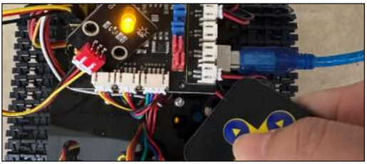

### Project 8: Motor Driving and Speed Control

#### **(1)Description:**

There are many ways to drive motors. Our smart car uses the most common solution called L298P. L298P, produced by STMicroelectronics, is an excellent driving chip specially designed for driving high-power motors . It can directly drive DC motors, two-phase and four-phase motors with the driving current reaching 2A. And the motor’s output terminal adopts 8 high-speed Schottky diodes as protection. We have designed an expansion board based on the L298P circuit of which the laminated design can be directly plugged into the UNO R3 board for use reducing the technical difficulties for users in using and driving the motor.

Stack the expansion board on the board, power the BAT , turn the DIP switch to the ON end, and power the expansion board and the UNO R3 board at the same time via external power supply. In order to facilitate wiring, the expansion board is equipped with anti-reverse interface (PH2.0 -2P -3P -4P -5P) and thus it can be directly plug with motors, power supply, and sensors /modules. The Bluetooth interface of the drive expansion board is fully compatible with the Keyestudio HM-10 Bluetooth module. Therefore, we only need to insert the HM-10 Bluetooth module into the corresponding interface when connecting. At the same time, the drive extension board also uses 2.54 pin headers to extend out some available digital ports and analog ports, so that you can continue to add other sensors and carry out expansion experiments.

The expansion board can be connected to 4 DC motors. In the default jumper cap connection mode, the A and A1, B and B1 interface motors are connected in parallel, and their motion pattern is the same. 8 jumper caps can be used to control the rotation direction of the 4 motor interfaces. For example, when the two jumper caps in front of the motor A interface are changed from a horizontal connection to a vertical connection, the rotation direction of the motor A now is opposite to the original rotation direction.

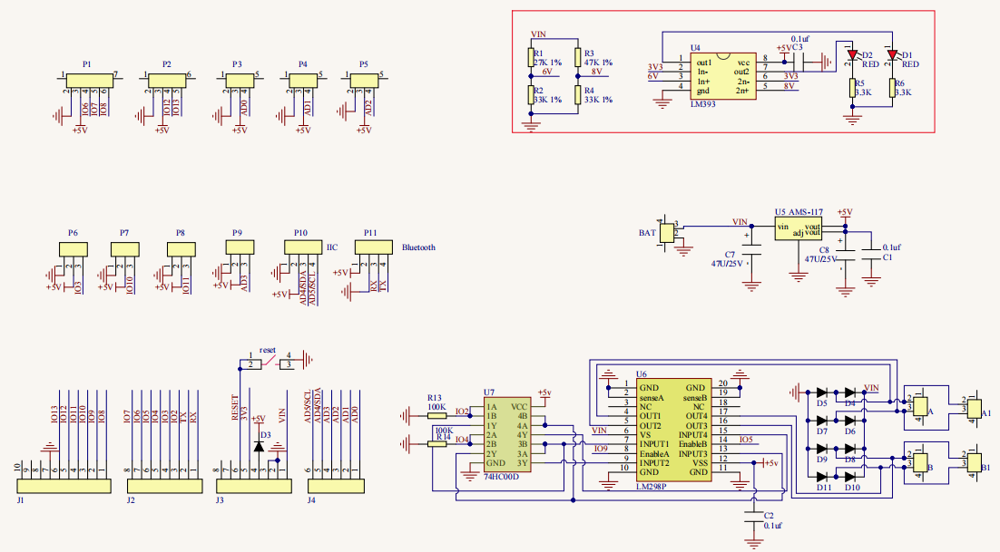

#### **(2)Parameters:**

-   Logic part input voltage: DC 5V

-   Driving part input voltage: DC 7-12V

-   Logic part working current: ≤36mA

-   Driving part working current: ≤ 2A

-   Maximum dissipation power: 25W (T=75℃)

-   Control signal input level:

    High level: 2.3V ≤ Vin ≤ 5V

    Low level: 0V ≤ Vin ≤ 1.5V

-   Working temperature: -25℃～＋130℃

#### **(3)Drive the robot to move:**

The direction pin of A motor is D2, the speed control pin is D5; the direction pin of B motor is in D4 and the speed control pin is D6,

According to the table below, we can know how to control the movement of the robot by controlling the rotation of two motors through the digital ports and PWM ports . Among them, the range of PWM value is 0-255. The larger the value is, the faster the motor rotates.

|   Function   |  D4  | D6（PWM） | Motor （left）B |  D2  | D5（PWM） | Motor（Right）A |
| :----------: | :--: | :-------: | :-------------: | :--: | :-------: | :-------------: |
| Move Forward | HIGH |     0     |   Rotate Left   | HIGH |     0     |   Rotate Left   |
|   Go Back    | LOW  |    255    |  Rotate Right   | LOW  |    255    |  Rotate Right   |
| Rotate Left  | LOW  |    255    |  Rotate Right   | HIGH |    100    |   Rotate Left   |
| Rotate Right | HIGH |    100    |   Rotate Left   | LOW  |    255    |  Rotate Right   |
|     Stop     | LOW  |     0     |      Stop       | LOW  |     0     |      Stop       |

#### **(4)Connection Diagram:**

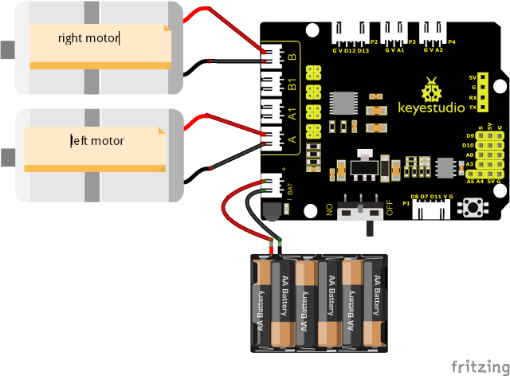

Note:

The 4-pinconnector is marked with A, A1, B1 and B. The right rear motor is connected to B of the 8833 board and left front one is connected to A port.

#### **(5)Test Code:**

You can also drag blocks to edit your code, as shown below.

（1）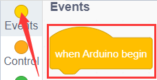

（2）

（3）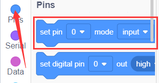

（4）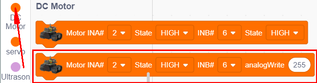

**Complete Test Code**

(Note: Do not connect the Bluetooth module before uploading the code, because the uploading of the code also uses serial communication, and there may be conflicts with the serial communication of the Bluetooth, which can cause the uploading of the code to fail.)

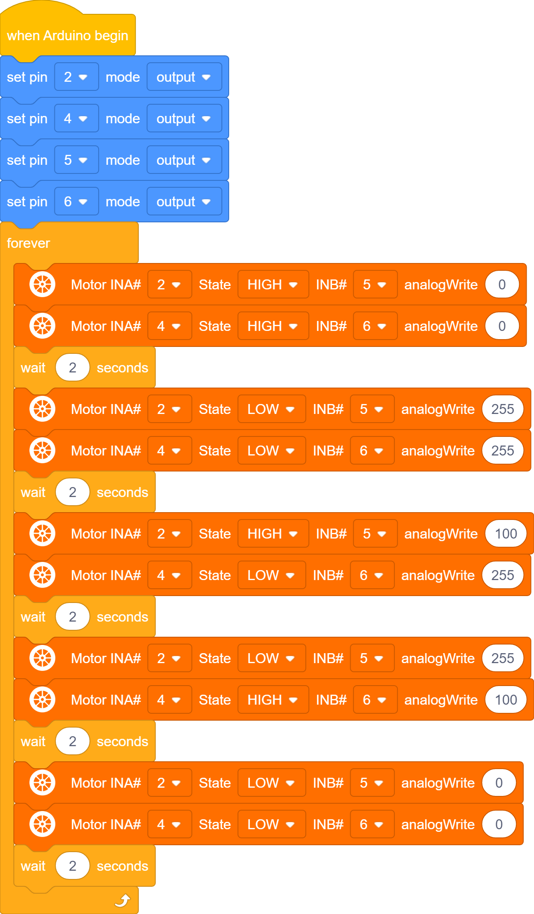

#### **(6)Test Results:**

After wiring according to the diagram, uploading the test code and powering it up.

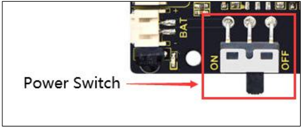

the smart car moves forward for 2s, goes back for 2s, turns left for 2s, turns right for 2s and stops for 2s.

### Project 9: 8*16 Facial Expression LED Dot Matrix

#### **(1)Description:**

Won’t it be fun if a expression board is added to the robot? And the Keyestudio 8*16 LED dot matrix can do the trick. With the help of it, you could design facial expressions, images, patterns and other displays by yourselves.

The 8*16 LED board comes with 128 LEDs. The data of the microprocessor (Arduino) communicates with the AiP1640 through a two-wire bus interface. Therefore, it can control the on and off of 128 LEDs on the module, so as to make the dot matrix on the module to display the pattern you need. A HX-2.54 4Pin cable is provided for your convenience of wiring.

#### **(2)Parameters:**

-   Working voltage: DC 3.3-5V

-   Power loss: 400mW

-   Oscillation frequency: 450KHz

-   Drive current: 200mA

-   Working temperature: -40\~80℃

-   Communication mode: two-wire bus

#### **(3)Knowledge:**

**Circuit of the 8\*16 LED dot matrix**

**Principle of the 8\*16 LED dot matrix**

How to control each LED of the 8\*16 dot matrix? It is known that each byte has 8 bits and each bit is 0 or 1. when it is 0, LED is off while when it is 1 LED is on. One byte can control one column of the LED,and naturally 16 bytes can control 16 columns of LEDs, that’s the 8\*16 dot matrix.

**Pins description and communication protocol**

The data of the microprocessor (Arduino) communicates with the AiP1640 through a two-wire bus cable.

The communication protocol diagram is as follows (SCLK) is SCL, (DIN) is SDA.

①The starting condition for data input: SCL is high level and SDA changes from high to low.

②For data command setting, there are methods as shown in the figure below.

In our sample program, select the way to **add 1 to the address automatically**, the binary value is 0100 0000 and the corresponding hexadecimal value is 0x40.

③For address command setting, the address can be selected as shown below.

The first 00H is selected in our sample program, and the binary number 1100 0000 corresponds to the hexadecimal 0xc0.

④The requirement for data input is that when SCL is at high level when inputting data, the signal on SDA must remain unchanged. Only when the clock signal on SCL is at low level, can the signal on SDA be changed. The input of data is the low bit first, and the high bit later.

⑤The condition for the end of data transmission is that when SCL is at low level, SDA at low level and SCL at high level, the level of SDA becomes high.

⑥Display control, set different pulse width, pulse width can be selected as shown in the figure below.

In the example, the pulse width is 4/16, and the hexadecimal corresponding to 1000 1010 is 0x8A.

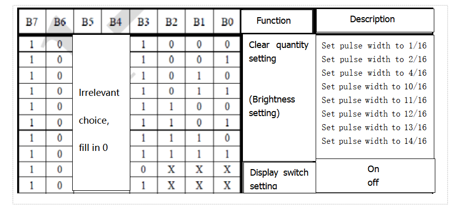

**Instructions for the use of modulus tool**

The dot matrix tool uses the online version, and the link is: <http://dotmatrixtool.com/#>

①Enter the link and the page appears as shown below

②The dot matrix is 8\*16, so adjust the height to 8 and width to 16, as shown in the figure below.

③Generate hexadecimal data from the pattern.

As shown in the figure below, press the left mouse button to select, right click to cancel; draw the pattern you want, click Generate, and the hexadecimal data we need will be generated.

#### **(4)Connection Diagram:**

The GND, VCC, SDA, and SCL of the 8x16 LED light board are respectively connected to the G(GND), V (VCC), A4 and A5 of the expansion board for two-wire serial communication.

(Note: though it is connected with the IIC pin of Arduino, this module is not for IIC communication. And the IO port here is to simulate I2C communication and can be connected with any two pins )

#### **(5)Test Code:**

You can also drag blocks to edit your code, as shown below

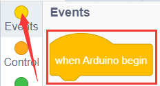

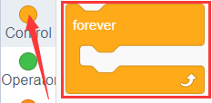

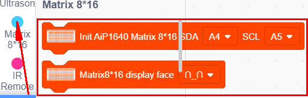

**Complete Test Code**

(Note: Do not connect the Bluetooth module before uploading the code, because the uploading of the code also uses serial communication, and there may be conflicts with the serial communication of the Bluetooth, which can cause the uploading of the code to fail.)

#### **(6)Test Results:**

After uploading the test code successfully, wire up, turn the DIP switch to the ON end and power up, a smile-shaped pattern shows on the dot matrix.

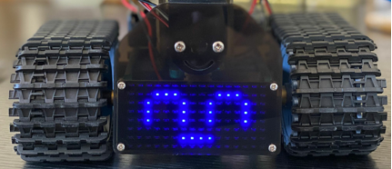

#### **(7)Extension Practice:**

We use the modulus tool we just learned, [http://dotmatrixtool.com/#](http://dotmatrixtool.com/#), to make the dot matrix display the pattern start , go forward, and stop and then clear the pattern. The time interval is 2000 ms.

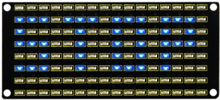

Block to show smile face

Code to show expression

Block to show heart

Code for moving forward

Block for going back

Block for turning left

Block for turning right

Block for stopping

Block for clearing up

You can also drag blocks to edit your code, as shown below.

（1）

（2）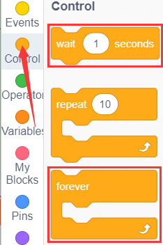

（3）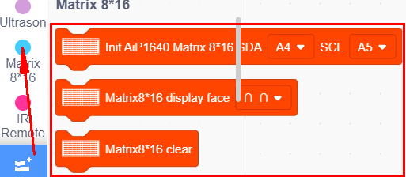

**Complete Test Code**

(Note: Do not connect the Bluetooth module before uploading the code, because the uploading of the code also uses serial communication, and there may be conflicts with the serial communication of the Bluetooth, which can cause the uploading of the code to fail.)

Upload the code to the development board, the 8\*16 board will show following patters.

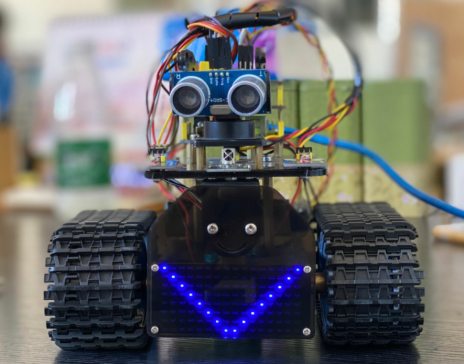

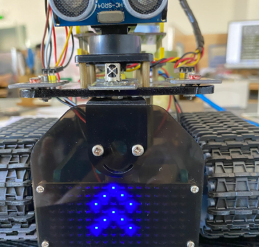

### Project 10: Light-following Tank

#### **(1)Description:**

In previous projects, we introduced in detail the use of various sensors, modules, and expansion boards on the smart car. Now let’s move to the projects of the smart car . The light-following smart cars, as the name suggests, is a smart car that can follow the light.

We can combine the knowledge from projects photoresistor and motor drive to make a light-seeking smart car. In the project, we use two photoresistor modules to detect the light intensity on the left and right sides of the smart car, read the corresponding analog values, and then control the rotation of the two motors based on these two data so as,to control the movements of the smart car.

The specific logic of the light-following smart car is shown as below.

#### **(2)Flow chart:**

#### **(3)Connection Diagram:**

Note: The pin "G", "V" and S of the left photoresistor module are connected to G (GND), V (VCC), A1 respectively;

The pin "G", "V" and S of the right photoresistor module are connected to the G (GND), V (VCC), and A2 respectively.

The 4pin cable is marked with A, A1, B1 and B. The right rear motor is connected to B port of the 8833 motor driver expansion board and the left front motor is connected to A port of the 8833 motor driver expansion board.

#### **(4)Test Code:**

You can also drag blocks to edit your code, as shown below.

（1）

（2）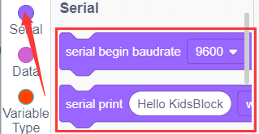

（3）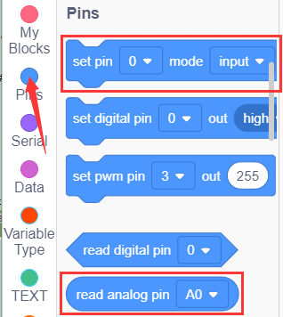

（4）

（5）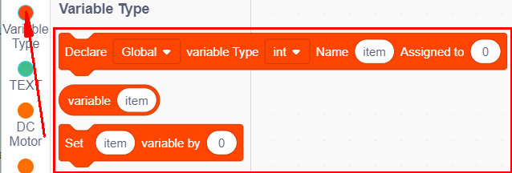

（6）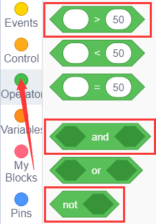

(7) 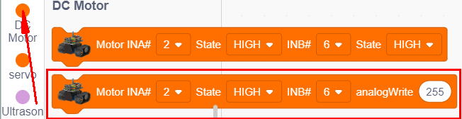

**Complete Test Code**

(Note: The threshold 650 in the code can be adjusted appropriately according to the specific light intensity.

Do not connect the Bluetooth module before uploading the code, because the uploading of the code also uses serial communication, and there may be conflicts with the serial communication of the Bluetooth, which can cause the uploading of the code to fail.)

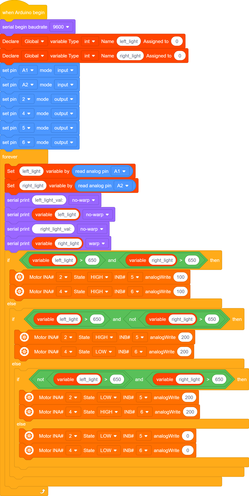

#### **(5)Test Results:**

After uploading the test code successfully, wire up, turn DIP switch to the ON end and power on, the smart car follows the light to move.

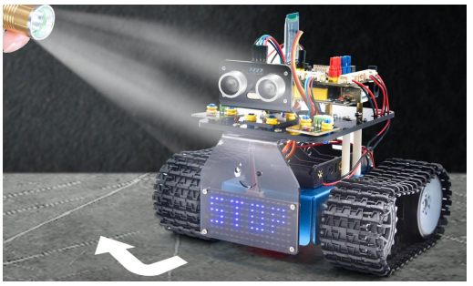

### Project 11: Ultrasonic Sound-following Tank

#### **(1)Description:**

In the previous lesson, we learned about the light-following smart car. And in this lesson, we can combine the knowledge to make an ultrasonic sound-following car. In the project, we use ultrasonic sensors to detect the distance between the car and the obstacle in front, and then control the rotation of the two motors based on this data so as to control the movements of the smart car.

The specific logic of the ultrasonic sound- following smart car is shown in the table blow:

|                        Detection                        |              Setting              |
| :-----------------------------------------------------: | :-------------------------------: |
| The distance(cm) between the car and the obstacle front | Set the angle of the servo to 90° |
|                      **Condition**                      |           **Movement**            |
|               distance≥20 and distance≤50               |             Go front              |
|            10＜distance＜20 distance＞50            |               Stop                |
|                       distance≤10                       |              go back              |

#### **(2)Flow chart:**

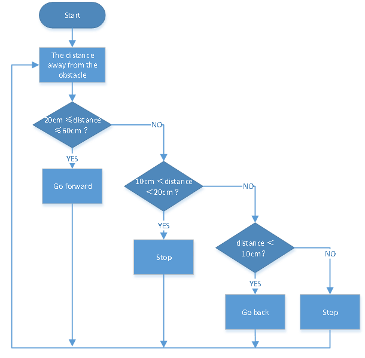

#### **(3)Connection Diagram:**

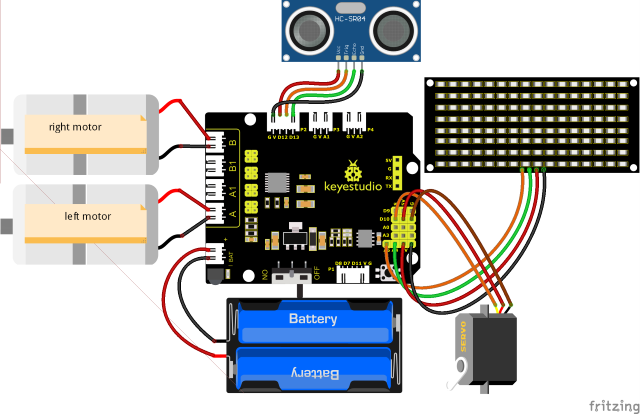

Note: The wiring of the ultrasonic sensor, the servo and the motor is the same as the previous project experiment. The GND, VCC, SDA, and SCL of the 8x16 LED panel are respectively connected to G (GND), V (VCC), A4, and A5 on the expansion board.

#### **(4)Test Code:**

You can also drag blocks to edit your code, as shown below.

（1）

（2）

（3）

（4）

（5）

（6）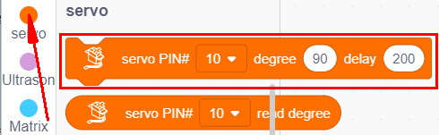

(7) 

(8) 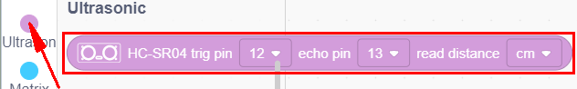

(9) 

(10) 

**Complete Test Code**

(Note: Do not connect the Bluetooth module before uploading the code, because the uploading of the code also uses serial communication, and there may be conflicts with the serial communication of the Bluetooth, which can cause the uploading of the code to fail.)

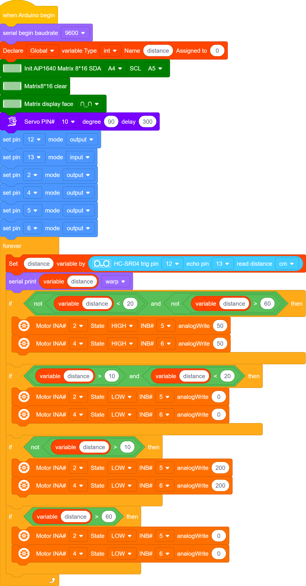

#### **(5)Test Result:**

Upload the code, power up and turn the DIP switch to ON. The servo will rotate 90°, the 8X16 LED panel will show  and the car follows the obstacle to move.

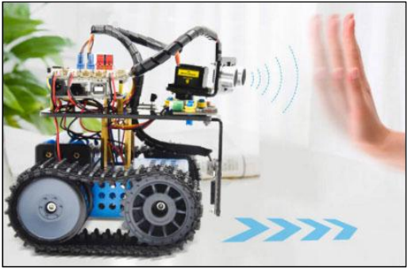

### Project 12: Ultrasonic Obstacle Avoidance Tank

#### **(1)Description:**

In the previous project, we made an ultrasonic sound-following smart car. In fact, using the same components and the same wiring method, we only need to change the test code to turn it into an ultrasonic obstacle avoidance smart car. This smart car can move with the movement of the human hands. 

We use ultrasonic sensors to detect the distance between the smart car and the obstacle in front, and then control the rotation of the two motors based on this data so as to control the movements of the smart car.

|                          Detection                           |         |
| :----------------------------------------------------------: | :-----: |
| Distance measured by the ultrasonic senor between the car and the obstacle in front  （set the angle of the servo to 90°） | a (cm)  |
| Distance measured by the ultrasonic senor between the car and the obstacle on the right  （set the angle of the servo to 0°） | a2 (cm) |
| Distance measured by the ultrasonic senor between the car and the obstacle on the left  （set the angle of the servo to 180°） | a1 (cm) |

**Setting: set the starting angle of the servo to 90°**

| Condition 1 |        Condition 2         |      Condition 3       | Movement                                                     |
| :---------: | :------------------------: | :--------------------: | :----------------------------------------------------------- |
|    a＜20    |                            |                        | Stop for 500ms；set the angle of the servo to 180°，read a1，delay in 100ms；set the angle of the servo to 0°，read a2，delay in 0.1s. |
|             | a1＜50 or a2＜50 | **Compare a1 with a2** |                                                              |
|             |                            |         a1＞a2         | Set the angle of the servo to 90°，rotate left for 700ms（set PWM to 255），and move forward（set PWM to 200）. |
|             |                            |         a1＜a2         | Set the angle of the servo to 90°，rotate right for 700ms（set PWM to 255），and move forward（set PWM to 200）. |
|             | a1≥50 and a2≥50  |         Random         | set the angle of the servo to 90°，rotate left for 500ms（set PWM to 255），and move forward（set PWM to 200）.  set the angle of the servo to 90°，rotate right for 500ms（set PWM to 255），and move forward（set PWM to 200）. |
|    a≥20     |                            |                        | move forward（set PWM to 100）                               |

#### **(2)Flow chart:**

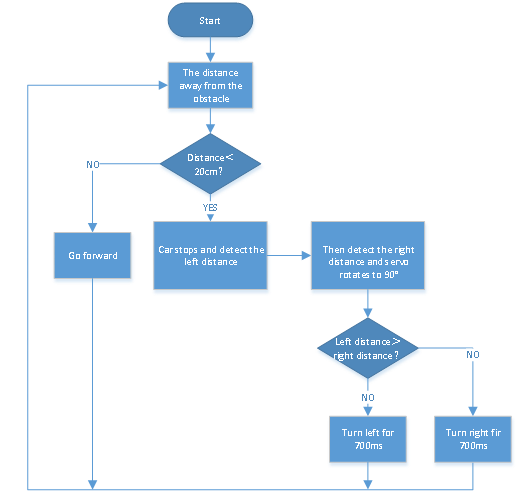

#### **(3)Connection Diagram:**

(Note: the brown, red and orange wires of the servo are respectively connected to G (GND), V（5V）and D10 of the expansion board；and for the ultrasonic sensor, the VCC pin is connected to the 5v (V) ,the Trig pin to digital 12 (S), the Echo pin to digital 13 (S), and the Gnd pin to Gnd (G); the same as last project.）

#### **(4)Test Code:**

You can also drag blocks to edit your code, as shown below.

（2）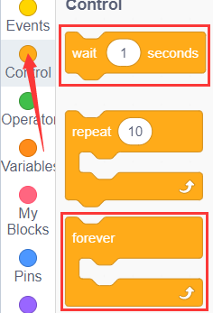

（3）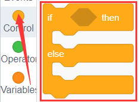

（4）

（5）

（6）

（7）

（8）

（9）

（10）

（11）

**Complete Test Code**

(Note: Do not connect the Bluetooth module before uploading the code, because the uploading of the code also uses serial communication, and there may be conflicts with the serial communication of the Bluetooth, which can cause the uploading of the code to fail.)

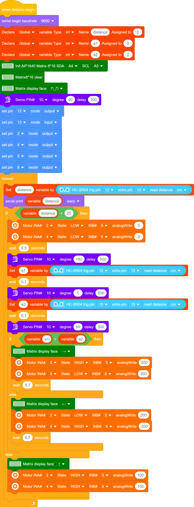

#### **(5)Test Results:**

After upload the test code successfully, wire up, turn the DIP switch to the ON end, and power up, the smart car moves forward and automatically avoids obstacles.

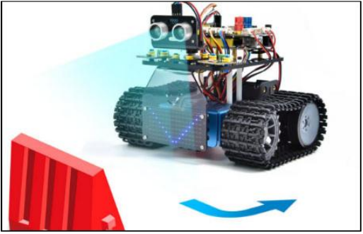

### Project 13: Move-in-Confined-Space Tank

#### **(1)Description:**

The ultrasonic sound-following and obstacle avoidance functions of the smart car have been introduced in previous projects. Here we intend to combine the knowledge in the previous courses to confine the smart car to move in a certain space. In the experiment, we use the line-tracking sensor to detect whether there is a black line around the smart car, and then control the rotation of the two motors according to the detection results, so as to lock the smart car in a circle drawn in black line.

The specific logic of the line-tracking smart car is shown in the table blow:

|                         Condition                         |                         Movement                          |
| :-------------------------------------------------------: | :-------------------------------------------------------: |
| If one of three line tracking sensors detects black lines | Go back（set PWM to 150）Then turn left（set PWM to 150） |
|             None of them detects black lines              |               Go forward（set PWM to 100）                |

#### **(2)Flow chart**

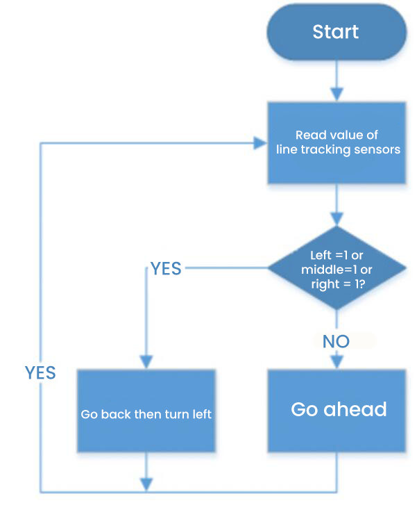

#### **(3)Connection Diagram:**

#### **(4)Test Code:**

You can also drag blocks to edit your code, as shown below

（1）

（2）

（3）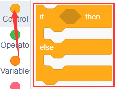

（4）

（5）

（6）

（7）

（8）

（9）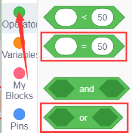

**Complete Test Code**

(Note: Do not connect the Bluetooth module before uploading the code, because the uploading of the code also uses serial communication, and there may be conflicts with the serial communication of the Bluetooth, which can cause the uploading of the code to fail.)

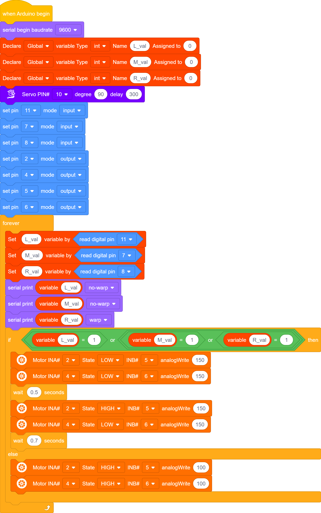

#### **(5)Test Results:**

After upload the test code successfully and power up, the smart car moves in a circle drawn in black line.

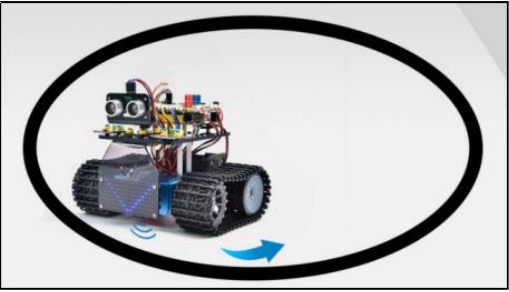

### Project 14:Line-tracking Tank

#### **(1)Description:**

The previous project has introduced how to confine the smart car to move in a certain space. In this project, we could use the knowledge learned before to make it a line-tracking smart car. In the experiment, we use the line-tracking sensor to detect whether there is a black line around the smart car, and then control the rotation of the two motors according to the detection results, so as to make the smart car to move along the black line.

The specific logic of the line-tracking smart car is shown in the table blow:

|               Sensor               |                          Detection                           |
| :--------------------------------: | :----------------------------------------------------------: |
| Line-tracking sensor in the middle | Black line detected: in high level White line detected: in low level |
|  Line-tracking sensor on the left  | Black line detected: in high level White line detected: in low level |
| Line-tracking sensor on the right  | Black line detected: in high level White line detected: in low level |

|                         Condition 1                          |                         Condition 2                          |   Movement   |
| :----------------------------------------------------------: | :----------------------------------------------------------: | :----------: |
| Line-tracking sensor  in the middle  detects the black line | Line-tracking sensor on the left detects the black line the one on the right detects white lines | Rotate left  |
| Line-tracking sensor  in the middle  detects the black line | Line-tracking sensor on the left detects white lines the one on the right detects the black line | Rotate right |
| Line-tracking sensor  in the middle  detects the black line | Both the left and right  line-tracking sensors detect white lines Both the left and right line-tracking sensors detect  the black line | Move forward |
| Line-tracking sensor in the middle  detects white lines | Line-tracking sensor on the left detects the black line the one on the right detects white lines | Rotate left  |
| Line-tracking sensor in the middle  detects white lines | Line-tracking sensor on the left detects white lines the one on the right detects the black line | Rotate right |
| Line-tracking sensor in the middle  detects white lines | Both the left and right  line-tracking sensors detect white lines Both the left and right line-tracking sensors detect  the black line |     Stop     |

#### **(2)Flow chart:**

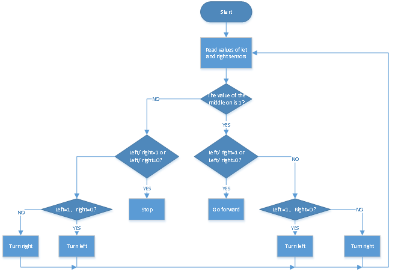

#### **(3)Connection Diagram:**

#### **(4)Test Code:**

You can also drag blocks to edit your code, as shown below

（1）

（2）

（3）

（4）

（5）

（6）

（7）

（8）

**Complete Test Code**

(Note: Do not connect the Bluetooth module before uploading the code, because the uploading of the code also uses serial communication, and there may be conflicts with the serial communication of the Bluetooth, which can cause the uploading of the code to fail.)

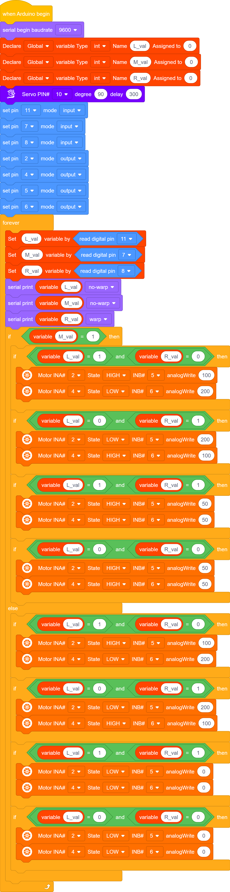

#### **(5)Test Results:**

After upload the test code successfully and power on, the smart car moves along the black line.

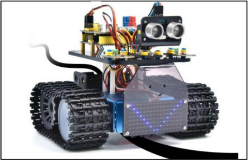

### Project 15: IR Remote Control Tank

#### **(1)Description:**

Infrared remote control is one of the most common remote control found applications in electric motors, electric fans, and many other household appliances. In this project,we use the knowledge we learned before to make an infrared remote control smart car.

In the 9th lesson, we have tested the corresponding key value of each key of the infrared remote control. In the project, we can set the code (key value) to make the corresponding button to control the movements of the smart car, and display the movement patterns on the 8X16 LED dot matrix.

The specific logic of the line-tracking smart car is shown in the table:

|                 Ultrasonic key                  | Key value | Instructions from keys                                       |
| :---------------------------------------------: | :-------: | ------------------------------------------------------------ |
|  |  FF629D   | Move forward（set PWM to 200） display the pattern of going forward |
|  |  FFA857   | Go back（set PWM to 200） display the pattern of going back |
|  |  FF22DD   | Turn left display the pattern“STOP”                     |
|  |  FFC23D   | Turn right display the pattern of turning left          |
|  |  FF02FD   | Stop display the pattern“STOP”                          |

**Initial setting: 8X16 LED dot matrix shows the pattern“”**

#### **(2)Flow chart:**

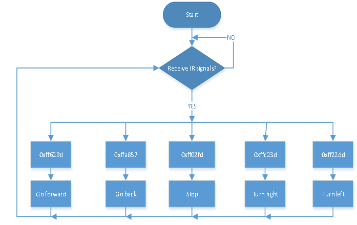

#### **(3)Connection Diagram:**

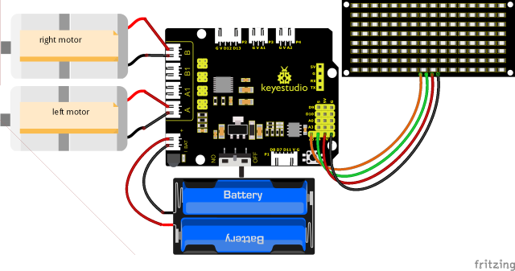

Note:

GND, VCC, SDA and SCL of the 8x16 LED panel are connected to G（GND), V（VCC). A4 and A5 of the expansion board.

Since the 8833 board integrates the IR receiver, you don’t need to wire it up. The pins of the IR receiver are G（GND), V（VCC) and D3.

#### **(4)Test Code:**

You can edit blocks to build up your code

（1）

（2）

(3) 

（4）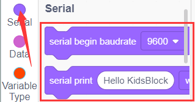

（5）

（6）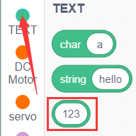

（7）

（8）

（9）

**Complete Test Code**

(Note: Do not connect the Bluetooth module before uploading the code, because the uploading of the code also uses serial communication, and there may be conflicts with the serial communication of the Bluetooth, which can cause the uploading of the code to fail.)

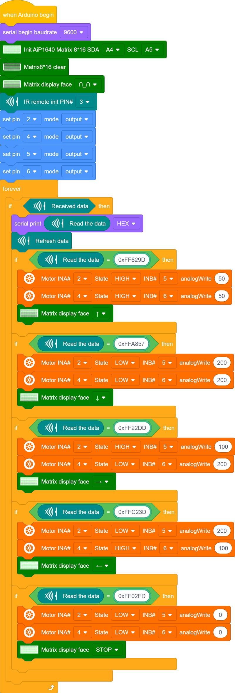

#### **(5)Test Results:**

After upload the test code successfully and power up, the smart car can be controlled to move by IR remote control and the 8\*16 shows the corresponding patterns of its movements.

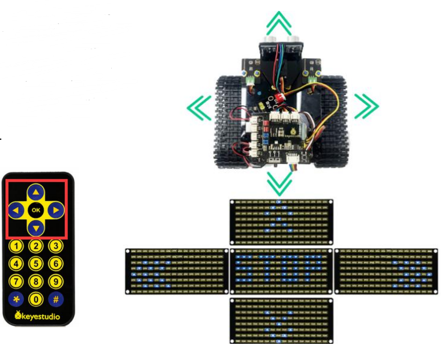

### Project 16: Bluetooth Remote Control

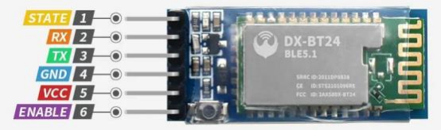

#### **(1)Description:**

In the last several decades, Bluetooth has become the most popular wireless communication module for it is easy to use and has found wide applications in most devices powered by batteries.

In order to adjust with the time and reality and need the needs of customers, Bluetooth has been upgraded several times. In recent years, it embraces lots of transformations in terms of data transfer rate, power consumption of wearable devices and IoT devices, and security systems and others. Here, we plan to learn about DX-BT24 with Arduino board.

#### **(2)Parameter:**

- Bluetooth protocol: Bluetooth Specification V5.1 BLE
- Working distance: In an open environment, achieve 40m ultra-long distance
- Communication Operating frequency: 2.4GHz ISM band
- Communication interface: UART
- Bluetooth certification: in line with FCC CE ROHS REACH certification standards
- Serial port parameters: 9600, 8 data bits, 1 stop bit, invalid bit, no flow control
- Power: 5V DC
- Operating temperature: –10 to +65 degrees Celsius

#### **(3)Application:**

The DX-BT24 module also supports the BT5.1 BLE protocol, which can be directly connected to iOS devices with BLE Bluetooth function, and supports resident running of background programs. Mainly used in the field of short-distance wireless data transmission. Avoid cumbersome cable connections and can directly replace serial cables. Successful application areas of BT24 modules:

※ Bluetooth wireless data transmission; 

※ Mobile phone, computer peripheral equipment; 

※ Handheld POS equipment; 

※ Wireless data transmission of medical equipment;

※ Smart home control; 

※ Bluetooth printer; 

※ Bluetooth remote control toys; 

※ Shared bicycles;

#### **(4)Pins description:**

①STATE：state pin

②RX：reception pin

③TX：sending pin

④GND：grounded

⑤VCC：power pin

⑥EN：enable pin

Connect Bluetooth to the development board

| Uno  | BT24 |
| :--: | :--: |
|  TX  |  RX  |
|  RX  |  TX  |
| VCC  |  5V  |
| GND  | GND  |

#### **(5)Connection Diagram:**

#### **(6)Download APP:**

##### **For IOS system**

1\. Open App Store.

2\. Search KeyesRobot in the Apple Store and click download.

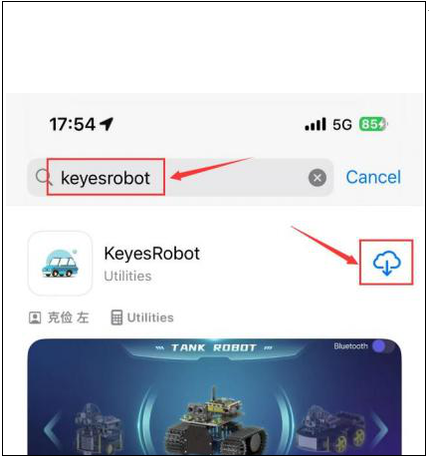

3\. After the app is installed, you will see the following icon on your phone desktop.

**How to connect iOS Phone to Bluetooth module:**

1\. Turn on the Bluetooth and location services on phone through settings.

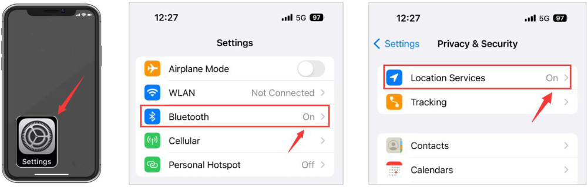

2\. Allow KeyesRobot APP to access Bluetooth through settings.

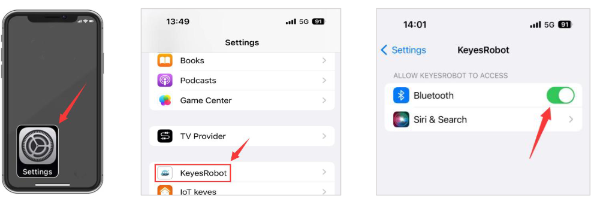

3\. Click to open KeyesRobot App.

4\. KeyesRobot App is a universal APP, which is applied to multiple keyestudio robots. If the interface does not display "TANK ROBOT", you can click the left and right buttons to find "TANK ROBOT".

5\. Click the Bluetooth button in the upper right corner to scan the bluetooth

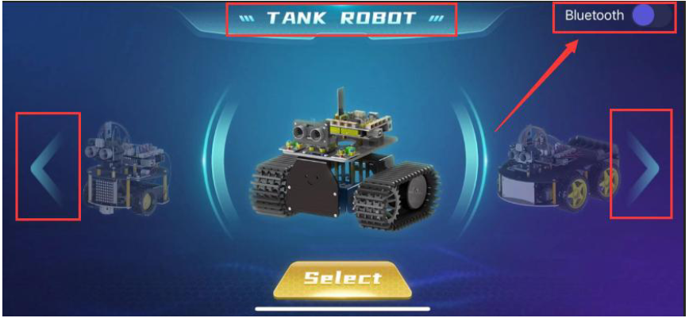

6\. You will see a Bluetooth named **BT24**, click the Connect button.

7\. If the onboard LED on the Bluetooth module stops flashing and stays on, it means your phone is successfully connected to the Bluetooth module.

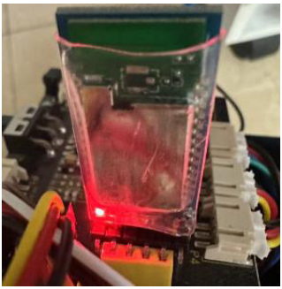

##### **For Android System**

1\. Search **KeyesRobot** in Google Play, or open the following link to download and install the app. 

[https://play.google.com/store/apps/details?id=com.keyestudio.keyestudio](https://play.google.com/store/apps/details?id=com.keyestudio.keyestudio)

2\. Turn on the Bluetooth and the location services of the mobile phone

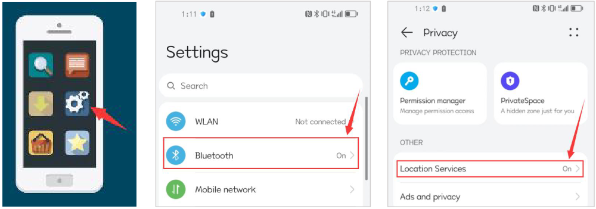

3\. Find the KeyesRobot Bluetooth app from settings, click on the permission options of the app, and
enable Location and nearby device permissions.(Note: Some mobile phones do not have nearby device permissions function.)

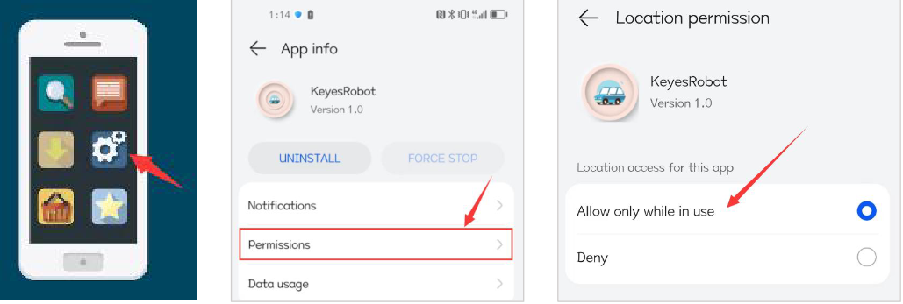

4\. Click to open KeyesRobot App.

5\. KeyesRobot App is a universal APP, which is applied to multiple keyestudio robots. If the interface does not display "TANK ROBOT", you can click the left and right buttons to find "TANK ROBOT".

6\. Click the Bluetooth button in the upper right corner to scan the bluetooth

7\. You will see a Bluetooth named **BT24**, click the Connect button.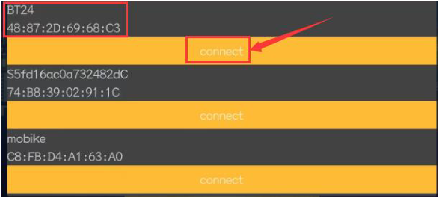

8\. When your phone is successfully connected to the Bluetooth module, the onboard LED on the Bluetooth module will stop flashing and stay on.

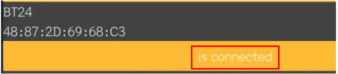

#### **(7)BT Test Code:**

You can also drag blocks to edit your code, as shown below

（1）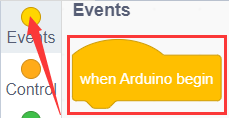

（2）

（3）

（4）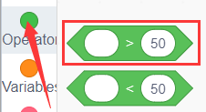

（5）

**Complete Test Code**

(Note: Do not connect the Bluetooth module before uploading the code, because the uploading of the code also uses serial communication, and there may be conflicts with the serial communication of the Bluetooth, which can cause the uploading of the code to fail.)

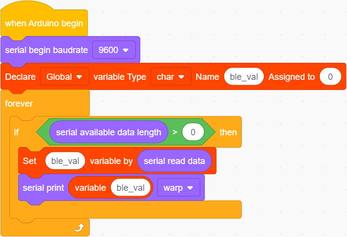

Upload the code to the development board, then plug in the Bluetooth module, and then connected the mobile phone to the Bluetooth module.

After the mobile phone is successfully connected to the Bluetooth module, click to open the Bluetooth APP and click the Select button on the homepage.

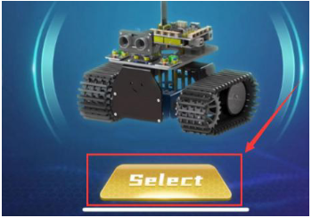

The main interface of the Bluetooth app is shown in the figure below.

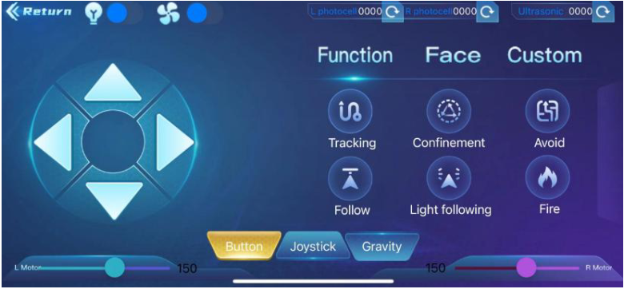

Click and set the baud rate to 9600. Click the icon on the APP interface and the serial monitor will display command sent by button.

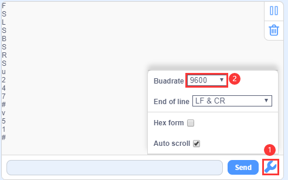

 
 
**Note: The APP connection method is the same as below.**
 
 

#### **(8)Extension Practice:**

In the above project, Bluetooth receives the signal sent by the mobile phone and displays it on the serial port of the development board. Here we use the command sent by the mobile phone to turn on or off an LED. Looking at the wiring diagram, an LED is connected to the D9 pin,

You can also drag blocks to edit your code, as shown below

（1）

（2）

（3）

（4）

(5）

（6）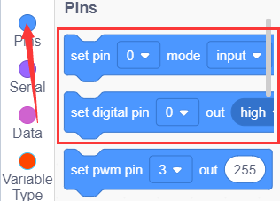

**Complete Test Code**

(Note: Do not connect the Bluetooth module before uploading the code, because the uploading of the code also uses serial communication, and there may be conflicts with the serial communication of the Bluetooth, which can cause the uploading of the code to fail.)

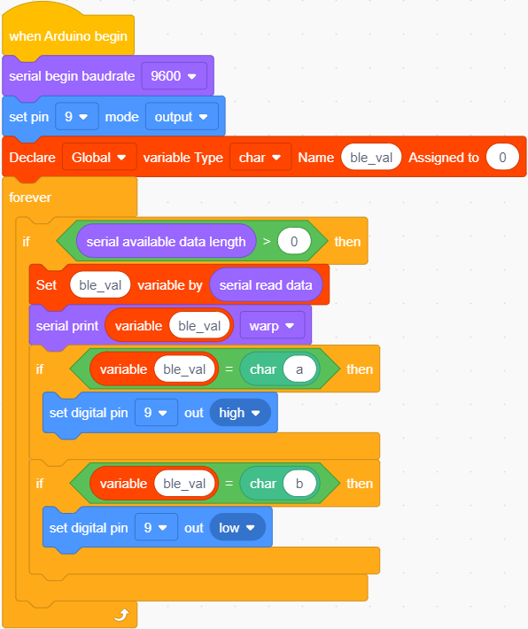

After the code above is successfully uploaded. Click  to control the LED.

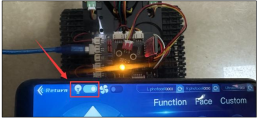

After you finish the BT project, remove it.

### Project 17: Bluetooth Control Tank

#### **(1)Description:**

We have learned the basic knowledge of Bluetooth in the previous project . In this lesson, we will use Bluetooth to control the smart car. Since it involves Bluetooth, a sending end and a receiving end are needed. In the project, we use the mobile phone as the sender (master), and the smart car connected with the HM-10 Bluetooth module (slave) as the receiver.

We have learned earlier that sending a bit can control LEDs. And the principle of controlling this robot car is the same.

In order to better control the intelligent tank robot, we specially made an APP. In this lesson, we will read all the key value on this APP through code, and then introduce the exclusive APP of our tank robot.

#### **(2)Key Function on the APP:**

The following table illustrates the functions of corresponding keys:

|                      Keys                       |                                                |                          Functions                           |
| :---------------------------------------------: | :--------------------------------------------: | :----------------------------------------------------------: |
|  |                                                | Pair and connect HM-10 Bluetooth module;click again to disconnect |
|  |                                                |                 select the robot to operate                  |
|  |                                                |       to control the movements of the robot by buttons       |
|  |                                                |      To control the movements of the robot by joystick       |
|  |                                                |       To control the movements of the robot by gravity       |
|  |   Send “F”when pressed and “S”when released    | The car moves forward when it is pressed and stops when released |
|  |   Send “L”when pressed and “S”when released    | The car turns left when it is pressed tight and stops when released |
|  |   Send “R”when pressed and “S”when released    | The car turns right when it is pressed tight and stops when released |
|  |   Send “B”when pressed and “S”when released    | The car turns back when it is pressed tight and stops when released |
|  |        Send “u”+digit+“\#”when dragged         |          Drag to change the speed of the left motor          |
|  |        Send “v”+digit+“\#”when dragged         |         Drag to change the speed of the right motor          |
|  |         Select to enter Function page          |                                                              |
|  | Send “G”when pressed and “S”when pressed again | Enter obstacle avoidance mode when pressed and exit when pressed again |
|  | Send “h”when pressed and “S”when pressed again | Enter following mode when pressed and exit when pressed again |
|  | Send “e”when pressed and “S”when pressed again | Enter line-tracking mode when pressed and exit when pressed again |
|  | Send “f”when pressed and “S”when pressed again | Enter move-in-confined-space mode when pressed and exit when pressed again |
|  | Send “i”when pressed and “S”when pressed again | Enter light following mode when pressed and exit when pressed again |
|  | Send “j”when pressed and “S”when pressed again | Enter fire extinguishing mode when pressed and exit when pressed again |
|  | Select to enter facial expression display mode |                                                              |
|  | Send “k”when pressed and “z”when pressed again | Show smiling pattern when clicked and clear expression when clicked again |
|  | Send “l”when pressed and “z”when pressed again | Show disgusting pattern when clicked and clear expression when clicked again |
|  | Send “m”when pressed and “z”when pressed again | Show happy face when clicked and clear expression when clicked again |
|  | Send “n”when pressed and “z”when pressed again | Show sad pattern when clicked and clear expression when clicked again |
|  | Send “o”when pressed and “z”when pressed again | Show disparaging pattern when clicked and clear expression when clicked again |
|  | Send “p”when pressed and “z”when pressed again | Show heart-shaped pattern when clicked and clear expression when clicked again |
|  |                                                | Choose to enter the custom function interface; there are six keys 1,2,3,4,5,6; with these keys, you can expand some functions by yourself |
|  |               Click to send “w”                | Click to display the analog value detected by the photoresistor on the left |
|  |                Click to send“y”                | Click to display the analog value detected by the photoresistor on the right |
|  |                Click to send“x”                | Click to show the distance detected by ultrasonic sensor (unit: cm) |
|  | Click to send“c”  Click again to send“d”  |   Press to turn on the fan and press again to turn off it    |

#### **(3)Flow Chart:**

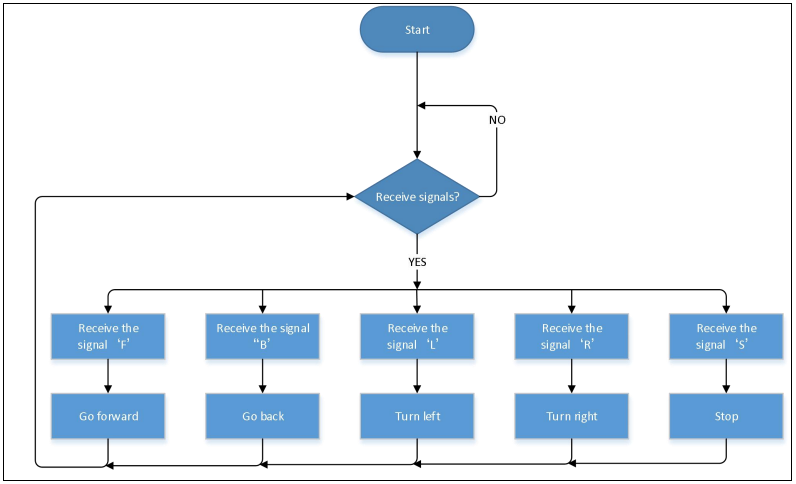

#### **(4)Connection Diagram:**

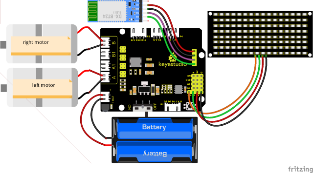

Note:

GND, VCC, SDA and SCL of the 8x16 LED panel are connected to G（GND), V（5V), A4 and A5 of the expansion board. STATE and BRK don’t need to be interfaced. The BT module is inserted into the expansion board.

#### **(5)Test Code:**

You can drag blocks to edit your code

（1）

（2）

(3) 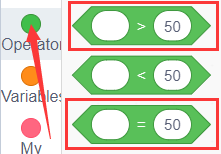

（4）

（5）

（6) 

（7）

（8）

（9）

**Complete Test Code**

(Note: Do not connect the Bluetooth module before uploading the code, because the uploading of the code also uses serial communication, and there may be conflicts with the serial communication of the Bluetooth, which can cause the uploading of the code to fail.)

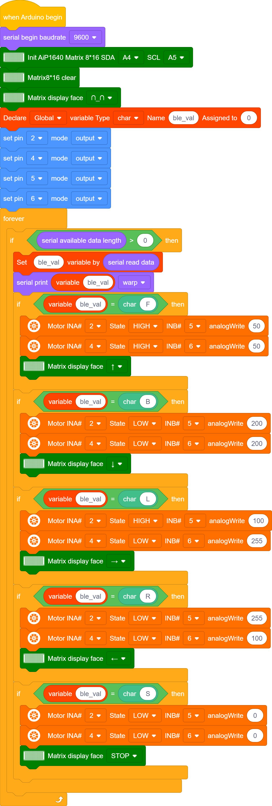

#### **(6)Test Result:**

After uploading the code, connect the robot to the Bluetooth module and pair the Bluetooth APP. Turn on the powerswitch of the motor drive shield. Place the robot on the floor, you can use these buttons of the Bluetooth app to control the robot. 

1. The up, down, left and right arrows control the robot to move forward, backward, left and right respectively.

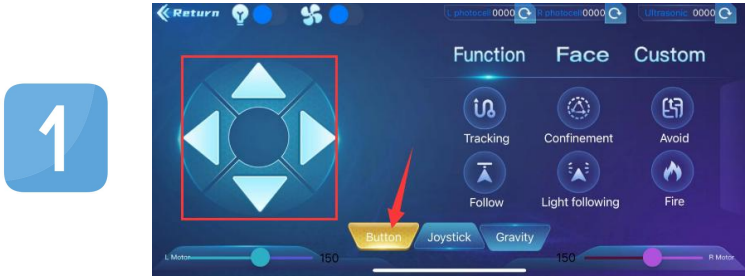

2. Click the joystick button and pull the direction of the black point in the white circle to control the movement direction of the robot.

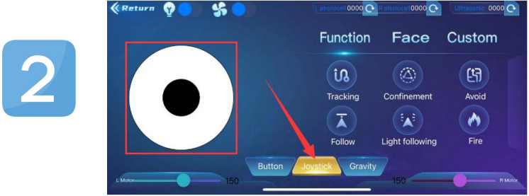

3.Click the Gravity button and tilt the phone in the forward, backward, left, and right directions, and the robot will move in the direction in which the phone istilted.

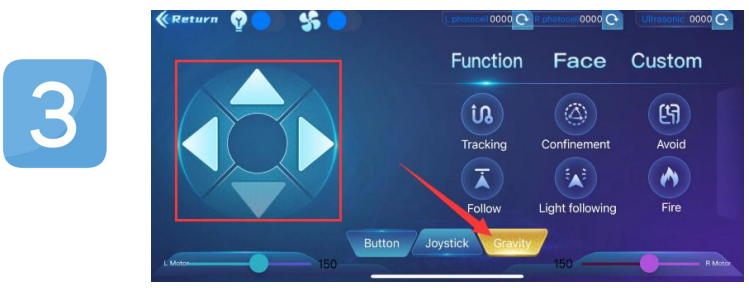

### Project 18: Ultrasonic Tank Robot Multiple Functions

#### **(1)Description:**

The smart car has performed a single function in every previous project. 

Can it display multiply functions at a time ? Positive. 

In this last big project, we intend to use a complete code to control the smart car to show off all functions mentioned in previous projects. We use the keys on the Bluetooth APP to automatically switch various functions, quite simple and convenient.

#### **(2)Flow Diagram:**

#### **(3)Connection Diagram:**

1\. GND, VCC, SDA and SCL of the 8x16 board are connected to G（GND), +（VCC), A4 and A5 of the expansion board.

2\. VCC, Trig, Echo and Gnd of the ultrasonic sensor are connected to 5V(V), 12(S), 13(S) and Gnd(G)

3\. The brown wire, red wire and orange wire of the servo are connected to Gnd(G), 5v(V) and D10.

4\. RXD, TXD, GND and VCC of the BT module are connected to TX, RX, G（GND) and 5V（VCC）. STATE and BRK don’t need to be interfaced.

5\. The pin "G", "V" and S of the left photoresistor module are connected to G (GND), V (VCC), A1 respectively; The right photoresistor module is connected to the G (GND), V (VCC), and A2 respectively.

6\. The distal port of the line tracking sensor is 11, 7 and 8

#### **(4)Test Code:**

(Note: Do not connect the Bluetooth module before uploading the code, because the uploading of the code also uses serial communication, and there may be conflicts with the serial communication of the Bluetooth, which can cause the uploading of the code to fail.)

Note: you can’t speed up the car via App.

#### **(5)Test Result:**

Before uploading the program code, the Bluetooth module needs to be removed, otherwise the code upload will fail.

After uploading the code successfully, open the positioning, and then connect the Bluetooth module.

After uploading the code successfully, plug in the Bluetooth module, after power-on, after the mobile APP is connected to the Bluetooth successfully, we can use the mobile APP to control the tank robot.

## 4. Experiment Extension

### Assemble Fire Extinguishing Robot

Remove the ultrasonic sensor and two photoresistors

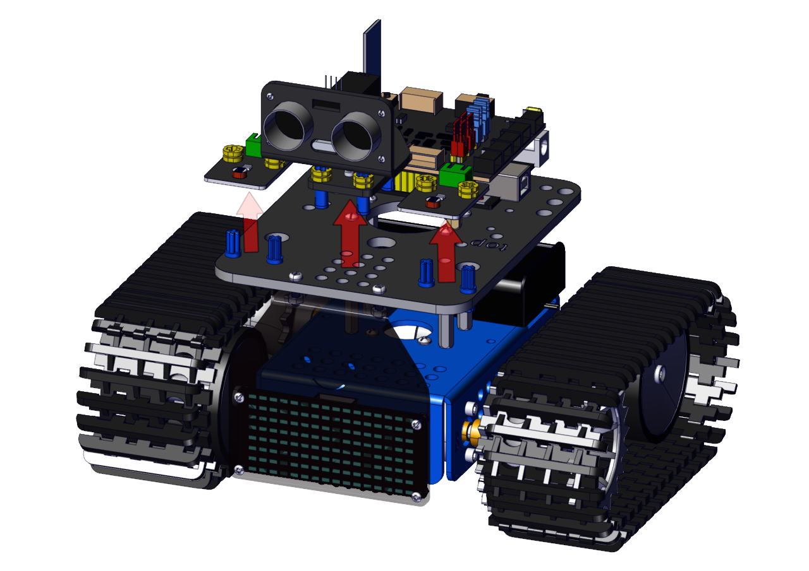

Put on a fan module and two flame sensors

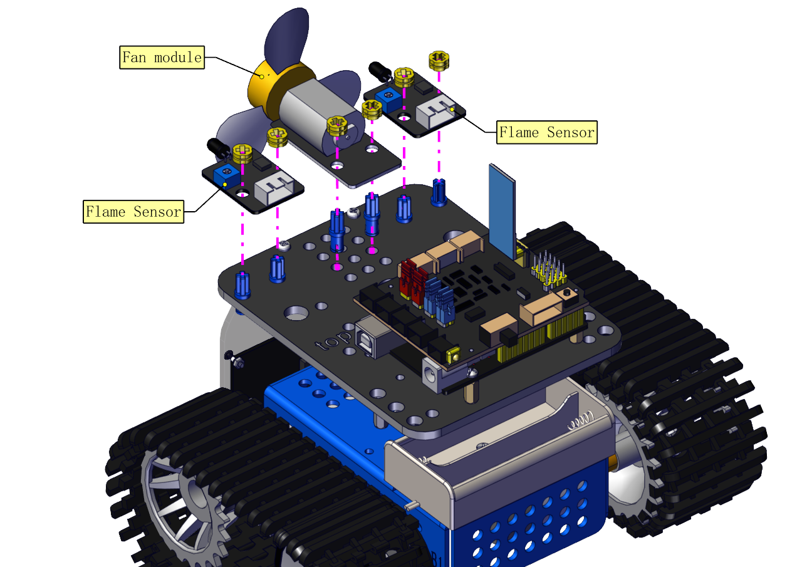

You can make the fan module install further if the fan module and flame sensors interfere

**Wire up**

Wire up the two flame sensors

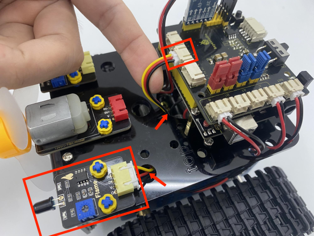

| Flame Sensor | Keyestudio 8833 Board |
| :----------: | :-------------------: |
|      G       |           G           |
|      V       |           V           |
|      A       |          A1           |

| Flame Sensor | Keyestudio 8833 Board |
| :----------: | :-------------------: |
|      G       |           G           |
|      V       |           V           |
|      A       |          A2           |

Wire up the fan module 

| DC130 Motor | Keyestudio 8833 Board |
| :---------: | :-------------------: |
|      G      |           G           |
|      V      |           V           |
|     IN+     |          D12          |
|     IN-     |          D13          |

------

 **We adopt a model 18650 lithium battery with a pointed positive pole, whose power and capacity are not required.**

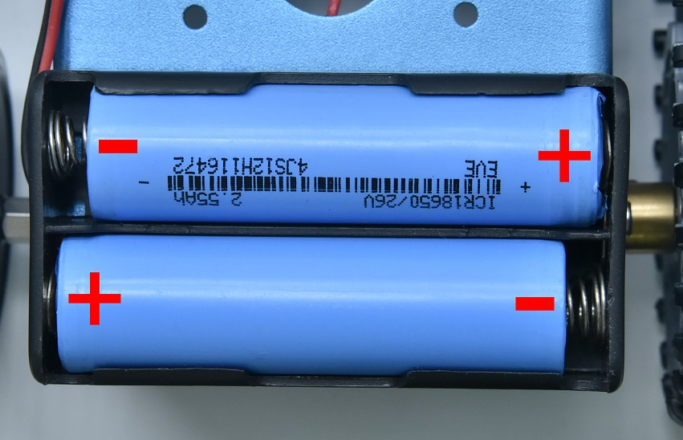

### Project 19: Flame Sensor

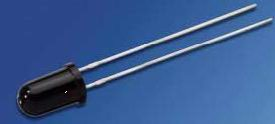

#### **(1)Description:**

The flame sensor uses IR receiving tube to detect flames, converts the brightness of the flame into signals with high and low levels, input them into the central processor. The corresponding program processing. In both flames close to and without flames, the voltage value of the analog port is varied. 

If there is no flame, the analog port is about 0.3V; when there is a flame, the analog port is 1.0V. The closer the flame is , the more the voltage value is. It can be used to detect the fire source or make a smart robot.

Note the probe of flame sensors only bears the temperature between -25 ℃and ～85℃.

In the process of use, pay attention to keep the flame sensor in certain distance to avoid getting damaged.

#### **(2)Parameters:**

- Working voltage: 3.3V-5V (DC)

- Current: 100mA

- Maximum power: 0.5W

- Work temperature: -10 ° C to +50 degrees Celsius

- Sensor size: 31.6mmx23.7mm

- Interface: 4pin turn 3PIN interface

- Output signal: analog signals A0, A1

#### **(3)Connection Diagram:**

Pin A of two photoresistors are connected to A1 and A2. We connect the flame sensor to A1 and A2. We replace two photoresistors and the ultrasonic sensor with two flame sensors and a fan, an extinguishing car is created.

**Note:**
1）This experiment requires the use of a fire source. Please make it away from flammable items to prevent fire. Children should experiment under adult supervision. If you cannot confirm that you are safe, please abandon the experiment. 
2）**The flame sensoris not fireproof, please do not burn it directly with flame.**

#### **(4)Test Code:**

You can also drag blocks to edit your code, as shown below

**Complete Test Code**

(Note: Do not connect the Bluetooth module before uploading the code, because the uploading of the code also uses serial communication, and there may be conflicts with the serial communication of the Bluetooth, which can cause the uploading of the code to fail.)

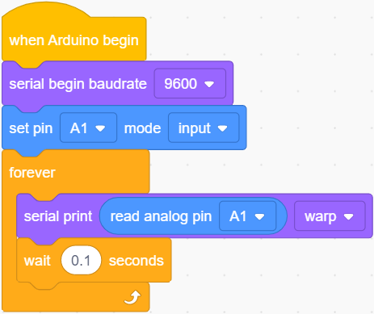

#### **(5)Test Results:**

Wire up components, burn the code, open the serial monitor and set the baud rate to 9600.

You can view the simulation value of flame sensor.

The closer the flame, the smaller the simulation value.

Adjust the potentiometer on the module to maintain the LED at the critical point. When the sensor does not detect flame, the LED will be off, but if the sensor detects flame, the LED will be on.

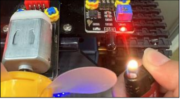

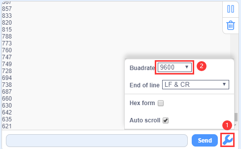

#### **(6)Extension Practice:**

**Note:**
1）This experiment requires the use of a fire source. Please make it away from flammable items to prevent fire. Children should experiment under adult supervision. If you cannot confirm that you are safe, please abandon the experiment. 
2）The flame sensoris not fireproof, please do not burn it directly with flame.
We can control an external LED with the flame sensor. The LED still is connected to D9. When fire is connected, LED will be on.

You can drag blocs to edit your code, as shown below

**Complete Test Code**

(Note: Do not connect the Bluetooth module before uploading the code, because the uploading of the code also uses serial communication, and there may be conflicts with the serial communication of the Bluetooth, which can cause the uploading of the code to fail.)

You can use the flame of a lighter near the left flame sensor. When the flame sensor detects a flame, the LED module will light up as an alarm.

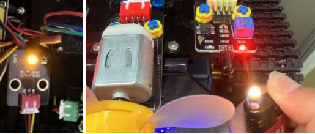

**Note:**
Please make it away from flammable items to prevent fire. Children should experiment under adult supervision. If you cannot confirm that you are safe, please abandon the experiment. The flame sensor is not fireproof, please do not burn it directly with flame.

### Project 20: Fan

#### **(1)Description：**

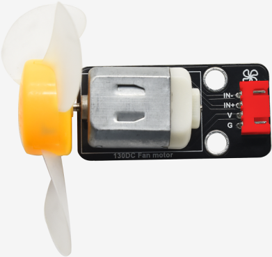

This fan module uses a HR1124S motor-controlling chip, a single-channel H-bridge driver chip containing a low-conductivity resistance PMOS and NMOS power tubes. The low-conducting resistance can ease the power consumption, contributing to the safe work of the chip for longer time.

In addition, its low standby current and low static working current makes itself apply to toys. We can control the rotation direction and speed of the fan by outputting IN + and IN- signals and PWM signals.

#### **(2)Parameters:**

- Working voltage: 5V

- Current: 200mA

- Maximum power: 2W

- Work temperature: -10 ° C to +50 degrees Celsius

- Size: 47.6mm \* 23.8mm

#### **(3)Connection Diagram:**

The fan module needs driving by large current; therefore, we install a battery holder.

The pin GND, VCC, IN+ and IN- of the fan module are connected to pin G, V, 12 and 13 of the shield.

#### **(4)Test Code:**

You can also drag blocks to edit your code, as shown below

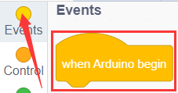

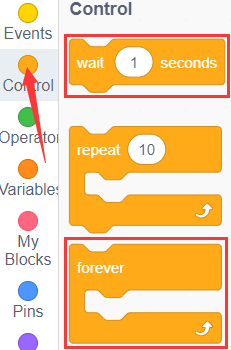

**Complete Test Code**

(Note: Do not connect the Bluetooth module before uploading the code, because the uploading of the code also uses serial communication, and there may be conflicts with the serial communication of the Bluetooth, which can cause the uploading of the code to fail.)

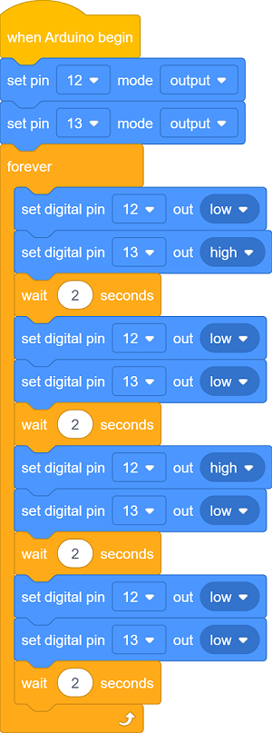

#### **(5)Test Results:**

Upload code, wire up components, power on and turn the DIP switch to ON. The small fan will turn clockwise for 2s, stop for 2s and anticlockwise for 2s

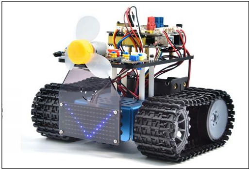

#### **(6)Extension Practice:**

We have understood the working principle of the flame sensor. Next, hook up a flame sensor in the circuit , as shown below. Then control the fan to blew out fire with the flame sensor.

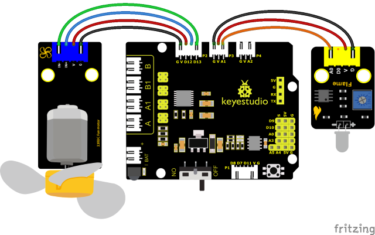

You can drag blocs to edit your code, as shown below

**Complete Test Code**

(Note: Do not connect the Bluetooth module before uploading the code, because the uploading of the code also uses serial communication, and there may be conflicts with the serial communication of the Bluetooth, which can cause the uploading of the code to fail.)

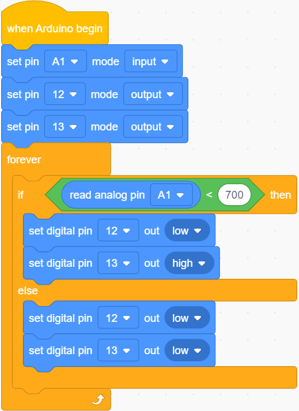

After uploading the code, turn on the power switch of the motor drive shield, you can turn on the fan when flame is detected from the left flame sensor of the robot.

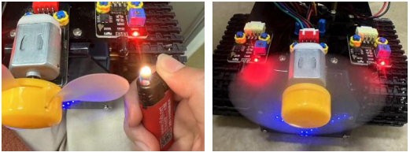

### Project 21: Fire Extinguishing Tank

#### **(1)Description:**

The line-tracking function of the smart tank has been explained in the previous project. And in this project we use the flame sensor to make a fire extinguishing robot. 

When the car encounters flames, the motor of the fan will rotate to blow out the fire. Of course, we need to replace the ultrasonic sensor and two photoresistors with a fan module and flame sensors first.

The specific logic of the line-tracking smart car is shown in the table blow:

| Left Flame Sensors | Right Flame Sensors | Status                                          |
| :----------------: | :-----------------: | :---------------------------------------------- |
|        ≤700        |        ≤700         | Car stops，fan starts rotating to blow up flame |
|        ≥700        |        ≥700         | Car stops，fan starts rotating to blow up flame |
|        ≥700        |        ≥700         | Car stops，fan starts rotating to blow up flame |
|       ＞700        |        ＞700        | Fan stops，car moves                            |

**Note:**
1）This experiment requires the use of a fire source. Please make it away from flammable items to prevent fire. Children should experiment under adult supervision. If you cannot confirm that you are safe, please abandon the experiment. 
2）The flame sensoris not fireproof, please do not burn it directly with flame.
We can control an external LED with the flame sensor. The LED still is connected to D9. When fire is connected, LED will be on.

#### **(2)Flow chart:**

#### **(3)Connection Diagram:**

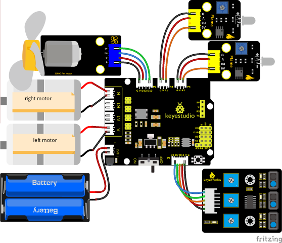

Note:

GND, VCC, SDA and SCL of the 8x16 LED panel are connected to G（GND, V（VCC), A4 and A5.

G, V and A of two flame sensors are interfaced with G（GND), V（VCC), A1 and A2 of the expansion board.

#### **(4)Test Code:**

You can also drag blocks to edit your code, as shown below

（1）

（2）

（3）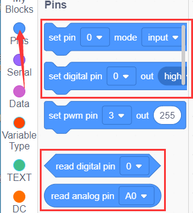

（4） 

（5） 

（6）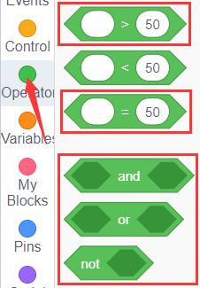

**Complete Test Code**

(Note: Do not connect the Bluetooth module before uploading the code, because the uploading of the code also uses serial communication, and there may be conflicts with the serial communication of the Bluetooth, which can cause the uploading of the code to fail.)

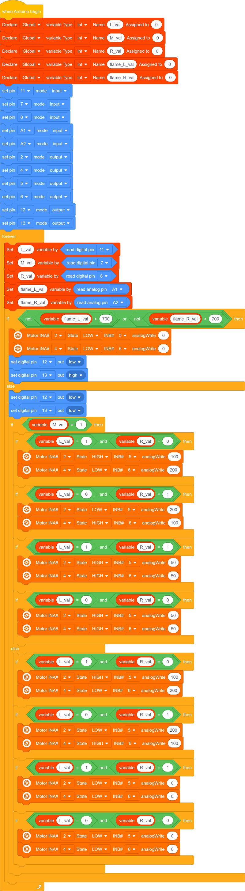

#### **(5)Test Results:**

After upload the test code successfully, power up and turn the DIP switch to ON end. The smart car will put out the fire when it detects flame.

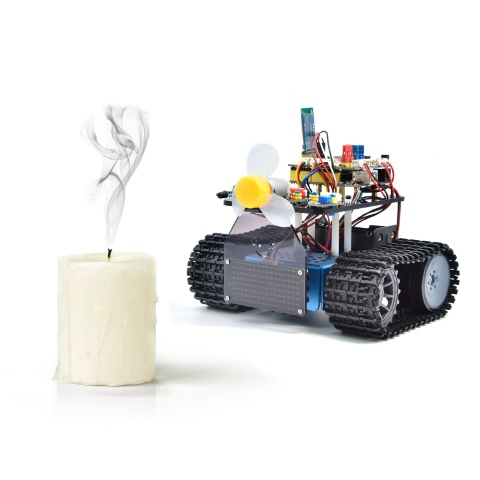

**Note:**
Please make it away from flammable items to prevent fire. Children should experiment under adult supervision. If you cannot confirm that you are safe, please abandon the experiment. The flame sensor is not fireproof, please do not burn it directly with flame.

### Project 22: Fire Extinguishing Robot Multiple Functions

#### **(1)Description:**

The smart car has performed a single function in every previous project. 

Can it display multiply functions at a time ? Positive. 

In this last big project, we intend to use a complete code to control the smart car to show off all functions mentioned in previous projects. We use the keys on the Bluetooth APP to automatically switch various functions, quite simple and convenient.

#### **(2)Flow Diagram:**

**Please referto Project 16 to install and configure Bluetooth APP**

#### **(3)Connection Diagram:**

1\. GND, VCC, SDA and SCL of the 8x16 board are connected to G（GND), +（VCC), A4 and A5 of the expansion board.

2\. VCC, IN+, IN- and Gnd of the ultrasonic sensor are connected to 5V(V), 12(S), 13(S) and Gnd(G)

3\. The brown wire, red wire and orange wire of the servo are connected to Gnd(G), 5v(V) and D10.

4\. RXD, TXD, GND and VCC of the BT module are connected to TX, RX, G（GND) and 5V（VCC）. STATE and BRK don’t need to be interfaced.

5\. The pin "G", "V" and S of the left Flame sensors are connected to G (GND), V (VCC), A1 respectively; The right Flame sensors is connected to the G (GND), V (VCC), and A2 respectively.

6\. The distal port of the line tracking sensor is 11, 7 and 8.

#### **(4)Test Code:**

(Note: Do not connect the Bluetooth module before uploading the code, because the uploading of the code also uses serial communication, and there may be conflicts with the serial communication of the Bluetooth, which can cause the uploading of the code to fail.)
Note: you can’t speed up the car via App.

#### **(5)Test Result:**

Before uploading the program code, the Bluetooth module needs to be removed, otherwise the code upload will fail.

After uploading the code successfully, open the positioning, and then connect the Bluetooth module.

After uploading the code successfully, plug in the Bluetooth module, after power-on, after the mobile APP is connected to the Bluetooth successfully, we can use the mobile APP to control the tank robot.

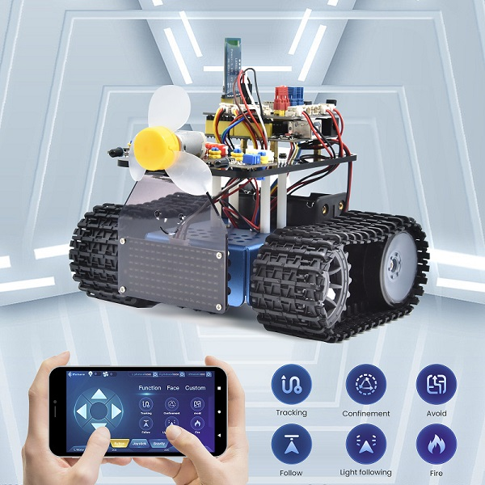

