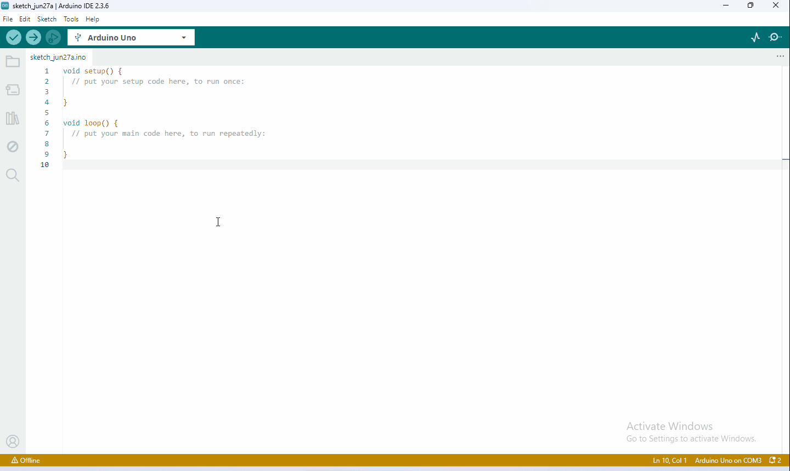

## 4.1 Gegevens downloaden

Arduino-informatie bevat bibliotheekbestanden en projectcode. Klik om te downloaden voor verdere studie.

Gegevens downloaden:[Arduino Data](./Arduino.7z)

## 4.2 Software downloaden

Wanneer we de besturingskaart ontvangen, moeten we eerst de Arduino IDE en het stuurprogramma downloaden.

Je kunt de Arduino IDE downloaden van de officiële website:<https://www.arduino.cc/en/software>.

Er zijn verschillende versies van Arduino. Download gewoon een geschikte versie voor uw systeem. We nemen het WINDOWS-systeem als voorbeeld om u te laten zien hoe u het kunt downloaden en installeren.

U hoeft alleen op JUST DOWNLOAD te klikken, klik vervolgens op het gedownloade bestand om het te installeren.

En wanneer het ZIP-bestand is gedownload, kunt u het direct uitpakken en starten.

## 4.3 Arduino IDE instellen

1. De kaart op de computer aansluiten.

## 4.4 Bibliotheek toevoegen

Wat zijn bibliotheken?

Bibliotheken zijn een verzameling code waarmee u eenvoudig verbinding kunt maken met een sensor, display, module, enz.

Er zijn honderden aanvullende bibliotheken beschikbaar op het internet om te downloaden.

We introduceren de eenvoudigste manier om bibliotheken toe te voegen.

