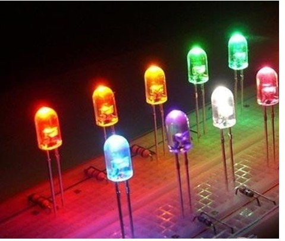
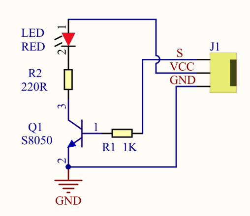
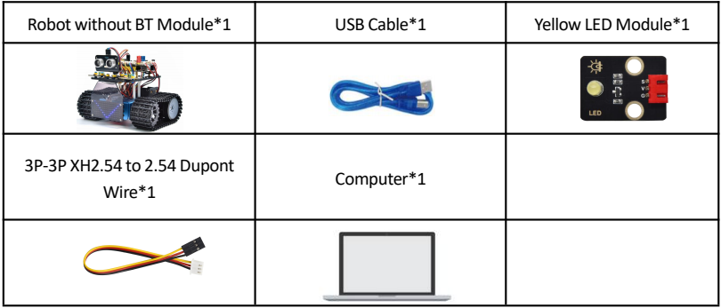
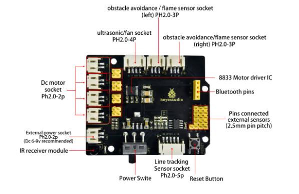
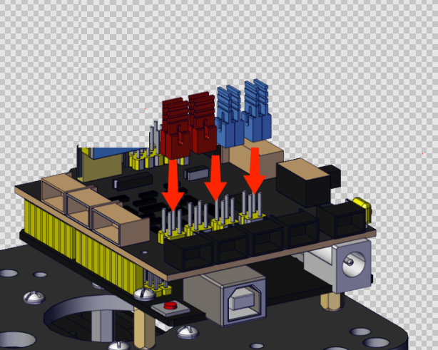

### Projet 1 : Clignotement d'une LED

#### **(1) Description :**





Pour les débutants et les passionnés, le clignotement d'une LED est un programme fondamental. LED, l'abréviation de diodes électroluminescentes, est composée de composés chimiques Ga, As, P, N et ainsi de suite. La LED peut clignoter dans différentes couleurs en modifiant le délai dans le code de test. Lors du contrôle, alimentez GND et VCC. La LED s'allumera si l'extrémité S est à un niveau haut ; sinon, elle s'éteindra.

#### **(2) Paramètres :**


- Interface de contrôle : port numérique
- Tension de fonctionnement : DC 3,3-5V
- Espacement des broches : 2,54mm
- Couleur d'affichage de la LED : jaune

#### **(3) Composants requis :**




#### **(4) Carte d'extension du pilote moteur 8833 :**

La carte d'extension du pilote moteur Keyestudio 8833 est compatible avec la carte de développement Arduino UNO. Il suffit de l'empiler sur la carte de développement lors de l'utilisation.



#### **(5) Schéma de connexion :**




<span style="color: rgb(255, 76, 65);">**REMARQUE :**</span> La LED est connectée au port D9. N'oubliez pas d'installer les cavaliers sur le shield.

#### **(6) Code de test :**

(<span style="color: rgb(255, 76, 65);">**Remarque :**</span> Ne pas connecter le module Bluetooth avant de téléverser le code, car le téléversement utilise également la communication série, et il peut y avoir des conflits avec la communication série Bluetooth, ce qui peut entraîner l'échec du téléversement.)

```C
/*

Keyestudio Mini Tank Robot V3 (Popular Edition)

lesson 1.1

Blink

http://www.keyestudio.com

*/

int LED = 9; // Définir la broche de la LED pour la connecter au port numérique 9

void setup()
{
	pinMode(LED, OUTPUT); // Initialiser la broche de la LED en mode sortie
}

void loop() // Boucle infinie
{
	digitalWrite(LED, HIGH); // Sortie niveau haut et allumage de la LED
	delay(1000); // Attendre 1s
	digitalWrite(LED, LOW); // Sortie niveau bas et extinction de la LED
	delay(1000); // Attendre 1s
}
```

#### **(7) Résultats du test :**

Téléversez le programme, la LED clignote à un intervalle de 1s.

#### **(8) Explication du code :**

**pinMode(LED，OUTPUT) -** Cette fonction permet d'indiquer que la broche est en mode INPUT (entrée) ou OUTPUT (sortie)

**digitalWrite(LED，HIGH) -** Lorsque la broche est en mode OUTPUT, nous pouvons la régler sur HIGH (sortie 5V) ou LOW (sortie 0V)

#### **(9) Pratique d'extension :**

Nous avons réussi à faire clignoter la LED. Ensuite, observons ce qui arrivera à la LED si nous modifions les broches et le délai.

**Code de test**

(<span style="color: rgb(255, 76, 65);">**Remarque :**</span> Ne pas connecter le module Bluetooth avant de téléverser le code, car le téléversement utilise également la communication série, et il peut y avoir des conflits avec la communication série Bluetooth, ce qui peut entraîner l'échec du téléversement.)

```C
/*

Keyestudio Mini Tank Robot V3 (Popular Edition)

lesson 1.2

Blink

http://www.keyestudio.com

*/

int LED = 9; // Définir la broche de la LED comme étant la broche 9

void setup()
{
	pinMode(LED, OUTPUT); // Régler la broche de la LED en sortie
}

void loop() // Boucle infinie
{
    digitalWrite(LED, HIGH); // Sortie niveau haut, allumer la LED
	delay(100); // Attendre 0,1s
	digitalWrite(LED, LOW); // Sortie niveau bas de la LED, éteindre la LED
	delay(100); // Attendre 0,1s

}
```

Le résultat du test montre que la LED clignote plus rapidement. Par conséquent, nous pouvons conclure que les broches et le délai affectent la fréquence de clignotement.