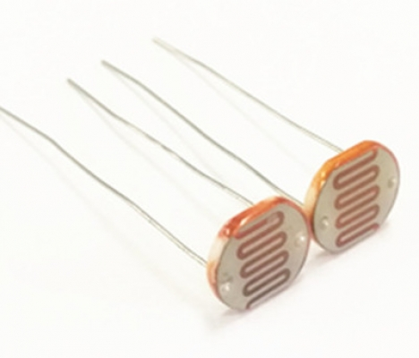
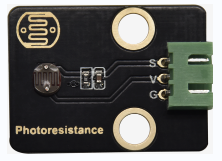
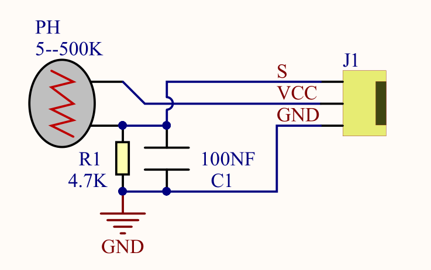
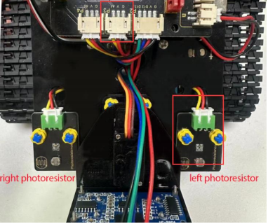
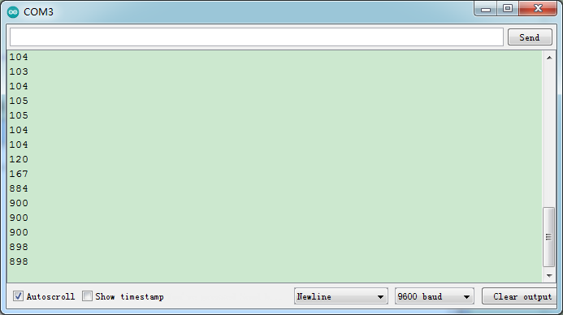
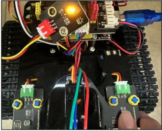

### Progetto 3: Fotoresistore



#### **(1)Descrizione:**

La resistenza fotosensibile è una resistenza speciale realizzata con un materiale semiconduttore come un solfuro o il selenio, ed è rivestita con una resina impermeabile all'umidità con effetto fotoconduttivo. La resistenza fotosensibile è molto sensibile alla luce ambientale: con diverse intensità di illuminazione, il valore della resistenza fotosensibile cambia. Usiamo la resistenza fotosensibile per progettare il modulo fotoresistore.

Il segnale del modulo è collegato alla porta analogica del microcontrollore. Quando l'intensità della luce è più forte, la tensione sulla porta analogica è maggiore, ovvero anche il valore analogico del microcontrollore è più grande; al contrario, quando l'intensità della luce è più debole, la tensione sulla porta analogica è minore, ovvero anche il valore analogico del microcontrollore è più piccolo.

In questo modo, possiamo leggere il corrispondente valore analogico usando il modulo fotoresistore, e rilevare l'intensità della luce nell'ambiente.





#### **(2)Parametri:**

Valore della resistenza fotosensibile: 5K Ou-0.5m

Tipo di interfaccia: porta di simulazione A0, A1

Tensione di funzionamento: 3.3V-5V

Passo dei pin: 2.54mm


#### **(3)Schema di Collegamento:**

Quello che andremo a testare è il modulo fotoresistore sul lato sinistro del robot.



Il fotoresistore sinistro è collegato ad A1/P3 dello shield del motore.


#### **(4)Codice di Test:**

(<span style="color: rgb(255, 76, 65);">**Nota:**</span> Non collegare il modulo Bluetooth prima di caricare il codice, perché il caricamento del codice utilizza anch'esso la comunicazione seriale, e potrebbero verificarsi conflitti con la comunicazione seriale Bluetooth, che possono causare il fallimento del caricamento.)

```C
/*

Keyestudio Mini Tank Robot V3 (Popular Edition)

lesson 3.1

photocell

http://www.keyestudio.com

*/

int sensorPin = A1; // A1 è il pin di ingresso del fotoresistore

int sensorValue = 0; // salva il valore del fotoresistore

void setup() 
{
	Serial.begin(9600); // Apri il monitor della porta seriale e imposta il baud rate a 9600
}

void loop() 
{
	sensorValue = analogRead(sensorPin); // Leggi il valore analogico dal sensore fotoresistore
	Serial.println(sensorValue); // La porta seriale stampa il valore del fotoresistore
	delay(500); // Ritardo di 500ms
}
```

#### **(5)Risultati del Test:**



Coprendo il sensore, il valore diminuisce; se non viene coperto, il valore aumenta.

#### **(6)Spiegazione del Codice:**

**analogRead(sensorPin)**: legge il valore analogico del fotoresistore

**Serial.begin(9600)**: inizializza la porta seriale e imposta il baud rate a 9600

**Serial.println**: stampa seriale

#### **(7)Pratica Avanzata:**

Il codice sopra legge soltanto il valore del fotoresistore. Possiamo combinare il fotoresistore con un LED per modificarne la luminosità. Che ne dici di controllare la luminosità del LED tramite il fotoresistore?


La luminosità del LED è controllata tramite PWM. Pertanto, colleghiamo il LED al pin PWM (pin 9) dello shield.

**Codice di Test**

(<span style="color: rgb(255, 76, 65);">**Nota:**</span> Non collegare il modulo Bluetooth prima di caricare il codice, perché il caricamento del codice utilizza anch'esso la comunicazione seriale, e potrebbero verificarsi conflitti con la comunicazione seriale Bluetooth, che possono causare il fallimento del caricamento.)

```c
/*

Keyestudio Mini Tank Robot V3 (Popular Edition)

lesson 3.2

photocell-analog output

http://www.keyestudio.com

*/

int analogInPin = A1; // A1 è il pin di ingresso del fotoresistore

int analogOutPin = 9; // La porta digitale 9 è l'uscita PMW

int sensorValue = 0; // salva la variabile del valore di resistenza del fotoresistore

int outputValue = 0; // Valore in uscita al PMW

void setup() 
{
	Serial.begin(9600); // Apri il monitor della porta seriale e imposta il baud rate a 9600
}

void loop() 
{
    sensorValue = analogRead(analogInPin); // Leggi il valore analogico dal sensore fotoresistore
    // Mappa i valori analogici da 0\~1023 ai valori di uscita PWM da 255\~0
    outputValue = map(sensorValue, 0, 1023, 255, 0);
    // Cambia l'uscita analogica
    analogWrite(analogOutPin, outputValue);
    Serial.println(sensorValue); // La porta seriale stampa il valore del fotoresistore
    delay(2);
}
```

Carica il codice sulla scheda di sviluppo, poi copri il fotoresistore e osserva la luminosità del LED.

