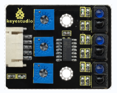
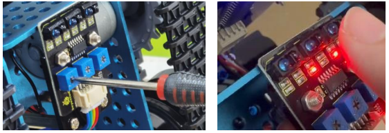
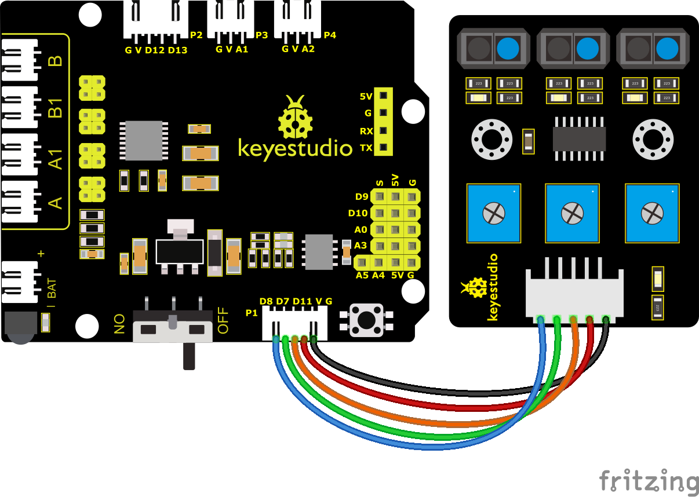
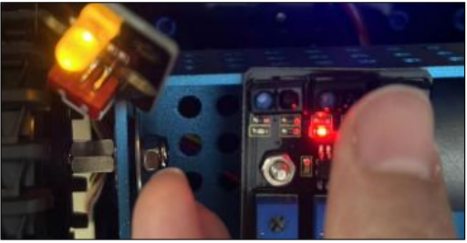
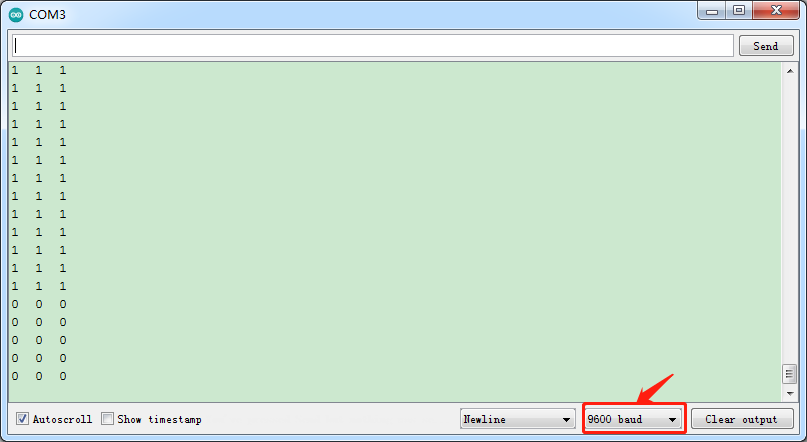
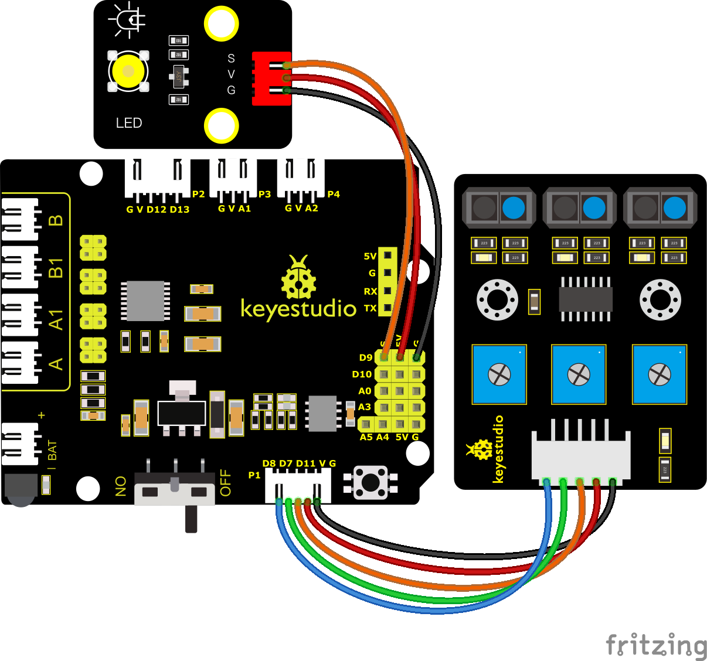

### プロジェクト4: ライントラッキングセンサー

#### **(1)概要:**



トラッキングセンサーは実際には赤外線センサーです。ここで使用されているコンポーネントはTCRT5000赤外線チューブです。

その動作原理は、赤外線の色に対する反射率の違いを利用し、反射信号の強度を電流信号に変換するものです。

検出プロセスでは、黒はHIGHレベルでアクティブになり、白はLOWレベルでアクティブになります。検出高さは0〜3 cmです。

Keyestudio 3チャンネルライントラッキングモジュールは、3セットのTCRT5000赤外線チューブを1枚の基板に統合しており、配線と制御がより便利になっています。

ライントラッキングセンサーが期待通りに動作しない場合は、ドライバーを使用してポテンショメーターを調整し、感度を高める必要があります。指をセンサーに近づけると基板上のLEDライトが点灯し、指を離すとLEDライトが消灯します。この状態のとき、感度は比較的良好です。



#### **(2)パラメータ:**

- 動作電圧: 3.3-5V (DC)

- インターフェース: 5PIN

- 出力信号: デジタル信号

- 検出高さ: 0〜3 cm


特記事項: テスト前に、センサーのポテンショメーターを回して検出感度を調整してください。LEDがONとOFFの閾値に調整されたとき、感度が最も良くなります。

<span style="color: rgb(255, 76, 65);">注意:</span> ライントラッキングセンサーはロボットの底部の下に取り付けられています。

#### **(3)接続図:**



#### **(4)テストコード:**

(<span style="color: rgb(255, 76, 65);">**注意:**</span> コードをアップロードする前にBluetoothモジュールを接続しないでください。コードのアップロードもシリアル通信を使用するため、Bluetoothシリアル通信と競合が発生し、アップロードに失敗する可能性があります。)

```C
/*

Keyestudio Mini Tank Robot V3 (Popular Edition)

lesson 4.1

Line Track sensor

http://www.keyestudio.com

*/

// ライントラッキングセンサーの配線
#define L_pin 11 // 左
#define M_pin 7 // 中央
#define R_pin 8 // 右

void setup()
{
    Serial.begin(9600); // ボーレートを9600に設定
    pinMode(L_pin, INPUT); // ライントラッキングセンサーのすべてのピンを入力モードに設定
    pinMode(M_pin, INPUT);
    pinMode(R_pin, INPUT);
}

void loop ()
{
    int L_val = digitalRead(L_pin); // 左センサーの値を読み取る
    int M_val = digitalRead(M_pin); // 中央センサーの値を読み取る
    int R_val = digitalRead(R_pin); // 右センサーの値を読み取る

    Serial.print(L_val);
    Serial.print(" ");
    Serial.print(M_val);
    Serial.print(" ");
    Serial.print(R_val);
    Serial.println(" ");
    delay(100); // 100msの遅延
}
```

#### **(5)テスト結果:**

開発ボードにコードをアップロードし、シリアルモニターを開いてライントラッキングセンサーを確認します。信号が受信されない場合、表示される値は1（HIGHレベル）です。センサーを紙で覆うと値が0に変わります。






#### **(6)コードの説明:**

**Serial.begin(9600)** - シリアルポートを初期化し、ボーレートを9600に設定します

**pinMode** - ピンを入力または出力モードとして定義します

**digitalRead** - ピンの状態を読み取ります。一般的にHIGHレベルとLOWレベルがあります

#### **(7)応用練習:**

動作原理を理解した後、D9にLEDを接続することで、ライントラッキングセンサーによってLEDを制御できます。



**テストコード**

(<span style="color: rgb(255, 76, 65);">**注意:**</span> コードをアップロードする前にBluetoothモジュールを接続しないでください。コードのアップロードもシリアル通信を使用するため、Bluetoothシリアル通信と競合が発生し、アップロードに失敗する可能性があります。)

```C
/*
Keyestudio Mini Tank Robot V3 (Popular Edition)

lesson 4.2

Line Track sensor

http://www.keyestudio.com

*/

// LEDピン
#define LED 9
// ライントラッキングセンサーの配線
#define L_pin 11 // 左
#define M_pin 7 // 中央
#define R_pin 8 // 右

void setup()
{
    Serial.begin(9600); // ボーレートを9600に設定
    pinMode(LED, OUTPUT); // LEDを出力モードに設定
    pinMode(L_pin, INPUT); // ライントラッキングセンサーのすべてのピンを入力モードに設定
    pinMode(M_pin, INPUT);
    pinMode(R_pin, INPUT);
}

void loop ()
{
    int L_val = digitalRead(L_pin); // 左センサーの値を読み取る
    int M_val = digitalRead(M_pin); // 中央センサーの値を読み取る
    int R_val = digitalRead(R_pin); // 右センサーの値を読み取る
    Serial.print(L_val);
    Serial.print(" ");
    Serial.print(M_val);
    Serial.print(" ");
    Serial.print(R_val);
    Serial.println(" ");
    delay(100); // 遅延

    if (L_val == 0 || M_val == 0 || R_val == 0) 
    {
    	digitalWrite(LED, HIGH);
    }
    else 
    {
    	digitalWrite(LED, LOW);
    }
}
```

 