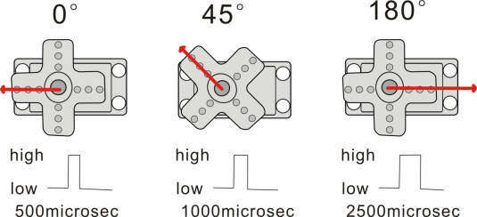
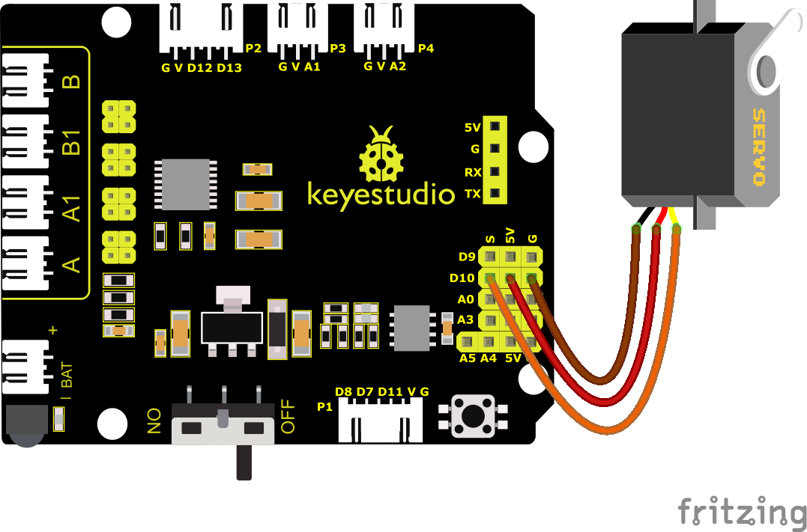
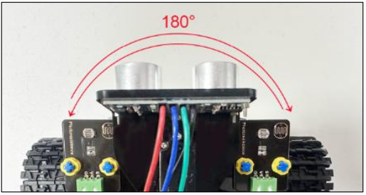

### Progetto 5: Controllo del Servo

#### **(1)Descrizione:**

Un servomotore è un attuatore rotativo per il controllo della posizione. È composto principalmente da un alloggiamento, una scheda elettronica, un motore senza nucleo, un ingranaggio e un sensore di posizione. Il suo principio di funzionamento è che il servo riceve il segnale inviato dal MCU o dal ricevitore e produce un segnale di riferimento con un periodo di 20ms e una larghezza di 1.5ms. Confronta quindi la tensione di polarizzazione DC acquisita con la tensione del potenziometro e ottiene l'uscita della differenza di tensione.

Quando la velocità del motore è costante, il potenziometro viene azionato in rotazione attraverso l'ingranaggio riduttore a cascata, il che porta la differenza di tensione a 0 e il motore si ferma. In generale, l'intervallo di angolo di rotazione del servo è 0° -- 180°

L'angolo di rotazione del servomotore è controllato regolando il ciclo di lavoro del segnale PWM (Pulse-Width Modulation). Il ciclo standard del segnale PWM è 20ms (50Hz). Teoricamente, la larghezza è distribuita tra 1ms-2ms, ma in pratica è tra 0.5ms-2.5ms. La larghezza corrisponde all'angolo di rotazione da 0° a 180°. Nota che per motori di marche diverse, lo stesso segnale può produrre angoli di rotazione differenti.


In generale, il servo ha tre fili: marrone, rosso e arancione. Il filo marrone è la massa, quello rosso è il polo positivo e quello arancione è il filo del segnale.



L'angolo del servo:


#### **(2)Parametri:**

- Tensione di lavoro: DC 4.8V \~ 6V

- Intervallo angolo operativo: circa 180° (a 500 → 2500 μsec)

- Intervallo larghezza impulso: 500 → 2500 μsec

- Velocità a vuoto: 0.12 ± 0.01 sec / 60 (DC 4.8V) 0.1 ± 0.01 sec / 60 (DC 6V)

- Corrente a vuoto: 200 ± 20mA (DC 4.8V) 220 ± 20mA (DC 6V)

- Coppia di stallo: 1.3 ± 0.01kg · cm (DC 4.8V) 1.5 ± 0.1kg · cm (DC 6V)

- Corrente di stallo: ≦ 850mA (DC 4.8V) ≦ 1000mA (DC 6V)

- Corrente in standby: 3 ± 1mA (DC 4.8V) 4 ± 1mA (DC 6V)

#### **(3)Schema di Collegamento:**



<span style="color: rgb(255, 76, 65);">Nota:</span> I fili marrone, rosso e arancione del servo sono collegati rispettivamente a Gnd(G), 5v(V) e 10 dello shield. Ricordarsi di collegare un'alimentazione esterna a causa dell'alta corrente del servo. In caso contrario, la scheda di sviluppo potrebbe danneggiarsi.

#### **(4)Codice di Test 1:**

(<span style="color: rgb(255, 76, 65);">**Nota:**</span> Non collegare il modulo Bluetooth prima di caricare il codice, poiché il caricamento del codice utilizza anche la comunicazione seriale e potrebbero verificarsi conflitti con la comunicazione seriale Bluetooth, che possono causare il fallimento del caricamento.)

```C
/*
Keyestudio Mini Tank Robot V3 (Popular Edition)
lesson 5.1
Servo
http://www.keyestudio.com
*/

#define servoPin 10 //Il pin del servo

int pos; //La variabile dell'angolo del servo
int pulsewidth; //La variabile della larghezza di impulso del servo

void setup() 
{
    pinMode(servoPin, OUTPUT); //Imposta il pin del servo come uscita
    procedure(0); //Imposta l'angolo del servo a 0°
}

void loop() 
{
    for (pos = 0; pos <= 180; pos += 1)  // Da 1° a 180°
    {
    	// con incrementi di 1 grado	
        procedure(pos); // Ruota all'angolo 'pos'
        delay(15); //Controlla la velocità di rotazione
    }
    for (pos = 180; pos >= 0; pos -= 1) // Da 180° a 1°
    { 
        procedure(pos); // Ruota all'angolo 'pos'
        delay(15);
    }
}
//La funzione controlla il servo
void procedure(int myangle) 
{
    pulsewidth = myangle * 11 + 500; //Calcola il valore della larghezza di impulso
    digitalWrite(servoPin, HIGH);
    delayMicroseconds(pulsewidth); //Il tempo al livello alto rappresenta la larghezza di impulso
    digitalWrite(servoPin, LOW);
    delay((20 - pulsewidth / 1000)); //Poiché il ciclo è 20ms, il tempo rimanente è al livello basso
}
```

Caricando il codice, vedremo il servo muoversi da 0° a 180°. Nei capitoli successivi, introdurremo come pilotare un servo. Inoltre, possiamo controllare un servo con una libreria servo di Arduino.

<span style="color: rgb(255, 76, 65);">Nota:</span> Questo file di libreria servo utilizza il timer 1, e l'uscita PWM delle porte IO 9 e 10 utilizza anch'essa il timer 1, quindi non possiamo utilizzare questa libreria servo quando utilizziamo l'uscita PWM di D9 e D10 in seguito.

#### **(5)Codice di Test 2:**

(<span style="color: rgb(255, 76, 65);">Nota: </span> Non collegare il modulo Bluetooth prima di caricare il codice, poiché il caricamento del codice utilizza anche la comunicazione seriale e potrebbero verificarsi conflitti con la comunicazione seriale Bluetooth, che possono causare il fallimento del caricamento del codice.)

```C
/*
Keyestudio Mini Tank Robot V3 (Popular Edition)
lesson 5.2
Servo
<http://www.keyestudio.com>
*/

#include <Servo.h>

Servo myservo; // crea i servo
int pos = 0; // Salva le variabili dell'angolo

void setup() 
{
	myservo.attach(10); //Collega il servo alla porta digitale 10
}

void loop() 
{
    for (pos = 0; pos <= 180; pos += 1)  //Da 0° a 180°
    {
    	//la lunghezza del passo è 1
        myservo.write(pos); // Ruota all'angolo 'pos'
        delay(15); // Attendi 15ms per controllare la velocità
    }

    for (pos = 180; pos >= 0; pos -= 1)  //Da 180° a 0°
    {
        myservo.write(pos); // Ruota all'angolo 'pos'
        delay(15); // Attendi 15ms per controllare la velocità
    }
}
```

#### **(6)Risultati del Test:**

Caricare il codice, collegare l'alimentazione e il servo si muove nell'intervallo tra 0° e 180°.



#### **(7)Spiegazione del Codice:**

Arduino è dotato di **\#include \<Servo.h\>** (funzione e istruzioni del servo)

Di seguito sono riportate alcune istruzioni comuni della funzione servo:

1\. **attach（interfaccia）**——Imposta l'interfaccia del servo, le porte 9 e 10 sono disponibili

2\. **write（angolo）**——L'istruzione per impostare l'angolo di rotazione del servo, l'intervallo di angolo va da 0° a 180°

3\. **read（）**——L'istruzione per leggere l'angolo del servo, legge il valore del comando di "write()"

4\. **attached（）**——Verifica se il parametro del servo è stato inviato alla sua interfaccia

Nota: Il formato di scrittura sopra indicato è "nome variabile servo, istruzione specifica（）", ad esempio: myservo.attach(10)