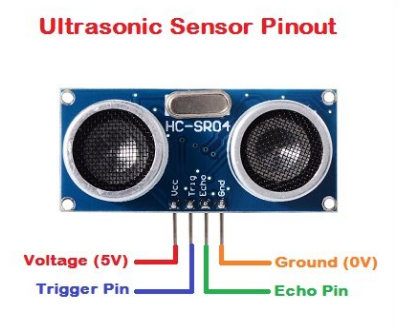
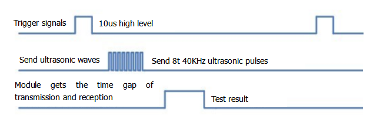
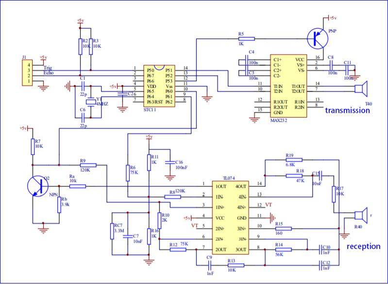
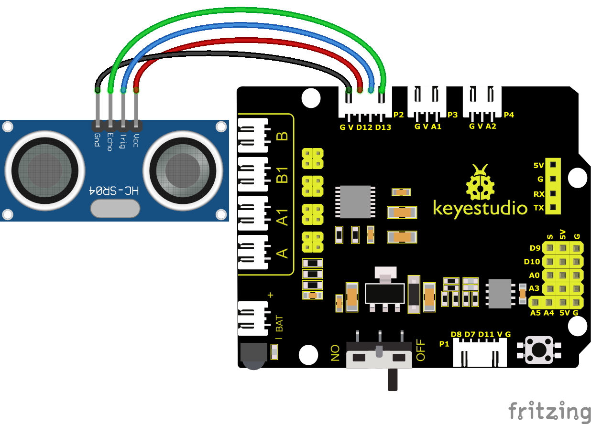
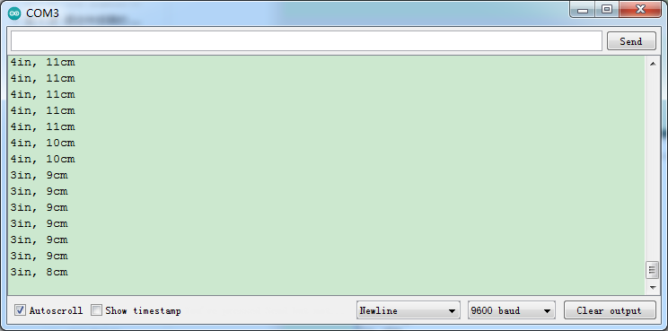
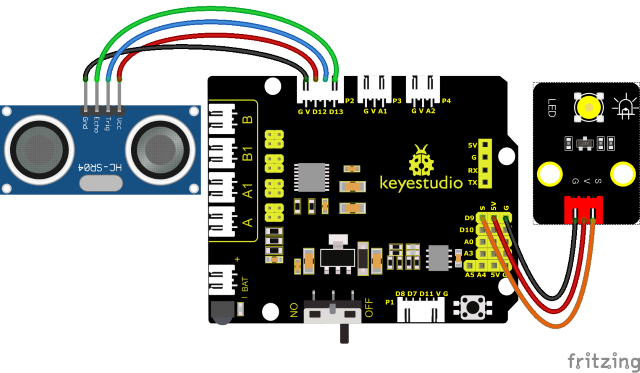
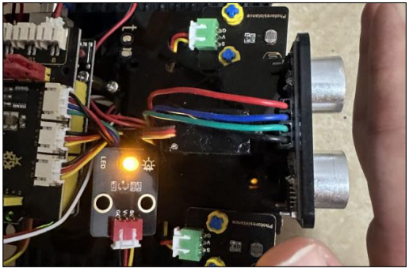

### Progetto 6: Sensore a Ultrasuoni

#### **(1) Descrizione:**


Il sensore a ultrasuoni HC-SR04 utilizza il sonar per determinare la distanza da un oggetto, come fanno i pipistrelli. Offre un'eccellente rilevazione della distanza senza contatto, con alta precisione e letture stabili in un pacchetto facile da usare. È completo di moduli trasmettitore e ricevitore a ultrasuoni.

L'HC-SR04 o il sensore a ultrasuoni viene utilizzato in un'ampia gamma di progetti elettronici per creare applicazioni di rilevamento ostacoli e misurazione della distanza, oltre a varie altre applicazioni. Qui abbiamo presentato il metodo semplice per misurare la distanza con Arduino e il sensore a ultrasuoni e come utilizzare il sensore a ultrasuoni con Arduino.



#### **(2) Parametri:**

- Alimentazione: +5V DC

- Corrente a riposo: \<2mA

- Corrente di funzionamento: 15mA

- Angolo efficace: \<15°

- Distanza di misurazione: 2cm – 400 cm

- Risoluzione: 0.3 cm

- Angolo di misurazione: 30 gradi

- Larghezza dell'impulso di ingresso trigger: 10uS


#### **(3) Il principio del sensore a ultrasuoni:**

Come mostrato nell'immagine sopra, è come due occhi. Uno è l'estremità trasmittente, l'altro è l'estremità ricevente.

Il modulo a ultrasuoni emetterà le onde ultrasoniche dopo aver ricevuto un segnale di trigger. Quando le onde ultrasoniche incontrano l'oggetto e vengono riflesse indietro, il modulo emette un segnale di eco, quindi può determinare la distanza dell'oggetto dalla differenza di tempo tra il segnale di trigger e il segnale di eco.

Il t è il tempo in cui il segnale emesso incontra l'ostacolo e ritorna. La velocità di propagazione del suono nell'aria è di circa 343m/s, e distanza = velocità * tempo. Tuttavia, l'onda ultrasonica viene emessa e ritorna, il che corrisponde a 2 volte la distanza. Pertanto, è necessario dividere per 2: la distanza misurata **dall'onda ultrasonica = (velocità * tempo)/2**

1. Metodo di utilizzo e diagramma temporale del modulo a ultrasuoni:

2. Impostare il ritardo del pin Trig di SR04 ad almeno 10μs, il che può attivarlo per rilevare la distanza.

3. Dopo il trigger, il modulo invierà automaticamente otto impulsi ultrasonici a 40KHz e rileverà se c'è un segnale di ritorno. Questo passaggio verrà completato automaticamente dal modulo.

4. Se il segnale ritorna, il pin Echo emetterà un livello alto, e la durata del livello alto è il tempo dalla trasmissione dell'onda ultrasonica al suo ritorno.



Schema del circuito del sensore a ultrasuoni:



#### **(4) Schema di collegamento:**



<span style="color: rgb(255, 76, 65);">Nota:</span> I pin VCC, Trig, Echo e Gnd del sensore a ultrasuoni sono collegati rispettivamente a 5v(V), 12(S), 13(S) e Gnd(G) dello shield.

#### **(5) Codice di Test:**

(<span style="color: rgb(255, 76, 65);">**Nota:**</span> Non collegare il modulo Bluetooth prima di caricare il codice, perché il caricamento del codice utilizza anche la comunicazione seriale, e potrebbero esserci conflitti con la comunicazione seriale Bluetooth, che possono causare il fallimento del caricamento.)

```C
/*
Keyestudio Mini Tank Robot V3 (Popular Edition)
lesson 6.1
Ultrasonic sensor
http://www.keyestudio.com
*/

int trigPin = 12; // Il pin Trig è collegato al 12
int echoPin = 13; // Il pin Echo è collegato al 13
long duration, cm, inches;

void setup() 
{
    // Avvio della porta seriale
    Serial.begin(9600);// Imposta il baud rate a 9600
    // Definisce ingresso e uscita
    pinMode(trigPin, OUTPUT);
    pinMode(echoPin, INPUT);
}

void loop() 
{
    // Fornisce un breve impulso basso per garantire un impulso alto pulito
    digitalWrite(trigPin, LOW);
    delayMicroseconds(2);
    digitalWrite(trigPin, HIGH);// Fornire almeno 10us di trigger a livello alto
    delayMicroseconds(10);
    digitalWrite(trigPin, LOW);
    // Il tempo a livello alto è uguale al tempo tra la trasmissione e il ritorno del suono ultrasonico
    duration = pulseIn(echoPin, HIGH);
    // Converti in distanza
    cm = (duration / 2) / 29.1; // converti in centimetri
    inches = (duration / 2) / 74; // converti in pollici
    // La porta seriale stampa i risultati
    Serial.print(inches);
    Serial.print("in, ");
    Serial.print(cm);
    Serial.print("cm");
    Serial.println();
    delay(50);
}
```

#### **(6) Risultati del Test:**

Carica il codice di test sulla scheda di sviluppo, apri il monitor seriale e imposta il baud rate a 9600. La distanza rilevata verrà visualizzata in cm e pollici. Quando ostacoli il sensore a ultrasuoni con la mano, il valore della distanza visualizzata diminuirà.



#### **(7) Spiegazione del Codice:**

**int trigPin = 12;** questo pin è definito per trasmettere onde ultrasoniche, generalmente in uscita.

**int echoPin = 13;** questo è definito come il pin di ricezione, generalmente in ingresso

**cm = (duration/2) / 29.1; inches = (duration/2) / 74; per 0.0135**

Possiamo calcolare la distanza utilizzando la seguente formula:

distanza = (tempo di percorrenza/2) x velocità del suono

La velocità del suono è: 343m/s = 0.0343 cm/uS = 1/29.1 cm/uS

Oppure in pollici: 13503.9in/s = 0.0135in/uS = 1/74in/uS

Dobbiamo dividere il tempo di percorrenza per 2 perché dobbiamo tenere conto del fatto che l'onda è stata inviata, ha colpito l'oggetto e poi è tornata al sensore.

#### **(8) Pratica di Estensione:**

Abbiamo appena misurato la distanza visualizzata dagli ultrasuoni. Che ne dici di controllare il LED con la distanza misurata? Proviamo e colleghiamo un modulo LED al pin D9.



**Codice di Test**

(<span style="color: rgb(255, 76, 65);">**Nota:**</span> Non collegare il modulo Bluetooth prima di caricare il codice, perché il caricamento del codice utilizza anche la comunicazione seriale, e potrebbero esserci conflitti con la comunicazione seriale Bluetooth, che possono causare il fallimento del caricamento.)

```C
/*
Keyestudio Mini Tank Robot V3 (Popular Edition)
lesson 6.2
Ultrasonic LED
http://www.keyestudio.com
*/

int trigPin = 12; // Trig è collegato al 12
int echoPin = 13; // Echo è collegato al 13
int LED = 9;
long duration, cm, inches;

void setup() 
{
    // avvia la porta seriale
    Serial.begin (9600);// imposta il baud rate a 9600
    // definisce ingresso e uscita
    pinMode(trigPin, OUTPUT);
    pinMode(echoPin, INPUT);
    pinMode(LED, OUTPUT);
}

void loop() 
{
    // Fornisce un breve impulso basso per garantire un impulso alto pulito
    digitalWrite(trigPin, LOW);
    delayMicroseconds(2);
    digitalWrite(trigPin, HIGH);// Fornire almeno 10us di trigger a livello alto
    delayMicroseconds(10);
    digitalWrite(trigPin, LOW);
    // La durata del livello alto è il tempo dal lancio al ritorno dell'onda ultrasonica
    duration = pulseIn(echoPin, HIGH);
    // converti in distanza
    cm = (duration / 2) / 29.1; // converti in centimetri
    inches = (duration / 2) / 74; // converti in pollici
    // La porta seriale stampa i risultati
    Serial.print(inches);
    Serial.print("in, ");
    Serial.print(cm);
    Serial.print("cm");
    Serial.println();
    if (cm >= 2 && cm <= 10) 
    {
    	digitalWrite(LED, HIGH);// accendi il LED
    } 
    else 
    {
    	digitalWrite(LED, LOW); // spegni il LED
    }
    delay(50);
}
```

Carica il codice di test sulla scheda di sviluppo e blocca il sensore a ultrasuoni con la mano, quindi verifica se il LED è acceso.

