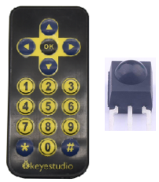
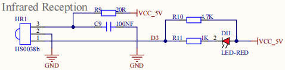
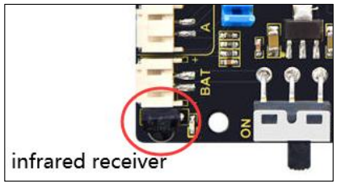
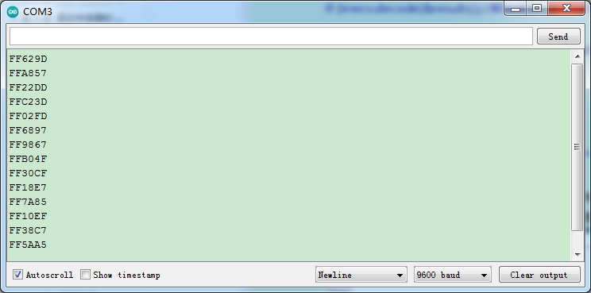
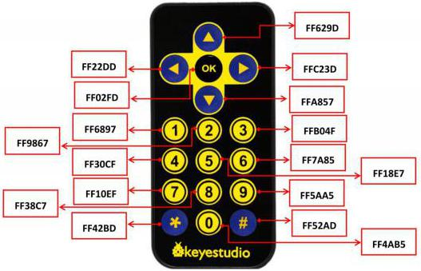
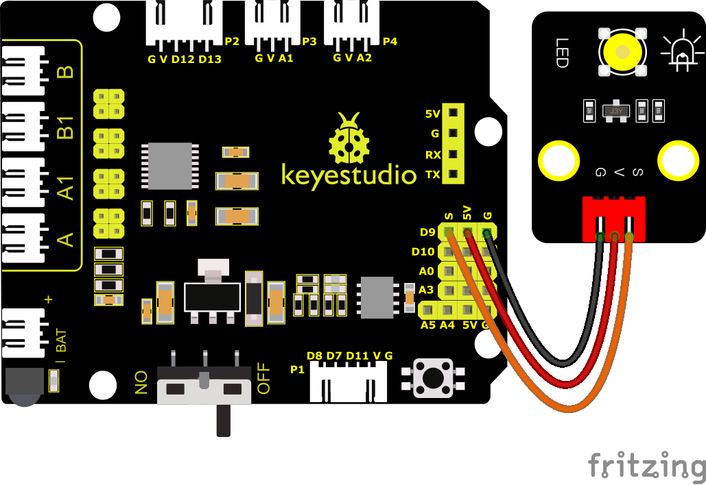
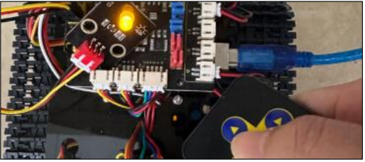

### Project 7: IR Reception

#### **(1)Description:**



There is no doubt that infrared remote control is ubiquitous in daily life. It is used to control various household appliances, such as TVs, stereos, video recorders and satellite signal receivers. Infrared remote control is composed of infrared transmitting and infrared receiving systems, that is, an infrared remote control and infrared receiving module and a single-chip microcomputer capable of decoding.   

The 38K infrared carrier signal emitted by the remote controller is encoded by the encoding chip in the remote controller. It is composed of a section of pilot code, user code, user inverse code, data code, and data inverse code. The time interval of the pulse is used to distinguish whether it is a 0 or 1 signal, and the encoding is made up of these 0 and 1 signals. 

The user code of the same remote control is unchanged while the data code can distinguish the key.

When the remote control button is pressed, the remote control sends out an infrared carrier signal. When the IR receiver receives the signal, the program will decode the carrier signal and determines which key is pressed. The MCU decodes the received 01 signal, thereby judging what key is pressed by the remote control.



The infrared receiver is welded on the motor drive board. It integrates receiving, amplification and demodulation, whose internal IC is already adjusted to fulfill infrared receiving and outputting, and TTL-signal-compatible works. It outputs digital signals and is suitable for infrared remote control and infrared data transmission. This module comes with only three pins, including signal, VCC, and GND, so it is very convenient to connect and communicate with microcontrollers such as arduino.

#### **(2)Parameters:**

Operating Voltage: 3.3-5V（DC）

Interface: 3PIN

Output Signal: Digital signal

Receiving Angle: 90 degrees

Frequency: 38khz

Receiving Distance: 10m

Infrared receiver integrated on motor drive board：




#### **(3)Test Code:**

You need to import the IR library first.

(<span style="color: rgb(255, 76, 65);">**Note:**</span> Do not connect the Bluetooth module before uploading the code, because uploading the code also uses serial communication, and there may be conflicts with the Bluetooth serial communication, which can cause the upload to fail.)

```C
/*

Keyestudio Mini Tank Robot V3 (Popular Edition)

lesson 7.1

IRremote

http://www.keyestudio.com

*/

#include <IRremote.h> // IRremote library statement

int RECV_PIN = 3; //define the pins of IR receiver as 3
IRrecv irrecv(RECV_PIN);
decode_results results; //decode results exist in the“result” of “decode results”

void setup() 
{
    Serial.begin(9600);
    irrecv.enableIRIn(); //Enable receiver
}

void loop() 
{
    if (irrecv.decode(&results))//decode successfully, receive a set of infrared signals
    {
        Serial.println(results.value, HEX);//Wrap word in 16 HEX to output and receive code
        irrecv.resume(); //Receive the next value
    }
    delay(100);
}
```

#### **(4)Test Results:**

Upload test code, open serial monitor and set baud rate to 9600, point remote control to IR receiver. Then the corresponding value will be shown. If holding down keys for a while, the error codes will appear.



Below we have listed out each button value of keyestudio remote control. So you can keep it for reference.



The IR receiver is connected to D3, so we don’t need to wire up

#### **(5)Code Explanation:**

**irrecv.enableIRIn():** after enabling IR decoding, the IR signals will be received, then function“decode()”will check continuously if decode successfully.

**irrecv.decode(&results):** after decoding successfully, this function will come back to “true”, and keep result in “results”. After decoding a IR signals, run the resume()function and receive the next signal.

#### **(6)Extension Practice:**

We decoded the key value of IR remote control. How about controlling LED by the measured value? We could design an experiment.

Attach an LED to D9, then press the keys of remote control to make LED light on and off.



**Test Code**

(<span style="color: rgb(255, 76, 65);">**Note:**</span> Do not connect the Bluetooth module before uploading the code, because uploading the code also uses serial communication, and there may be conflicts with the Bluetooth serial communication, which can cause the upload to fail.)

```C
/*
Keyestudio Mini Tank Robot V3 (Popular Edition)
lesson 7.2
IRremote
http://www.keyestudio.com
*/

#include <IRremote.h> //IRremote statement

int RECV_PIN = 3; //define the pin of LED as pin 3
int LED = 9;
bool flag = 0;
IRrecv irrecv(RECV_PIN);
decode_results results; //decode results exist in the“result” of “decode results”

void setup() 
{
    Serial.begin(9600);
    pinMode(LED, OUTPUT);//set LED to output
    irrecv.enableIRIn(); //Enable receiver
}

void loop() 
{
    if (irrecv.decode(&results)) 
    {
        if (results.value == 0xFF02FD & flag == 0) //The above key code, we use the OK button on the remote control, if you press the OK button
        {
            digitalWrite(LED, HIGH); //LED on
            flag = 1;
        }

        else if (results.value == 0xFF02FD & flag == 1) //press again
        {
            digitalWrite(LED, LOW); //LED off
            flag = 0;
        }
        irrecv.resume(); // Receive the next value
    }
}
```

Upload the code to the development board, and press the “OK” key on the remote control to turn the LED on and off.


