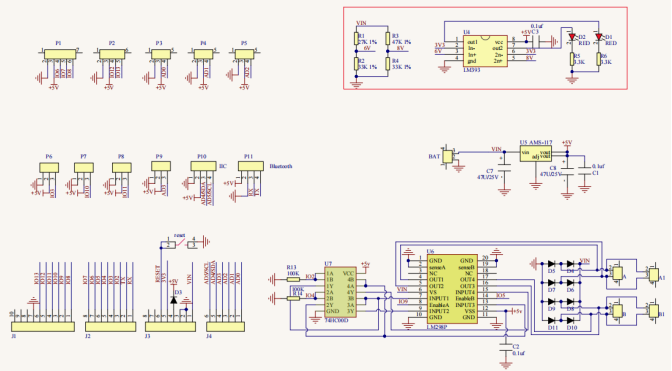
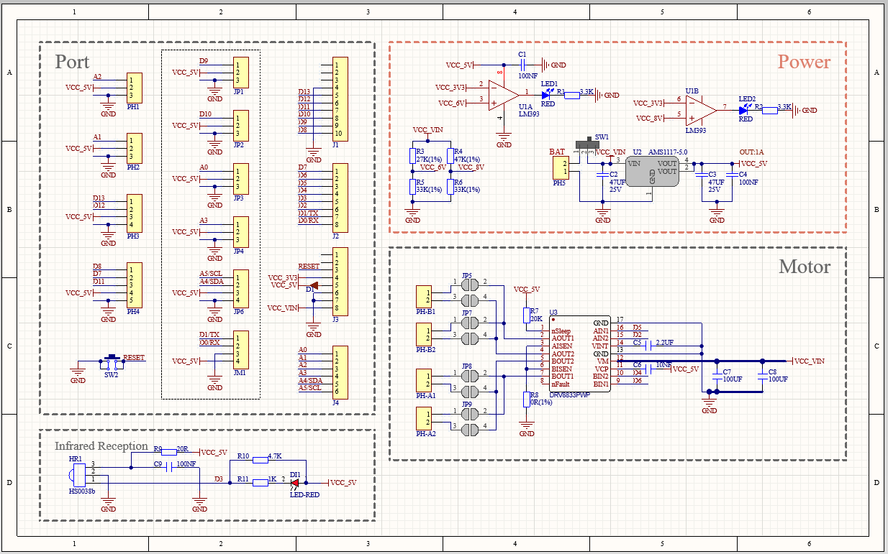
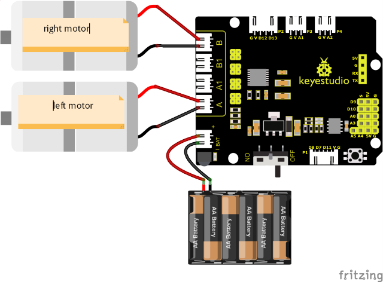
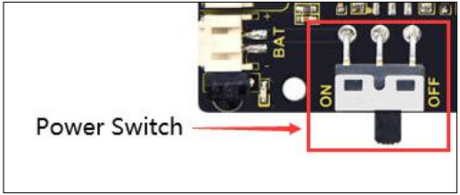

### Projet 8 : Commande et Contrôle de Vitesse des Moteurs

#### **(1) Description :**

Il existe de nombreuses façons de piloter des moteurs. Notre voiture intelligente utilise la solution la plus courante appelée L298P. Le L298P, fabriqué par STMicroelectronics, est un excellent circuit de commande spécialement conçu pour piloter des moteurs à haute puissance.

Il peut piloter directement des moteurs à courant continu, des moteurs biphasés et quadriphasés avec un courant de commande atteignant 2A. La borne de sortie du moteur utilise 8 diodes Schottky haute vitesse comme protection.

Nous avons conçu une carte d'extension basée sur le circuit L298P dont la conception empilable peut être directement connectée à la carte UNO R3 pour utilisation, réduisant ainsi les difficultés techniques pour les utilisateurs dans l'utilisation et la commande du moteur.

Empilez la carte d'extension sur la carte, alimentez la BAT, basculez le commutateur DIP sur la position ON, et alimentez simultanément la carte d'extension et la carte UNO R3 via une alimentation externe.

Afin de faciliter le câblage, la carte d'extension est équipée d'une interface anti-inversion (PH2.0 -2P -3P -4P -5P) et peut ainsi être directement branchée avec des moteurs, une alimentation et des capteurs/modules.

L'interface Bluetooth de la carte d'extension de commande est entièrement compatible avec le module Bluetooth Keyestudio HM-10. Par conséquent, il suffit d'insérer le module Bluetooth HM-10 dans l'interface correspondante lors de la connexion.

En même temps, la carte d'extension de commande utilise également des connecteurs à broches 2.54 pour étendre certains ports numériques et analogiques disponibles, afin que vous puissiez continuer à ajouter d'autres capteurs et réaliser des expériences d'extension.

La carte d'extension peut être connectée à 4 moteurs à courant continu. Dans le mode de connexion par cavalier par défaut, les moteurs des interfaces A et A1, B et B1 sont connectés en parallèle, et leur schéma de mouvement est identique. 8 cavaliers peuvent être utilisés pour contrôler le sens de rotation des 4 interfaces moteur.

Par exemple, lorsque les deux cavaliers devant l'interface moteur A sont changés d'une connexion horizontale à une connexion verticale, le sens de rotation du moteur A est alors opposé au sens de rotation d'origine.





#### **(2) Paramètres :**

- Tension d'entrée de la partie logique : DC 5V

- Tension d'entrée de la partie de commande : DC 7-12V

- Courant de fonctionnement de la partie logique : ≤36mA

- Courant de fonctionnement de la partie de commande : ≤ 2A

- Puissance de dissipation maximale : 25W (T=75℃)

- Niveau du signal d'entrée de commande :
  
  ​	Niveau haut : 2.3V ≤ Vin ≤ 5V
  
  ​	Niveau bas : 0V ≤ Vin ≤ 1.5V

- Température de fonctionnement : -25℃～＋130℃

#### **(3) Faire se déplacer le robot**

La broche de direction du moteur A est D2, la broche de contrôle de vitesse est D5 ; la broche de direction du moteur B est D4 et la broche de contrôle de vitesse est D6.

D'après le tableau ci-dessous, nous pouvons savoir comment contrôler le mouvement du robot en contrôlant la rotation de deux moteurs via les ports numériques et les ports PWM. La plage de valeurs PWM est 0-255. Plus la valeur est grande, plus le moteur tourne vite.

|     Fonction     |  D4  | D6（PWM） | Moteur（gauche）B |  D2  | D5（PWM） | Moteur（droite）A |
| :--------------: | :--: | :-------: | :---------------: | :--: | :-------: | :---------------: |
| Avancer          | HIGH |  255-200  |   Rotation Gauche   | HIGH |  255-200  |   Rotation Gauche   |
| Reculer          | LOW  |    200    |  Rotation Droite   | LOW  |    200    |  Rotation Droite   |
| Tourner à Gauche | LOW  |    200    |  Rotation Droite   | HIGH |  255-200  |   Rotation Gauche   |
| Tourner à Droite | HIGH |  255-200  |   Rotation Gauche   | LOW  |    200    |  Rotation Droite   |
| Arrêt            | LOW  |     0     |      Arrêt       | LOW  |     0     |      Arrêt       |


#### **(4) Schéma de connexion :**



<span style="color: rgb(255, 76, 65);">Remarque :</span>

Le connecteur à 4 broches est marqué A, A1, B1 et B. Le moteur arrière droit est connecté à B de la carte 8833 et le moteur avant gauche est connecté au port A.

#### **(5) Code de test :**

(<span style="color: rgb(255, 76, 65);">**Remarque :**</span> Ne pas connecter le module Bluetooth avant de téléverser le code, car le téléversement du code utilise également la communication série, et il peut y avoir des conflits avec la communication série Bluetooth, ce qui peut entraîner l'échec du téléversement.)

```C
/*
Keyestudio Mini Tank Robot V3 (Popular Edition)
lesson 8.1
motor driver
http://www.keyestudio.com
*/

#define ML_Ctrl 4 // Définir la broche de contrôle de direction du moteur gauche
#define ML_PWM 6 // Définir la broche de contrôle PWM du moteur gauche
#define MR_Ctrl 2 // Définir la broche de contrôle de direction du moteur droit
#define MR_PWM 5 // Définir la broche de contrôle PWM du moteur droit

void setup()
{
    pinMode(ML_Ctrl, OUTPUT);// Définir la broche de contrôle de direction du moteur gauche en SORTIE
    pinMode(ML_PWM, OUTPUT);// Définir la broche de contrôle PWM du moteur gauche en SORTIE
    pinMode(MR_Ctrl, OUTPUT);// Définir la broche de contrôle de direction du moteur droit en SORTIE
    pinMode(MR_PWM, OUTPUT);// Définir la broche de contrôle PWM du moteur droit en SORTIE
}

void loop()
{
    // avant
    digitalWrite(ML_Ctrl, HIGH); // Régler la vitesse de contrôle de direction du moteur gauche sur HIGH
    analogWrite(ML_PWM, 55); // La vitesse de contrôle PWM du moteur gauche est 55
    digitalWrite(MR_Ctrl, HIGH); // Régler la vitesse de contrôle de direction du moteur droit sur HIGH
    analogWrite(MR_PWM, 55); // La vitesse de contrôle PWM du moteur droit est 55
    delay(2000);// délai de 2s

    // arrière
    digitalWrite(ML_Ctrl, LOW); // Régler la vitesse de contrôle de direction du moteur gauche sur LOW
    analogWrite(ML_PWM, 200); // La vitesse de contrôle PWM du moteur gauche est 200
    digitalWrite(MR_Ctrl, LOW); // Régler la vitesse de contrôle de direction du moteur droit sur LOW
    analogWrite(MR_PWM, 200); // La vitesse de contrôle PWM du moteur droit est 200
    delay(2000);// délai de 2s

    // tourner à gauche
    digitalWrite(ML_Ctrl, LOW); // Régler la vitesse de contrôle de direction du moteur gauche sur LOW
    analogWrite(ML_PWM, 200); // La vitesse de contrôle PWM du moteur gauche est 200
    digitalWrite(MR_Ctrl, HIGH); // Régler la vitesse de contrôle de direction du moteur droit sur HIGH
    analogWrite(MR_PWM, 55); // La vitesse de contrôle PWM du moteur droit est 55
    delay(2000);// délai de 2s

    // tourner à droite
    digitalWrite(ML_Ctrl, HIGH); // Régler la vitesse de contrôle de direction du moteur gauche sur HIGH
    analogWrite(ML_PWM, 55); // La vitesse de contrôle PWM du moteur gauche est 55
    digitalWrite(MR_Ctrl, LOW); // Régler la vitesse de contrôle de direction du moteur droit sur LOW
    analogWrite(MR_PWM, 200); // La vitesse de contrôle PWM du moteur droit est 200
    delay(2000);// délai de 2s

    // arrêt
    digitalWrite(ML_Ctrl, LOW);
    analogWrite(ML_PWM, 0); // La vitesse de contrôle PWM du moteur gauche est 0
    digitalWrite(MR_Ctrl, LOW);
    analogWrite(MR_PWM, 0); // La vitesse de contrôle PWM du moteur droit est 0
    delay(2000);// délai de 2s
}
```

#### **(6) Résultats du test :**

Après avoir effectué le câblage selon le schéma, téléversé le code de test et mis sous tension.



la voiture intelligente avance pendant 2s, recule pendant 2s, tourne à gauche pendant 2s, tourne à droite pendant 2s et s'arrête pendant 2s, puis répète cette séquence.

#### **(7) Explication du code :**

**digitalWrite(ML_Ctrl,LOW);**

Le changement entre les niveaux haut et bas permet aux moteurs de tourner dans le sens horaire ou antihoraire. Les broches numériques générales peuvent être utilisées pour contrôler ces mouvements.

**analogWrite(ML_PWM,200);**

Le réglage de la vitesse du moteur est réalisé par PWM, et la broche qui contrôle la vitesse du moteur doit être la broche PWM de l'Arduino.

#### **(8) Projet d'extension :**

Nous ajustons la vitesse des moteurs en contrôlant le PWM et le câblage reste identique.

**Code de test**

(<span style="color: rgb(255, 76, 65);">**Remarque :**</span> Ne pas connecter le module Bluetooth avant de téléverser le code, car le téléversement du code utilise également la communication série, et il peut y avoir des conflits avec la communication série Bluetooth, ce qui peut entraîner l'échec du téléversement.)

```C
/*
Keyestudio Mini Tank Robot V3 (Popular Edition)
lesson 8.2
motor driver pwm
http://www.keyestudio.com
*/

#define ML_Ctrl 4 // Définir la broche de contrôle de direction du moteur gauche
#define ML_PWM 6 // Définir la broche de contrôle PWM du moteur gauche
#define MR_Ctrl 2 // Définir la broche de contrôle de direction du moteur droit
#define MR_PWM 5 // Définir la broche de contrôle PWM du moteur droit

void setup() 
{
    pinMode(ML_Ctrl, OUTPUT);// Définir la broche de contrôle de direction du moteur gauche en SORTIE
    pinMode(ML_PWM, OUTPUT);// Définir la broche de contrôle PWM du moteur gauche en SORTIE
    pinMode(MR_Ctrl, OUTPUT);// Définir la broche de contrôle de direction du moteur droit en SORTIE
    pinMode(MR_PWM, OUTPUT);// Définir la broche de contrôle PWM du moteur droit en SORTIE
}

void loop() 
{
    // avant
    digitalWrite(ML_Ctrl, HIGH); // Régler la vitesse de contrôle de direction du moteur gauche sur HIGH
    analogWrite(ML_PWM, 155); // La vitesse de contrôle PWM du moteur gauche est 155
    digitalWrite(MR_Ctrl, HIGH); // Régler la vitesse de contrôle de direction du moteur droit sur HIGH
    analogWrite(MR_PWM, 155); // La vitesse de contrôle PWM du moteur droit est 155
    delay(2000);// délai de 2s

    // arrière
    digitalWrite(ML_Ctrl, LOW); // Régler la vitesse de contrôle de direction du moteur gauche sur LOW
    analogWrite(ML_PWM, 100); // La vitesse de contrôle PWM du moteur gauche est 100
    digitalWrite(MR_Ctrl, LOW); // Régler la vitesse de contrôle de direction du moteur droit sur LOW
    analogWrite(MR_PWM, 100); // La vitesse de contrôle PWM du moteur droit est 100
    delay(2000);// délai de 2s

    // gauche
    digitalWrite(ML_Ctrl, LOW); // Régler la vitesse de contrôle de direction du moteur gauche sur LOW
    analogWrite(ML_PWM, 100); // La vitesse de contrôle PWM du moteur gauche est 100
    digitalWrite(MR_Ctrl, HIGH); // Régler la vitesse de contrôle de direction du moteur droit sur HIGH
    analogWrite(MR_PWM, 155); // La vitesse de contrôle PWM du moteur droit est 155
    delay(2000);// délai de 2s

    // droite
    digitalWrite(ML_Ctrl, HIGH); // Régler la vitesse de contrôle de direction du moteur gauche sur HIGH
    analogWrite(ML_PWM, 155); // La vitesse de contrôle PWM du moteur gauche est 155
    digitalWrite(MR_Ctrl, LOW); // Régler la vitesse de contrôle de direction du moteur droit sur LOW
    analogWrite(MR_PWM, 100); // La vitesse de contrôle PWM du moteur droit est 100
    delay(2000);// délai de 2s

    // arrêt
    digitalWrite(ML_Ctrl, LOW); // Régler la vitesse de contrôle de direction du moteur gauche sur LOW
    analogWrite(ML_PWM, 0); // La vitesse de contrôle PWM du moteur gauche est 0
    digitalWrite(MR_Ctrl, LOW); // Régler la vitesse de contrôle de direction du moteur droit sur LOW
    analogWrite(MR_PWM, 0); // La vitesse de contrôle PWM du moteur droit est 0
    delay(2000);// délai de 2s
}
```

Téléversez le code, la vitesse du moteur est plus lente.

Un faible courant entraînera une rotation lente du moteur.