### Project 9: 8*16 Gezichtsuitdrukking LED Dot Matrix

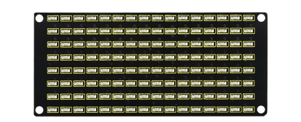

#### **(1)Beschrijving:**

Zou het niet leuk zijn als een uitdrukkingsbord aan de robot wordt toegevoegd? En de Keyestudio 8*16 LED dot matrix kan precies dat doen. Met behulp hiervan kunt u zelf gezichtsuitdrukkingen, afbeeldingen, patronen en andere weergaven ontwerpen.

Het 8*16 LED-bord heeft 128 LED's. De gegevens van de microprocessor (Arduino) communiceren met de AiP1640 via een twee-draads bus-interface. Daardoor kan het het aan- en uitschakelen van 128 LED's op de module regelen, zodat de dot matrix op de module het patroon weergeeft dat u nodig heeft. Er is een HX-2.54 4Pin kabel meegeleverd voor uw gemak bij het bedraden.

#### **(2)Parameters:**

- Werkspanning: DC 3.3-5V
- Vermogensverlies: 400mW
- Oscillatiefrequentie: 450KHz
- Aandrijfstroom: 200mA
- Werktemperatuur: -40\~80℃
- Communicatiemodus: twee-draads bus

#### **(3)Kennis:**

**Principe van de 8\*16 LED dot matrix**

Hoe regelt u elke LED van de 8\*16 dot matrix? Het is bekend dat elke byte 8 bits heeft en elke bit 0 of 1 is. Wanneer het 0 is, is de LED uit, terwijl wanneer het 1 is, de LED aan is. Eén byte kan één kolom van de LED regelen, en uiteraard kunnen 16 bytes 16 kolommen van LED's regelen, dat is de 8\*16 dot matrix.

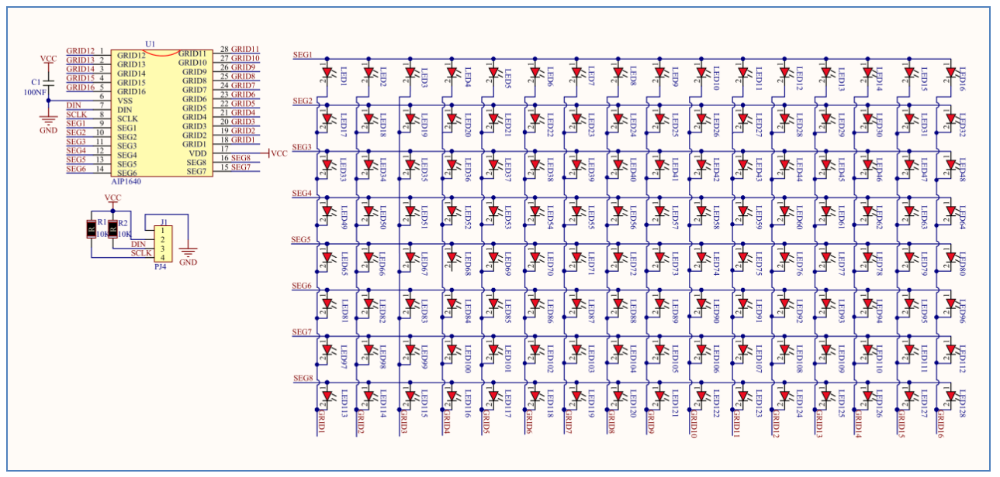

**Beschrijving van pinnen en communicatieprotocol**

De gegevens van de microprocessor (Arduino) communiceren met de AiP1640 via een twee-draads buskabel.

Het communicatieprotocoldiagram is als volgt: (SCLK) is SCL, (DIN) is SDA

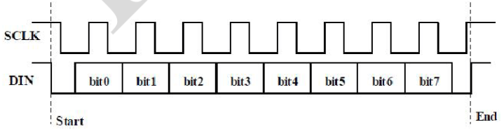

①De startconditie voor gegevensinvoer: SCL is hoog niveau en SDA verandert van hoog naar laag.

②Voor het instellen van de dataopdracht zijn er methoden zoals weergegeven in de onderstaande afbeelding.

In ons voorbeeldprogramma selecteren we de manier om **het adres automatisch met 1 te verhogen**, de binaire waarde is 0100 0000 en de overeenkomstige hexadecimale waarde is 0x40

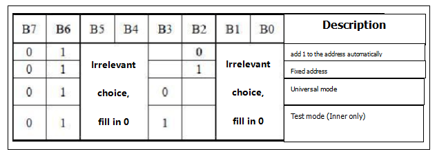

③Voor het instellen van de adresopdracht kan het adres worden geselecteerd zoals hieronder weergegeven.

Het eerste 00H is geselecteerd in ons voorbeeldprogramma, en het binaire getal 1100 0000 komt overeen met het hexadecimale 0xc0

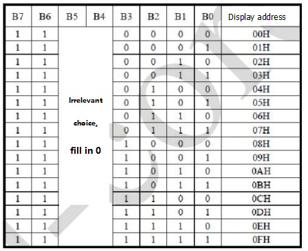


④De vereiste voor gegevensinvoer is dat wanneer SCL op hoog niveau is tijdens het invoeren van gegevens, het signaal op SDA ongewijzigd moet blijven. Alleen wanneer het kloksignaal op SCL op laag niveau is, kan het signaal op SDA worden gewijzigd. De invoer van gegevens is eerst het lage bit en daarna het hoge bit.

⑤De conditie voor het einde van de gegevensoverdracht is dat wanneer SCL op laag niveau is, SDA op laag niveau is en SCL op hoog niveau is, het niveau van SDA hoog wordt.

⑥Weergavebesturing, stel verschillende pulsbreedtes in; de pulsbreedte kan worden geselecteerd zoals weergegeven in de onderstaande afbeelding. In het voorbeeld is de pulsbreedte 4/16, en de hexadecimale waarde overeenkomend met 1000 1010 is 0x8A

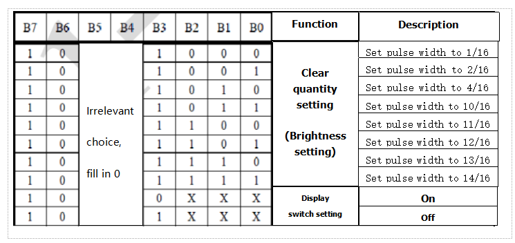


**Instructies voor het gebruik van de moduletool**

De dot matrix-tool gebruikt de online versie, en de link is: [http://dotmatrixtool.com/#]( http://dotmatrixtool.com/#)

①Voer de link in en de pagina verschijnt zoals hieronder weergegeven


②De dot matrix is 8\*16, dus pas de hoogte aan naar 8 en de breedte naar 16, zoals weergegeven in de onderstaande afbeelding


③Genereer hexadecimale gegevens uit het patroon

Zoals weergegeven in de onderstaande afbeelding, druk op de linkermuisknop om te selecteren, klik met de rechtermuisknop om te annuleren; teken het gewenste patroon, klik op Generate, en de hexadecimale gegevens die we nodig hebben worden gegenereerd.

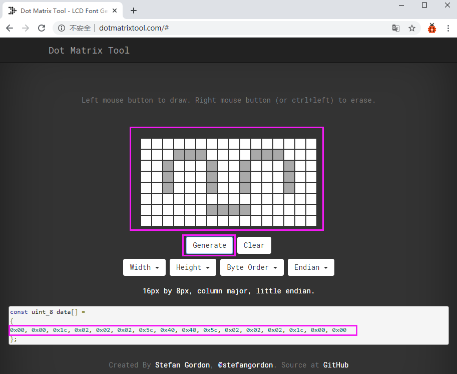

#### **(4)Aansluitdiagram:**

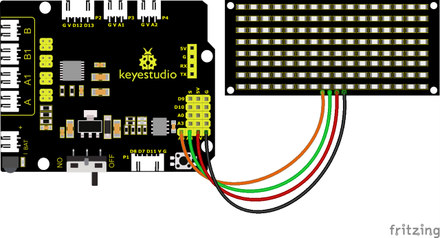

De GND, VCC, SDA en SCL van het 8x16 LED-lichtbord zijn respectievelijk verbonden met het keyestudio sensor-uitbreidingsbord -(GND), + (VCC), A4, A5 voor twee-draads seriële communicatie.

(<span style="color: rgb(255, 76, 65);">Opmerking:</span> hoewel het is verbonden met de IIC-pin van Arduino, is deze module niet voor IIC-communicatie. En de IO-poort hier simuleert I2C-communicatie en kan worden verbonden met twee willekeurige pinnen)

#### **(5)Testcode:**

De code om het lachende gezicht weer te geven

(<span style="color: rgb(255, 76, 65);">**Opmerking:**</span> Sluit de Bluetooth-module niet aan voordat u de code uploadt, omdat het uploaden van de code ook gebruik maakt van seriële communicatie, en er mogelijk conflicten zijn met de Bluetooth seriële communicatie, wat ertoe kan leiden dat het uploaden mislukt.)

```C
/*
  Keyestudio Mini Tank Robot V3 (Popular Edition)
  lesson 9.1
  Matrix face
  http://www.keyestudio.com
*/
// haal de gegevens van het lachende gezicht op uit een moduletool
unsigned char smile[] = {0x00, 0x00, 0x1c, 0x02, 0x02, 0x02, 0x5c, 0x40, 0x40, 0x5c, 0x02, 0x02, 0x02, 0x1c, 0x00, 0x00};

#define SCL_Pin  A5  // stel een klokpin in op A5
#define SDA_Pin  A4  // stel een datapin in op A4

void setup() {
  // stel de pin in op OUTPUT
  pinMode(SCL_Pin, OUTPUT);
  pinMode(SDA_Pin, OUTPUT);
  // scherm wissen
  //matrix_display(clear);
}
void loop() {
  matrix_display(smile);  // geef het lachende gezicht weer
}
// deze functie wordt gebruikt voor de weergave van de dot matrix
void matrix_display(unsigned char matrix_value[])
{
  IIC_start();  // gebruik de functie om gegevensoverdracht te starten
  IIC_send(0xc0);  // selecteer een adres

  for (int i = 0; i < 16; i++) // afbeeldingsgegevens hebben 16 tekens
  {
    IIC_send(matrix_value[i]); // gegevens om afbeeldingen te verzenden
  }

  IIC_end();   // beëindig de gegevensoverdracht van afbeeldingen

  IIC_start();
  IIC_send(0x8A);  // weergavebesturing en selecteer pulsbreedte 4/16
  IIC_end();
}

// de conditie dat gegevensoverdracht begint
void IIC_start()
{
  digitalWrite(SDA_Pin, HIGH);
  digitalWrite(SCL_Pin, HIGH);
  delayMicroseconds(3);
  digitalWrite(SDA_Pin, LOW);
  delayMicroseconds(3);
  digitalWrite(SCL_Pin, LOW);
}

// het teken dat gegevensoverdracht eindigt
void IIC_end()
{
  digitalWrite(SCL_Pin, LOW);
  digitalWrite(SDA_Pin, LOW);
  delayMicroseconds(3);
  digitalWrite(SCL_Pin, HIGH);
  delayMicroseconds(3);
  digitalWrite(SDA_Pin, HIGH);
  delayMicroseconds(3);
}

// gegevens verzenden
void IIC_send(unsigned char send_data)
{
  for (byte mask = 0x01; mask != 0; mask <<= 1) // elk teken heeft 8 cijfers, die één voor één worden gedetecteerd
  {
    if (send_data & mask) { // stel hoge of lage niveaus in op basis van elk bit (0 of 1)
      digitalWrite(SDA_Pin, HIGH);
    } else {
      digitalWrite(SDA_Pin, LOW);
    }
    delayMicroseconds(3);
    digitalWrite(SCL_Pin, HIGH); // trek de klokpin SCL_Pin omhoog om de gegevensoverdracht te beëindigen
    delayMicroseconds(3);
    digitalWrite(SCL_Pin, LOW); // trek de klokpin SCL_Pin omlaag om signalen van SDA te wijzigen
  }
}
```

#### **(6)Testresultaten:**

Na het succesvol uploaden van de testcode, aansluiten volgens het bedradingsdiagram, de DIP-schakelaar naar rechts zetten en inschakelen, verschijnt er een lachend patroon op de dot matrix.

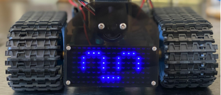

#### **(7)Uitbreidingsproject:**

We gebruiken de moduletool die we zojuist hebben geleerd, [http://dotmatrixtool.com/#](http://dotmatrixtool.com/#), om de dot matrix de patronen start, vooruit rijden en stop te laten weergeven en vervolgens het patroon te wissen. Het tijdsinterval is 2000 ms.

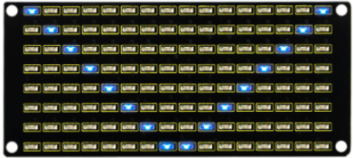

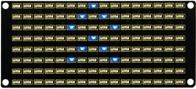

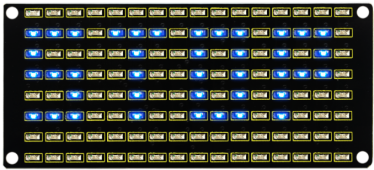


**Code verkregen uit de moduletool：**

**Code voor het patroon start:**

0x01,0x02,0x04,0x08,0x10,0x20,0x40,0x80,0x80,0x40,0x20,0x10,0x08,0x04,0x02,0x01

**Code voor het patroon vooruit rijden:**

0x00,0x00,0x00,0x00,0x00,0x24,0x12,0x09,0x12,0x24,0x00,0x00,0x00,0x00,0x00,0x00

**Code voor het patroon achteruit rijden:**

0x00,0x00,0x00,0x00,0x00,0x24,0x48,0x90,0x48,0x24,0x00,0x00,0x00,0x00,0x00,0x00

**Code voor het patroon links afslaan：**

0x00,0x00,0x00,0x00,0x00,0x00,0x44,0x28,0x10,0x44,0x28,0x10,0x44,0x28,0x10,0x00

**Code voor het patroon rechts afslaan：**

0x00,0x10,0x28,0x44,0x10,0x28,0x44,0x10,0x28,0x44,0x00,0x00,0x00,0x00,0x00,0x00

**Code voor het patroon stop：**

0x2E,0x2A,0x3A,0x00,0x02,0x3E,0x02,0x00,0x3E,0x22,0x3E,0x00,0x3E,0x0A,0x0E,0x00

**Code om scherm te wissen：**

0x00,0x00,0x00,0x00,0x00,0x00,0x00,0x00,0x00,0x00,0x00,0x00,0x00,0x00,0x00,0x00

**Testcode**


(<span style="color: rgb(255, 76, 65);">**Opmerking:**</span> Sluit de Bluetooth-module niet aan voordat u de code uploadt, omdat het uploaden van de code ook gebruik maakt van seriële communicatie, en er mogelijk conflicten zijn met de Bluetooth seriële communicatie, wat ertoe kan leiden dat het uploaden mislukt.)

```C
/*
  keyestudio Mini Tank Robot V3 (Popular Edition)
  lesson 9.2
  Matrix face
  http://www.keyestudio.com
*/

// Array, gebruikt om gegevens van afbeeldingen op te slaan, kan zelf worden berekend of worden verkregen via de moduletool
unsigned char start01[] = {0x01, 0x02, 0x04, 0x08, 0x10, 0x20, 0x40, 0x80, 0x80, 0x40, 0x20, 0x10, 0x08, 0x04, 0x02, 0x01};
unsigned char front[] = {0x00, 0x00, 0x00, 0x00, 0x00, 0x24, 0x12, 0x09, 0x12, 0x24, 0x00, 0x00, 0x00, 0x00, 0x00, 0x00};
unsigned char back[] = {0x00, 0x00, 0x00, 0x00, 0x00, 0x24, 0x48, 0x90, 0x48, 0x24, 0x00, 0x00, 0x00, 0x00, 0x00, 0x00};
unsigned char left[] = {0x00, 0x00, 0x00, 0x00, 0x00, 0x00, 0x44, 0x28, 0x10, 0x44, 0x28, 0x10, 0x44, 0x28, 0x10, 0x00};
unsigned char right[] = {0x00, 0x10, 0x28, 0x44, 0x10, 0x28, 0x44, 0x10, 0x28, 0x44, 0x00, 0x00, 0x00, 0x00, 0x00, 0x00};
unsigned char STOP01[] = {0x2E, 0x2A, 0x3A, 0x00, 0x02, 0x3E, 0x02, 0x00, 0x3E, 0x22, 0x3E, 0x00, 0x3E, 0x0A, 0x0E, 0x00};
unsigned char clear[] = {0x00, 0x00, 0x00, 0x00, 0x00, 0x00, 0x00, 0x00, 0x00, 0x00, 0x00, 0x00, 0x00, 0x00, 0x00, 0x00};

#define SCL_Pin  A5  // stel een klokpin in op A5
#define SDA_Pin  A4  // stel een datapin in op A4

void setup() {
  // stel de pin in op OUTPUT
  pinMode(SCL_Pin, OUTPUT);
  pinMode(SDA_Pin, OUTPUT);
  // scherm wissen
  matrix_display(clear);
}
void loop() {
  matrix_display(start01);  // geef de "Start" afbeelding weer
  delay(2000);
  matrix_display(front);    // geef de "front" afbeelding weer
  delay(2000);
  matrix_display(STOP01);   // geef de "STOP01" afbeelding weer
  delay(2000);
  matrix_display(clear);    // geef de "clear" afbeelding weer
  delay(2000);
}
// deze functie wordt gebruikt voor de weergave van de dot matrix
void matrix_display(unsigned char matrix_value[])
{
  IIC_start();  // gebruik de functie om gegevensoverdracht te starten
  IIC_send(0xc0);  // selecteer een adres

  for (int i = 0; i < 16; i++) // afbeeldingsgegevens hebben 16 tekens
  {
    IIC_send(matrix_value[i]); // gegevens om afbeeldingen te verzenden
  }

  IIC_end();   // beëindig de gegevensoverdracht van afbeeldingen

  IIC_start();
  IIC_send(0x8A);  // weergavebesturing en selecteer pulsbreedte 4/16
  IIC_end();
}

// de conditie dat gegevensoverdracht begint
void IIC_start()
{
  digitalWrite(SDA_Pin, HIGH);
  digitalWrite(SCL_Pin, HIGH);
  delayMicroseconds(3);
  digitalWrite(SDA_Pin, LOW);
  delayMicroseconds(3);
  digitalWrite(SCL_Pin, LOW);
}

// het teken dat gegevensoverdracht eindigt
void IIC_end()
{
  digitalWrite(SCL_Pin, LOW);
  digitalWrite(SDA_Pin, LOW);
  delayMicroseconds(3);
  digitalWrite(SCL_Pin, HIGH);
  delayMicroseconds(3);
  digitalWrite(SDA_Pin, HIGH);
  delayMicroseconds(3);
}

// gegevens verzenden
void IIC_send(unsigned char send_data)
{
  for (byte mask = 0x01; mask != 0; mask <<= 1) // elk teken heeft 8 cijfers, die één voor één worden gedetecteerd
  {
    if (send_data & mask) { // stel hoge of lage niveaus in op basis van elk bit (0 of 1)
      digitalWrite(SDA_Pin, HIGH);
    } else {
      digitalWrite(SDA_Pin, LOW);
    }
    delayMicroseconds(3);
    digitalWrite(SCL_Pin, HIGH); // trek de klokpin SCL_Pin omhoog om de gegevensoverdracht te beëindigen
    delayMicroseconds(3);
    digitalWrite(SCL_Pin, LOW); // trek de klokpin SCL_Pin omlaag om signalen van SDA te wijzigen
  }
}
```

Na het uploaden van de testcode geeft het gezichtsuitdrukkingsbord deze patronen op volgorde weer en herhaalt deze reeks.

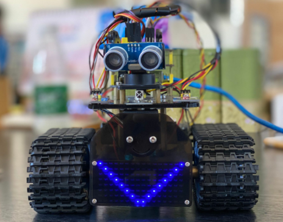

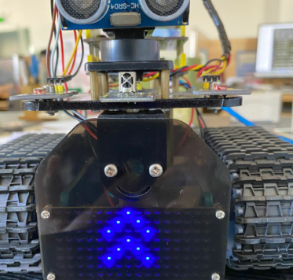

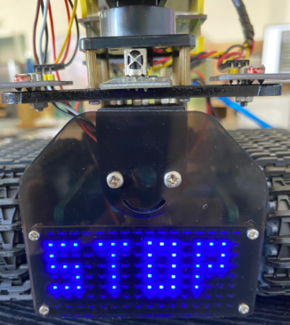