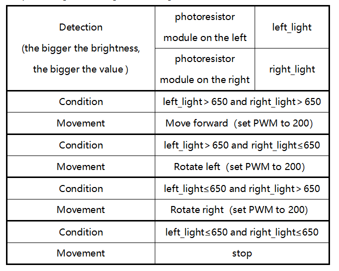
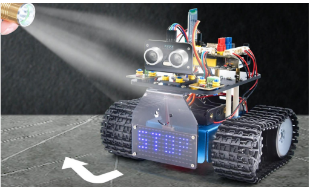

### Projekt 10: Lichtfolgendes Fahrzeug


#### **(1)Beschreibung:**

In den vorherigen Projekten haben wir die Verwendung verschiedener Sensoren, Module und Erweiterungsplatinen am Smart Car detailliert vorgestellt. Jetzt wenden wir uns den Projekten des Smart Cars zu. Das lichtfolgende Smart Car ist, wie der Name schon sagt, ein Smart Car, das dem Licht folgen kann.

Wir können das Wissen aus den Projekten Fotowiderstand und Motorsteuerung kombinieren, um ein lichtfolgendes Smart Car zu bauen. In diesem Projekt verwenden wir zwei Fotowiderstandsmodule, um die Lichtintensität auf der linken und rechten Seite des Smart Cars zu erfassen, lesen die entsprechenden Analogwerte aus und steuern dann die Drehung der beiden Motoren basierend auf diesen zwei Datenwerten, um die Bewegungen des Smart Cars zu kontrollieren.

Die spezifische Logik des lichtfolgenden Smart Cars ist wie folgt dargestellt.



#### **(2)Flussdiagramm:**


#### **(3)Anschlussdiagramm:**


<span style="color: rgb(255, 76, 65);">Hinweis:</span> Die Pins „G", „V" und S des linken Fotowiderstandsmoduls sind mit G (GND), V (VCC) bzw. A1 verbunden;

Die Pins „G", „V" und S des rechten Fotowiderstandsmoduls sind mit G (GND), V (VCC) bzw. A2 verbunden.

Das 4-polige Kabel ist mit A, A1, B1 und B gekennzeichnet. Der rechte hintere Motor ist mit dem B-Anschluss der 8833-Motortreiber-Erweiterungsplatine verbunden und der linke vordere Motor ist mit dem A-Anschluss der 8833-Motortreiber-Erweiterungsplatine verbunden.

#### **(4)Testcode:**

(<span style="color: rgb(255, 76, 65);">**Hinweis:**</span> Schließen Sie das Bluetooth-Modul nicht an, bevor Sie den Code hochladen, da das Hochladen ebenfalls die serielle Kommunikation verwendet und es zu Konflikten mit der seriellen Bluetooth-Kommunikation kommen kann, was das Hochladen fehlschlagen lässt.)

```C
/*
  Keyestudio Mini Tank Robot V3 (Popular Edition)
  lesson 10
  light follow tank
  http://www.keyestudio.com
*/
#define light_L_Pin A1   // Definiere den Pin des Lichtsensors auf der linken Seite
#define light_R_Pin A2   // Definiere den Pin des Lichtsensors auf der rechten Seite
#define ML_Ctrl 4  // Definiere den Richtungssteuerungspin des linken Motors
#define ML_PWM 6   // Definiere den PWM-Steuerungspin des linken Motors
#define MR_Ctrl 2  // Definiere den Richtungssteuerungspin des rechten Motors
#define MR_PWM 5   // Definiere den PWM-Steuerungspin des rechten Motors
int left_light;
int right_light;
void setup() 
{
  Serial.begin(9600);
  pinMode(light_L_Pin, INPUT);
  pinMode(light_R_Pin, INPUT);
  pinMode(ML_Ctrl, OUTPUT);
  pinMode(ML_PWM, OUTPUT);
  pinMode(MR_Ctrl, OUTPUT);
  pinMode(MR_PWM, OUTPUT);
}

void loop() 
{
  left_light = analogRead(light_L_Pin);
  right_light = analogRead(light_R_Pin);
  Serial.print("left_light_value = ");
  Serial.println(left_light);
  Serial.print("right_light_value = ");
  Serial.println(right_light);
  if (left_light > 650 && right_light > 650) // vorwärts fahren
  {
    Car_front();
  }
  else if (left_light > 650 && right_light <= 650)  // links abbiegen
  {
    Car_left();
  }
  else if (left_light <= 650 && right_light > 650) // rechts abbiegen
  {
    Car_right();
  }
  else  // andernfalls anhalten
  {
    Car_Stop();
  }
}

void Car_front()
{
  digitalWrite(MR_Ctrl, HIGH);
  analogWrite(MR_PWM, 55);
  digitalWrite(ML_Ctrl, HIGH);
  analogWrite(ML_PWM, 55);
}

void Car_left()
{
  digitalWrite(MR_Ctrl, HIGH);
  analogWrite(MR_PWM, 55);
  digitalWrite(ML_Ctrl, LOW);
  analogWrite(ML_PWM, 200);
}

void Car_right()
{
  digitalWrite(MR_Ctrl, LOW);
  analogWrite(MR_PWM, 200);
  digitalWrite(ML_Ctrl, HIGH);
  analogWrite(ML_PWM, 55);
}

void Car_Stop()
{
  digitalWrite(MR_Ctrl, LOW);
  analogWrite(MR_PWM, 0);
  digitalWrite(ML_Ctrl, LOW);
  analogWrite(ML_PWM, 0);
}
```

#### **(5)Testergebnis**

Nachdem der Testcode erfolgreich hochgeladen wurde, entsprechend dem Verdrahtungsdiagramm angeschlossen, den DIP-Schalter nach rechts gestellt und das Gerät eingeschaltet wurde, folgt das Smart Car dem Licht und bewegt sich entsprechend.

