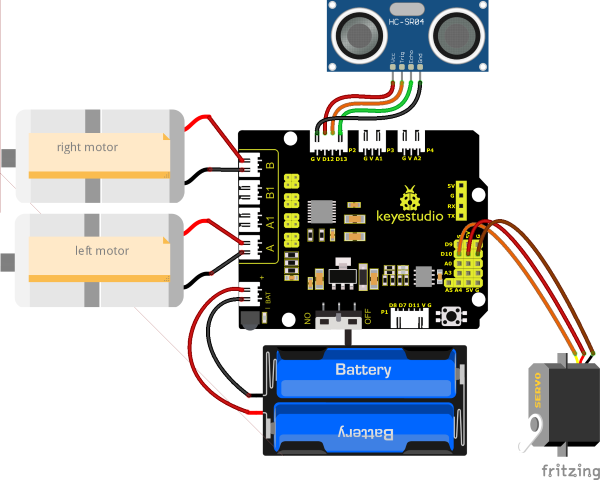
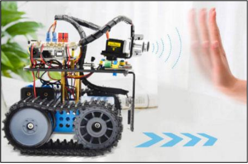

### Project 11: Ultrasonic Following Tank


#### **(1)Beschrijving:**

In de vorige les hebben we geleerd over de licht-volgende slimme auto. En in deze les kunnen we de kennis combineren om een ultrasone geluid-volgende auto te maken.

In het project gebruiken we ultrasone sensoren om de afstand tussen de auto en het obstakel voor te detecteren, en vervolgens de rotatie van de twee motoren te besturen op basis van deze gegevens om zo de bewegingen van de slimme auto te beheersen.

De specifieke logica van de ultrasone geluid-volgende slimme auto wordt weergegeven in de onderstaande tabel:

|                        Detectie                        |              Instelling              |
| :----------------------------------------------------: | :----------------------------------: |
| De afstand(cm) tussen de auto en het obstakel voor | Stel de hoek van de servo in op 90° |
|                      **Conditie**                      |           **Beweging**            |
|               afstand≥20 en afstand≤50               |             Vooruit rijden              |
|            10＜afstand＜20<br/>afstand＞50            |               Stoppen                |
|                       afstand≤10                       |              Achteruit rijden              |

#### **(2)Stroomdiagram:**


#### **(3)Aansluitingsschema:**



#### **(4)Testcode:**

(<span style="color: rgb(255, 76, 65);">**Opmerking:**</span> Sluit de Bluetooth-module niet aan voordat u de code uploadt, omdat het uploaden van de code ook gebruik maakt van seriële communicatie, en er kunnen conflicten ontstaan met de Bluetooth seriële communicatie, waardoor het uploaden kan mislukken.)

```C
/*
  Keyestudio Mini Tank Robot V3 (Popular Edition)
  lesson 11
  Ultrasonic follow tank
  http://www.keyestudio.com
*/
#define servoPin 10  //De pin van de servo

#define ML_Ctrl 4  //Definieer de richtingsbesturingspin van de linkermotor
#define ML_PWM 6   //Definieer de PWM-besturingspin van de linkermotor
#define MR_Ctrl 2  //Definieer de richtingsbesturingspin van de rechtermotor
#define MR_PWM 5   //Definieer de PWM-besturingspin van de rechtermotor
#define Trig 12
#define Echo 13
float distance;

void setup() 
{
  pinMode(servoPin, OUTPUT);
  pinMode(Trig, OUTPUT);
  pinMode(Echo, INPUT);
  pinMode(ML_Ctrl, OUTPUT);
  pinMode(ML_PWM, OUTPUT);
  pinMode(MR_Ctrl, OUTPUT);
  pinMode(MR_PWM, OUTPUT);
  procedure(90); //Stel de hoek van de servo in op 90°
  delay(500); //vertraging van 500ms
}

void loop() 
{
  distance = checkdistance();  //Wijs de door ultrasoon gemeten afstand toe aan distance
  if (distance >= 20 && distance <= 50) //vooruit rijden
  {
    Car_front();
  }
  else if (distance > 10 && distance < 20)  //stoppen
  {
    Car_Stop();
  }
  else if (distance <= 10)  //achteruit rijden
  {
    Car_back();
  }
  else  //In andere omstandigheden stopt het
  {
    Car_Stop();
  }
}

void Car_front()
{
  digitalWrite(MR_Ctrl, HIGH);
  analogWrite(MR_PWM, 55);
  digitalWrite(ML_Ctrl, HIGH);
  analogWrite(ML_PWM, 55);
}

void Car_back()
{
  digitalWrite(MR_Ctrl, LOW);
  analogWrite(MR_PWM, 200);
  digitalWrite(ML_Ctrl, LOW);
  analogWrite(ML_PWM, 200);
}

void Car_left()
{
  digitalWrite(MR_Ctrl, HIGH);
  analogWrite(MR_PWM, 55);
  digitalWrite(ML_Ctrl, LOW);
  analogWrite(ML_PWM, 200);
}

void Car_right()
{
  digitalWrite(MR_Ctrl, LOW);
  analogWrite(MR_PWM, 200);
  digitalWrite(ML_Ctrl, HIGH);
  analogWrite(ML_PWM, 55);
}

void Car_Stop()
{
  digitalWrite(MR_Ctrl, LOW);
  analogWrite(MR_PWM, 0);
  digitalWrite(ML_Ctrl, LOW);
  analogWrite(ML_PWM, 0);
}

//De functie om servo's te besturen
void procedure(byte myangle) 
{
  int pulsewidth;
  for (int i = 0; i < 5; i++) 
  {
    pulsewidth = myangle * 11 + 500;  //Bereken de waarde van de pulsebreedte    digitalWrite(servoPin, HIGH);
    delayMicroseconds(pulsewidth);   //De tijd in hoog niveau vertegenwoordigt de pulsebreedte
    digitalWrite(servoPin, LOW);
    delay((20 - pulsewidth / 1000));  //Omdat de cyclus 20ms is, is de resterende tijd in laag niveau
  }
}
//De functie om ultrasoon geluid te besturen
float checkdistance() 
{
  static float distance;
  digitalWrite(Trig, LOW);
  delayMicroseconds(2);
  digitalWrite(Trig, HIGH);
  delayMicroseconds(10);
  digitalWrite(Trig, LOW);
  distance = pulseIn(Echo, HIGH) / 58.20;  //De 58.20 hier komt van 2*29.1=58.2
  delay(10);
  return distance;
}
```

#### **(5)Testresultaten:**

Upload de testcode succesvol, sluit de bedrading aan, zet de DIP-schakelaar naar de rechterkant, schakel de stroom in en stel de servo in op 90°, de slimme auto volgt het obstakel om te bewegen.

