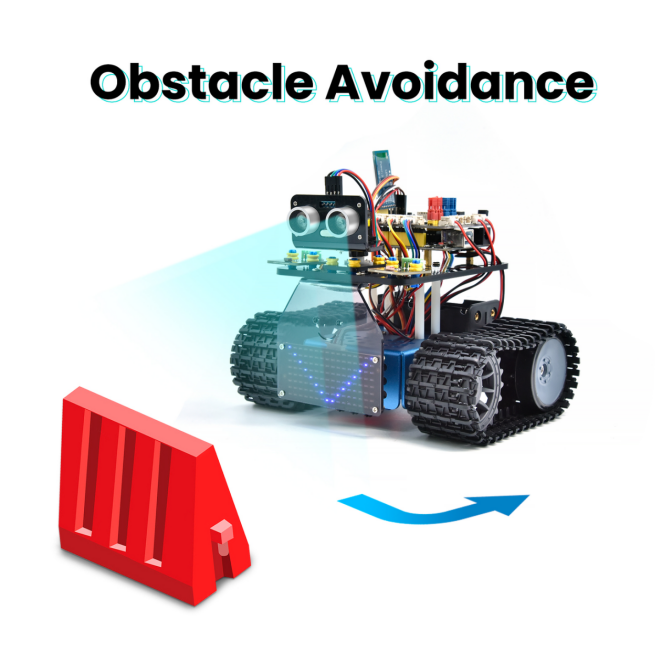
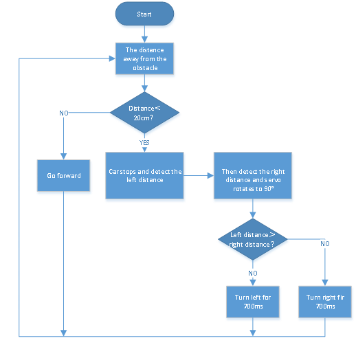
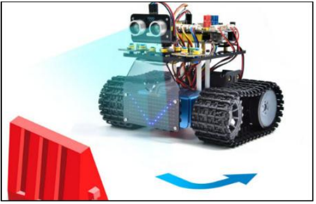

### Projekt 12: Ultraschall-Hindernisumfahrungs-Panzer




#### **(1)Beschreibung:**

Im vorherigen Projekt haben wir ein ultraschallgesteuertes, folgendes Smart-Car gebaut. Tatsächlich können wir mit denselben Komponenten und derselben Verdrahtungsmethode durch einfaches Ändern des Testcodes ein ultraschall-basiertes Hindernisumfahrungs-Smart-Car daraus machen. Dieses Smart-Car kann sich entsprechend der Bewegung der menschlichen Hände bewegen.

Wir verwenden Ultraschallsensoren, um den Abstand zwischen dem Smart-Car und dem Hindernis davor zu messen, und steuern dann anhand dieser Daten die Rotation der beiden Motoren, um die Bewegungen des Smart-Cars zu kontrollieren.

|                          Erkennung                           |        |
| :----------------------------------------------------------: | :----: |
| Vom Ultraschallsensor gemessener Abstand zwischen dem Fahrzeug und dem Hindernis vorne <br />（Servowinkl auf 90° einstellen） | a(cm)  |
| Vom Ultraschallsensor gemessener Abstand zwischen dem Fahrzeug und dem Hindernis rechts <br />（Servowinkel auf 20° einstellen） | a2(cm) |
| Vom Ultraschallsensor gemessener Abstand zwischen dem Fahrzeug und dem Hindernis links <br />（Servowinkel auf 160° einstellen） | a1(cm) |
|   **Einstellung:** Startwinkel des Servos auf 90° einstellen    |        |

|   Bedingung 1   |        Bedingung 2         | Bedingung 3 | Bewegung                                                     |
| :-------------: | :------------------------: | ----------- | ------------------------------------------------------------ |
|      a＜20      |                            |             | 500ms anhalten；<br />Servowinkel auf 180° einstellen, a1 lesen, 100ms verzögern；<br />Servowinkel auf 0° einstellen, a2 lesen, 0,1s verzögern. |
|                 | a1＜50<br />oder<br />a2＜50 |             | a1 mit a2 vergleichen                                           |
|                 |                            | a1＞a2      | Servowinkel auf 90° einstellen, 700ms nach links drehen (PWM auf 255 setzen)<br />vorwärts fahren（PWM auf 200 setzen）. |
|                 |                            | a1＜a2      | Servowinkel auf 90° einstellen, 700ms nach rechts drehen (PWM auf 255 setzen) <br />vorwärts fahren（PWM auf 200 setzen）. |
| **Bedingung 1** |      **Bedingung 2**       |             | **Bewegung**                                                 |
|      a＜20      | a1≥50<br />und<br />a2≥50  | Zufällig      | Servowinkel auf 90° einstellen, 500ms nach links drehen (PWM auf 255 setzen)<br />vorwärts fahren (PWM auf 200 setzen)<br /><br />Servowinkel auf 90° einstellen, 500ms nach rechts drehen (PWM auf 255 setzen) <br />vorwärts fahren (PWM auf 200 setzen) |
|  **Bedingung**  |                            |             | **Bewegung**                                                 |
|      a≥20       |                            |             | vorwärts fahren (PWM auf 100 setzen)                                 |


#### **(2)Flussdiagramm:**



#### **(3)Anschlussdiagramm:**


(<span style="color: rgb(255, 76, 65);">Hinweis:</span> Die braunen, roten und orangefarbenen Kabel des Servos sind jeweils mit G (GND), V（5V）und D10 der Erweiterungsplatine verbunden；und beim Ultraschallsensor ist der VCC-Pin mit 5V (V) verbunden, der Trig-Pin mit Digital 12 (S), der Echo-Pin mit Digital 13 (S) und der GND-Pin mit GND (G); genauso wie beim vorherigen Projekt.）

#### **(4)Testcode:**

(<span style="color: rgb(255, 76, 65);">**Hinweis:**</span> Schließen Sie das Bluetooth-Modul nicht an, bevor Sie den Code hochladen, da das Hochladen des Codes ebenfalls serielle Kommunikation verwendet und es zu Konflikten mit der Bluetooth-seriellen Kommunikation kommen kann, was dazu führen kann, dass der Upload fehlschlägt.)

```C
/*
  Keyestudio Mini Tank Robot V3 (Popular Edition)
  lesson 12
  Ultrasonic avoid tank
  http://www.keyestudio.com
*/
#define servoPin 10  //Der Pin des Servos
int a, a1, a2;
#define ML_Ctrl 4  //Definiert den Richtungssteuerungspin des linken Motors
#define ML_PWM 6   //Definiert den PWM-Steuerungspin des linken Motors
#define MR_Ctrl 2  //Definiert den Richtungssteuerungspin des rechten Motors
#define MR_PWM 5   //Definiert den PWM-Steuerungspin des rechten Motors
#define Trig 12
#define Echo 13
float distance;

void setup() 
{
  Serial.begin(9600);
  pinMode(servoPin, OUTPUT);
  pinMode(Trig, OUTPUT);
  pinMode(Echo, INPUT);
  pinMode(ML_Ctrl, OUTPUT);
  pinMode(ML_PWM, OUTPUT);
  pinMode(MR_Ctrl, OUTPUT);
  pinMode(MR_PWM, OUTPUT);
  procedure(90); //Servowinkel auf 90° einstellen
  delay(500); //500ms verzögern
}

void loop() 
{
  a = checkdistance();  //Den vom Ultraschallsensor vorne gemessenen Abstand der Variable a zuweisen

  if (a < 20) //Wenn der Abstand nach vorne weniger als 20cm beträgt
  {
    Car_Stop();  //Der Roboter hält an
    delay(500); //500ms verzögern
    procedure(180);  //Ultraschall-Schwenkkopf dreht nach links
    delay(500); //500ms verzögern
    a1 = checkdistance();  //Den vom Ultraschallsensor links gemessenen Abstand der Variable a1 zuweisen
    delay(100); //Wert lesen
    procedure(0); //Ultraschall-Schwenkkopf dreht nach rechts
    delay(500); //500ms verzögern
    a2 = checkdistance(); //Den vom Ultraschallsensor rechts gemessenen Abstand der Variable a2 zuweisen
    delay(100); //Wert lesen
    
    procedure(90);  //Zurück auf 90°
    delay(500);
    if (a1 > a2) 
    { //Wenn der Abstand links größer ist als rechts
      Car_left();  //Der Roboter dreht nach links
      delay(700);  //700ms nach links drehen
    } 
    else 
    {
      Car_right(); //700ms nach links drehen
      delay(700);
    }
  } 
  else//Wenn der Abstand nach vorne >=20cm ist, fährt der Roboter vorwärts
  {    
    Car_front(); //vorwärts fahren
  }

}

void Car_front()
{
  digitalWrite(MR_Ctrl, HIGH);
  analogWrite(MR_PWM, 55);
  digitalWrite(ML_Ctrl, HIGH);
  analogWrite(ML_PWM, 55);
}

void Car_back()
{
  digitalWrite(MR_Ctrl, LOW);
  analogWrite(MR_PWM, 200);
  digitalWrite(ML_Ctrl, LOW);
  analogWrite(ML_PWM, 200);
}

void Car_left()
{
  digitalWrite(MR_Ctrl, HIGH);
  analogWrite(MR_PWM, 55);
  digitalWrite(ML_Ctrl, LOW);
  analogWrite(ML_PWM, 200);
}

void Car_right()
{
  digitalWrite(MR_Ctrl, LOW);
  analogWrite(MR_PWM, 200);
  digitalWrite(ML_Ctrl, HIGH);
  analogWrite(ML_PWM, 55);
}

void Car_Stop()
{
  digitalWrite(MR_Ctrl, LOW);
  analogWrite(MR_PWM, 0);
  digitalWrite(ML_Ctrl, LOW);
  analogWrite(ML_PWM, 0);
}

//Die Funktion steuert Servos
void procedure(byte myangle) 
{
  int pulsewidth;
  for (int i = 0; i < 5; i++) 
  {
    pulsewidth = myangle * 11 + 500;  //Den Wert der Pulsbreite berechnen
    digitalWrite(servoPin, HIGH);
    delayMicroseconds(pulsewidth);   //Die Zeit im High-Pegel repräsentiert die Pulsbreite
    digitalWrite(servoPin, LOW);
    delay((20 - pulsewidth / 1000));  //Da der Zyklus 20ms beträgt, verbleibt die restliche Zeit im Low-Pegel
  }
}

//Die Funktion steuert den Ultraschall
float checkdistance() 
{
  float distance;
  digitalWrite(Trig, LOW);
  delayMicroseconds(2);
  digitalWrite(Trig, HIGH);
  delayMicroseconds(10);
  digitalWrite(Trig, LOW);
  distance = pulseIn(Echo, HIGH) / 58.20;  //Der Wert 58,20 ergibt sich aus 2*29,1=58,2
  delay(10);
  return distance;
}
```

#### **(5)Testergebnis:**

Nachdem der Testcode erfolgreich hochgeladen wurde, verdrahten Sie alles, stellen Sie den DIP-Schalter auf die ON-Position und schalten Sie die Stromversorgung ein. Das Smart-Car fährt vorwärts und weicht automatisch Hindernissen aus.

