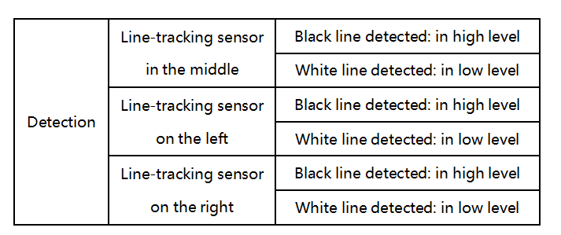
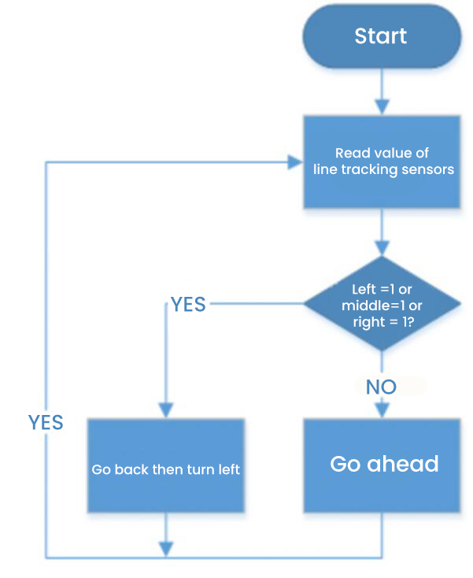
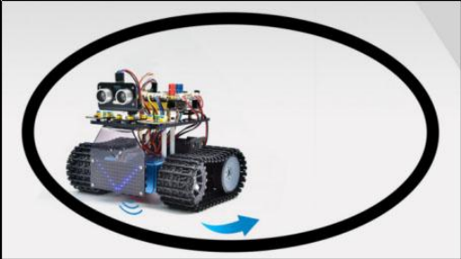

### プロジェクト13: 限られたスペース内で動くタンク


#### **(1)説明:**

スマートカーの超音波追従および障害物回避機能については、以前のプロジェクトで紹介しました。ここでは、以前のコースの知識を組み合わせて、スマートカーを一定のスペース内で動くように制限することを目的としています。

実験では、ライントラッキングセンサーを使用してスマートカーの周囲に黒線があるかどうかを検出し、その検出結果に応じて2つのモーターの回転を制御することで、黒線で描かれた円の中にスマートカーを閉じ込めます。

ライントラッキングスマートカーの具体的なロジックは、以下の表に示されています：



|                         条件                         |                         動作                          |
| :-------------------------------------------------------: | :-------------------------------------------------------: |
| 3つのライントラッキングセンサーのいずれかが黒線を検出した場合 | 後退する（PWMを150に設定）その後左折する（PWMを150に設定） |
|             いずれも黒線を検出しない場合              |               前進する（PWMを100に設定）                |

#### **(2)フローチャート:**



#### **(3)接続図:**


#### **(4)テストコード:**

(<span style="color: rgb(255, 76, 65);">**注意:**</span> コードをアップロードする前にBluetoothモジュールを接続しないでください。コードのアップロードにもシリアル通信を使用するため、Bluetoothシリアル通信と競合が発生し、アップロードに失敗する可能性があります。)

```C
/*
  Keyestudio Mini Tank Robot V3 (Popular Edition)
  lesson 13
  draw a circle for tank
  http://www.keyestudio.com
*/

// ラインセンサーの配線
#define L_pin  11  // 左
#define M_pin  7  // 中央
#define R_pin  8  // 右

#define ML_Ctrl 4  // 左モーターの方向制御ピンを定義
#define ML_PWM 6   // 左モーターのPWM制御ピンを定義
#define MR_Ctrl 2  // 右モーターの方向制御ピンを定義
#define MR_PWM 5   // 右モーターのPWM制御ピンを定義
int L_val, M_val, R_val;

void setup()
{
  Serial.begin(9600); // ボーレートを9600に設定
  pinMode(L_pin, INPUT); // ラインセンサーの全ピンを入力モードに設定
  pinMode(M_pin, INPUT);
  pinMode(R_pin, INPUT);
  pinMode(ML_Ctrl, OUTPUT);
  pinMode(ML_PWM, OUTPUT);
  pinMode(MR_Ctrl, OUTPUT);
  pinMode(MR_PWM, OUTPUT);
}

void loop () 
{
  L_val = digitalRead(L_pin); // 左センサーの値を読み取る
  M_val = digitalRead(M_pin); // 中央センサーの値を読み取る
  R_val = digitalRead(R_pin); // 右センサーの値を読み取る
  if ( L_val == 0 && M_val == 0 && R_val == 0 )  // 黒線が検出されない場合、前進する
  {
    Car_front();
  }
  else  // 黒線が検出された場合、後退してから左折する
  {
    Car_back();
    delay(700);
    Car_left();
    delay(800);
  }
}

void Car_front()
{
  digitalWrite(MR_Ctrl, HIGH);
  analogWrite(MR_PWM, 100);
  digitalWrite(ML_Ctrl, HIGH);
  analogWrite(ML_PWM, 100);
}

void Car_back()
{
  digitalWrite(MR_Ctrl, LOW);
  analogWrite(MR_PWM, 150);
  digitalWrite(ML_Ctrl, LOW);
  analogWrite(ML_PWM, 150);
}

void Car_left()
{
  digitalWrite(MR_Ctrl, HIGH);
  analogWrite(MR_PWM, 100);
  digitalWrite(ML_Ctrl, LOW);
  analogWrite(ML_PWM, 150);
}

void Car_right()
{
  digitalWrite(MR_Ctrl, LOW);
  analogWrite(MR_PWM, 150);
  digitalWrite(ML_Ctrl, HIGH);
  analogWrite(ML_PWM, 100);
}

void Car_Stop()
{
  digitalWrite(MR_Ctrl, LOW);
  analogWrite(MR_PWM, 0);
  digitalWrite(ML_Ctrl, LOW);
  analogWrite(ML_PWM, 0);
}
```

#### **(5)テスト結果:**

テストコードのアップロードが成功し、電源を入れると、スマートカーは黒線で描かれた円の中の限られたスペース内で動きます。

