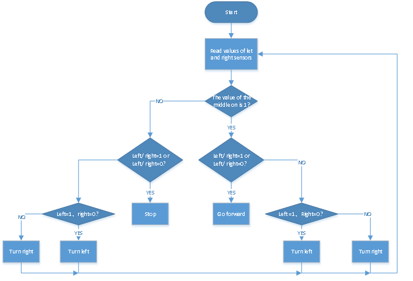
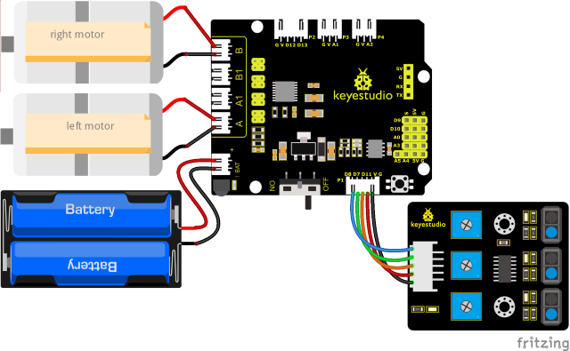
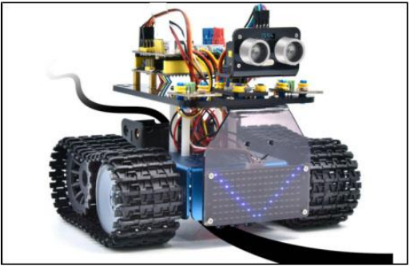

### Project 14: Lijnvolgend Pantservoertuig


#### **(1)Beschrijving:**

Het vorige project heeft uitgelegd hoe je de slimme auto kunt beperken om in een bepaalde ruimte te bewegen. In dit project kunnen we de eerder geleerde kennis gebruiken om er een lijnvolgend slim voertuig van te maken. In het experiment gebruiken we de lijnvolgsensor om te detecteren of er een zwarte lijn in de buurt van het slimme voertuig is, en vervolgens de rotatie van de twee motoren te regelen op basis van de detectieresultaten, zodat het slimme voertuig langs de zwarte lijn kan bewegen.

De specifieke logica van het lijnvolgende slimme voertuig wordt weergegeven in de onderstaande tabel:

|               Sensor               |                          Detectie                           |
| :--------------------------------: | :----------------------------------------------------------: |
| Lijnvolgsensor in het midden | Zwarte lijn gedetecteerd: hoog niveau<br />Witte lijn gedetecteerd: laag niveau |
|  Lijnvolgsensor aan de linkerkant  | Zwarte lijn gedetecteerd: hoog niveau<br />Witte lijn gedetecteerd: laag niveau |
| Lijnvolgsensor aan de rechterkant  | Zwarte lijn gedetecteerd: hoog niveau<br />Witte lijn gedetecteerd: laag niveau |

|                         Conditie 1                          |                         Conditie 2                          |             Beweging             |
| :----------------------------------------------------------: | :----------------------------------------------------------: | :------------------------------: |
| Lijnvolgsensor in het midden <br />detecteert de zwarte lijn | Lijnvolgsensor aan de linkerkant detecteert de zwarte lijn <br />en <br />die aan de rechterkant detecteert witte lijn | Draai links<br />stel PWM in op 200  |
| Lijnvolgsensor in het midden <br />detecteert de zwarte lijn | Lijnvolgsensor aan de linkerkant detecteert witte lijn <br />en <br />die aan de rechterkant detecteert de zwarte lijn | Draai rechts<br />stel PWM in op 200 |
| Lijnvolgsensor in het midden <br />detecteert de zwarte lijn | Zowel de linker- als de rechter lijnvolgsensor detecteren witte lijn<br />of<br />Zowel de linker- als de rechter detecteren de zwarte lijn |           Rij vooruit           |
| Lijnvolgsensor in het midden <br />detecteert witte lijn  | Lijnvolgsensor aan de linkerkant detecteert de zwarte lijn <br />en <br />die aan de rechterkant detecteert witte lijn | Draai links<br />stel PWM in op 200  |
| Lijnvolgsensor in het midden <br />detecteert witte lijn  | Lijnvolgsensor aan de linkerkant detecteert witte lijn<br />en <br />die aan de rechterkant detecteert de zwarte lijn | Draai rechts<br />stel PWM in op 200 |
| Lijnvolgsensor in het midden <br />detecteert witte lijn  | Zowel de linker- als de rechter lijnvolgsensor detecteren witte lijn<br />of<br />Zowel de linker- als de rechter lijnvolgsensoren detecteren de zwarte lijn |               Stop               |

#### **(2)Stroomdiagram:**



#### **(3)Bedradingsschema:**



#### **(4)Testcode:**

(<span style="color: rgb(255, 76, 65);">**Opmerking:**</span> Sluit de Bluetooth-module niet aan voordat je de code uploadt, omdat het uploaden van de code ook gebruik maakt van seriële communicatie, en er kunnen conflicten optreden met de Bluetooth seriële communicatie, waardoor het uploaden kan mislukken.)

```C
/*
  Keyestudio Mini Tank Robot V3 (Popular Edition)
  lesson 14
  Line track tank
  http://www.keyestudio.com
*/

//De bedrading van de lijnvolgsensor
#define L_pin  11  //links
#define M_pin  7  //midden
#define R_pin  8  //rechts
#define ML_Ctrl 4  //Definieer de richtingsbesturingspin van de linkermotor
#define ML_PWM 6   //Definieer de PWM-besturingspin van de linkermotor
#define MR_Ctrl 2  //Definieer de richtingsbesturingspin van de rechtermotor
#define MR_PWM 5   //Definieer de PWM-besturingspin van de rechtermotor
int L_val, M_val, R_val;

void setup()
{
  Serial.begin(9600); //Stel de baudrate in op 9600
  pinMode(L_pin, INPUT); //Stel alle pinnen van de lijnvolgsensor in als invoermodus
  pinMode(M_pin, INPUT);
  pinMode(R_pin, INPUT);
  pinMode(ML_Ctrl, OUTPUT);
  pinMode(ML_PWM, OUTPUT);
  pinMode(MR_Ctrl, OUTPUT);
  pinMode(MR_PWM, OUTPUT);
}

void loop () 
{
  L_val = digitalRead(L_pin); //Lees de waarde van de linkersensor
  M_val = digitalRead(M_pin); //Lees de waarde van de middelste sensor
  R_val = digitalRead(R_pin); //Lees de waarde van de rechtersensor
  if (M_val == 1) { //de middelste detecteert zwarte lijnen
    if (L_val == 1 && R_val == 0)  //Als er een zwarte lijn aan de linkerkant wordt gedetecteerd, maar niet aan de rechterkant, draai links
    {
      Car_left();
    }
    else if (L_val == 0 && R_val == 1)  //Als er een zwarte lijn aan de rechterkant wordt gedetecteerd, maar niet aan de linkerkant, draai rechts
    {
      Car_right();
    }
    else  //anders, rij vooruit
    {
      Car_front();
    }
  }
  else  //De middelste detecteert geen zwarte lijnen
  {
    if (L_val == 1 && R_val == 0)  //Als er een zwarte lijn aan de linkerkant wordt gedetecteerd, maar niet aan de rechterkant, draai links
    {
      Car_left();
    }
    else if (L_val == 0 && R_val == 1)  //Als er een zwarte lijn aan de rechterkant wordt gedetecteerd, maar niet aan de linkerkant, draai rechts
    {
      Car_right();
    }
    else  //anders, stop
    {
      Car_Stop();
    }
  }
}

//rij vooruit
void Car_front()
{
  digitalWrite(MR_Ctrl, HIGH);
  analogWrite(MR_PWM, 100);
  digitalWrite(ML_Ctrl, HIGH);
  analogWrite(ML_PWM, 100);
}

//rij achteruit
void Car_back()
{
  digitalWrite(MR_Ctrl, LOW);
  analogWrite(MR_PWM, 150);
  digitalWrite(ML_Ctrl, LOW);
  analogWrite(ML_PWM, 150);
}

//draai links
void Car_left()
{
  digitalWrite(MR_Ctrl, HIGH);
  analogWrite(MR_PWM, 100);
  digitalWrite(ML_Ctrl, LOW);
  analogWrite(ML_PWM, 150);
}

//draai rechts
void Car_right()
{
  digitalWrite(MR_Ctrl, LOW);
  analogWrite(MR_PWM, 150);
  digitalWrite(ML_Ctrl, HIGH);
  analogWrite(ML_PWM, 100);
}

//stop
void Car_Stop()
{
  digitalWrite(MR_Ctrl, LOW);
  analogWrite(MR_PWM, 0);
  digitalWrite(ML_Ctrl, LOW);
  analogWrite(ML_PWM, 0);
}
```

#### **(5)Testresultaat:**

Na het succesvol uploaden van de testcode en het inschakelen van de voeding, beweegt het slimme voertuig langs de zwarte lijn.

