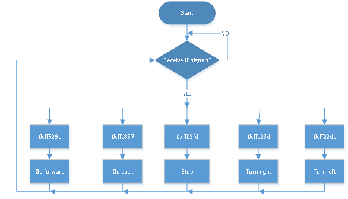
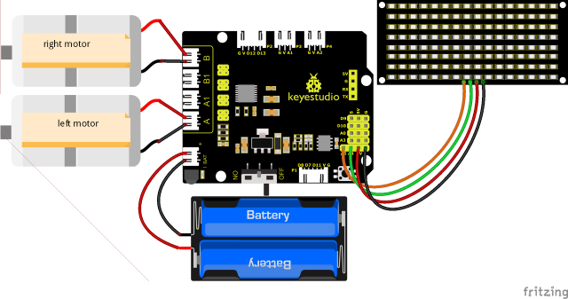
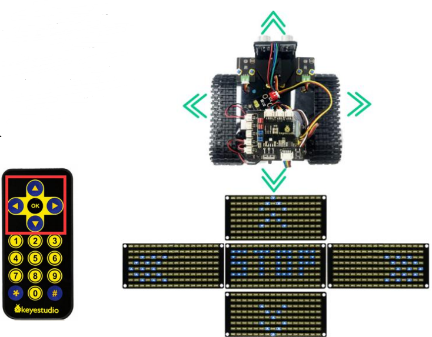

### Projet 15 : Char Télécommandé par Infrarouge


#### **(1) Description :**

La télécommande infrarouge est l'une des méthodes de contrôle à distance les plus courantes, utilisée dans les moteurs électriques, les ventilateurs électriques et de nombreux autres appareils électroménagers. Dans ce projet, nous utilisons les connaissances acquises précédemment pour fabriquer une voiture intelligente télécommandée par infrarouge.

Dans la 9ème leçon, nous avons testé la valeur de code correspondant à chaque touche de la télécommande infrarouge. Dans ce projet, nous pouvons définir le code (valeur de touche) pour que le bouton correspondant contrôle les mouvements du char intelligent, et afficher les schémas de mouvement sur la matrice de points LED 8X16.

La logique spécifique du char intelligent à suivi de ligne est indiquée dans le tableau :

|                        Touche ultrasonique                        | Valeur de touche |                    Instructions des touches                    |
| :----------------------------------------------------------: | :-------: | :----------------------------------------------------------: |
|  |  FF629D   | Avancer（régler le PWM à 200）<br />afficher le schéma d'avancement |
|  |  FFA857   | Reculer（régler le PWM à 200）<br />afficher le schéma de recul |
|  |  FF22DD   |           Tourner à gauche<br />afficher le schéma "STOP"           |
|  |  FFC23D   |     Tourner à droite<br />afficher le schéma de virage à gauche      |
|  |  FF02FD   |             Arrêter<br />afficher le schéma "STOP"              |

**Réglage initial** : La matrice de points LED 8X16 affiche le schéma "".


#### **(2) Organigramme :**



#### **(3) Schéma de connexion :**



<span style="color: rgb(255, 76, 65);">Remarque :</span>

GND, VCC, SDA et SCL du panneau LED 8x16 sont connectés à G（GND), V（VCC), SDA et SCL de la carte d'extension.

Étant donné que la carte 8833 intègre le récepteur IR, vous n'avez pas besoin de le câbler. Les broches du récepteur IR sont G（GND), V（VCC) et D3.

#### (4) **Code de test :**

(<span style="color: rgb(255, 76, 65);">**Remarque :**</span> Ne pas connecter le module Bluetooth avant de téléverser le code, car le téléversement utilise également la communication série, ce qui peut entraîner des conflits avec la communication série Bluetooth et faire échouer le téléversement.)

```C
/*
 Keyestudio Mini Tank Robot V3 (Popular Edition)
 lesson 15
 IRremote Control Tank
 http://www.keyestudio.com
*/
#include <IRremote.h>
IRrecv irrecv(3);  //
decode_results results;
long ir_rec;  // Utilisé pour stocker les valeurs infrarouge reçues

// Tableau, utilisé pour sauvegarder les données des images, peut être calculé manuellement ou obtenu depuis l'outil de modulus
unsigned char start01[] = {0x01, 0x02, 0x04, 0x08, 0x10, 0x20, 0x40, 0x80, 0x80, 0x40, 0x20, 0x10, 0x08, 0x04, 0x02, 0x01};
unsigned char front[] = {0x00, 0x00, 0x00, 0x00, 0x00, 0x24, 0x12, 0x09, 0x12, 0x24, 0x00, 0x00, 0x00, 0x00, 0x00, 0x00};
unsigned char back[] = {0x00, 0x00, 0x00, 0x00, 0x00, 0x24, 0x48, 0x90, 0x48, 0x24, 0x00, 0x00, 0x00, 0x00, 0x00, 0x00};
unsigned char left[] = {0x00, 0x00, 0x00, 0x00, 0x00, 0x00, 0x44, 0x28, 0x10, 0x44, 0x28, 0x10, 0x44, 0x28, 0x10, 0x00};
unsigned char right[] = {0x00, 0x10, 0x28, 0x44, 0x10, 0x28, 0x44, 0x10, 0x28, 0x44, 0x00, 0x00, 0x00, 0x00, 0x00, 0x00};
unsigned char STOP01[] = {0x2E, 0x2A, 0x3A, 0x00, 0x02, 0x3E, 0x02, 0x00, 0x3E, 0x22, 0x3E, 0x00, 0x3E, 0x0A, 0x0E, 0x00};
unsigned char clear[] = {0x00, 0x00, 0x00, 0x00, 0x00, 0x00, 0x00, 0x00, 0x00, 0x00, 0x00, 0x00, 0x00, 0x00, 0x00, 0x00};
#define SCL_Pin  A5  // Définir la broche d'horloge comme A5
#define SDA_Pin  A4  // Définir la broche de données comme A4

#define ML_Ctrl 4  // Définir la broche de contrôle de direction du moteur gauche
#define ML_PWM 6   // Définir la broche de contrôle PWM du moteur gauche
#define MR_Ctrl 2  // Définir la broche de contrôle de direction du moteur droit
#define MR_PWM 5    // Définir la broche de contrôle PWM du moteur droit

void setup() 
{
  Serial.begin(9600);
  irrecv.enableIRIn();  // Initialiser la bibliothèque du récepteur infrarouge

  pinMode(ML_Ctrl, OUTPUT);
  pinMode(ML_PWM, OUTPUT);
  pinMode(MR_Ctrl, OUTPUT);
  pinMode(MR_PWM, OUTPUT);

  pinMode(SCL_Pin, OUTPUT);
  pinMode(SDA_Pin, OUTPUT);
  matrix_display(clear); // effacer l'écran
  matrix_display(start01);  // afficher l'image de démarrage
}

void loop() 
{
  if (irrecv.decode(&results))  // Recevoir la valeur de la télécommande infrarouge
  {
    ir_rec = results.value;
    String type = "UNKNOWN";
    String typelist[14] = {"UNKNOWN", "NEC", "SONY", "RC5", "RC6", "DISH", "SHARP", "PANASONIC", "JVC", "SANYO", "MITSUBISHI", "SAMSUNG", "LG", "WHYNTER"};
    if (results.decode_type >= 1 && results.decode_type <= 13) 
    {
      type = typelist[results.decode_type];
    }
    Serial.print("IR TYPE:" + type + "  ");
    Serial.println(ir_rec, HEX);
    irrecv.resume();
  }

  switch (ir_rec) 
  {
    case 0xFF629D: Car_front();     break;   // commande pour avancer
    case 0xFFA857: Car_back();      break;   // commande pour reculer
    case 0xFF22DD: Car_T_left();    break;   // commande pour tourner à gauche
    case 0xFFC23D: Car_T_right();   break;   // commande pour tourner à droite
    case 0xFF02FD: Car_Stop();      break;   // commande pour s'arrêter
    case 0xFF30CF: Car_left();      break;   // commande pour pivoter à gauche
    case 0xFF7A85: Car_right();     break;   // commande pour pivoter à droite
    default: break;
  }
}

/***************Fonction de commande des moteurs***************/
void Car_back() 
{
  digitalWrite(MR_Ctrl, LOW);
  analogWrite(MR_PWM, 200);
  digitalWrite(ML_Ctrl, LOW);
  analogWrite(ML_PWM, 200);
  matrix_display(back);  // Reculer
}

void Car_front() 
{
  digitalWrite(MR_Ctrl, HIGH);
  analogWrite(MR_PWM, 55);
  digitalWrite(ML_Ctrl, HIGH);
  analogWrite(ML_PWM, 55);
  matrix_display(front);  // afficher l'image pour avancer
}

void Car_left() 
{
  digitalWrite(MR_Ctrl, HIGH);
  analogWrite(MR_PWM, 55);
  digitalWrite(ML_Ctrl, LOW);
  analogWrite(ML_PWM, 200);
  matrix_display(left);  // afficher l'image pour tourner à gauche
}

void Car_right() 
{
  digitalWrite(MR_Ctrl, LOW);
  analogWrite(MR_PWM, 200);
  digitalWrite(ML_Ctrl, HIGH);
  analogWrite(ML_PWM, 55);
  matrix_display(right);  // afficher l'image pour tourner à droite
}

void Car_Stop() 
{
  digitalWrite(MR_Ctrl, LOW);
  analogWrite(MR_PWM, 0);
  digitalWrite(ML_Ctrl, LOW);
  analogWrite(ML_PWM, 0);
  matrix_display(STOP01);  // afficher l'image pour s'arrêter
}

void Car_T_left() 
{
  digitalWrite(MR_Ctrl, HIGH);
  analogWrite(MR_PWM, 0);
  digitalWrite(ML_Ctrl, HIGH);
  analogWrite(ML_PWM, 100);
  matrix_display(left);  // afficher l'image pour tourner à gauche
}

void Car_T_right() 
{
  digitalWrite(MR_Ctrl, HIGH);
  analogWrite(MR_PWM, 100);
  digitalWrite(ML_Ctrl, HIGH);
  analogWrite(ML_PWM, 0);
  matrix_display(right);  // afficher l'image pour tourner à droite
}

// Cette fonction est utilisée pour l'affichage sur l'écran à matrice de points
void matrix_display(unsigned char matrix_value[])
{
  IIC_start();  // Fonction pour appeler la condition de début de transfert de données
  IIC_send(0xc0);  // Choisir une adresse
  for (int i = 0; i < 16; i++) // Les données de schéma contiennent 16 octets
  {
    IIC_send(matrix_value[i]); // transférer les données du schéma
  }
  IIC_end();   // Terminer le transfert des données du schéma
  IIC_start();
  IIC_send(0x8A);  // contrôle d'affichage, sélectionner la largeur d'impulsion à 4/16
  IIC_end();
}

// Conditions pour le début du transfert de données
void IIC_start()
{
  digitalWrite(SDA_Pin, HIGH);
  digitalWrite(SCL_Pin, HIGH);
  delayMicroseconds(3);
  digitalWrite(SDA_Pin, LOW);
  delayMicroseconds(3);
  digitalWrite(SCL_Pin, LOW);
}

// Le signe de fin de transmission de données
void IIC_end()
{
  digitalWrite(SCL_Pin, LOW);
  digitalWrite(SDA_Pin, LOW);
  delayMicroseconds(3);
  digitalWrite(SCL_Pin, HIGH);
  delayMicroseconds(3);
  digitalWrite(SDA_Pin, HIGH);
  delayMicroseconds(3);
}

// transférer les données
void IIC_send(unsigned char send_data)
{
  for (byte mask = 0x01; mask != 0; mask <<= 1) // chaque caractère a 8 chiffres, détectés un par un
  {
    if (send_data & mask)  // définir des niveaux haut ou bas en fonction de chaque bit (0 ou 1)
    {
      digitalWrite(SDA_Pin, HIGH);
    } 
    else 
    {
      digitalWrite(SDA_Pin, LOW);
    }
    delayMicroseconds(3);
    digitalWrite(SCL_Pin, HIGH); // Tirer la broche d'horloge SCL_Pin à l'état haut pour arrêter la transmission de données
    delayMicroseconds(3);
    digitalWrite(SCL_Pin, LOW); // Abaisser la broche d'horloge SCL_Pin pour changer les signaux de SDA
  }
}
```

#### **(5) Résultat du test :**

Après avoir téléversé le code, allumez l'interrupteur d'alimentation du bouclier de commande des moteurs. Placez le robot sur le sol, référez-vous au tableau ci-dessus et appuyez sur différents boutons, le robot se déplacera dans la direction préréglée correspondante.

