### Progetto 16: Controllo Remoto Bluetooth

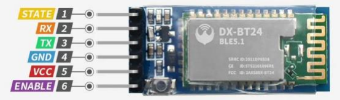

#### **(1)Descrizione:**

Negli ultimi decenni, il Bluetooth è diventato il modulo di comunicazione wireless più diffuso perché è facile da usare e ha trovato ampie applicazioni nella maggior parte dei dispositivi alimentati a batteria.

Per adattarsi ai tempi, alla realtà e alle esigenze dei clienti, il Bluetooth è stato aggiornato più volte. Negli ultimi anni ha subito molte trasformazioni in termini di velocità di trasferimento dati, consumo energetico dei dispositivi indossabili e dei dispositivi IoT, sistemi di sicurezza e altro ancora. Qui, intendiamo studiare il DX-BT24 con la scheda Arduino.

#### **(2)Parametri:**

- Protocollo Bluetooth: Bluetooth Specification V5.1 BLE

- Invio e ricezione tramite porta seriale senza limite di byte

- Distanza di comunicazione: 40m (ambiente aperto)

- Frequenza operativa: banda ISM 2.4GHz

- Metodo di modulazione: GFSK (Gaussian Frequency Shift Keying)

- Caratteristiche di sicurezza: Autenticazione e Cifratura

- Servizi supportati: UUID Central e Peripheral FFE0, FFE1, FFE2

- Consumo energetico: modalità di sospensione automatica, corrente in standby 400uA\~800uA, 8.5mA durante la trasmissione.
  
- Alimentazione: 5V

- Temperatura operativa: da –10 a +65 gradi Celsius

#### **(3)Schema di Collegamento:**

1.STATE è il pin di test dello stato collegato al diodo emettitore di luce interno e di solito rimane non collegato.

2.RXD è l'interfaccia della porta seriale per il terminale di ricezione.

3.TXD è l'interfaccia della porta seriale per il terminale di invio.

4.GND è per la messa a terra.

5.VCC è il polo positivo.

6.EN/BRK: la sua disconnessione rappresenta la disconnessione del Bluetooth e di solito rimane non collegato.

(Nota: qui il Bluetooth è collegato direttamente con lo shield V2 e **prestare attenzione alla direzione**)


#### **(4)Scarica e installa l'APP:**

##### **Per sistema IOS**

1\. Apri App Store.

2\. Cerca <span style="color: rgb(61, 167, 66);">KeyesRobot</span> nell'Apple Store e clicca su scarica.


3\. Dopo l'installazione dell'app, vedrai la seguente icona sul desktop del tuo telefono.


**Come collegare un telefono iOS al modulo Bluetooth:**

1\. Attiva il Bluetooth e i servizi di localizzazione sul telefono tramite le impostazioni.


2\. Consenti all'app KeyesRobot di accedere al Bluetooth tramite le impostazioni.


3\. Clicca per aprire l'app KeyesRobot.


4\. KeyesRobot App è un'APP universale, applicata a più robot keyestudio. Se l'interfaccia non mostra "TANK ROBOT", puoi cliccare i pulsanti sinistra e destra per trovare "TANK ROBOT".

5\. Clicca il pulsante <span style="color: rgb(61, 167, 66);">Bluetooth</span>  nell'angolo in alto a destra per scansionare il bluetooth


6\. Vedrai un Bluetooth di nome <span style="color: rgb(0, 209, 0);">**BT24**</span>, clicca il pulsante <span style="color: rgb(255, 169, 0);">Connect</span>.

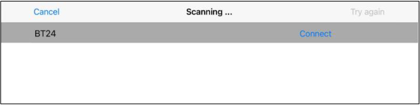

7\. Se il LED integrato sul modulo Bluetooth smette di lampeggiare e rimane acceso, significa che il tuo telefono è connesso con successo al modulo Bluetooth.

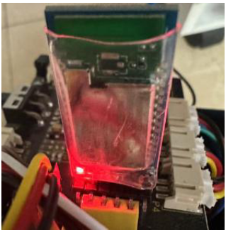


##### **Per sistema Android**

1\. Cerca <span style="color: rgb(61, 167, 66);">**KeyesRobot**</span> su Google Play, oppure apri il seguente link per scaricare e installare l'app.

[https://play.google.com/store/apps/details?id=com.keyestudio.keyestudio](https://play.google.com/store/apps/details?id=com.keyestudio.keyestudio)


2\. Attiva il Bluetooth e i servizi di localizzazione del telefono cellulare

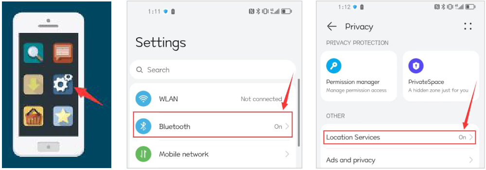

3\. Trova l'app Bluetooth KeyesRobot dalle impostazioni, clicca sulle opzioni dei permessi dell'app e
abilita i permessi di Posizione e dispositivi nelle vicinanze.(<span style="color: rgb(255, 76, 65);">Nota:</span> Alcuni telefoni cellulari non dispongono della funzione dei permessi per i dispositivi nelle vicinanze.)


4\. Clicca per aprire l'app KeyesRobot.


5\. KeyesRobot App è un'APP universale, applicata a più robot keyestudio. Se l'interfaccia non mostra "TANK ROBOT", puoi cliccare i pulsanti sinistra e destra per trovare "TANK ROBOT".

6\. Clicca il pulsante <span style="color: rgb(61, 167, 66);">Bluetooth</span>  nell'angolo in alto a destra per scansionare il bluetooth


7\. Vedrai un Bluetooth di nome <span style="color: rgb(0, 209, 0);">**BT24**</span>, clicca il pulsante <span style="color: rgb(255, 169, 0);">Connect</span>.

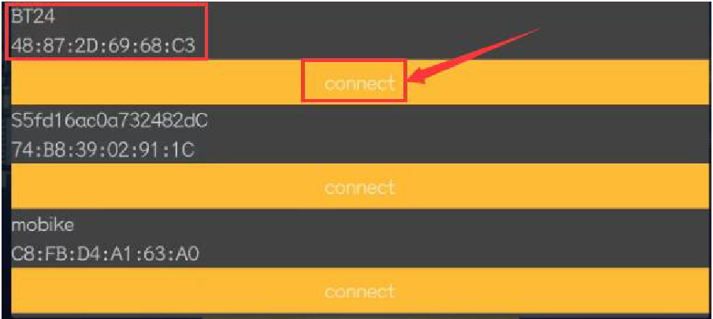

8\. Quando il tuo telefono è connesso con successo al modulo Bluetooth, il LED integrato sul modulo Bluetooth smetterà di lampeggiare e rimarrà acceso.

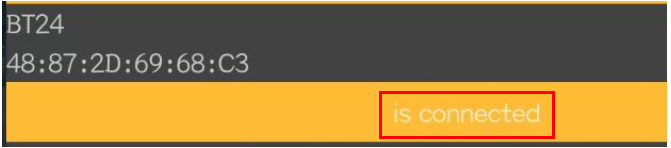


#### **(5)Testare l'APP Bluetooth:**

(<span style="color: rgb(255, 76, 65);">**Nota:**</span> Non collegare il modulo Bluetooth prima di caricare il codice, perché il caricamento del codice utilizza anche la comunicazione seriale, e potrebbero verificarsi conflitti con la comunicazione seriale Bluetooth, che possono causare il fallimento del caricamento.)

```C
/*
Keyestudio Mini Tank Robot V3 (Popular Edition)
lesson 16.1
Bluetooth
http://www.keyestudio.com
*/

char ble_val; // Variabile carattere (usata per memorizzare il valore ricevuto dal Bluetooth)

void setup() 
{
	Serial.begin(9600);
}

void loop() 
{
    if (Serial.available() > 0) // Determina se ci sono dati nel buffer della porta seriale
    {
        ble_val = Serial.read(); // Legge i dati nel buffer della porta seriale
        Serial.println(ble_val); // Stampa
    }
}
```

Carica il codice sulla scheda di sviluppo, poi inserisci il modulo Bluetooth e connetti il telefono cellulare al modulo Bluetooth.

Dopo che il telefono cellulare è connesso con successo al modulo Bluetooth, clicca per aprire l'APP Bluetooth e clicca il pulsante <span style="color: rgb(0, 252, 255);">Select</span> sulla <span style="color: rgb(0, 252, 255);">homepage</span>.

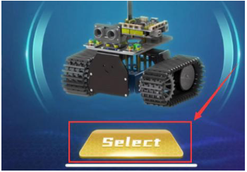

L'interfaccia principale dell'app Bluetooth è mostrata nella figura seguente.


Dopo che il codice sopra è stato caricato con successo, apri il monitor seriale dell'Arduino IDE e imposta la velocità di baud a 9600. Clicca l'icona sull'interfaccia dell'APP e il monitor seriale mostrerà il comando inviato dal pulsante.

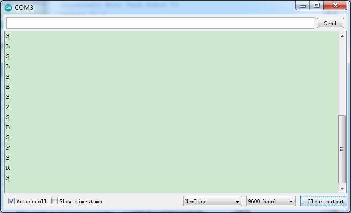

<br>
<br>
<span style="color: rgb(255, 76, 65);">**Nota: Il metodo di connessione dell'APP è lo stesso di seguito.**</span>
<br>
<b>

#### **(6)Spiegazione del Codice:**

**Serial.available()** rappresenta il numero di caratteri attualmente rimanenti nel buffer della porta seriale.

Questa funzione è generalmente usata per determinare se ci sono dati in quest'area. Quando Serial.available()\>0, significa che la porta seriale ha ricevuto dati e può essere letta.

**Serial.read()** si riferisce al prelievo e alla lettura di un Byte di dati dal buffer della porta seriale. Ad esempio, se un dispositivo invia dati all'Arduino tramite la porta seriale, possiamo usare Serial.read() per leggere i dati inviati.

#### **(7)Progetto di Espansione:**

Qui usiamo il comando inviato dal telefono cellulare per accendere o spegnere un LED. Guardando il diagramma di cablaggio, un LED è collegato al pin D9.


**Codice di Test**

(<span style="color: rgb(255, 76, 65);">Nota: </span> Non collegare il modulo Bluetooth prima di caricare il codice, perché il caricamento del codice utilizza anche la comunicazione seriale, e potrebbero verificarsi conflitti con la comunicazione seriale del Bluetooth, che possono causare il fallimento del caricamento del codice.)

```C
/*
Keyestudio Mini Tank Robot V3 (Popular Edition)
lesson 16.2
Bluetooth
http://www.keyestudio.com
*/

int LED = 9;
char ble_val; // Variabile intera usata per memorizzare il valore ricevuto dal Bluetooth

void setup() 
{
    Serial.begin(9600);
    pinMode(LED, OUTPUT);
}

void loop() 
{

    if (Serial.available() > 0) // Determina se ci sono dati nel buffer della porta seriale
    {
        ble_val = Serial.read(); // Legge i dati dal buffer della porta seriale
        Serial.print("DATA RECEIVED:");
        Serial.println(ble_val);
        if (ble_val == 'a') 
        {
            digitalWrite(LED, HIGH);
            Serial.println("led on");
        }
        if (ble_val == 'b') 
        {
            digitalWrite(LED, LOW);
            Serial.println("led off");
        }
    }
}
```

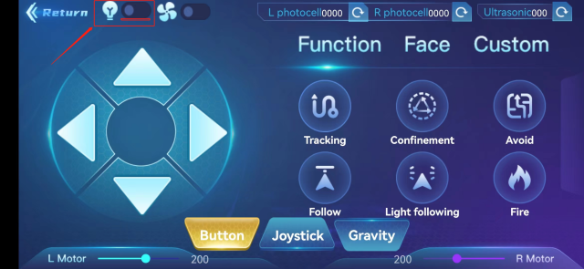

Dopo che il codice sopra è stato caricato con successo, apri il monitor seriale dell'Arduino IDE e imposta la velocità di baud a 9600. Clicca  per controllare il LED. Quando si clicca, verrà inviato il carattere a, quindi il LED si accenderà. Se questo pulsante viene premuto di nuovo, il LED si spegnerà.

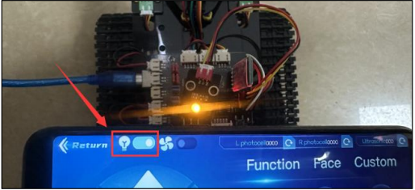

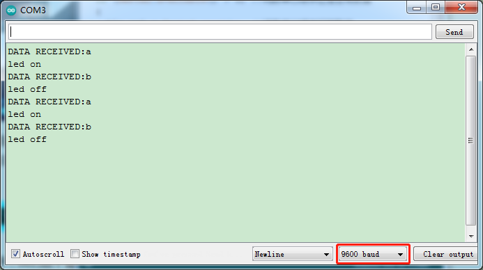

È necessario rimuovere il modulo BT al termine dei progetti.