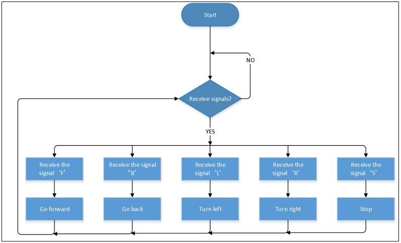
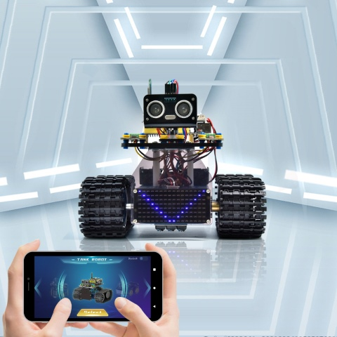
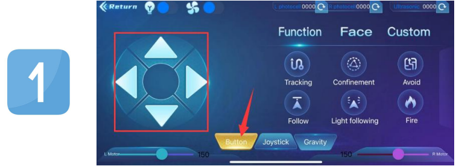
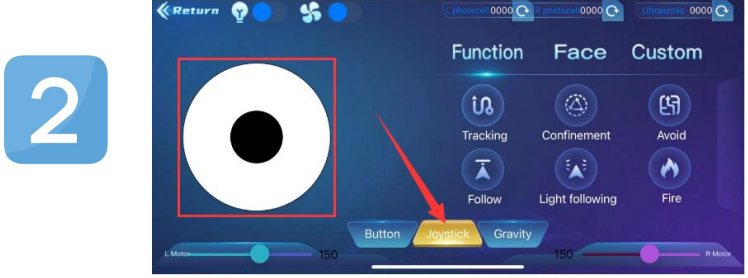
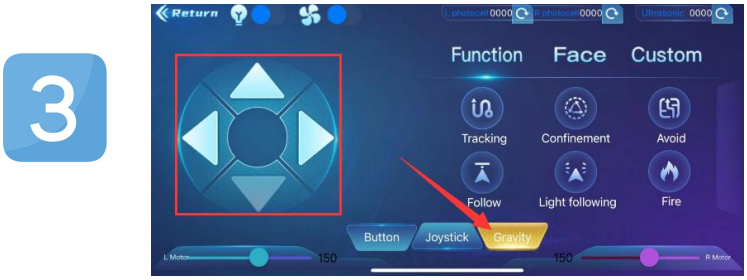

### Progetto 17: Tank Controllato via Bluetooth


#### **(1)Descrizione:**

Abbiamo imparato le nozioni di base del Bluetooth nel progetto precedente. In questa lezione, utilizzeremo il Bluetooth per controllare il robot. Poiché coinvolge il Bluetooth, sono necessari un mittente e un ricevitore. Nel progetto, utilizziamo il telefono cellulare come mittente (master) e il robot connesso con il modulo Bluetooth HM-10 (slave) come ricevitore.

Abbiamo imparato in precedenza che l'invio di un bit può controllare i LED. Il principio per controllare questo robot è lo stesso.

Prima di tutto capiamo la funzione di ogni pulsante sull'APP, poi utilizziamo i pulsanti dell'APP per controllare il tank.

#### **(2)Funzioni Principali dei Tasti sull'APP**

La tabella seguente illustra le funzioni dei tasti corrispondenti:

|                      TASTI                       | FUNZIONI                                                    |
| :---------------------------------------------: | ------------------------------------------------------------ |
|  | Accoppia e connette il modulo Bluetooth HM-10; clicca di nuovo per disconnettere |
|  | seleziona il robot da controllare                                  |
|  | per controllare i movimenti del robot tramite pulsanti             |
|  | Per controllare i movimenti del robot tramite joystick            |
|  | Per controllare i movimenti del robot tramite gravità             |
|  | Invia "F" quando premuto e "S" quando rilasciato<br />Il robot avanza quando premuto e si ferma quando rilasciato |
|  | Invia "L" quando premuto e "S" quando rilasciato <br />Il robot gira a sinistra quando premuto e si ferma quando rilasciato |
|  | Invia "R" quando premuto e "S" quando rilasciato<br />Il robot gira a destra quando premuto e si ferma quando rilasciato |
|  | Invia "B" quando premuto e "S" quando rilasciato<br />Il robot va indietro quando premuto e si ferma quando rilasciato |
|  | Invia "u"+cifra+"\#" quando trascinato<br />Trascina per cambiare la velocità del motore sinistro |
|  | Invia "v"+cifra+"\#" quando trascinato<br />Trascina per cambiare la velocità del motore destro |
|  | Seleziona per entrare nella pagina Funzioni                                |
|  | Invia "G" quando premuto e "S" quando premuto di nuovo<br />Entra in modalità di evitamento ostacoli quando premuto ed esce quando premuto di nuovo |
|  | Invia "h" quando premuto e "S" quando premuto di nuovo<br />Entra in modalità di inseguimento quando premuto ed esce quando premuto di nuovo |
|  | Invia "e" quando premuto e "S" quando premuto di nuovo<br />Entra in modalità di tracciamento linea quando premuto ed esce quando premuto di nuovo |
|  | Invia "f" quando premuto e "S" quando premuto di nuovo<br />Entra in modalità di movimento in spazio confinato quando premuto ed esce quando premuto di nuovo |
|  | Invia "i" quando premuto e "S" quando premuto di nuovo<br />Entra in modalità di inseguimento della luce quando premuto ed esce quando premuto di nuovo |
|  | Invia "j" quando premuto e "S" quando premuto di nuovo<br />Entra in modalità di estinzione incendi quando premuto ed esce quando premuto di nuovo |
|  | Seleziona per entrare nella modalità di visualizzazione delle espressioni facciali               |
|  | Invia "k" quando premuto e "z" quando premuto di nuovo<br />Mostra il disegno sorridente quando cliccato e cancella l'espressione quando cliccato di nuovo |
|  | Invia "l" quando premuto e "z" quando premuto di nuovo<br />Mostra il disegno disgustato quando cliccato e cancella l'espressione quando cliccato di nuovo |
|  | Invia "m" quando premuto e "z" quando premuto di nuovo<br />Mostra la faccia felice quando cliccato e cancella l'espressione quando cliccato di nuovo |
|  | Invia "n" quando premuto e "z" quando premuto di nuovo<br />Mostra il disegno triste quando cliccato e cancella l'espressione quando cliccato di nuovo |
|  | Invia "o" quando premuto e "z" quando premuto di nuovo<br />Mostra il disegno sprezzante quando cliccato e cancella l'espressione quando cliccato di nuovo |
|  | Invia "p" quando premuto e "z" quando premuto di nuovo<br />Mostra il disegno a forma di cuore quando cliccato e cancella l'espressione quando cliccato di nuovo |
|  | Scegli per entrare nell'interfaccia delle funzioni personalizzate; ci sono sei tasti 1,2,3,4,5,6; con questi tasti, puoi espandere alcune funzioni da solo |
|  | Clicca per inviare "w"<br />Clicca per visualizzare il valore analogico rilevato dalla fotoresistenza sinistra |
|  | Clicca per inviare "y"<br />Clicca per visualizzare il valore analogico rilevato dalla fotoresistenza destra |
|  | Clicca per inviare "x" <br />Clicca per mostrare la distanza rilevata dal sensore ad ultrasuoni (unità: cm) |
|  | Clicca per inviare "c", clicca di nuovo per inviare "d"<br />Premi per accendere il ventilatore e premi di nuovo per spegnerlo |

#### **(3)Diagramma di Flusso:**



#### **(4)Schema di Collegamento:**


GND, VCC, SDA e SCL della matrice di LED 8x16 sono collegati rispettivamente a -(GND), +(VCC), SDA, SCL della scheda di espansione;

I pin STATE e BRK del modulo Bluetooth non devono essere collegati.

#### **(5)Codice di Test:**

(<span style="color: rgb(255, 76, 65);">**Nota:**</span> Durante il caricamento del codice, il modulo Bluetooth deve essere scollegato; il Bluetooth potrà essere riconnesso dopo il completamento del caricamento. Altrimenti, il codice potrebbe non essere caricato correttamente.)

```C
/*
  Keyestudio Mini Tank Robot V3 (Popular Edition)
  lesson 17.
  bluetooth Control tank
  http://www.keyestudio.com
*/

//Array, utilizzato per salvare i dati delle immagini, può essere calcolato manualmente o ottenuto dallo strumento di modulo
unsigned char start01[] = {0x01, 0x02, 0x04, 0x08, 0x10, 0x20, 0x40, 0x80, 0x80, 0x40, 0x20, 0x10, 0x08, 0x04, 0x02, 0x01};
unsigned char front[] = {0x00, 0x00, 0x00, 0x00, 0x00, 0x24, 0x12, 0x09, 0x12, 0x24, 0x00, 0x00, 0x00, 0x00, 0x00, 0x00};
unsigned char back[] = {0x00, 0x00, 0x00, 0x00, 0x00, 0x24, 0x48, 0x90, 0x48, 0x24, 0x00, 0x00, 0x00, 0x00, 0x00, 0x00};
unsigned char left[] = {0x00, 0x00, 0x00, 0x00, 0x00, 0x00, 0x44, 0x28, 0x10, 0x44, 0x28, 0x10, 0x44, 0x28, 0x10, 0x00};
unsigned char right[] = {0x00, 0x10, 0x28, 0x44, 0x10, 0x28, 0x44, 0x10, 0x28, 0x44, 0x00, 0x00, 0x00, 0x00, 0x00, 0x00};
unsigned char STOP01[] = {0x2E, 0x2A, 0x3A, 0x00, 0x02, 0x3E, 0x02, 0x00, 0x3E, 0x22, 0x3E, 0x00, 0x3E, 0x0A, 0x0E, 0x00};
unsigned char clear[] = {0x00, 0x00, 0x00, 0x00, 0x00, 0x00, 0x00, 0x00, 0x00, 0x00, 0x00, 0x00, 0x00, 0x00, 0x00, 0x00};
#define SCL_Pin  A5  //Imposta il pin del clock come A5
#define SDA_Pin  A4  //Imposta il pin dei dati come A4

#define ML_Ctrl 4  //Definisce il pin di controllo della direzione del motore sinistro
#define ML_PWM 6   //Definisce il pin di controllo PWM del motore sinistro
#define MR_Ctrl 2  //Definisce il pin di controllo della direzione del motore destro
#define MR_PWM 5   //Definisce il pin di controllo PWM del motore destro
char ble_val;      //Utilizzato per memorizzare il valore ottenuto dal Bluetooth

void setup() 
{
  Serial.begin(9600);

  pinMode(ML_Ctrl, OUTPUT);
  pinMode(ML_PWM, OUTPUT);
  pinMode(MR_Ctrl, OUTPUT);
  pinMode(MR_PWM, OUTPUT);

  pinMode(SCL_Pin, OUTPUT);
  pinMode(SDA_Pin, OUTPUT);
  matrix_display(clear); //pulisce lo schermo
  matrix_display(start01);  //mostra l'immagine di avvio
}

void loop() 
{
  if (Serial.available())
  {
    ble_val = Serial.read();
    Serial.println(ble_val);
  }
  switch (ble_val)
  {
    case 'F':  //il comando per andare avanti
      Car_front();
      break;
    case 'B':  //il comando per andare indietro
      Car_back();
      break;
    case 'L':  //il comando per girare a sinistra
      Car_left();
      break;
    case 'R':  //il comando per girare a destra
      Car_right();
      break;
    case 'S':  //il comando per fermarsi
      Car_Stop();
      break;
  }
}

/***************Funzione per azionare il motore***************/
void Car_back() 
{
  digitalWrite(MR_Ctrl, LOW);
  analogWrite(MR_PWM, 200);
  digitalWrite(ML_Ctrl, LOW);
  analogWrite(ML_PWM, 200);
  matrix_display(back);  //Va indietro
}

void Car_front() 
{
  digitalWrite(MR_Ctrl, HIGH);
  analogWrite(MR_PWM, 55);
  digitalWrite(ML_Ctrl, HIGH);
  analogWrite(ML_PWM, 55);
  matrix_display(front);  //mostra l'immagine per andare avanti
}

void Car_left() 
{
  digitalWrite(MR_Ctrl, HIGH);
  analogWrite(MR_PWM, 55);
  digitalWrite(ML_Ctrl, LOW);
  analogWrite(ML_PWM, 200);
  matrix_display(left);  //mostra l'immagine per girare a sinistra
}

void Car_right() 
{
  digitalWrite(MR_Ctrl, LOW);
  analogWrite(MR_PWM, 200);
  digitalWrite(ML_Ctrl, HIGH);
  analogWrite(ML_PWM, 55);
  matrix_display(right);  //mostra l'immagine per girare a destra
}

void Car_Stop() 
{
  digitalWrite(MR_Ctrl, LOW);
  analogWrite(MR_PWM, 0);
  digitalWrite(ML_Ctrl, LOW);
  analogWrite(ML_PWM, 0);
  matrix_display(STOP01);  //mostra l'immagine di stop
}

//Questa funzione è utilizzata per la visualizzazione sulla matrice di punti
void matrix_display(unsigned char matrix_value[])
{
  IIC_start();  //Funzione per chiamare la condizione di inizio trasferimento dati
  IIC_send(0xc0);  //Sceglie un indirizzo
  for (int i = 0; i < 16; i++) //I dati del pattern hanno 16 byte
  {
    IIC_send(matrix_value[i]); //trasferisce i dati del pattern
  }
  IIC_end();   //Termina il trasferimento dei dati del pattern
  IIC_start();
  IIC_send(0x8A);  //controllo display, seleziona la larghezza dell'impulso come 4/16
  IIC_end();
}

//Condizioni per l'inizio del trasferimento dati
void IIC_start()
{
  digitalWrite(SDA_Pin, HIGH);
  digitalWrite(SCL_Pin, HIGH);
  delayMicroseconds(3);
  digitalWrite(SDA_Pin, LOW);
  delayMicroseconds(3);
  digitalWrite(SCL_Pin, LOW);
}

//il segnale di fine trasmissione dati
void IIC_end()
{
  digitalWrite(SCL_Pin, LOW);
  digitalWrite(SDA_Pin, LOW);
  delayMicroseconds(3);
  digitalWrite(SCL_Pin, HIGH);
  delayMicroseconds(3);
  digitalWrite(SDA_Pin, HIGH);
  delayMicroseconds(3);
}

//trasferisce i dati
void IIC_send(unsigned char send_data)
{
  for (byte mask = 0x01; mask != 0; mask <<= 1) //ogni carattere ha 8 cifre, rilevate una ad una
  {
    if (send_data & mask)  //imposta livelli alti o bassi in base a ogni bit (0 o 1)
    {
      digitalWrite(SDA_Pin, HIGH);
    } 
    else 
    {
      digitalWrite(SDA_Pin, LOW);
    }
    delayMicroseconds(3);
    digitalWrite(SCL_Pin, HIGH); //Porta il pin del clock SCL_Pin alto per fermare la trasmissione dati
    delayMicroseconds(3);
    digitalWrite(SCL_Pin, LOW); //abbassa il pin del clock SCL_Pin per cambiare i segnali di SDA
  }
}
```

#### **(6)Risultato del Test:**

Dopo aver caricato il codice, connetti il robot al modulo Bluetooth e accoppia l'APP Bluetooth. Attiva l'interruttore di alimentazione dello shield per il controllo dei motori. Posiziona il robot sul pavimento; puoi utilizzare i pulsanti dell'app Bluetooth per controllare il robot.



1. Le frecce su, giù, sinistra e destra controllano rispettivamente il movimento in avanti, indietro, sinistra e destra del robot.




2. Clicca il pulsante joystick e trascina la direzione del punto nero nel cerchio bianco per controllare la direzione di movimento del robot.



3. Clicca il pulsante Gravità e inclina il telefono nelle direzioni avanti, indietro, sinistra e destra; il robot si muoverà nella direzione in cui il telefono viene inclinato.

