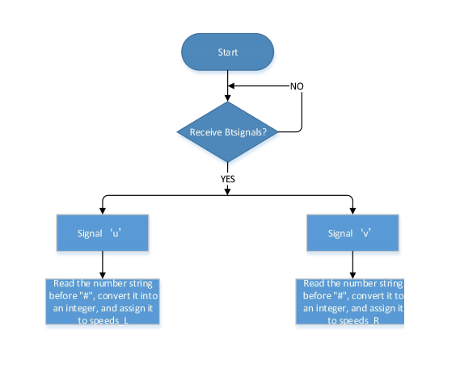
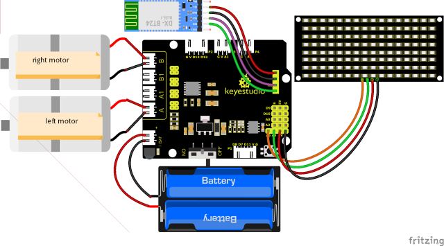
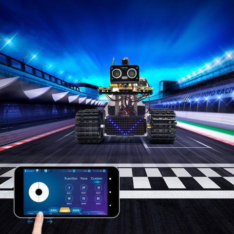

### Projekt 18: BT-Geschwindigkeitssteuerung Roboter

#### (1)**Beschreibung:**

Im vorherigen Projekt haben wir gelernt, wie man den Smart-Panzer mit Bluetooth steuert. Der PWM-Wert des Motors, den wir zuvor verwendet haben, beträgt 200 (die Geschwindigkeit ist 200).

In dieser Lektion werden wir Bluetooth verwenden, um die Geschwindigkeit des Smart Cars anzupassen. Es ist nicht auf eine feste Geschwindigkeit von 200 begrenzt. Wir definieren zwei Variablen, um die Geschwindigkeitswerte des linken bzw. rechten Motors zu speichern. Durch das vorherige Studium wissen wir, dass der Bereich dieses Wertes nur 0 bis 255 betragen kann.

#### **(2)Flussdiagramm:**



#### **(3)Anschlussdiagramm:**



GND, VCC, SDA und SCL der 8x16 LED-Dot-Matrix sind jeweils mit -(GND), +(VCC), SDA, SCL der Erweiterungsplatine verbunden;

#### **(4)Testcode:**

(<span style="color: rgb(255, 76, 65);">Hinweis:</span> Beim Hochladen des Codes muss das Bluetooth-Modul abgezogen werden. Bluetooth kann erst nach dem Hochladevorgang wieder verbunden werden. Andernfalls kann der Code möglicherweise nicht gebrannt werden.)

```C
/*
  Keyestudio Mini Tank Robot V3 (Popular Edition)
  lesson 18
  bluetooth control speed tank
  http://www.keyestudio.com
*/

// Array, zum Speichern von Bilddaten, kann selbst berechnet oder mit dem Modulus-Tool ermittelt werden
unsigned char start01[] = {0x01, 0x02, 0x04, 0x08, 0x10, 0x20, 0x40, 0x80, 0x80, 0x40, 0x20, 0x10, 0x08, 0x04, 0x02, 0x01};
unsigned char front[] = {0x00, 0x00, 0x00, 0x00, 0x00, 0x24, 0x12, 0x09, 0x12, 0x24, 0x00, 0x00, 0x00, 0x00, 0x00, 0x00};
unsigned char back[] = {0x00, 0x00, 0x00, 0x00, 0x00, 0x24, 0x48, 0x90, 0x48, 0x24, 0x00, 0x00, 0x00, 0x00, 0x00, 0x00};
unsigned char left[] = {0x00, 0x00, 0x00, 0x00, 0x00, 0x00, 0x44, 0x28, 0x10, 0x44, 0x28, 0x10, 0x44, 0x28, 0x10, 0x00};
unsigned char right[] = {0x00, 0x10, 0x28, 0x44, 0x10, 0x28, 0x44, 0x10, 0x28, 0x44, 0x00, 0x00, 0x00, 0x00, 0x00, 0x00};
unsigned char STOP01[] = {0x2E, 0x2A, 0x3A, 0x00, 0x02, 0x3E, 0x02, 0x00, 0x3E, 0x22, 0x3E, 0x00, 0x3E, 0x0A, 0x0E, 0x00};
unsigned char clear[] = {0x00, 0x00, 0x00, 0x00, 0x00, 0x00, 0x00, 0x00, 0x00, 0x00, 0x00, 0x00, 0x00, 0x00, 0x00, 0x00};
unsigned char speed_a[] = {0x00, 0x00, 0x00, 0x20, 0x10, 0x08, 0x04, 0x02, 0xff, 0x02, 0x04, 0x08, 0x10, 0x20, 0x00, 0x00};
unsigned char speed_d[] = {0x00, 0x00, 0x00, 0x04, 0x08, 0x10, 0x20, 0x40, 0xff, 0x40, 0x20, 0x10, 0x08, 0x04, 0x00, 0x00};
#define SCL_Pin  A5  // Taktpin auf A5 setzen
#define SDA_Pin  A4  // A4 Datenpin auf A4 setzen

#define ML_Ctrl 4  // Richtungssteuerungspin des linken Motors definieren
#define ML_PWM 6   // PWM-Steuerungspin des linken Motors definieren
#define MR_Ctrl 2  // Richtungssteuerungspin des rechten Motors definieren
#define MR_PWM 5   // PWM-Steuerungspin des rechten Motors definieren
char ble_val;      // PWM-Steuerungspin des rechten Motors definieren
byte speeds_L = 200; // Die Anfangsgeschwindigkeit des linken Motors beträgt 200
byte speeds_R = 200; // Die Anfangsgeschwindigkeit des rechten Motors beträgt 200
String speeds_l, speeds_r; // Einen PWM-String empfangen und in einen ganzzahligen PWM-Wert umwandeln

void setup() 
{
  Serial.begin(9600);

  pinMode(ML_Ctrl, OUTPUT);
  pinMode(ML_PWM, OUTPUT);
  pinMode(MR_Ctrl, OUTPUT);
  pinMode(MR_PWM, OUTPUT);

  pinMode(SCL_Pin, OUTPUT);
  pinMode(SDA_Pin, OUTPUT);
  matrix_display(clear); // Bildschirm löschen
  matrix_display(start01);  // Startbild anzeigen
}

void loop() 
{
  if (Serial.available() > 0) 
  {
    ble_val = Serial.read();
    Serial.println(ble_val);
    switch (ble_val) 
    {
      case 'F':  // Befehl zum Vorwärtsfahren
        Car_front();
        break;
      case 'B':  // Befehl zum Rückwärtsfahren
        Car_back();
        break;
      case 'L':  // Befehl zum Linksdrehen
        Car_left();
        break;
      case 'R':  // Befehl zum Rechtsdrehen
        Car_right();
        break;
      case 'S':  // Befehl zum Anhalten
        Car_Stop();
        break;
      case 'u':  // Einen String empfangen, der mit u beginnt und mit # endet, und in einen ganzzahligen Wert umwandeln
        speeds_l = Serial.readStringUntil('#');
        speeds_L = String(speeds_l).toInt();
        break;
      case 'v':  // Einen String empfangen, der mit v beginnt und mit # endet, und in einen ganzzahligen Wert umwandeln
        speeds_r = Serial.readStringUntil('#');
        speeds_R = String(speeds_r).toInt();
        break;
    }
  }
}

/***************Funktion zum Betreiben des Motors***************/

void Car_back() 
{
  digitalWrite(MR_Ctrl, LOW);
  analogWrite(MR_PWM, speeds_R);
  digitalWrite(ML_Ctrl, LOW);
  analogWrite(ML_PWM, speeds_L);
  matrix_display(back);  // Rückwärtsfahren
}

void Car_front() 
{
  digitalWrite(MR_Ctrl, HIGH);
  analogWrite(MR_PWM, 255 - speeds_R);
  digitalWrite(ML_Ctrl, HIGH);
  analogWrite(ML_PWM, 255 - speeds_L);
  matrix_display(front);  // Bild für Vorwärtsfahren anzeigen
}

void Car_left() 
{
  digitalWrite(MR_Ctrl, HIGH);
  analogWrite(MR_PWM, 255 - speeds_R);
  digitalWrite(ML_Ctrl, LOW);
  analogWrite(ML_PWM, speeds_L);
  matrix_display(left);  // Bild für Linksdrehen anzeigen
}

void Car_right() 
{
  digitalWrite(MR_Ctrl, LOW);
  analogWrite(MR_PWM, speeds_R);
  digitalWrite(ML_Ctrl, HIGH);
  analogWrite(ML_PWM, 255 - speeds_L);
  matrix_display(right);  // Bild für Rechtsdrehen anzeigen
}

void Car_Stop() 
{
  digitalWrite(MR_Ctrl, LOW);
  analogWrite(MR_PWM, 0);
  digitalWrite(ML_Ctrl, LOW);
  analogWrite(ML_PWM, 0);
  matrix_display(STOP01);  // Bild zum Anhalten anzeigen
}

// Diese Funktion wird zur Anzeige auf dem Dot-Matrix-Bildschirm verwendet
void matrix_display(unsigned char matrix_value[])
{
  IIC_start();  // Funktion zum Aufrufen der Startbedingung für die Datenübertragung
  IIC_send(0xc0);  // Adresse auswählen
  for (int i = 0; i < 16; i++) // Musterdaten haben 16 Bytes
  {
    IIC_send(matrix_value[i]); // Musterdaten übertragen
  }
  IIC_end();   // Musterdatenübertragung beenden
  IIC_start();
  IIC_send(0x8A);  // Anzeigesteuerung, Pulsbreite als 4/16 auswählen
  IIC_end();
}

// Bedingungen für den Start der Datenübertragung
void IIC_start()
{
  digitalWrite(SDA_Pin, HIGH);
  digitalWrite(SCL_Pin, HIGH);
  delayMicroseconds(3);
  digitalWrite(SDA_Pin, LOW);
  delayMicroseconds(3);
  digitalWrite(SCL_Pin, LOW);
}

// Zeichen für das Ende der Datenübertragung
void IIC_end()
{
  digitalWrite(SCL_Pin, LOW);
  digitalWrite(SDA_Pin, LOW);
  delayMicroseconds(3);
  digitalWrite(SCL_Pin, HIGH);
  delayMicroseconds(3);
  digitalWrite(SDA_Pin, HIGH);
  delayMicroseconds(3);
}

// Daten übertragen
void IIC_send(unsigned char send_data)
{
  for (byte mask = 0x01; mask != 0; mask <<= 1) // Jedes Zeichen hat 8 Stellen, die einzeln geprüft werden
  {
    if (send_data & mask)  // Hohe oder niedrige Pegel entsprechend jedem Bit (0 oder 1) setzen
    {
      digitalWrite(SDA_Pin, HIGH);
    } 
    else 
    {
      digitalWrite(SDA_Pin, LOW);
    }
    delayMicroseconds(3);
    digitalWrite(SCL_Pin, HIGH); // Taktpin SCL_Pin auf HIGH ziehen, um die Datenübertragung zu stoppen
    delayMicroseconds(3);
    digitalWrite(SCL_Pin, LOW); // Taktpin SCL_Pin nach unten ziehen, um SDA-Signale zu ändern
  }
}
```

#### **(5)Testergebnisse:**

Nach erfolgreichem Hochladen des Testcodes, Umlegen des DIP-Schalters auf die rechte Seite, Einschalten und Kopplung der APP mit Bluetooth kann das Smart Car durch die APP gesteuert werden. Die Geschwindigkeit des Fahrzeugs kann durch Ziehen der Geschwindigkeitsregler des linken und rechten Motors reguliert werden.



(Sie können die Funktionstabelle in Projekt 17 als Referenz verwenden.)