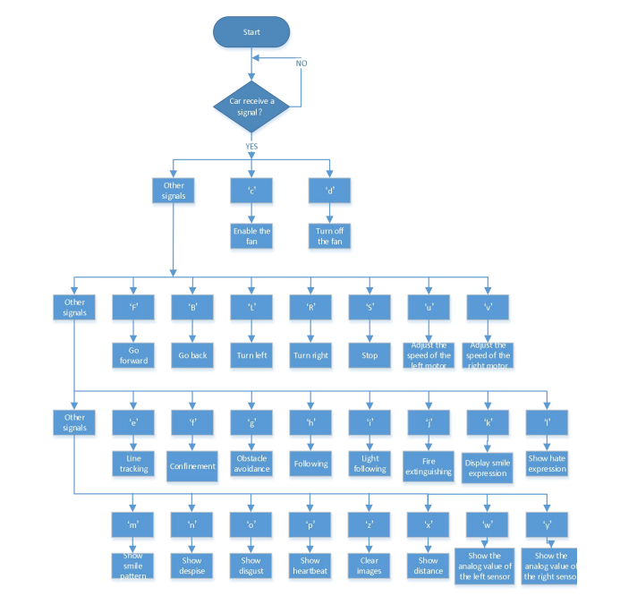
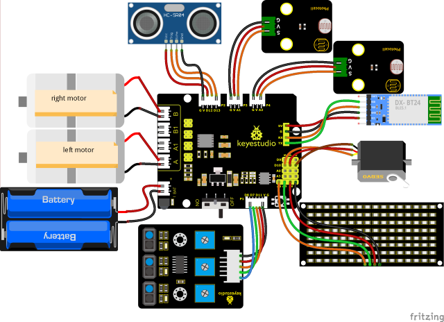

### Progetto 19: Robot Carro Armato Ultrasonico - Funzioni Multiple

#### **(1)Descrizione:**

Il robot auto intelligente ha eseguito una singola funzione in ogni progetto precedente.

Può mostrare più funzioni contemporaneamente? Sì.

In quest'ultimo grande progetto, intendiamo utilizzare un codice completo per controllare il robot auto intelligente e mostrare tutte le funzioni menzionate nei progetti precedenti. Utilizziamo i tasti sull'APP Bluetooth per passare automaticamente da una funzione all'altra, in modo molto semplice e conveniente.

#### **(2)Diagramma di Flusso:**



#### **(3)Schema di Collegamento:**



1\. GND, VCC, SDA e SCL della scheda 8x16 sono collegati a G (GND), + (VCC), A4 e A5 della scheda di espansione.

2\. VCC, Trig, Echo e Gnd del sensore ultrasonico sono collegati a 5V (V), 12 (S), 13 (S) e Gnd (G).

3\. Il filo marrone, il filo rosso e il filo arancione del servo sono collegati a Gnd (G), 5v (V) e D10.

4\. RXD, TXD, GND e VCC del modulo BT sono collegati a TX, RX, G (GND) e 5V (VCC). STATE e BRK non necessitano di essere collegati.

5\. I pin "G", "V" e S del modulo fotoresistore sinistro sono collegati rispettivamente a G (GND), V (VCC) e A1; Il modulo fotoresistore destro è collegato rispettivamente a G (GND), V (VCC) e A2.

6\. Le porte distali del sensore di rilevamento della linea sono 11, 7 e 8.

#### **(4)Codice di Test:**

(<span style="color: rgb(255, 76, 65);">**Nota:**</span> Non collegare il modulo Bluetooth prima di caricare il codice, poiché il caricamento del codice utilizza anche la comunicazione seriale e potrebbero verificarsi conflitti con la comunicazione seriale Bluetooth, causando un errore nel caricamento.)

```C
/*
  Keyestudio Mini Tank Robot V3 (Popular Edition)
  lesson 19
  Ultrasonic Tank Robot Multiple Functions
  http://www.keyestudio.com
*/
#include <IRremote.h>
IRrecv irrecv(3);  //
decode_results results;
long ir_rec;  // utilizzato per salvare il valore IR

/***********/
#define USE_FAN_FUNCTION   0

// Array, utilizzato per salvare i dati delle immagini, può essere calcolato manualmente o ottenuto dallo strumento di modulazione
unsigned char start01[] = {0x01, 0x02, 0x04, 0x08, 0x10, 0x20, 0x40, 0x80, 0x80, 0x40, 0x20, 0x10, 0x08, 0x04, 0x02, 0x01};
unsigned char STOP01[] = {0x2E, 0x2A, 0x3A, 0x00, 0x02, 0x3E, 0x02, 0x00, 0x3E, 0x22, 0x3E, 0x00, 0x3E, 0x0A, 0x0E, 0x00};
unsigned char front[] = {0x00, 0x00, 0x00, 0x00, 0x00, 0x24, 0x12, 0x09, 0x12, 0x24, 0x00, 0x00, 0x00, 0x00, 0x00, 0x00};
unsigned char back[] = {0x00, 0x00, 0x00, 0x00, 0x00, 0x24, 0x48, 0x90, 0x48, 0x24, 0x00, 0x00, 0x00, 0x00, 0x00, 0x00};
unsigned char left[] = {0x00, 0x00, 0x00, 0x00, 0x00, 0x00, 0x44, 0x28, 0x10, 0x44, 0x28, 0x10, 0x44, 0x28, 0x10, 0x00};
unsigned char right[] = {0x00, 0x10, 0x28, 0x44, 0x10, 0x28, 0x44, 0x10, 0x28, 0x44, 0x00, 0x00, 0x00, 0x00, 0x00, 0x00};

unsigned char Smile[] = {0x00, 0x00, 0x1c, 0x02, 0x02, 0x02, 0x5c, 0x40, 0x40, 0x5c, 0x02, 0x02, 0x02, 0x1c, 0x00, 0x00};
unsigned char Disgust[] = {0x00, 0x00, 0x02, 0x02, 0x02, 0x12, 0x08, 0x04, 0x08, 0x12, 0x22, 0x02, 0x02, 0x00, 0x00, 0x00};
unsigned char Happy[] = {0x02, 0x02, 0x02, 0x02, 0x08, 0x18, 0x28, 0x48, 0x28, 0x18, 0x08, 0x02, 0x02, 0x02, 0x02, 0x00};
unsigned char Squint[] = {0x00, 0x00, 0x00, 0x41, 0x22, 0x14, 0x48, 0x40, 0x40, 0x48, 0x14, 0x22, 0x41, 0x00, 0x00, 0x00};
unsigned char Despise[] = {0x00, 0x00, 0x06, 0x04, 0x04, 0x04, 0x24, 0x20, 0x20, 0x26, 0x04, 0x04, 0x04, 0x04, 0x00, 0x00};
unsigned char Heart[] = {0x00, 0x00, 0x0C, 0x1E, 0x3F, 0x7F, 0xFE, 0xFC, 0xFE, 0x7F, 0x3F, 0x1E, 0x0C, 0x00, 0x00, 0x00};

unsigned char clear[] = {0x00, 0x00, 0x00, 0x00, 0x00, 0x00, 0x00, 0x00, 0x00, 0x00, 0x00, 0x00, 0x00, 0x00, 0x00, 0x00};

#define SCL_Pin  A5  // imposta il pin del clock su A5
#define SDA_Pin  A4  // imposta il pin dei dati su A4

#define ML_Ctrl 4  // definisce il pin di controllo della direzione del motore sinistro come 4
#define ML_PWM 6   // definisce il pin di controllo PWM del motore sinistro
#define MR_Ctrl 2  // definisce il pin di controllo della direzione del sensore destro
#define MR_PWM 5   // definisce il pin di controllo PWM del motore destro
char ble_val;      // utilizzato per salvare il valore Bluetooth
byte speeds_L = 200; // la velocità iniziale del motore sinistro è 200
byte speeds_R = 200; // la velocità iniziale del motore destro è 200
String speeds_l, speeds_r; // riceve i caratteri PWM e li converte in valore PWM

// collegamento del sensore di rilevamento della linea
#define L_pin  11  // sinistra
#define M_pin  7  // centro
#define R_pin  8  // destra
int L_val, M_val, R_val;

#if USE_FAN_FUNCTION  /****usa la ventola*******/
int flame_L = A1; // definisce la porta analogica del sensore di fiamma sinistro su A1
int flame_R = A2; // definisce la porta analogica del sensore di fiamma destro su A2
int flame_valL, flame_valR;

// il pin del motore 130
int INA = 12;
int INB = 13;

#else /****usa il sensore ultrasonico*******/
#define servoPin    10  // pin del servo
#define light_L_Pin A1   // definisce il pin del fotoresistore sinistro
#define light_R_Pin A2   // definisce il pin del fotoresistore destro
int left_light;
int right_light;

#define Trig 12
#define Echo 13
float distance;// Memorizza i valori di distanza rilevati dall'ultrasonico per il seguimento

// Memorizza i valori di distanza rilevati dall'ultrasonico per l'evitamento degli ostacoli
int a;
int a1;
int a2;

#endif

bool flag;  // variabile flag, utilizzata per entrare e uscire da una modalità

void setup() 
{
  Serial.begin(9600);
  irrecv.enableIRIn();  // Inizializza la libreria del telecomando IR

  pinMode(SCL_Pin, OUTPUT);
  pinMode(SDA_Pin, OUTPUT);
  
  pinMode(ML_Ctrl, OUTPUT);
  pinMode(ML_PWM, OUTPUT);
  pinMode(MR_Ctrl, OUTPUT);
  pinMode(MR_PWM, OUTPUT);

  pinMode(L_pin, INPUT); // definisce i pin dei sensori come INPUT
  pinMode(M_pin, INPUT);
  pinMode(R_pin, INPUT);

  matrix_display(clear);    // schermo pulito
  matrix_display(start01);  // mostra l'avvio

#if USE_FAN_FUNCTION/****usa la ventola*******/
  pinMode(INA, OUTPUT);// imposta INA come OUTPUT
  pinMode(INB, OUTPUT);// imposta INB come OUTPUT

  // definisce gli ingressi del sensore di fiamma
  pinMode(flame_L, INPUT);
  pinMode(flame_R, INPUT);
#else/****usa il sensore ultrasonico*******/
  pinMode(servoPin, OUTPUT);
  pinMode(light_L_Pin, INPUT);
  pinMode(light_R_Pin, INPUT);

  pinMode(Trig, OUTPUT);
  pinMode(Echo, INPUT);
  procedure(90); // imposta l'angolo del servo a 90°
#endif
}

void loop() 
{
  if (Serial.available()) // se ci sono dati nel buffer seriale
  {
    ble_val = Serial.read();
    Serial.println(ble_val);
    switch (ble_val) 
    {
      case 'F': Car_front(); break; // il comando per andare avanti

      case 'B': Car_back(); break;  // il comando per andare indietro

      case 'L': Car_left(); break;  // il comando per girare a sinistra

      case 'R': Car_right(); break; // il comando per girare a destra

      case 'S': Car_Stop();  break; // fermati

      case 'e': Tracking();  break; // entra nella modalità di rilevamento della linea

      case 'f': Confinement(); break;  // entra nella modalità di confinamento

#if USE_FAN_FUNCTION/****usa la ventola*******/
      case 'j': Fire(); break;  // abilita la modalità estinzione incendi

      case 'c': fan_begin(); break;  // abilita la ventola

      case 'd': fan_stop();  break;  // spegni la ventola

#else/****usa il sensore ultrasonico*******/
      case 'g': Avoid(); break;  // entra nella modalità evitamento ostacoli

      case 'h': Follow(); break;  // entra nella modalità seguimento

      case 'i': Light_following();  break;  // entra nella modalità seguimento della luce
#endif
      case 'u': 
        speeds_l = Serial.readStringUntil('#'); 
        speeds_L = String(speeds_l).toInt(); 
        break; // inizia ricevendo u, termina ricevendo il carattere # e converte in intero

      case 'v': 
        speeds_r = Serial.readStringUntil('#');
        speeds_R = String(speeds_r).toInt(); 
        break; // inizia ricevendo u, termina ricevendo il carattere # e converte in intero

      case 'k': matrix_display(Smile);    break;  // mostra il volto "sorridente"
      case 'l': matrix_display(Disgust);  break;  // mostra il volto "disgustato"
      case 'm': matrix_display(Happy);    break;  // mostra il volto "felice"
      case 'n': matrix_display(Squint);   break;  // mostra il volto "triste"
      case 'o': matrix_display(Despise);  break;  // mostra il volto "disprezzo"
      case 'p': matrix_display(Heart);    break;  // mostra l'immagine del battito cardiaco
      case 'z': matrix_display(clear);    break;  // cancella le immagini

      default: break;
    }
  }

#if (USE_FAN_FUNCTION != 1)/****la funzione per non usare la ventola*******/
  // I seguenti tre segnali sono utilizzati principalmente per la stampa ciclica
  if (ble_val == 'x') 
  {
    distance = checkdistance(); Serial.println(distance);
    delay(50);
  } 
  else if (ble_val == 'w') 
  {
    left_light = analogRead(light_L_Pin);
    Serial.println(left_light);
    delay(50);
  } 
  else if (ble_val == 'y') 
  {
    right_light = analogRead(light_R_Pin);
    Serial.println(right_light);
    delay(50);
  }
#endif

  if (irrecv.decode(&results))  // Riceve il valore del telecomando infrarosso
  {
    ir_rec = results.value;
    Serial.println(ir_rec, HEX);
    switch (ir_rec) 
    {
      case 0xFF629D: Car_front();   break;   // vai avanti
      case 0xFFA857: Car_back();    break;   // vai indietro
      case 0xFF22DD: Car_left();    break;   // ruota a sinistra
      case 0xFFC23D: Car_right();   break;   // ruota a destra
      case 0xFF02FD: Car_Stop();    break;   // fermati
      default: break;
    }
    irrecv.resume();
  }
}

#if (USE_FAN_FUNCTION != 1)/****usa il sensore ultrasonico*******/

// Controlla il sensore ultrasonico
float checkdistance() 
{
  float distance;
  digitalWrite(Trig, LOW);
  delayMicroseconds(2);
  digitalWrite(Trig, HIGH);
  delayMicroseconds(10);
  digitalWrite(Trig, LOW);
  distance = pulseIn(Echo, HIGH) / 58.20;  //
  delay(10);
  return distance;
}


// la funzione per controllare il servo
void procedure(int myangle) 
{
  int pulsewidth;
  pulsewidth = map(myangle, 0, 180, 500, 2000);  // Calcola il valore della larghezza dell'impulso, che dovrebbe essere il valore mappato da 500 a 2500. Considerando l'influenza della libreria infrarossi, viene utilizzato 500~2000.
  for (int i = 0; i < 5; i++) 
  {
    digitalWrite(servoPin, HIGH);
    delayMicroseconds(pulsewidth);   // La durata del livello alto è la larghezza dell'impulso
    digitalWrite(servoPin, LOW);
    delay((20 - pulsewidth / 1000));  // Il periodo è 20ms, quindi il livello basso dura il resto del tempo
  }
}

/*****************evitamento ostacoli******************/
void Avoid()
{
  flag = 0;
  while (flag == 0)
  {
    a = checkdistance();  // la distanza frontale è impostata su a
    if (a < 20) // Quando la distanza frontale è inferiore a 20cm
    {
      Car_Stop();  // fermati
      delay(500); // ritardo di 500ms
      procedure(180);  // il servo gira a sinistra
      delay(500); // ritardo di 500ms
      a1 = checkdistance();  // la distanza sinistra è impostata su a1
      delay(100); // leggi il valore

      procedure(0); // il servo gira a destra
      delay(500); // ritardo di 500ms
      a2 = checkdistance(); // la distanza destra è impostata su a2
      delay(100); // leggi il valore

      procedure(90);  // torna a 90°
      delay(500);
      if (a1 > a2)  // Quando la distanza a sinistra è maggiore della distanza a destra
      {
        Car_left();  // il robot gira a sinistra
        delay(700);  // gira a sinistra per 700ms
      } 
      else 
      {
        Car_right(); // gira a destra
        delay(700);
      }
    }
    else  // se la distanza frontale è ≥20cm, il robot va avanti
    {
      Car_front(); // vai avanti
    }
    // riceve il valore Bluetooth per uscire dal loop
    if (Serial.available())
    {
      ble_val = Serial.read();
      if (ble_val == 'S')  // riceve S
      {
        flag = 1;  // imposta flag a 1 per uscire dal loop
        Car_Stop();
      }
    }
  }
}

/*******************seguimento***************/
void Follow() 
{
  flag = 0;
  while (flag == 0) 
  {
    distance = checkdistance();  // imposta il valore della distanza su distance
    if (distance >= 20 && distance <= 60) // vai avanti
    {
      Car_front();
    }
    else if (distance > 10 && distance < 20)  // fermati
    {
      Car_Stop();
    }
    else if (distance <= 10)  // vai indietro
    {
      Car_back();
    }
    else  // fermati
    {
      Car_Stop();
    }
    if (Serial.available())
    {
      ble_val = Serial.read();
      if (ble_val == 'S')
      {
        flag = 1;  // esci dal loop
        Car_Stop();
      }
    }
  }
}

/****************seguimento della luce******************/
void Light_following() 
{
  flag = 0;
  while (flag == 0) 
  {
    left_light = analogRead(light_L_Pin);
    right_light = analogRead(light_R_Pin);
    if (left_light > 650 && right_light > 650) // vai avanti
    {
      Car_front();
    }
    else if (left_light > 650 && right_light <= 650)  // gira a sinistra
    {
      Car_left();
    }
    else if (left_light <= 650 && right_light > 650) // gira a destra
    {
      Car_right();
    }
    else  // altrimenti, fermati
    {
      Car_Stop();
    }
    if (Serial.available())
    {
      ble_val = Serial.read();
      if (ble_val == 'S') 
      {
        flag = 1;
        Car_Stop();
      }
    }
  }
}

#else/****usa la ventola*******/
/***************abilita la ventola*****************/
void fan_begin() 
{
  digitalWrite(INA, LOW);
  digitalWrite(INB, HIGH);
}

/***************ferma la ventola*****************/
void fan_stop() 
{
  digitalWrite(INA, LOW);
  digitalWrite(INB, LOW);
}

/***************estingui l'incendio****************/
void Fire() 
{
  flag = 0;
  while (flag == 0) 
  {
    // Leggi il valore analogico del sensore di fiamma
    flame_valL = analogRead(flame_L);
    flame_valR = analogRead(flame_R);
    if (flame_valL <= 700 || flame_valR <= 700) 
    {
      Car_Stop();
      fan_begin();
    } 
    else 
    {
      fan_stop();
      L_val = digitalRead(L_pin); // Leggi il valore del sensore sinistro
      M_val = digitalRead(M_pin); // Leggi il valore del sensore sinistro
      R_val = digitalRead(R_pin); // Leggi il valore del sensore destro
```

```
     if (M_val == 1)  //quello centrale rileva le linee nere
      {
        if (L_val == 1 && R_val == 0)  //Se viene rilevata una linea nera a sinistra, ma non a destra, girare a sinistra
        {
          Car_left();
        }
        else if (L_val == 0 && R_val == 1)  //Se viene rilevata una linea nera a destra, non a sinistra, girare a destra
        {
          Car_right();
        }
        else  //vai avanti
        {
          Car_front();
        }
      }
      else  //quello centrale rileva le linee nere
      {
        if (L_val == 1 && R_val == 0)  //Se viene rilevata una linea nera a sinistra, ma non a destra, girare a sinistra
        {
          Car_left();
        }
        else if (L_val == 0 && R_val == 1)  //Se viene rilevata una linea nera a destra, non a sinistra, girare a destra
        {
          Car_right();
        }
        else  //altrimenti fermarsi
        {
          Car_Stop();
        }
      }
    }
    if (Serial.available())
    {
      ble_val = Serial.read();
      if (ble_val == 'S') 
      {
        flag = 1;
        Car_Stop();
      }
    }
  }
}

#endif

/***************inseguimento linea*****************/
void Tracking() 
{
  flag = 0;
  while (flag == 0) 
  {
    L_val = digitalRead(L_pin); //Leggi il valore del sensore sinistro
    M_val = digitalRead(M_pin); //Leggi il valore del sensore intermedio
    R_val = digitalRead(R_pin); //Leggi il valore del sensore destro
    if (M_val == 1)  //quello centrale rileva le linee nere
    {
      if (L_val == 1 && R_val == 0)  //Se viene rilevata una linea nera a sinistra, ma non a destra, girare a sinistra
      {
        Car_left();
      }
      else if (L_val == 0 && R_val == 1)  //Se viene rilevata una linea nera a destra, non a sinistra, girare a destra
      {
        Car_right();
      }
      else  //vai avanti
      {
        Car_front();
      }
    }
    else  //il sensore centrale non rileva linee nere
    {
      if (L_val == 1 && R_val == 0)  //Se viene rilevata una linea nera a sinistra, ma non a destra, girare a sinistra
      {
        Car_left();
      }
      else if (L_val == 0 && R_val == 1) //Se viene rilevata una linea nera a destra, non a sinistra, girare a destra
      { 
        Car_right();
      }
      else //altrimenti fermarsi
      { 
        Car_Stop();
      }
    }
    if (Serial.available())
    {
      ble_val = Serial.read();
      if (ble_val == 'S') 
      {
        flag = 1;
        Car_Stop();
      }
    }
  }
}

/***************Confinamento*****************/
void Confinement() 
{
  flag = 0;
  while (flag == 0) 
  {
    L_val = digitalRead(L_pin); //Leggi il valore del sensore sinistro
    M_val = digitalRead(M_pin); //Leggi il valore del sensore intermedio
    R_val = digitalRead(R_pin); //Leggi il valore del sensore destro
    if ( L_val == 0 && M_val == 0 && R_val == 0 ) //Vai avanti quando non vengono rilevate linee nere 
    {      
        Car_front();
    }
    else 
    { 
      Car_back();
      delay(700);
      Car_left();
      delay(800);
    }
    if (Serial.available())
    {
      ble_val = Serial.read();
      if (ble_val == 'S') 
      {
        flag = 1;
        Car_Stop();
      }
    }
  }
}


/***************matrice di punti******************/
//questa funzione viene utilizzata per la visualizzazione della matrice di punti 
void matrix_display(unsigned char matrix_value[])
{
  IIC_start();  //usa la funzione per avviare la trasmissione dei dati
  IIC_send(0xc0);  //seleziona un indirizzo
  for (int i = 0; i < 16; i++) //i dati dell'immagine hanno 16 caratteri
  {
    IIC_send(matrix_value[i]); //dati per trasmettere immagini
  }
  IIC_end();   //termina la trasmissione dei dati delle immagini
  IIC_start();
  IIC_send(0x8A);  //mostra il controllo e seleziona la larghezza del impulso 4/16
  IIC_end();
}

//la condizione in cui i dati iniziano a trasmettere
void IIC_start()
{
  digitalWrite(SDA_Pin, HIGH);
  digitalWrite(SCL_Pin, HIGH);
  delayMicroseconds(3);
  digitalWrite(SDA_Pin, LOW);
  delayMicroseconds(3);
  digitalWrite(SCL_Pin, LOW);
}

//trasmetti dati
void IIC_send(unsigned char send_data)
{
  for (byte mask = 0x01; mask != 0; mask <<= 1) //ogni carattere ha 8 cifre, che vengono rilevate una per una
  {
    if (send_data & mask) //imposta livelli alti o bassi in base a ciascun bit (0 o 1)
    { 
      digitalWrite(SDA_Pin, HIGH);
    } 
    else 
    {
      digitalWrite(SDA_Pin, LOW);
    }
    delayMicroseconds(3);
    digitalWrite(SCL_Pin, HIGH); //alza il pin del clock SCL_Pin per terminare la trasmissione dei dati
    delayMicroseconds(3);
    digitalWrite(SCL_Pin, LOW); //abbassa il pin del clock SCL_Pin per cambiare i segnali di SDA 
  }
}

//il segnale che la trasmissione dei dati è terminata
void IIC_end()
{
  digitalWrite(SCL_Pin, LOW);
  digitalWrite(SDA_Pin, LOW);
  delayMicroseconds(3);
  digitalWrite(SCL_Pin, HIGH);
  delayMicroseconds(3);
  digitalWrite(SDA_Pin, HIGH);
  delayMicroseconds(3);
}

/***************motore in funzione****************/
void Car_back() 
{
  digitalWrite(MR_Ctrl, LOW);
  analogWrite(MR_PWM, speeds_R);
  digitalWrite(ML_Ctrl, LOW);
  analogWrite(ML_PWM, speeds_L);
  matrix_display(back);  //mostra l'immagine di marcia indietro
}

void Car_front() 
{
  digitalWrite(MR_Ctrl, HIGH);
  analogWrite(MR_PWM, 255 - speeds_R);
  digitalWrite(ML_Ctrl, HIGH);
  analogWrite(ML_PWM, 255 - speeds_L);
  matrix_display(front);  //mostra l'immagine di marcia in avanti
}

void Car_left() 
{
  digitalWrite(MR_Ctrl, HIGH);
  analogWrite(MR_PWM, 255 - speeds_R);
  digitalWrite(ML_Ctrl, LOW);
  analogWrite(ML_PWM, speeds_L);
  matrix_display(left);  //mostra l'immagine di svolta a sinistra
}

void Car_right() 
{
  digitalWrite(MR_Ctrl, LOW);
  analogWrite(MR_PWM, speeds_R);
  digitalWrite(ML_Ctrl, HIGH);
  analogWrite(ML_PWM, 255 - speeds_L);
  matrix_display(right);  //mostra l'immagine di svolta a destra
}

void Car_Stop() 
{
  digitalWrite(MR_Ctrl, LOW);
  analogWrite(MR_PWM, 0);
  digitalWrite(ML_Ctrl, LOW);
  analogWrite(ML_PWM, 0);
  matrix_display(STOP01);  //mostra l'immagine di stop
}
```

#### **(5)Risultato del Test:**

Prima di caricare il codice del programma, il modulo Bluetooth deve essere rimosso; altrimenti il caricamento del codice fallirà.

Dopo aver caricato il codice con successo, attiva i servizi di localizzazione sul tuo dispositivo, quindi connetti il modulo Bluetooth.

Una volta che il modulo Bluetooth è collegato e alimentato, e l'APP mobile è connessa con successo al Bluetooth, possiamo utilizzare l'APP mobile per controllare il robot cingolato.

Puoi anche controllare il robot con il telecomando.