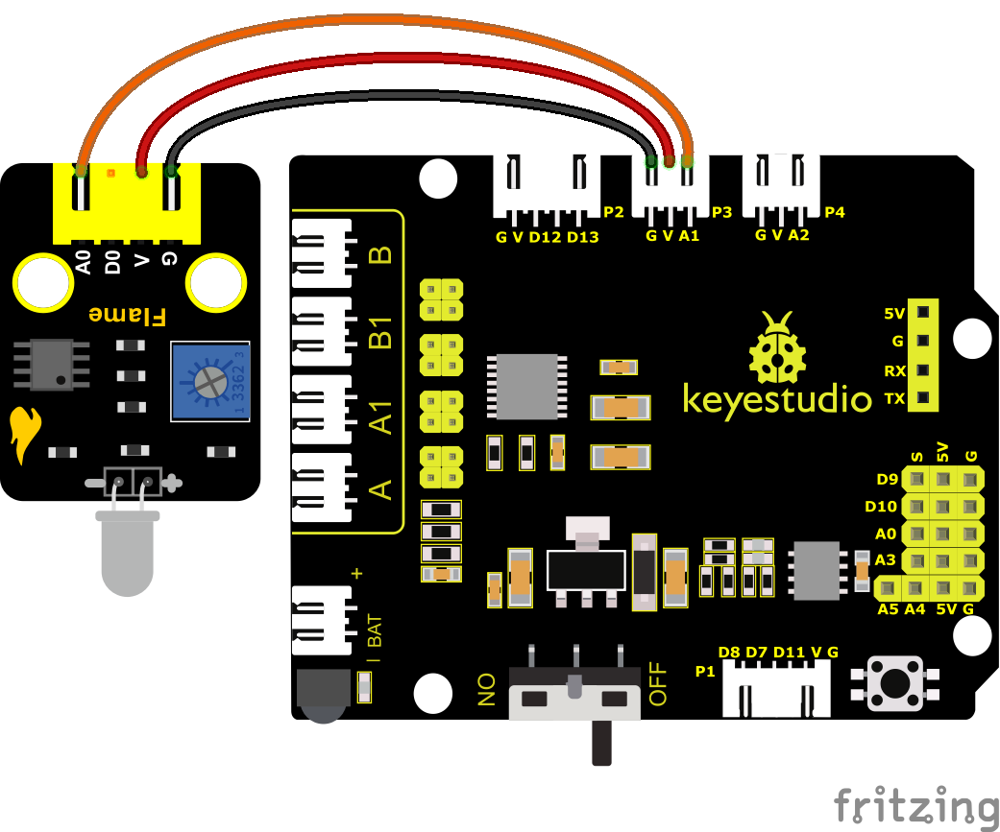
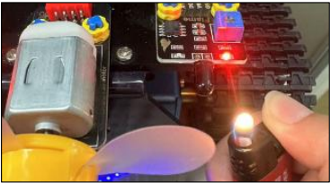
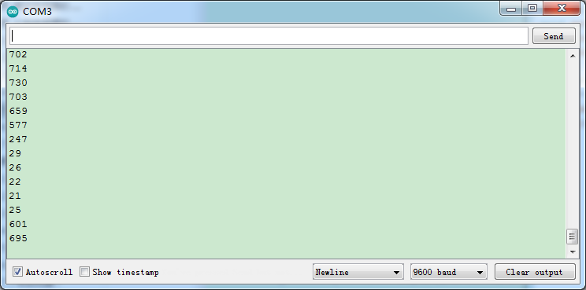
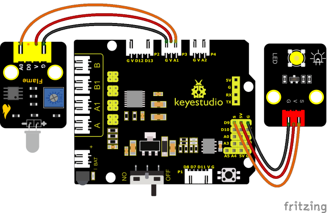
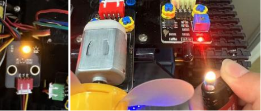

### プロジェクト 20: 炎センサー


#### **(1)説明：**

炎センサーはIR受光管を使用して炎を検出します。炎の明るさを高低レベルの信号に変換し、中央処理装置に入力して対応するプログラム処理を行います。アナログポートの電圧値は、近くに炎があるかどうかによって異なります。

炎がない場合、アナログポートは約0.3Vを読み取ります。炎がある場合、アナログポートは約1.0Vを読み取ります。炎が近いほど、電圧値は高くなります。火源の検出やスマートロボットの構築に使用できます。

炎センサーのプローブは-25℃から85℃の温度範囲しか耐えられないことに注意してください。

使用中は、炎センサーを火から安全な距離に保ち、損傷を避けてください。

#### **(2)パラメータ：**


- 動作電圧：3.3V-5V（DC）

- 電流：100mA

- 最大電力：0.5W

- 動作温度：-10°Cから+50°C

- センサーサイズ：31.6mmx23.7mm

- インターフェース：4pinから3PINインターフェース

- 出力信号：アナログ信号 A0、A1


#### **(3)接続図：**



炎センサーはA1とA2に接続されています。

超音波センサーと光電抵抗を取り外し、炎センサーとファンモジュールを追加すると、
消火ロボットが完成します。

<span style="color: rgb(255, 76, 65);">**注意：**</span>
1）この実験では火源を使用します。火災を防ぐため、可燃物から遠ざけてください。子供は大人の監督のもとで実験を行ってください。安全を確認できない場合は、実験を中止してください。
2）**炎センサーは耐火性ではありません。直接炎で燃やさないでください。**


#### **(4)テストコード：**

(<span style="color: rgb(255, 76, 65);">**注意：**</span> コードをアップロードする前にBluetoothモジュールを接続しないでください。コードのアップロードにもシリアル通信を使用するため、Bluetoothシリアル通信と競合が発生し、アップロードが失敗する可能性があります。)

```C
/*

Keyestudio Mini Tank Robot V3 (Popular Edition)

lesson 20.1

flame sensor

http://www.keyestudio.com

*/

int flame = A1; //炎ピンをアナログピンA1として定義
int val = 0; //デジタル変数を定義

void setup() 
{
	pinMode(flame, INPUT); //ブザーを入力ソースとして定義
    Serial.begin(9600); //ボーレートを9600に設定
}

void loop() 
{
	val = analogRead(flame); //炎センサーのアナログ値を読み取る
	Serial.println(val);//アナログ値を出力して印刷する
	delay(100); //100msの遅延
}
```

#### **(5)テスト結果：**

部品を接続し、コードを書き込み、シリアルモニターを開いてボーレートを9600に設定します。

炎センサーのシミュレーション値を確認できます。

炎が近いほど、シミュレーション値は小さくなります。

モジュールのポテンショメーターを調整して、D1を臨界点に維持します。センサーが炎を検出しない場合、D1はオフになりますが、センサーが炎を検出した場合、D1はオンになります。





<span style="color: rgb(255, 76, 65);">**注意：**</span>
火災を防ぐため、可燃物から遠ざけてください。子供は大人の監督のもとで実験を行ってください。安全を確認できない場合は、実験を中止してください。炎センサーは耐火性ではありません。直接炎で燃やさないでください。

#### **(6)応用練習：**

<span style="color: rgb(255, 76, 65);">**注意：**</span>
1）この実験では火源を使用します。火災を防ぐため、可燃物から遠ざけてください。子供は大人の監督のもとで実験を行ってください。安全を確認できない場合は、実験を中止してください。
2）炎センサーは耐火性ではありません。直接炎で燃やさないでください。

次に、LEDをピン9に接続し、炎センサーで制御します。以下のとおりです；



**テストコード**

(<span style="color: rgb(255, 76, 65);">**注意：**</span> コードをアップロードする前にBluetoothモジュールを接続しないでください。コードのアップロードにもシリアル通信を使用するため、Bluetoothシリアル通信と競合が発生し、アップロードが失敗する可能性があります。)

```C
/*

Keyestudio Mini Tank Robot V3 (Popular Edition)

lesson 20.2

flame sensor

http://www.keyestudio.com

*/

int flame = A1; //炎ピンをアナログピンA1として定義
int LED = 9; //LEDをデジタルポート9として定義
int val = 0; //デジタル変数を定義

void setup() 
{
    pinMode(flame, INPUT); //炎を入力ソースとして定義
    pinMode(LED, OUTPUT); //LEDを出力モードに設定
    Serial.begin(9600); //ボーレートを9600に設定
}

void loop() 
{
    val = analogRead(flame); //炎センサーのアナログ値を読み取る
    Serial.println(val);//アナログ値を出力して印刷する
    if (val < 300)  //アナログ値が300未満の場合、LEDがオンになる
    {
    	digitalWrite(LED, HIGH); //LEDをオンにする
    } 
    else 
    {
    	digitalWrite(LED, LOW); //LEDをオフにする
    }
    delay(50); //50msの遅延
}
```

#### **(8)テスト結果：**

ライターの炎を左の炎センサーに近づけることができます。炎センサーが炎を検出すると、LEDモジュールがアラームとして点灯します。



<span style="color: rgb(255, 76, 65);">**注意：**</span>
火災を防ぐため、可燃物から遠ざけてください。子供は大人の監督のもとで実験を行ってください。安全を確認できない場合は、実験を中止してください。炎センサーは耐火性ではありません。直接炎で燃やさないでください。