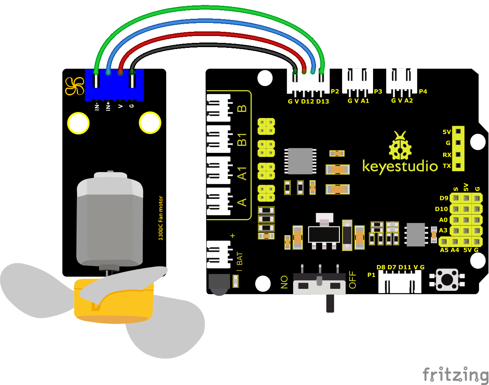
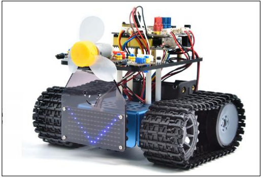
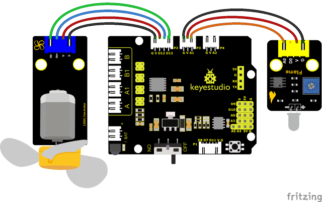
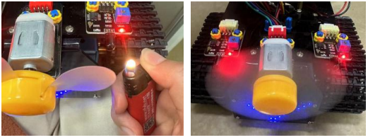

### Project 21: Ventilator

#### **(1)Beschrijving：**


Deze ventilatormodule maakt gebruik van een HR1124S motorbesturings-chip, een enkelvoudige H-brug driverchip met een laag-geleidingsweerstand PMOS en NMOS vermogenstransistoren. De lage geleidingsweerstand vermindert het energieverbruik, wat bijdraagt aan een langdurig veilig gebruik van de chip.

Bovendien zorgen de lage stand-bystroomverbruik en lage statische werkstroom ervoor dat deze module geschikt is voor speelgoed. We kunnen de rotatierichting en snelheid van de ventilator besturen door IN+ en IN- signalen en PWM-signalen uit te voeren.

#### **(2)Specificaties:**

Werkspanning: 5V

Stroom: 200MA

Maximaal vermogen: 2W

Bedrijfstemperatuur: -10 graden Celsius tot +50 graden Celsius

Afmetingen: 47.6MM \*23.8MM

#### **(3)Aansluitdiagram:**

De ventilatormodule heeft een grote stroom nodig voor aansturing; daarom installeren we een batterijhouder.



De pinnen GND, VCC, IN+ en IN- van de ventilatormodule zijn verbonden met pin G, V, D12 en D13 van het shield.

#### **(4)Testcode:**

(<span style="color: rgb(255, 76, 65);">**Opmerking:**</span> Sluit de Bluetooth-module niet aan voordat u de code uploadt, omdat het uploaden van de code ook gebruik maakt van seriële communicatie, en er kunnen conflicten optreden met de Bluetooth seriële communicatie, waardoor het uploaden kan mislukken.)

```C
/*
Keyestudio Mini Tank Robot V3 (Popular Edition)
lesson 21.1
130 motor
http://www.keyestudio.com
*/

int INA = 12;
int INB = 13;

void setup()
{
    pinMode(INA, OUTPUT);//Stel digitale poort INA in als uitvoer
    pinMode(INB, OUTPUT);//Stel digitale poort INB in als uitvoer
}

void loop() 
{
    //Stel de ventilator in om 3s tegen de klok in te draaien
    digitalWrite(INA, LOW);
    digitalWrite(INB, HIGH);
    delay(3000);
    //Stel de ventilator in om 1s te stoppen
    digitalWrite(INA, LOW);
    digitalWrite(INB, LOW);
    delay(1000);
    //Stel de ventilator in om 3s met de klok mee te draaien
    digitalWrite(INA, HIGH);
    digitalWrite(INB, LOW);
    delay(3000);
}
```

#### **(5)Testresultaten：**

Upload de code, sluit de componenten aan en steek de stroom in. De kleine ventilator draait 3000ms tegen de klok in, stopt 1000ms, en draait 300ms met de klok mee.



#### **(6)Uitgebreide oefening:**

We hebben het werkingsprincipe van de vlamsensor begrepen. Sluit vervolgens een vlamsensor aan in het circuit, zoals hieronder weergegeven. Bestuur dan de ventilator om het vuur met de vlamsensor uit te blazen.



(<span style="color: rgb(255, 76, 65);">**Opmerking:**</span> Sluit de Bluetooth-module niet aan voordat u de code uploadt, omdat het uploaden van de code ook gebruik maakt van seriële communicatie, en er kunnen conflicten optreden met de Bluetooth seriële communicatie, waardoor het uploaden kan mislukken.)

```C
/*
Keyestudio Mini Tank Robot V3 (Popular Edition)
lesson 21.2
130 motor
http://www.keyestudio.com
*/

int INA = 12;
int INB = 13;
int flame = A1; //Definieer de vlampin als analoge pin A1
int val = 0; //Definieer digitale variabelen

void setup() 
{
    pinMode(INA, OUTPUT);//Stel digitale poort INA in als uitvoer
    pinMode(INB, OUTPUT);//Stel digitale poort INB in als uitvoer
    pinMode(flame, INPUT); //Definieer de vlam als invoerbron
}

void loop() 
{
    val = analogRead(flame); //Lees de analoge waarde van de vlamsensor
    if (val <= 700)  //Wanneer de analoge waarde≤700 is, gaat de ventilator aan
    {
        //Zet de ventilator aan wanneer vlam wordt gedetecteerd
        digitalWrite(INA, LOW);
        digitalWrite(INB, HIGH);
    } 
    else 
    {
        //Anders stopt hij met werken
        digitalWrite(INA, LOW);
        digitalWrite(INB, LOW);
    }
}
```

Na het uploaden van de code, zet de aan/uit-schakelaar van het motoraandrijvingsshield aan. U kunt de ventilator inschakelen wanneer vlam wordt gedetecteerd door de linker vlamsensor van de robot.

