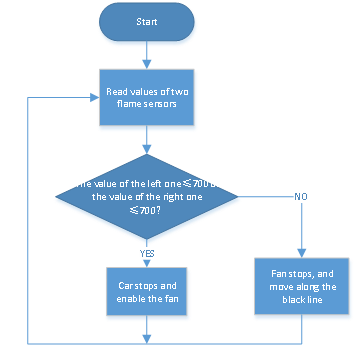
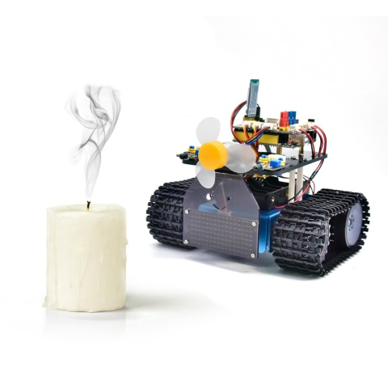

### Projekt 22: Feuerlöschpanzer


#### **(1) Beschreibung:**

Die Spurverfolgungsfunktion des intelligenten Panzers wurde im vorherigen Projekt erläutert. In diesem Projekt verwenden wir den Flammensensor, um einen feuerlöschenden Roboter zu bauen.

Wenn das Fahrzeug auf Flammen trifft, dreht sich der Motor des Lüfters, um das Feuer auszublasen. Natürlich müssen wir zuerst den Ultraschallsensor und die zwei Fotowiderstände durch ein Lüftermodul und Flammensensoren ersetzen.

Die spezifische Logik des spurverfolgenden Smart Cars ist in der folgenden Tabelle dargestellt:

| Linker Flammensensor | Rechter Flammensensor | Status                                                      |
| :------------------: | :-------------------: | :---------------------------------------------------------- |
|        ≤700          |         ≤700          | Auto stoppt, Lüfter beginnt zu drehen, um Flamme auszublasen |
|        ≥700          |         ≥700          | Auto stoppt, Lüfter beginnt zu drehen, um Flamme auszublasen |
|        ≥700          |         ≥700          | Auto stoppt, Lüfter beginnt zu drehen, um Flamme auszublasen |
|        ＞700         |         ＞700         | Lüfter stoppt, Auto bewegt sich                             |

<span style="color: rgb(255, 76, 65);">**Hinweis:**</span>
1) Dieses Experiment erfordert den Einsatz einer Feuerquelle. Bitte halten Sie es von brennbaren Gegenständen fern, um einen Brand zu vermeiden. Kinder sollten das Experiment unter Aufsicht von Erwachsenen durchführen. Wenn Sie nicht sicher sein können, dass Sie sicher sind, verzichten Sie bitte auf das Experiment.
2) Der Flammensensor ist nicht feuerfest, bitte verbrennen Sie ihn nicht direkt mit einer Flamme.
Wir können eine externe LED mit dem Flammensensor steuern. Die LED ist weiterhin mit D9 verbunden. Wenn Feuer erkannt wird, leuchtet die LED auf.

#### **(2) Flussdiagramm:**



#### **(3) Anschlussdiagramm:**


#### **(4) Testcode:**

(<span style="color: rgb(255, 76, 65);">**Hinweis:**</span> Schließen Sie das Bluetooth-Modul nicht an, bevor Sie den Code hochladen, da das Hochladen des Codes ebenfalls die serielle Kommunikation verwendet und es zu Konflikten mit der Bluetooth-seriellen Kommunikation kommen kann, was dazu führen kann, dass das Hochladen fehlschlägt.)

```C
/*
  Keyestudio Mini Tank Robot V3 (Popular Edition)
  lesson 22
  Fire extinguishing tank
  http://www.keyestudio.com
*/

int flame_L = A1; // Definiere die Flammen-Schnittstelle links als analogen Pin A1
int flame_R = A2; // Definiere die Flammen-Schnittstelle rechts als analogen Pin A2
// Verdrahtung des Spurverfolgungssensors
#define L_pin  11  // links
#define M_pin  7  // mitte
#define R_pin  8  // rechts
// Der Pin des Servos 130
int INA = 12;
int INB = 13;
#define ML_Ctrl 4  // Definiere den Richtungssteuerungspin des linken Motors
#define ML_PWM 6   // Definiere den PWM-Steuerungspin des linken Motors
#define MR_Ctrl 2  // Definiere den Richtungssteuerungspin des rechten Motors
#define MR_PWM 5   // Definiere den PWM-Steuerungspin des rechten Motors
int L_val, M_val, R_val, flame_valL, flame_valR;

void setup()
{
  Serial.begin(9600);
  // Setze alle Pins des Spurverfolgungssensors als Eingangsmodus
  pinMode(L_pin, INPUT);
  pinMode(M_pin, INPUT);
  pinMode(R_pin, INPUT);
  // Definiere die Flamme als EINGANG
  pinMode(flame_L, INPUT);
  pinMode(flame_R, INPUT);
  // Definiere den Motor als AUSGANG
  pinMode(ML_Ctrl, OUTPUT);
  pinMode(ML_PWM, OUTPUT);
  pinMode(MR_Ctrl, OUTPUT);
  pinMode(MR_PWM, OUTPUT);
  pinMode(INA, OUTPUT);// Setze digitalen Port INA als AUSGANG
  pinMode(INB, OUTPUT);// Setze digitalen Port INB als AUSGANG
}

void loop () 
{
  // Lese den Analogwert der Flammensensoren
  flame_valL = analogRead(flame_L);
  flame_valR = analogRead(flame_R);
  Serial.print(flame_valL);
  Serial.print("  ");
  Serial.print(flame_valR);
  Serial.println("  ");
//  delay(500);
  if (flame_valL <= 700 || flame_valR <= 700) 
  {
    Car_Stop();
    fan_begin();
  } 
  else 
  {
    fan_stop();
    L_val = digitalRead(L_pin); // Lese den Wert des linken Sensors
    M_val = digitalRead(M_pin); // Lese den Wert des mittleren Sensors
    R_val = digitalRead(R_pin); // Lese den Wert des rechten Sensors
    
    if (M_val == 1)  // Der mittlere erkennt schwarze Linien
    {
      if (L_val == 1 && R_val == 0)  // Wenn links eine schwarze Linie erkannt wird, aber nicht rechts, nach links abbiegen
      {
        Car_left();
      }
      else if (L_val == 0 && R_val == 1)  // Wenn rechts eine schwarze Linie erkannt wird, aber nicht links, nach rechts abbiegen
      {
        Car_right();
      }
      else  // andernfalls vorwärts fahren
      {
        Car_front();
      }
    }
    else  // Der mittlere erkennt keine schwarzen Linien
    {
      if (L_val == 1 && R_val == 0)  // Wenn links eine schwarze Linie erkannt wird, aber nicht rechts, nach links abbiegen
      {
        Car_left();
      }
      else if (L_val == 0 && R_val == 1)  // Wenn rechts eine schwarze Linie erkannt wird, aber nicht links, nach rechts abbiegen
      {
        Car_right();
      }
      else  // andernfalls stoppen
      {
        Car_Stop();
      }
    }
  }
}

void fan_stop() 
{
  // Drehung stoppen
  digitalWrite(INA, LOW);
  digitalWrite(INB, LOW);
}

void fan_begin() 
{
  // Lüfter dreht sich
  digitalWrite(INA, LOW);
  digitalWrite(INB, HIGH);
}

void Car_front()
{
  digitalWrite(MR_Ctrl, HIGH);
  analogWrite(MR_PWM, 150);
  digitalWrite(ML_Ctrl, HIGH);
  analogWrite(ML_PWM, 150);
}

void Car_back()
{
  digitalWrite(MR_Ctrl, LOW);
  analogWrite(MR_PWM, 100);
  digitalWrite(ML_Ctrl, LOW);
  analogWrite(ML_PWM, 100);
}

void Car_left()
{
  digitalWrite(MR_Ctrl, HIGH);
  analogWrite(MR_PWM, 150);
  digitalWrite(ML_Ctrl, LOW);
  analogWrite(ML_PWM, 100);
}

void Car_right()
{
  digitalWrite(MR_Ctrl, LOW);
  analogWrite(MR_PWM, 100);
  digitalWrite(ML_Ctrl, HIGH);
  analogWrite(ML_PWM, 150);
}

void Car_Stop()
{
  digitalWrite(MR_Ctrl, LOW);
  analogWrite(MR_PWM, 100);
  digitalWrite(ML_Ctrl, LOW);
  analogWrite(ML_PWM, 100);
  
  digitalWrite(MR_Ctrl, LOW);
  analogWrite(MR_PWM, 0);
  digitalWrite(ML_Ctrl, LOW);
  analogWrite(ML_PWM, 0);
}
```

#### **(5) Testergebnis:**

Nach dem erfolgreichen Hochladen des Testcodes und dem Einschalten löscht das Smart Car das Feuer, wenn es eine Flamme erkennt, und fährt weiter entlang der schwarzen Linie.



<span style="color: rgb(255, 76, 65);">**Hinweis:**</span>
Bitte halten Sie es von brennbaren Gegenständen fern, um einen Brand zu vermeiden. Kinder sollten das Experiment unter Aufsicht von Erwachsenen durchführen. Wenn Sie nicht sicher sein können, dass Sie sicher sind, verzichten Sie bitte auf das Experiment. Der Flammensensor ist nicht feuerfest, bitte verbrennen Sie ihn nicht direkt mit einer Flamme.