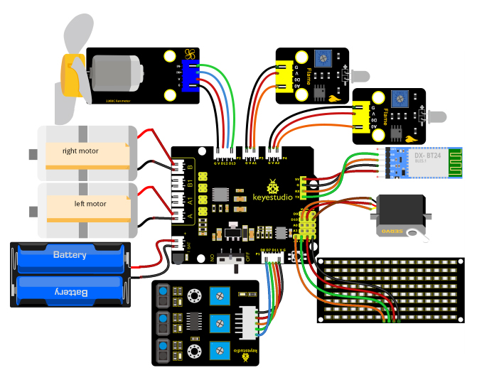
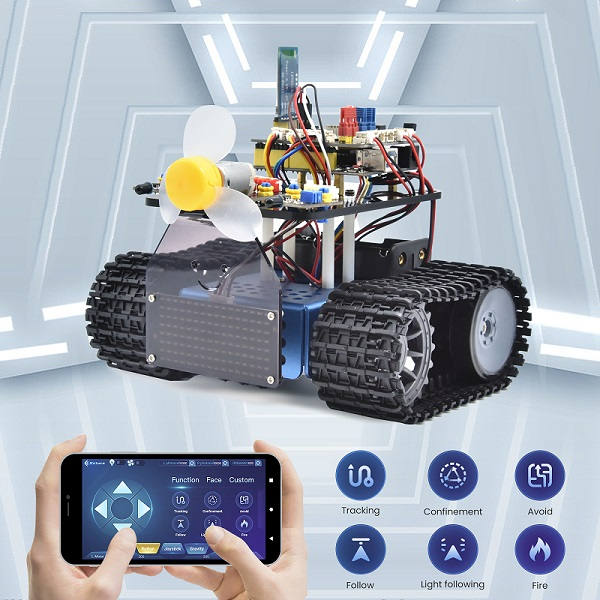

### Projekt 23: Feuerlösch-Roboter Mehrere Funktionen


#### **(1)Beschreibung:**

Der Smart Car hat in jedem vorherigen Projekt eine einzelne Funktion ausgeführt.

Kann er mehrere Funktionen gleichzeitig anzeigen? Ja.

In diesem letzten großen Projekt beabsichtigen wir, einen vollständigen Code zu verwenden, um den Smart Car zu steuern und alle in den vorherigen Projekten erwähnten Funktionen zu demonstrieren. Wir verwenden die Tasten der Bluetooth-APP, um automatisch zwischen verschiedenen Funktionen umzuschalten, ganz einfach und bequem.


#### **(2)Flussdiagramm:**

<span style="color: rgb(255, 76, 65);">**Bitte beachten Sie Projekt 16 zur Installation und Konfiguration der Bluetooth-APP**</span>


#### **(3)Anschlussdiagramm:**



1\. GND, VCC, SDA und SCL des 8x16-Boards sind mit G (GND), + (VCC), A4 und A5 des Erweiterungsboards verbunden.

2\. VCC, IN+, IN- und Gnd des Lüftermoduls sind mit 5V (V), 12 (S), 13 (S) und Gnd (G) verbunden.

3\. Das braune Kabel, rote Kabel und orangefarbene Kabel des Servos sind mit Gnd (G), 5v (V) und D10 verbunden.

4\. RXD, TXD, GND und VCC des BT-Moduls sind mit TX, RX, G (GND) und 5V (VCC) verbunden. STATE und BRK müssen nicht angeschlossen werden.

5\. Die Pins „G", „V" und A des linken Flammensensors sind jeweils mit G (GND), V (VCC) und A1 verbunden; Der rechte Flammensensor ist jeweils mit G (GND), V (VCC) und A2 verbunden.

6\. Die äußeren Ports des Linienverfolgungssensors sind 11, 7 und 8.

#### **(4)Testcode:**

(<span style="color: rgb(255, 76, 65);">**Hinweis:**</span> Schließen Sie das Bluetooth-Modul nicht an, bevor Sie den Code hochladen, da das Hochladen des Codes ebenfalls die serielle Kommunikation verwendet und es zu Konflikten mit der Bluetooth-seriellen Kommunikation kommen kann, was zum Fehlschlagen des Uploads führen kann.)

```C
/*
  Keyestudio Mini Tank Robot V3 (Popular Edition)
  lesson 23
  Fire Extinguishing Robot Multiple Functions
  http://www.keyestudio.com
*/
#include <IRremote.h>
IRrecv irrecv(3);  //
decode_results results;
long ir_rec;  // wird verwendet, um den IR-Wert zu speichern

/***********/
#define USE_FAN_FUNCTION   1

// Array, wird verwendet, um Bilddaten zu speichern, kann selbst berechnet oder mit dem Modulus-Tool ermittelt werden
unsigned char start01[] = {0x01, 0x02, 0x04, 0x08, 0x10, 0x20, 0x40, 0x80, 0x80, 0x40, 0x20, 0x10, 0x08, 0x04, 0x02, 0x01};
unsigned char STOP01[] = {0x2E, 0x2A, 0x3A, 0x00, 0x02, 0x3E, 0x02, 0x00, 0x3E, 0x22, 0x3E, 0x00, 0x3E, 0x0A, 0x0E, 0x00};
unsigned char front[] = {0x00, 0x00, 0x00, 0x00, 0x00, 0x24, 0x12, 0x09, 0x12, 0x24, 0x00, 0x00, 0x00, 0x00, 0x00, 0x00};
unsigned char back[] = {0x00, 0x00, 0x00, 0x00, 0x00, 0x24, 0x48, 0x90, 0x48, 0x24, 0x00, 0x00, 0x00, 0x00, 0x00, 0x00};
unsigned char left[] = {0x00, 0x00, 0x00, 0x00, 0x00, 0x00, 0x44, 0x28, 0x10, 0x44, 0x28, 0x10, 0x44, 0x28, 0x10, 0x00};
unsigned char right[] = {0x00, 0x10, 0x28, 0x44, 0x10, 0x28, 0x44, 0x10, 0x28, 0x44, 0x00, 0x00, 0x00, 0x00, 0x00, 0x00};

unsigned char Smile[] = {0x00, 0x00, 0x1c, 0x02, 0x02, 0x02, 0x5c, 0x40, 0x40, 0x5c, 0x02, 0x02, 0x02, 0x1c, 0x00, 0x00};
unsigned char Disgust[] = {0x00, 0x00, 0x02, 0x02, 0x02, 0x12, 0x08, 0x04, 0x08, 0x12, 0x22, 0x02, 0x02, 0x00, 0x00, 0x00};
unsigned char Happy[] = {0x02, 0x02, 0x02, 0x02, 0x08, 0x18, 0x28, 0x48, 0x28, 0x18, 0x08, 0x02, 0x02, 0x02, 0x02, 0x00};
unsigned char Squint[] = {0x00, 0x00, 0x00, 0x41, 0x22, 0x14, 0x48, 0x40, 0x40, 0x48, 0x14, 0x22, 0x41, 0x00, 0x00, 0x00};
unsigned char Despise[] = {0x00, 0x00, 0x06, 0x04, 0x04, 0x04, 0x24, 0x20, 0x20, 0x26, 0x04, 0x04, 0x04, 0x04, 0x00, 0x00};
unsigned char Heart[] = {0x00, 0x00, 0x0C, 0x1E, 0x3F, 0x7F, 0xFE, 0xFC, 0xFE, 0x7F, 0x3F, 0x1E, 0x0C, 0x00, 0x00, 0x00};

unsigned char clear[] = {0x00, 0x00, 0x00, 0x00, 0x00, 0x00, 0x00, 0x00, 0x00, 0x00, 0x00, 0x00, 0x00, 0x00, 0x00, 0x00};

#define SCL_Pin  A5  // Taktpin auf A5 setzen
#define SDA_Pin  A4  // Datenpin auf A4 setzen

#define ML_Ctrl 4  // Richtungssteuerungspin des linken Motors als 4 definieren
#define ML_PWM 6   // PWM-Steuerungspin des linken Motors definieren
#define MR_Ctrl 2  // Richtungssteuerungspin des rechten Sensors definieren
#define MR_PWM 5   // PWM-Steuerungspin des rechten Motors definieren
char ble_val;      // wird verwendet, um den Bluetooth-Wert zu speichern
byte speeds_L = 200; // die Anfangsgeschwindigkeit des linken Motors beträgt 200
byte speeds_R = 200; // die Anfangsgeschwindigkeit des rechten Motors beträgt 200
String speeds_l, speeds_r; // PWM-Zeichen empfangen und in PWM-Wert umwandeln

// Linienverfolgungssensor verdrahten
#define L_pin  11  // links
#define M_pin  7  // mitte
#define R_pin  8  // rechts
int L_val, M_val, R_val;

#if USE_FAN_FUNCTION  /****Lüfter verwenden*******/
int flame_L = A1; // den analogen Port des linken Flammensensors auf A1 definieren
int flame_R = A2; // den analogen Port des rechten Flammensensors auf A2 definieren
int flame_valL, flame_valR;

// der Pin des 130-Motors
int INA = 12;
int INB = 13;

#else /****Ultraschallsensor verwenden*******/
#define servoPin    10  // Servo-Pin
#define light_L_Pin A1   // den Pin des linken Fotowiderstands definieren
#define light_R_Pin A2   // den Pin des rechten Fotowiderstands definieren
int left_light;
int right_light;

#define Trig 12
#define Echo 13
float distance;// Distanzwerte des Ultraschallsensors für die Verfolgung speichern

// Distanzwerte des Ultraschallsensors für die Hindernisumgehung speichern
int a;
int a1;
int a2;

#endif

bool flag;  // Flag-Variable, wird verwendet, um einen Modus zu betreten und zu verlassen

void setup() 
{
  Serial.begin(9600);
  irrecv.enableIRIn();  // Bibliothek der IR-Fernbedienung initialisieren

  pinMode(SCL_Pin, OUTPUT);
  pinMode(SDA_Pin, OUTPUT);
  
  pinMode(ML_Ctrl, OUTPUT);
  pinMode(ML_PWM, OUTPUT);
  pinMode(MR_Ctrl, OUTPUT);
  pinMode(MR_PWM, OUTPUT);

  pinMode(L_pin, INPUT); // Pins der Sensoren als INPUT definieren
  pinMode(M_pin, INPUT);
  pinMode(R_pin, INPUT);

  matrix_display(clear);    // Bildschirm löschen
  matrix_display(start01);  // Start anzeigen

#if USE_FAN_FUNCTION/****den Lüfter verwenden*******/
  pinMode(INA, OUTPUT);// INA auf OUTPUT setzen
  pinMode(INB, OUTPUT);// INB auf OUTPUT setzen

  // Eingänge des Flammensensors definieren
  pinMode(flame_L, INPUT);
  pinMode(flame_R, INPUT);
#else/****den Ultraschallsensor verwenden*******/
  pinMode(servoPin, OUTPUT);
  pinMode(light_L_Pin, INPUT);
  pinMode(light_R_Pin, INPUT);

  pinMode(Trig, OUTPUT);
  pinMode(Echo, INPUT);
  procedure(90); // den Winkel des Servos auf 90° setzen
#endif
}

void loop() 
{
  if (Serial.available()) // wenn Daten im seriellen Puffer vorhanden sind
  {
    ble_val = Serial.read();
    Serial.println(ble_val);
    switch (ble_val) 
    {
      case 'F': Car_front(); break; // Befehl zum Vorwärtsfahren

      case 'B': Car_back(); break;  // Befehl zum Rückwärtsfahren

      case 'L': Car_left(); break;  // Befehl zum Linksdrehen

      case 'R': Car_right(); break; // Befehl zum Rechtsdrehen

      case 'S': Car_Stop();  break; // Stopp

      case 'e': Tracking();  break; // Linienverfolgungsmodus aktivieren

      case 'f': Confinement(); break;  // Eingrenzungsmodus aktivieren

#if USE_FAN_FUNCTION/****Lüfter verwenden*******/
      case 'j': Fire(); break;  // Feuerlöschmodus aktivieren

      case 'c': fan_begin(); break;  // Lüfter einschalten

      case 'd': fan_stop();  break;  // Lüfter ausschalten

#else/****den Ultraschallsensor verwenden*******/
      case 'g': Avoid(); break;  // Hindernisumgehungsmodus aktivieren

      case 'h': Follow(); break;  // Verfolgungsmodus aktivieren

      case 'i': Light_following();  break;  // Lichtverfolgungsmodus aktivieren
#endif
      case 'u': 
        speeds_l = Serial.readStringUntil('#'); 
        speeds_L = String(speeds_l).toInt(); 
        break; // beginnt mit dem Empfang von u, endet mit dem Zeichen # und konvertiert in eine ganze Zahl

      case 'v': 
        speeds_r = Serial.readStringUntil('#');
        speeds_R = String(speeds_r).toInt(); 
        break; // beginnt mit dem Empfang von u, endet mit dem Zeichen # und konvertiert in eine ganze Zahl

      case 'k': matrix_display(Smile);    break;  // "Lächeln"-Gesicht anzeigen
      case 'l': matrix_display(Disgust);  break;  // "Ekel"-Gesicht anzeigen
      case 'm': matrix_display(Happy);    break;  // "Fröhlich"-Gesicht anzeigen
      case 'n': matrix_display(Squint);   break;  // "Traurig"-Gesicht anzeigen
      case 'o': matrix_display(Despise);  break;  // "Verachtung"-Gesicht anzeigen
      case 'p': matrix_display(Heart);    break;  // Herzbild anzeigen
      case 'z': matrix_display(clear);    break;  // Bilder löschen

      default: break;
    }
  }

#if (USE_FAN_FUNCTION != 1)/****Funktion ohne Lüfter*******/
  // Die folgenden drei Signale werden hauptsächlich für zyklisches Drucken verwendet
  if (ble_val == 'x') 
  {
    distance = checkdistance(); Serial.println(distance);
    delay(50);
  } 
  else if (ble_val == 'w') 
  {
    left_light = analogRead(light_L_Pin);
    Serial.println(left_light);
    delay(50);
  } 
  else if (ble_val == 'y') 
  {
    right_light = analogRead(light_R_Pin);
    Serial.println(right_light);
    delay(50);
  }
#endif

  if (irrecv.decode(&results))  // Infrarot-Fernbedienungswert empfangen
  {
    ir_rec = results.value;
    Serial.println(ir_rec, HEX);
    switch (ir_rec) 
    {
      case 0xFF629D: Car_front();   break;   // vorwärts fahren
      case 0xFFA857: Car_back();    break;   // rückwärts fahren
      case 0xFF22DD: Car_left();    break;   // nach links drehen
      case 0xFFC23D: Car_right();   break;   // nach rechts drehen
      case 0xFF02FD: Car_Stop();    break;   // stopp
      default: break;
    }
    irrecv.resume();
  }
}

#if (USE_FAN_FUNCTION != 1)/****den Ultraschallsensor verwenden*******/

// Ultraschallsensor steuern
float checkdistance() 
{
  float distance;
  digitalWrite(Trig, LOW);
  delayMicroseconds(2);
  digitalWrite(Trig, HIGH);
  delayMicroseconds(10);
  digitalWrite(Trig, LOW);
  distance = pulseIn(Echo, HIGH) / 58.20;  //
  delay(10);
  return distance;
}


// Funktion zur Steuerung des Servos
void procedure(int myangle) 
{
  int pulsewidth;
  pulsewidth = map(myangle, 0, 180, 500, 2000);  // Pulsbreitenwert berechnen, der den Mapping-Wert von 500 bis 2500 darstellt. In Anbetracht des Einflusses der Infrarotbibliothek wird hier 500~2000 verwendet.
  for (int i = 0; i < 5; i++) 
  {
    digitalWrite(servoPin, HIGH);
    delayMicroseconds(pulsewidth);   // Die Dauer des hohen Pegels entspricht der Pulsbreite
    digitalWrite(servoPin, LOW);
    delay((20 - pulsewidth / 1000));  // Die Periode beträgt 20ms, daher dauert der niedrige Pegel die verbleibende Zeit
  }
}

/*****************Hindernisumgehung******************/
void Avoid()
{
  flag = 0;
  while (flag == 0)
  {
    a = checkdistance();  // der vordere Abstand wird auf a gesetzt
    if (a < 20) // Wenn der Abstand vorne weniger als 20 cm beträgt
    {
      Car_Stop();  // stopp
      delay(500); // 500 ms verzögern
      procedure(180);  // Servo dreht nach links
      delay(500); // 500 ms verzögern
      a1 = checkdistance();  // der linke Abstand wird auf a1 gesetzt
      delay(100); // Wert lesen

      procedure(0); // Servo dreht nach rechts
      delay(500); // 500 ms verzögern
      a2 = checkdistance(); // der rechte Abstand wird auf a2 gesetzt
      delay(100); // Wert lesen

      procedure(90);  // zurück auf 90°
      delay(500);
      if (a1 > a2)  // Wenn der Abstand links größer ist als der Abstand rechts
      {
        Car_left();  // der Roboter dreht nach links
        delay(700);  // 700 ms nach links drehen
      } 
      else 
      {
        Car_right(); // nach rechts drehen
        delay(700);
      }
    }
    else  // wenn der vordere Abstand ≥20 cm beträgt, fährt der Roboter vorwärts
    {
      Car_front(); // vorwärts fahren
    }
    // Bluetooth-Wert empfangen, um die Schleife zu beenden
    if (Serial.available())
    {
      ble_val = Serial.read();
      if (ble_val == 'S')  // S empfangen
      {
        flag = 1;  // Flag auf 1 setzen, um die Schleife zu beenden
        Car_Stop();
      }
    }
  }
}

/*******************Verfolgung***************/
void Follow() 
{
  flag = 0;
  while (flag == 0) 
  {
    distance = checkdistance();  // den Abstandswert auf distance setzen
    if (distance >= 20 && distance <= 60) // vorwärts fahren
    {
      Car_front();
    }
    else if (distance > 10 && distance < 20)  // stopp
    {
      Car_Stop();
    }
    else if (distance <= 10)  // rückwärts fahren
    {
      Car_back();
    }
    else  // stopp
    {
      Car_Stop();
    }
    if (Serial.available())
    {
      ble_val = Serial.read();
      if (ble_val == 'S')
      {
        flag = 1;  // Schleife beenden
        Car_Stop();
      }
    }
  }
}

/****************Lichtverfolgung******************/
void Light_following() 
{
  flag = 0;
  while (flag == 0) 
  {
    left_light = analogRead(light_L_Pin);
    right_light = analogRead(light_R_Pin);
    if (left_light > 650 && right_light > 650) // vorwärts fahren
    {
      Car_front();
    }
    else if (left_light > 650 && right_light <= 650)  // nach links drehen
    {
      Car_left();
    }
    else if (left_light <= 650 && right_light > 650) // nach rechts drehen
    {
      Car_right();
    }
    else  // andernfalls stopp
    {
      Car_Stop();
    }
    if (Serial.available())
    {
      ble_val = Serial.read();
      if (ble_val == 'S') 
      {
        flag = 1;
        Car_Stop();
      }
    }
  }
}

#else/****den Lüfter verwenden*******/
/***************Lüfter einschalten*****************/
void fan_begin() 
{
  digitalWrite(INA, LOW);
  digitalWrite(INB, HIGH);
}

/***************Lüfter stoppen*****************/
void fan_stop() 
{
  digitalWrite(INA, LOW);
  digitalWrite(INB, LOW);
}

/***************Feuer löschen****************/
void Fire() 
{
  flag = 0;
  while (flag == 0) 
  {
    // Analogwert des Flammensensors lesen
    flame_valL = analogRead(flame_L);
    flame_valR = analogRead(flame_R);
    if (flame_valL <= 700 || flame_valR <= 700) 
    {
      Car_Stop();
      fan_begin();
    } 
    else 
    {
      fan_stop();
      L_val = digitalRead(L_pin); // Wert des linken Sensors lesen
      M_val = digitalRead(M_pin); // Wert des mittleren Sensors lesen
      R_val = digitalRead(R_pin); // Wert des rechten Sensors lesen
```

```     if (M_val == 1)  //die mittlere erkennt schwarze Linien
      {
        if (L_val == 1 && R_val == 0)  //Wenn links eine schwarze Linie erkannt wird, aber nicht rechts, nach links drehen
        {
          Car_left();
        }
        else if (L_val == 0 && R_val == 1)  //Wenn rechts eine schwarze Linie erkannt wird, aber nicht links, nach rechts drehen
        {
          Car_right();
        }
        else //vorwärts fahren
        { 
          Car_front();
        }
      }
      else //die mittlere erkennt keine schwarzen Linien
      { 
        if (L_val == 1 && R_val == 0) //Wenn links eine schwarze Linie erkannt wird, aber nicht rechts, nach links drehen
        { 
          Car_left();
        }
        else if (L_val == 0 && R_val == 1) //Wenn rechts eine schwarze Linie erkannt wird, aber nicht links, nach rechts drehen
        { 
          Car_right();
        }
        else //ansonsten anhalten
        { 
          Car_Stop();
        }
      }
    }
    if (Serial.available())
    {
      ble_val = Serial.read();
      if (ble_val == 'S') 
      {
        flag = 1;
        Car_Stop();
      }
    }
  }
}

#endif

/***************Linienverfolger*****************/
void Tracking() 
{
  flag = 0;
  while (flag == 0) 
  {
    L_val = digitalRead(L_pin); //Wert des linken Sensors lesen
    M_val = digitalRead(M_pin); //Wert des mittleren Sensors lesen
    R_val = digitalRead(R_pin); //Wert des rechten Sensors lesen
    if (M_val == 1)  //die mittlere erkennt schwarze Linien
    {
      if (L_val == 1 && R_val == 0) //Wenn links eine schwarze Linie erkannt wird, aber nicht rechts, nach links drehen
      {
        Car_left();
      }
      else if (L_val == 0 && R_val == 1) //Wenn rechts eine schwarze Linie erkannt wird, aber nicht links, nach rechts drehen
      { 
        Car_right();
      }
      else //vorwärts fahren
      { 
        Car_front();
      }
    }
    else //der mittlere Sensor erkennt keine schwarzen Linien
    { 
      if (L_val == 1 && R_val == 0) //Wenn links eine schwarze Linie erkannt wird, aber nicht rechts, nach links drehen
      { 
        Car_left();
      }
      else if (L_val == 0 && R_val == 1) //Wenn rechts eine schwarze Linie erkannt wird, aber nicht links, nach rechts drehen
      { 
        Car_right();
      }
      else //ansonsten anhalten
      { 
        Car_Stop();
      }
    }
    if (Serial.available())
    {
      ble_val = Serial.read();
      if (ble_val == 'S') 
      {
        flag = 1;
        Car_Stop();
      }
    }
  }
}

/***************Eingrenzung*****************/
void Confinement() 
{
  flag = 0;
  while (flag == 0) 
  {
    L_val = digitalRead(L_pin); //Wert des linken Sensors lesen
    M_val = digitalRead(M_pin); //Wert des mittleren Sensors lesen
    R_val = digitalRead(R_pin); //Wert des rechten Sensors lesen
    if ( L_val == 0 && M_val == 0 && R_val == 0 ) //Vorwärts fahren, wenn keine schwarzen Linien erkannt werden   
    {    
        Car_front();
    }
    else 
    { 
      Car_back();
      delay(700);
      Car_left();
      delay(800);
    }
    if (Serial.available())
    {
      ble_val = Serial.read();
      if (ble_val == 'S') 
      {
        flag = 1;
        Car_Stop();
      }
    }
  }
}


/***************Punktmatrix******************/
//Diese Funktion wird für die Anzeige der Punktmatrix verwendet 
void matrix_display(unsigned char matrix_value[])
{
  IIC_start();  //Funktion zum Starten der Datenübertragung verwenden
  IIC_send(0xc0);  //Adresse auswählen
  for (int i = 0; i < 16; i++) //Bilddaten haben 16 Zeichen
  {
    IIC_send(matrix_value[i]); //Daten zur Übertragung von Bildern
  }
  IIC_end();   //Datenübertragung der Bilder beenden
  IIC_start();
  IIC_send(0x8A);  //Anzeigesteuerung und Impulsbreite 4/16 auswählen
  IIC_end();
}

//Bedingung, unter der die Datenübertragung beginnt
void IIC_start()
{
  digitalWrite(SDA_Pin, HIGH);
  digitalWrite(SCL_Pin, HIGH);
  delayMicroseconds(3);
  digitalWrite(SDA_Pin, LOW);
  delayMicroseconds(3);
  digitalWrite(SCL_Pin, LOW);
}

//Daten übertragen
void IIC_send(unsigned char send_data)
{
  for (byte mask = 0x01; mask != 0; mask <<= 1) //jedes Zeichen hat 8 Stellen, die einzeln geprüft werden
  {
    if (send_data & mask)  //hohe oder niedrige Pegel entsprechend jedem Bit (0 oder 1) setzen
    {
      digitalWrite(SDA_Pin, HIGH);
    } 
    else 
    {
      digitalWrite(SDA_Pin, LOW);
    }
    delayMicroseconds(3);
    digitalWrite(SCL_Pin, HIGH); //Taktpin SCL_Pin hochziehen, um die Datenübertragung zu beenden
    delayMicroseconds(3);
    digitalWrite(SCL_Pin, LOW); //Taktpin SCL_Pin runterziehen, um SDA-Signale zu ändern 
  }
}

//Zeichen, dass die Datenübertragung endet
void IIC_end()
{
  digitalWrite(SCL_Pin, LOW);
  digitalWrite(SDA_Pin, LOW);
  delayMicroseconds(3);
  digitalWrite(SCL_Pin, HIGH);
  delayMicroseconds(3);
  digitalWrite(SDA_Pin, HIGH);
  delayMicroseconds(3);
}

/***************Motor läuft****************/
void Car_back() 
{
  digitalWrite(MR_Ctrl, LOW);
  analogWrite(MR_PWM, speeds_R);
  digitalWrite(ML_Ctrl, LOW);
  analogWrite(ML_PWM, speeds_L);
  matrix_display(back);  //Bild für Rückwärtsfahren anzeigen
}

void Car_front() 
{
  digitalWrite(MR_Ctrl, HIGH);
  analogWrite(MR_PWM, 255 - speeds_R);
  digitalWrite(ML_Ctrl, HIGH);
  analogWrite(ML_PWM, 255 - speeds_L);
  matrix_display(front);  //Bild für Vorwärtsfahren anzeigen
}

void Car_left() 
{
  digitalWrite(MR_Ctrl, HIGH);
  analogWrite(MR_PWM, 255 - speeds_R);
  digitalWrite(ML_Ctrl, LOW);
  analogWrite(ML_PWM, speeds_L);
  matrix_display(left);  //Bild für Linksabbiegen anzeigen
}

void Car_right() 
{
  digitalWrite(MR_Ctrl, LOW);
  analogWrite(MR_PWM, speeds_R);
  digitalWrite(ML_Ctrl, HIGH);
  analogWrite(ML_PWM, 255 - speeds_L);
  matrix_display(right);  //Bild für Rechtsabbiegen anzeigen
}

void Car_Stop() 
{
  digitalWrite(MR_Ctrl, LOW);
  analogWrite(MR_PWM, 0);
  digitalWrite(ML_Ctrl, LOW);
  analogWrite(ML_PWM, 0);
  matrix_display(STOP01);  //Stopbild anzeigen
}
```

#### (5) Testergebnis

Vor dem Hochladen des Programmcodes muss das Bluetooth-Modul entfernt werden, da sonst das Hochladen des Codes fehlschlägt.

Nachdem der Code erfolgreich hochgeladen wurde, aktivieren Sie die Ortungsdienste auf Ihrem Gerät und verbinden Sie dann das Bluetooth-Modul.

Sobald das Bluetooth-Modul eingesteckt und eingeschaltet ist und die mobile APP erfolgreich mit dem Bluetooth verbunden ist, können wir die mobile APP verwenden, um den Kettenroboter zu steuern.

Sie können den Roboter auch mit der Fernbedienung steuern.

