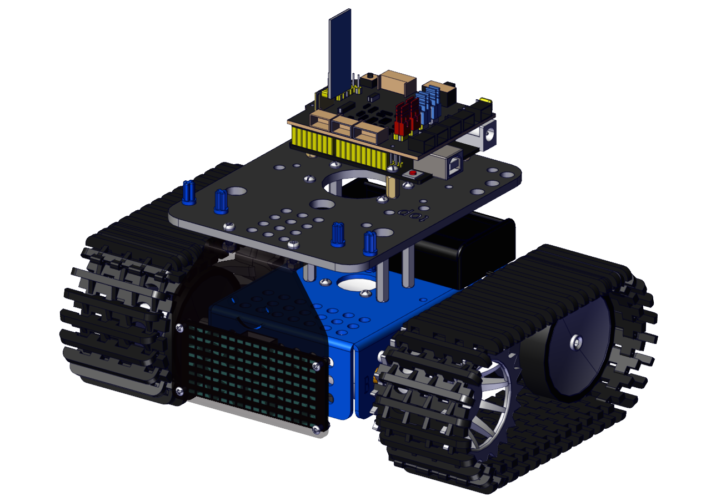
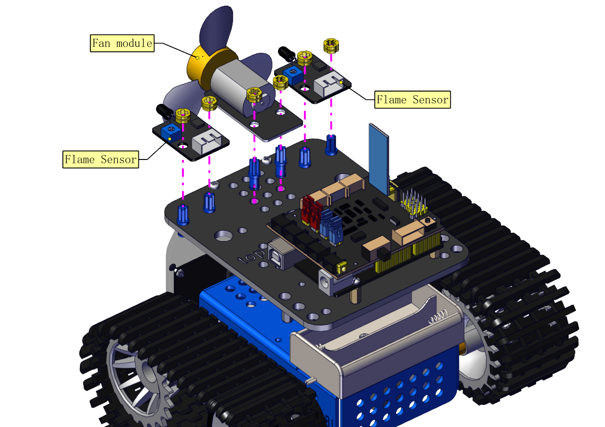
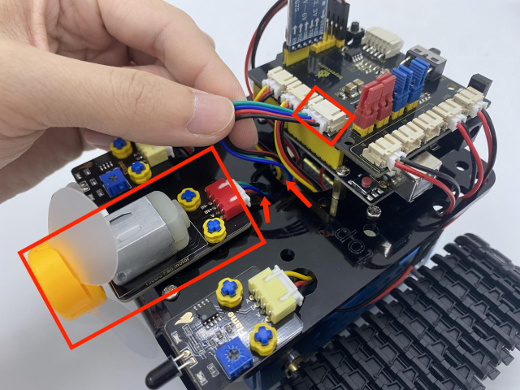

### Ensamblar el Robot Extintor de Incendios

Retira el sensor ultrasónico y los dos fotorresistores.

Coloca un módulo de ventilador y dos sensores de llama.

Puedes instalar el módulo de ventilador más lejos si el módulo de ventilador y los sensores de llama interfieren entre sí.

**Conexiones**

Conecta los dos sensores de llama.

| Flame Sensor | Keyestudio 8833 Board |
| :----------: | :-------------------: |
|      G       |           G           |
|      V       |           V           |
|      A       |          A1           |

| Flame Sensor | Keyestudio 8833 Board |
| :----------: | :-------------------: |
|      G       |           G           |
|      V       |           V           |
|      A       |          A2           |

Conecta el módulo de ventilador.

| DC130 Motor | Keyestudio 8833 Board |
| :---------: | :-------------------: |
|      G      |           G           |
|      V      |           V           |
|     IN+     |          D12          |
|     IN-     |          D13          |

 **Utilizamos una batería de litio 18650 con polo positivo en punta, cuya potencia y capacidad no son requisitos específicos.**

