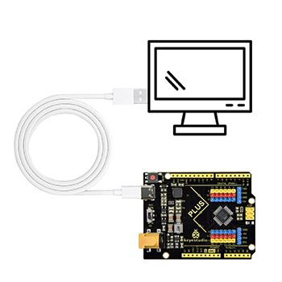
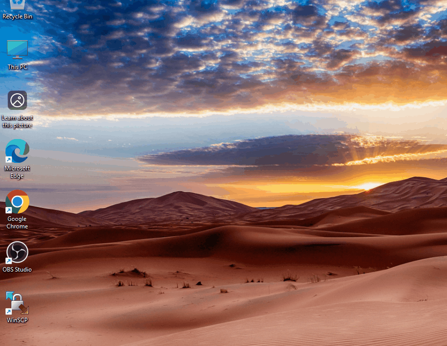
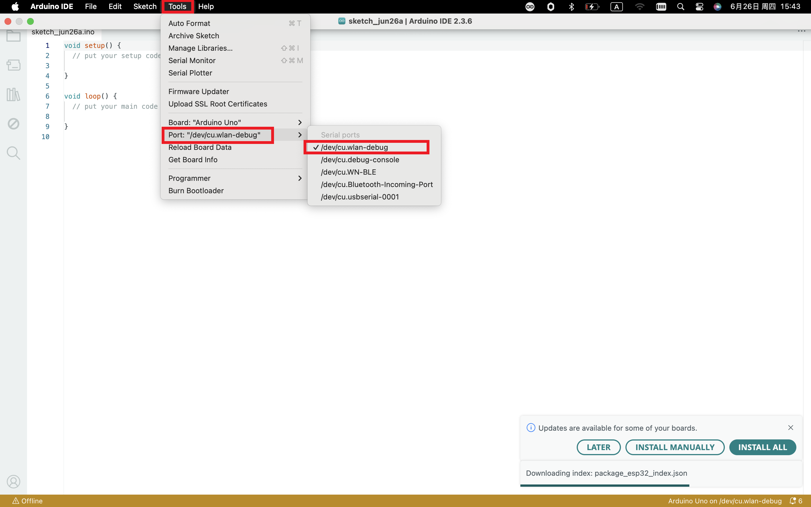
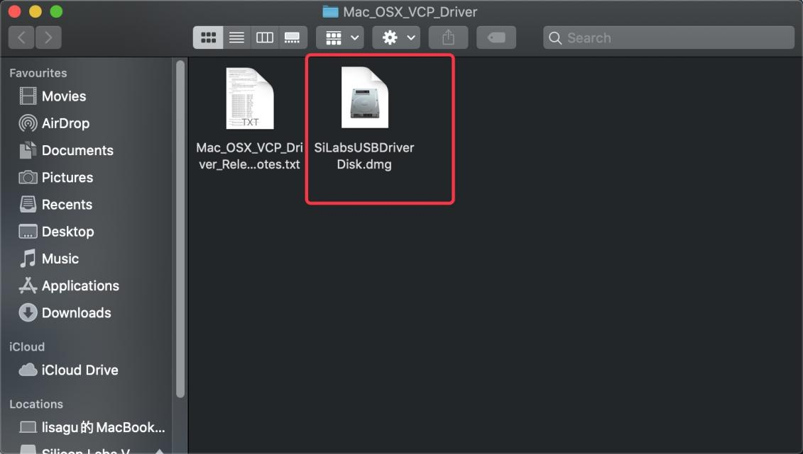
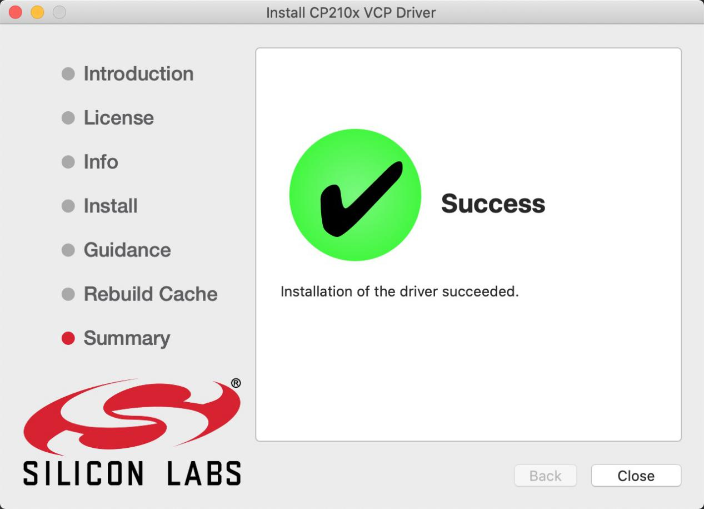

# 3. Driver installation

## 3.1 Windows System

**Checking the driver**

1. Connect the motherboard to the computer.

2. Open the Device Manager. If the prompt **"Silicon Labs CP210x USB to UART Bridge (COMx)"** appears, it proves that the driver has been installed, and you can skip the **"Driver installation"** part.

**Manual driver installation**

1. Driver download

- Windows System: [Windows System driver](./Windows.7z)

2. Connect the motherboard to the computer and open the Device Manager. If there is a yellow exclamation mark in front of the driver in the picture, it proves that the driver is not installed. Please download the driver and install it manually.

## 3.2 MAC System

**1 Checking the driver**

Connect the development board to the computer, and go to [Tools] ---> [Port] to select the development board port. (Note: If you cannot confirm which port is the development board, please connect the motherboard and take a picture to record all the ports, then unplug the development board and take another picture. Compare the two pictures to find the disappeared port, which is the port of the board, and then select it.) If you cannot recognize the port, please replace the computer USB port or the USB cable to re-recognize the port. If it still does not work, refer to the following steps to install the driver.

**2 Manual driver installation**

1. Driver download

​       Mac System: [Mac System driver](./Mac.7z)

2. Double-click to decompress the downloaded driver zip package.

3. After that, keep clicking **"Next"** until the installation is complete.

At this point, the port can be recognized by plugging in the board again.

4. Then go to the Arduino IDE, click on “Tools”, and select the board Arduino Uno and the recognized development board port.

5. Click  to upload the code. It will show “Done uploading” when finished.

