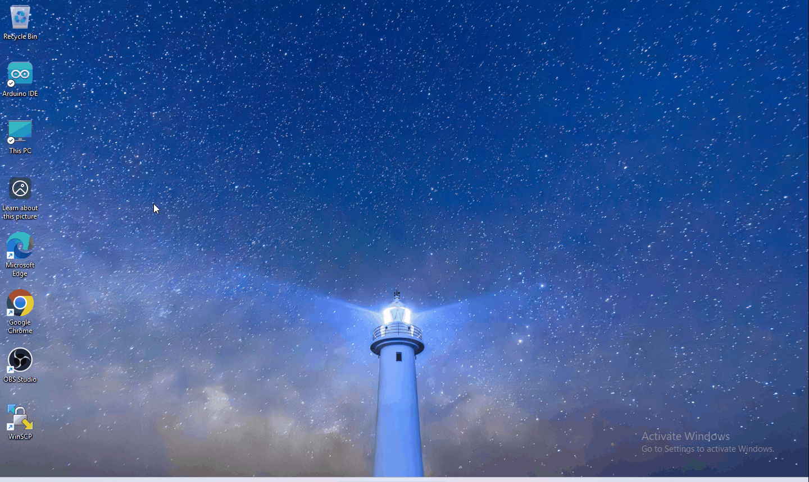
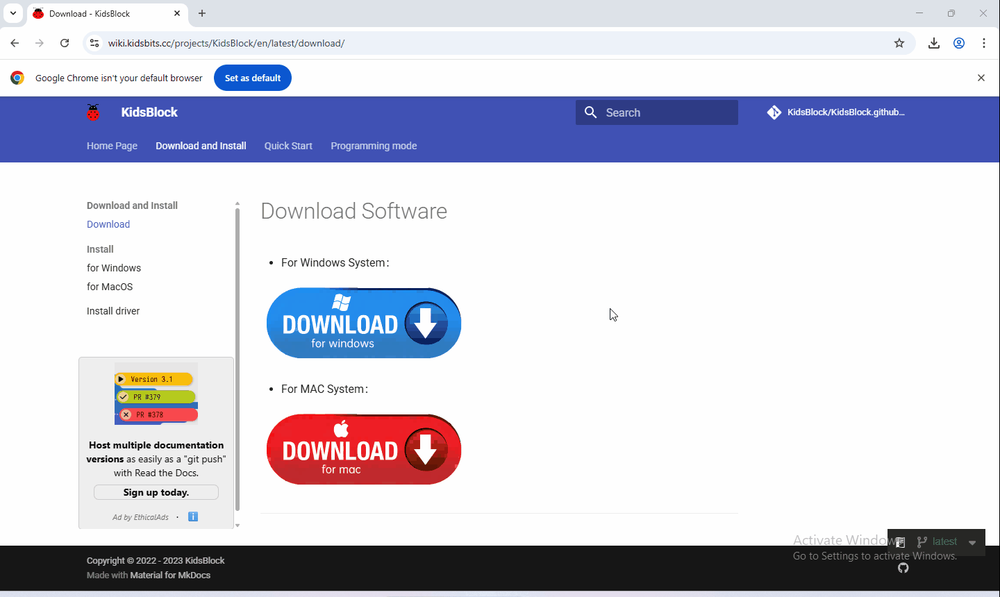
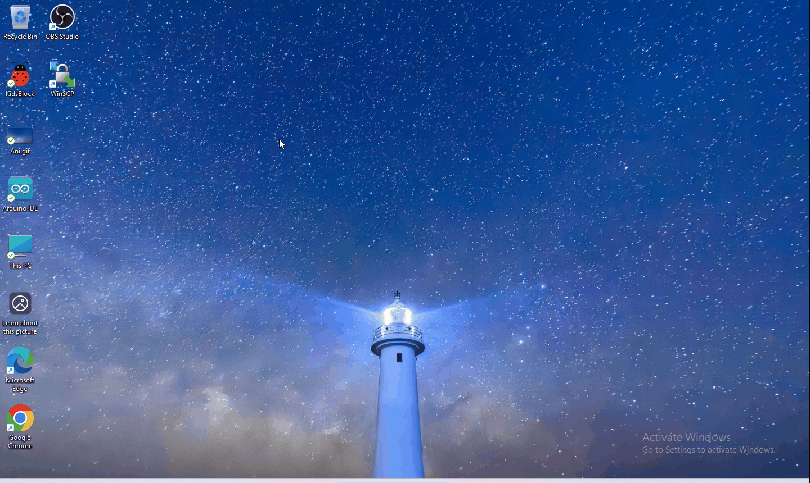
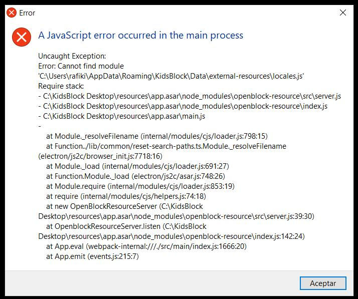
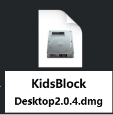
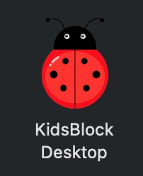

## 5.1 Gegevens downloaden

Scratch-informatie bevat projectcode. Klik om te downloaden voor vervolgstudies.

Gegevens downloaden: [Gegevens downloaden](./Kidsblock.7z)

## 5.2 Software-installatie van Windows-systeem

1. Download KidsBlock: https://wiki.kidsbits.cc/projects/KidsBlock/en/latest/ 

   

2. Software-installatie

3. Software uitvoeren

Verbind eerst het ontwikkelbord met de computer.

Als u tijdens de installatie van KidsBlock de onderstaande fout tegenkomt, kan een herinstallatie het probleem oplossen. Raadpleeg de videozelfstudie en volg de beschreven stappen.

<iframe width="951" height="536" src="https://www.youtube.com/embed/ZOIm0tTaBeQ" title="KidsBlock Error Resolution" frameborder="0" allow="accelerometer; autoplay; clipboard-write; encrypted-media; gyroscope; picture-in-picture; web-share" referrerpolicy="strict-origin-when-cross-origin" allowfullscreen></iframe>

## 5.3 Software-installatie van Mac-systeem

1. Download KidsBlock: https://xiazai.keyesrobot.cn/KidsBlock.dmg Desktop 2.0.4.dmg.

2. Klik op KidsBlock en sleep KidsBlock Desktop naar Programma's.

3. Wacht tot de installatie is voltooid. Het KidsBlock-pictogram verschijnt in Launchpad als de installatie succesvol is.
