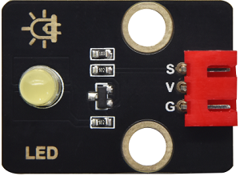
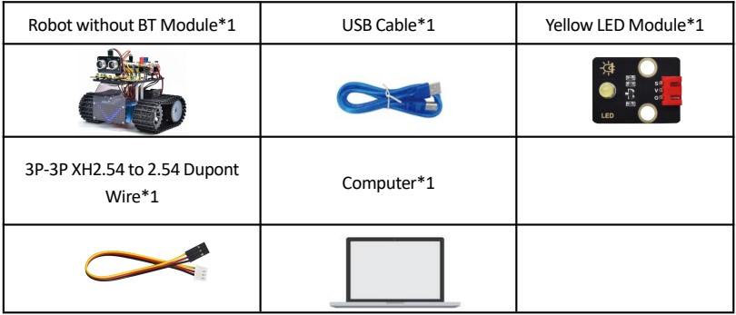
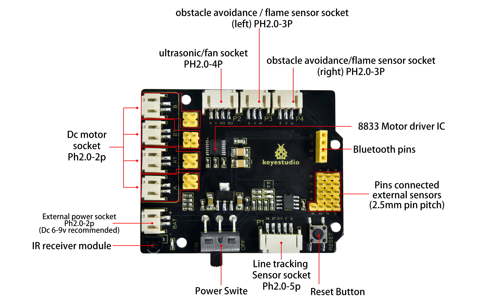
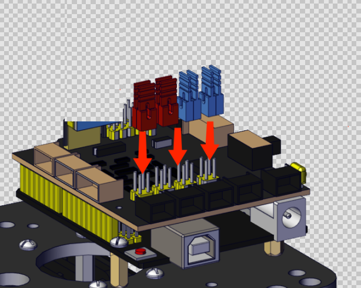
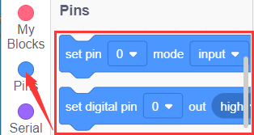

### Proyecto 1: Parpadeo de LED

#### (1)Descripción：

Para principiantes y entusiastas, el parpadeo de LED es un programa fundamental. LED, la abreviación de diodos emisores de luz, está compuesto por compuestos químicos de Ga, As, P, N, entre otros. El LED puede parpadear en diversos colores modificando el tiempo de retardo en el código de prueba. Al controlar, se alimenta GND y VCC. El LED se encenderá si el extremo S está en nivel alto; de lo contrario, se apagará.

#### **(2)Parámetros:**

- Interfaz de control: puerto digital
- Voltaje de trabajo: DC 3.3-5V
- Espaciado de pines: 2.54mm
- Color de visualización del LED: amarillo

#### (3)Componentes Requeridos:

#### **(4)Placa de Expansión del Driver de Motor 8833:**

La placa de expansión del driver de motor Keyestudio 8833 es compatible con la placa de desarrollo Arduino UNO. Simplemente apílela sobre la placa de desarrollo al usarla.

#### **(5)Diagrama de Conexión:**

**NOTA:** El LED está conectado al puerto D9. Recuerde instalar los puentes en el shield.

#### **(6)Código de Prueba:**

También puede arrastrar bloques para editar su código, como se muestra a continuación.

**Código de Prueba Completo**

(**Nota:** No conecte el módulo Bluetooth antes de subir el código, porque la carga del código también usa comunicación serial, y puede haber conflictos con la comunicación serial Bluetooth, lo que puede causar que la carga falle.)

#### **(7)Resultados de la Prueba:**

Suba el programa; el LED parpadea con un intervalo de 1s.

#### **(8)Práctica de Extensión:**

Ya sabemos cómo controlar el LED, entonces cambiemos la frecuencia del LED.

Podemos cambiar la frecuencia del LED sin cambiar el pin del LED. Modifiquemos el código.

También puede arrastrar bloques para editar su código, como se muestra a continuación.

**Código de Prueba Completo**

(**Nota:** No conecte el módulo Bluetooth antes de subir el código, porque la carga del código también usa comunicación serial, y puede haber conflictos con la comunicación serial Bluetooth, lo que puede causar que la carga falle.)

El resultado de la prueba muestra que el LED parpadea más rápido. Por lo tanto, podemos concluir que los pines y el tiempo de retardo afectan la frecuencia de parpadeo.