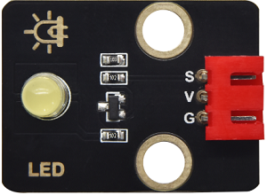
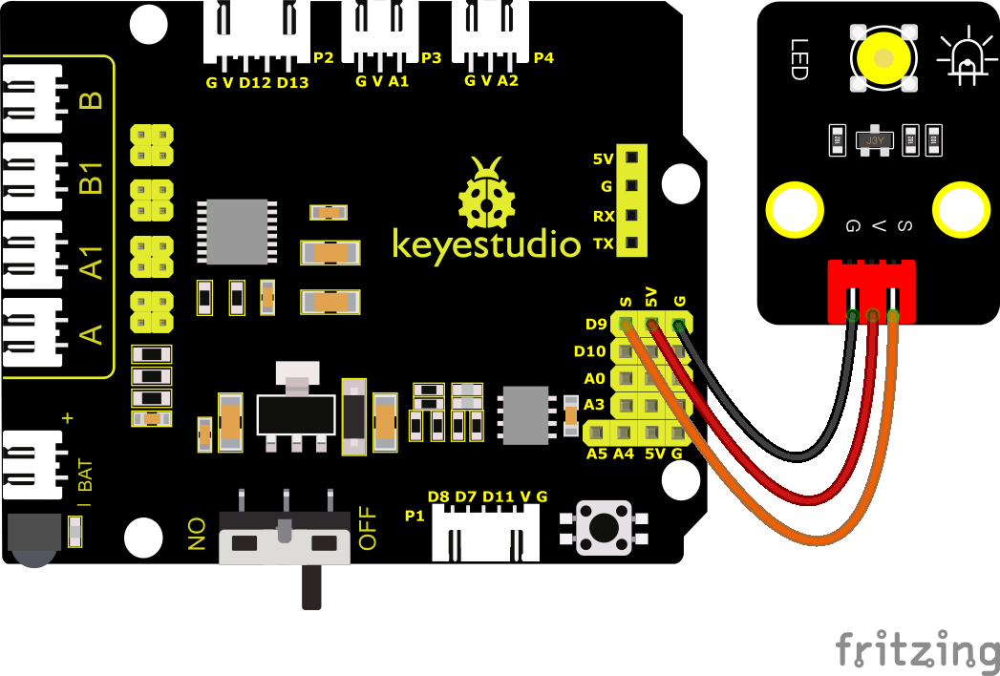
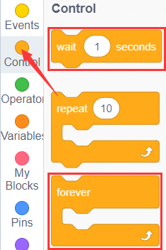
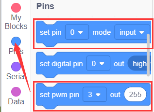
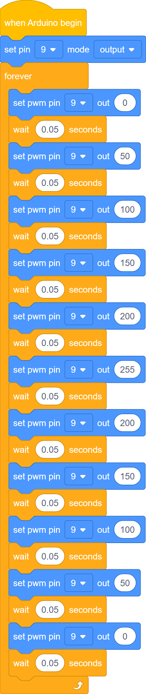
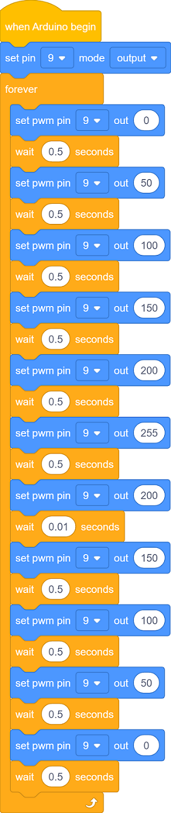

### Projekt 2: LED-Helligkeit einstellen

#### **(1)Beschreibung:**

In der vorherigen Lektion haben wir die LED ein- und ausgeschaltet und zum Blinken gebracht.

In diesem Projekt steuern wir die Helligkeit der LED über PWM und simulieren damit einen Atemeffekt. Ebenso können Sie die Schrittlänge und die Verzögerungszeit im Code ändern, um verschiedene Atemeffekte darzustellen.

PWM ist eine Methode zur Steuerung des analogen Ausgangs über digitale Mittel. Die digitale Steuerung wird verwendet, um Rechteckwellen mit unterschiedlichen Tastverhältnissen (ein Signal, das ständig zwischen hohen und niedrigen Pegeln wechselt) zu erzeugen, um den analogen Ausgang zu steuern.

Im Allgemeinen betragen die Eingangsspannungen der Ports 0V und 5V. Was ist, wenn 3V benötigt werden? Oder ein Wechsel zwischen 1V, 3V und 3,5V? Wir können nicht ständig Widerstände wechseln. Aus diesem Grund greifen wir auf PWM zurück.

Bei den digitalen Port-Spannungsausgängen des Arduino gibt es nur LOW- und HIGH-Pegel, die jeweils den Spannungsausgängen von 0V und 5V entsprechen. Sie können LOW als „0" und HIGH als „1" definieren und den Arduino innerhalb von 1 Sekunde fünfhundert „0" oder „1" ausgeben lassen. Wenn fünfhundert „1" ausgegeben werden, sind das 5V; wenn alles „0" ist, sind das 0V; wenn 250 01-Muster ausgegeben werden, sind das 2,5V.

Dieser Vorgang lässt sich mit dem Abspielen eines Films vergleichen. Die Filme, die wir schauen, sind nicht vollständig kontinuierlich. Tatsächlich werden 25 Bilder pro Sekunde erzeugt, was das menschliche Auge nicht unterscheiden kann. Daher nehmen wir es als kontinuierlichen Prozess wahr. PWM funktioniert auf die gleiche Weise. Um unterschiedliche Spannungen auszugeben, müssen wir das Verhältnis von 0 und 1 steuern. Je mehr „0" oder „1" pro Zeiteinheit ausgegeben werden, desto genauer ist die Steuerung.

#### **(2)Parameter:**

- Steuerungsschnittstelle: Digitaler Port 3

- Betriebsspannung: DC 3,3-5V

- Pin-Abstand: 2,54mm

- LED-Anzeigefarbe: Gelb

#### **(3)Schaltplan**

Die PWM-Pins des Arduino sind mit 3, 5, 6, 9, 10 und 11 verbunden. Pin9 bleibt unverändert.

#### **(4)Testcode:**

Sie können auch Blöcke per Drag-and-Drop bearbeiten, wie unten gezeigt

**Vollständiger Testcode**

(**Hinweis:** Schließen Sie das Bluetooth-Modul nicht an, bevor Sie den Code hochladen, da das Hochladen des Codes ebenfalls die serielle Kommunikation verwendet und es zu Konflikten mit der seriellen Bluetooth-Kommunikation kommen kann, was dazu führen kann, dass das Hochladen fehlschlägt.)

#### **(5)Testergebnisse**

Nach erfolgreichem Hochladen des Testcodes ändert sich die LED allmählich von hell zu dunkel, wie der menschliche Atem, anstatt sofort ein- und auszuschalten.

#### **(6)Erweiterungsübung:**

Lassen Sie uns den Verzögerungswert ändern und den Pin unverändert lassen, und beobachten Sie dann, wie sich die LED verändert.

**Vollständiger Testcode**

(**Hinweis:** Schließen Sie das Bluetooth-Modul nicht an, bevor Sie den Code hochladen, da das Hochladen des Codes ebenfalls die serielle Kommunikation verwendet und es zu Konflikten mit der seriellen Bluetooth-Kommunikation kommen kann, was dazu führen kann, dass das Hochladen fehlschlägt.)

Laden Sie den Code auf die Entwicklungsplatine hoch, die LED blinkt langsamer.