### Project 3: Photoresistor

#### **(1)Description:**

The photosensitive resistor is a special resistor made of a semiconductor material such as a sulfide or selenium, and a moisture-proof resin is also coated with a photoconductive effect. The photosensitive resistance is most sensitive to the ambient light, different illumination strength, and the resistance of the photosensitive resistance is different. We use the photosensitive resistance to design the photosensitive resistor module. 

The module signal is connected to the microcontroller analog port. When the light intensity is stronger, the larger the analog port voltage, that is, the simulation value of the microcontroller is also large; in turn, when the light intensity is weaker, the smaller the analog port voltage, that is, the simulation value of the microcontroller is also small. 

In this way, we can read the corresponding analog value using the photosensitive resistor module, and the intensity of the light in the inductive environment.

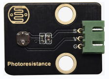

#### **(2)Parameters:**

- Photosensitive resistance resistance value: 5K Ou-0.5m

- Interface type: simulation port A0, A1

- Working voltage: 3.3V-5V

- Pin spacing: 2.54mm

#### **(3)Connection Diagram:**

What we are going to test next isthe photoresistor module on the leftside ofthe robot.

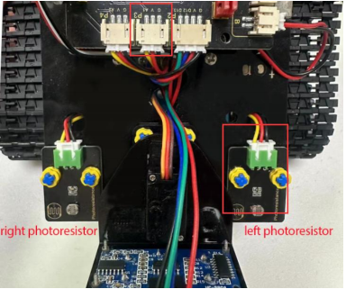

The left photoresistoris connected to A1/P3 of the motor drive shield.

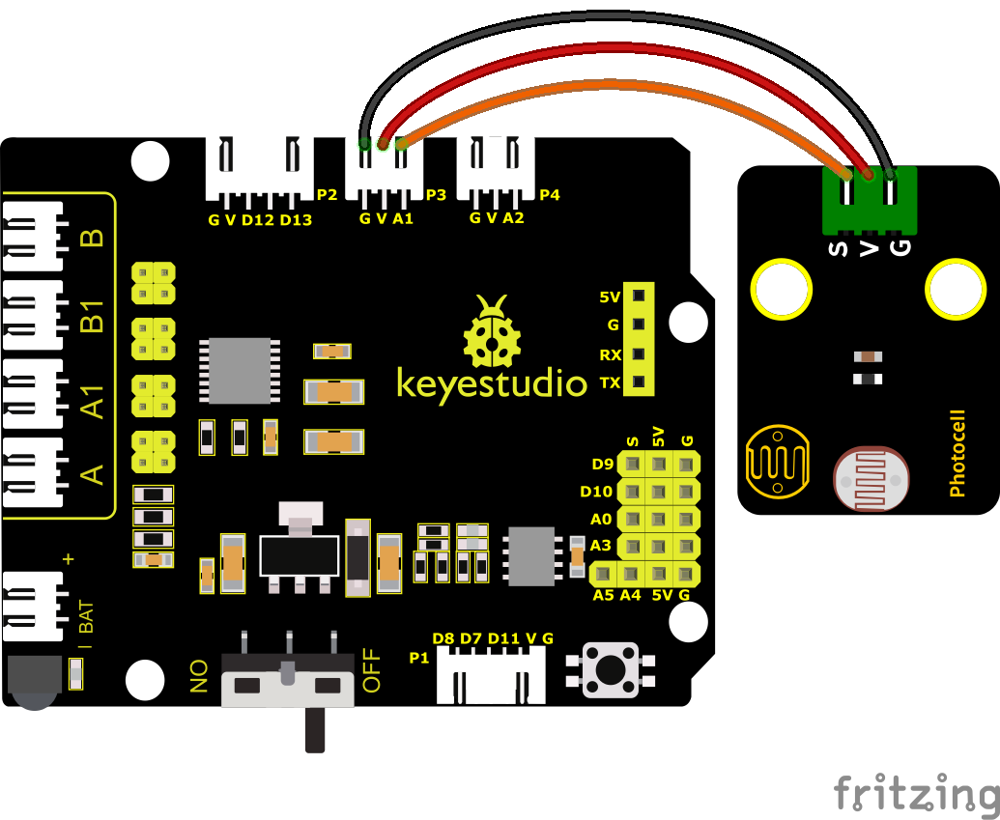

#### **(4)Test Code:**

You can also drag blocks to edit your code, as shown below.

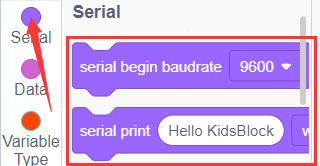

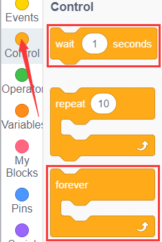

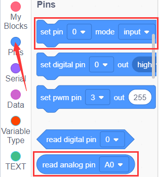

**Complete Test Code**

(**Note:** Do not connect the Bluetooth module before uploading the code, because uploading the code also uses serial communication, and there may be conflicts with the Bluetooth serial communication, which can cause the upload to fail.)

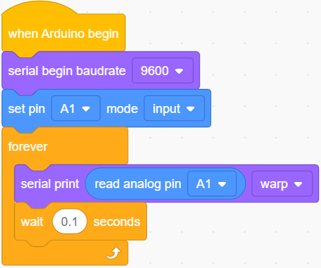

#### **(5)Test Results:**

Upload the code to the development board. Click  to set baud rate 9600.When covering it with your hand, the value gets smaller; if not, the value gets larger.

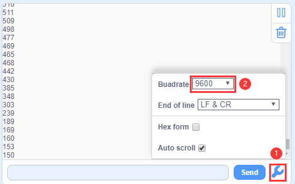

#### **(6)Extension Practice:**

The above code just reads the value of the photoresistor. We can make the photosensitive and LED combine to change the LED.How about controlling the LED’s brightness by it?

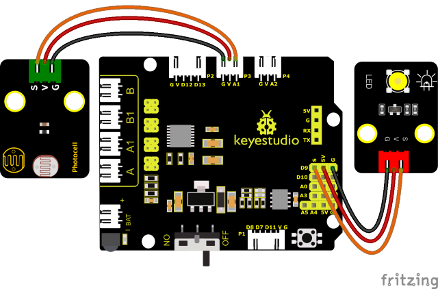

PWM can change the light brightness, that is, LED should be connected to the PWM of the development board.

Connect the LED to D9 and keep other pins unchanged, then we edit code.

You can also drag blocks to edit your code, as shown below.

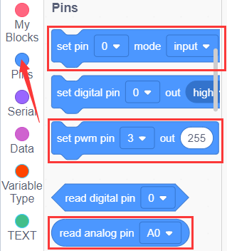

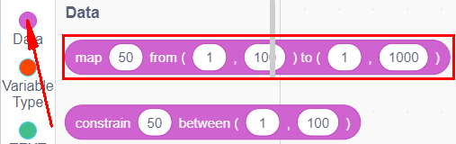

**Complete Test Code**

(**Note:** Do not connect the Bluetooth module before uploading the code, because uploading the code also uses serial communication, and there may be conflicts with the Bluetooth serial communication, which can cause the upload to fail.)

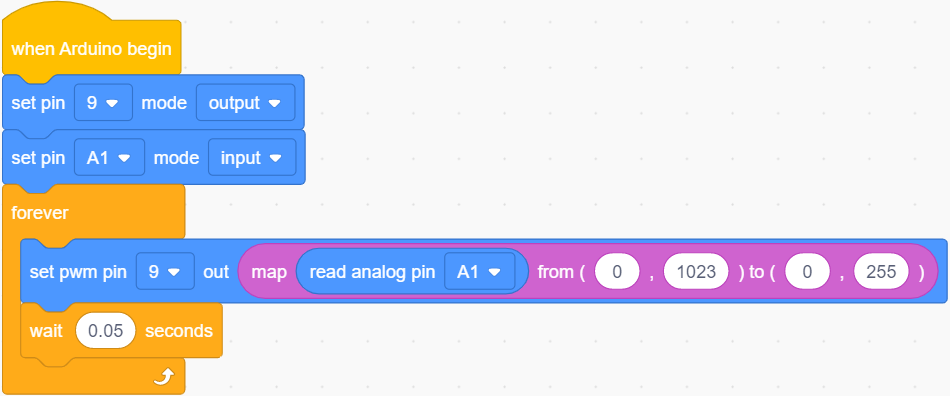

Upload the code to the development board, we press the photoresistor to see if the brightness of the LED light has changed.

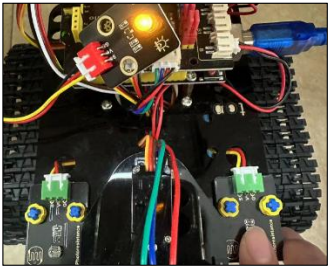
