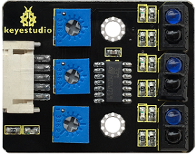
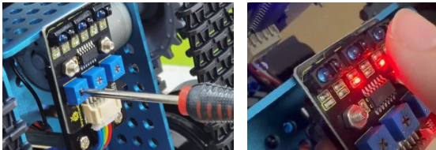
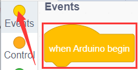
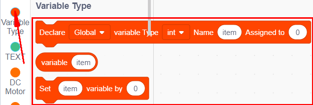
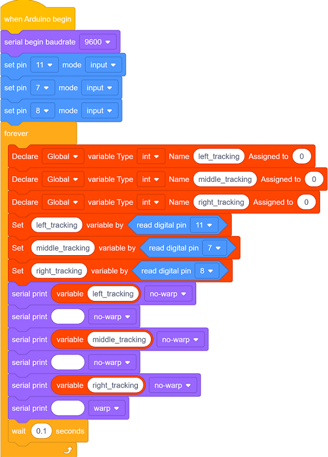
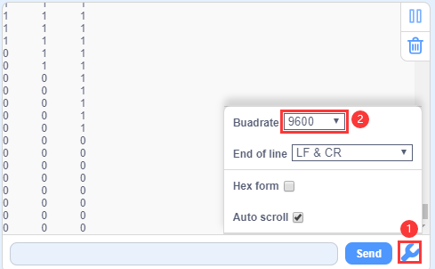
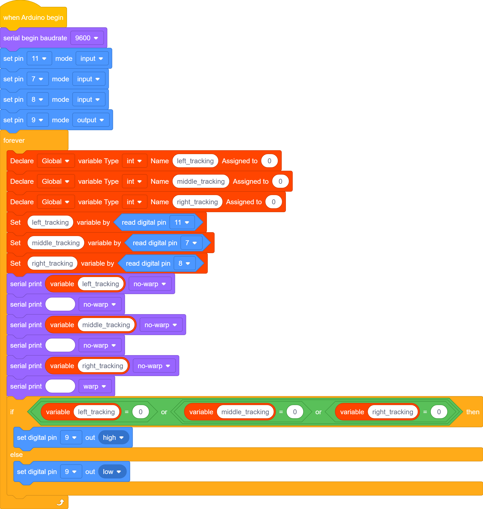
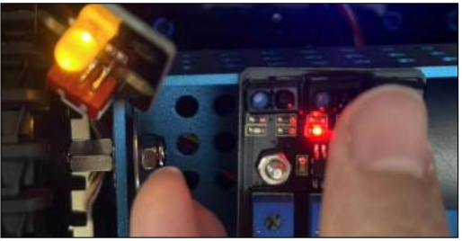

### Projet 4 : Capteur de Suivi de Ligne

#### **(1)Description :**

Le capteur de suivi est en réalité un capteur infrarouge. Le composant utilisé ici est le tube infrarouge TCRT5000.

Son principe de fonctionnement consiste à utiliser la différence de réflectivité de la lumière infrarouge selon les couleurs, puis à convertir l'intensité du signal réfléchi en signal de courant.

Lors du processus de détection, le noir est actif au niveau HAUT (HIGH) tandis que le blanc est actif au niveau BAS (LOW). La hauteur de détection est de 0 à 3 cm.

Le module de suivi de ligne 3 canaux Keyestudio intègre 3 ensembles de tubes infrarouges TCRT5000 sur une seule carte, ce qui facilite le câblage et le contrôle.

Si le capteur de suivi de ligne ne fonctionne pas comme prévu, vous devrez utiliser un tournevis pour ajuster son potentiomètre afin de le rendre plus sensible. Lorsque votre doigt est proche du capteur, la LED embarquée s'allume, et lorsque votre doigt s'éloigne, la LED embarquée s'éteint. À ce moment-là, sa sensibilité est relativement bonne.

#### **(2)Paramètres :**

- Tension de fonctionnement : 3,3-5V (DC)
- Interface : 5PIN
- Signal de sortie : Signal numérique
- Hauteur de détection : 0-3 cm

Remarque particulière : avant le test, tournez le potentiomètre sur le capteur pour régler la sensibilité de détection. Lorsque vous réglez la LED au seuil entre ALLUMÉ et ÉTEINT, la sensibilité est optimale.

Remarque : le capteur de suivi de ligne est installé sous le fond du robot.

#### **(3)Schéma de connexion :**

#### **(4)Code de test :**

Vous pouvez également faire glisser des blocs pour modifier votre code, comme indiqué ci-dessous.

**Code de test complet**

(**Remarque :** Ne pas connecter le module Bluetooth avant de téléverser le code, car le téléversement du code utilise également la communication série, et il peut y avoir des conflits avec la communication série Bluetooth, ce qui peut provoquer l'échec du téléversement.)

#### **(5)Résultats du test :**

Téléversez le code sur la carte de développement, ouvrez le moniteur série à 9600 et vérifiez les capteurs de suivi de ligne. La valeur affichée est 1 (niveau haut) lorsqu'aucun signal n'est reçu. La valeur passe à 0 lorsque le capteur est recouvert de papier.

#### **(6)Pratique d'extension :**

Nous pouvons contrôler une LED avec ce capteur. La LED est connectée à D9. Si nous la recouvrons, la LED s'allumera.

Vous pouvez également faire glisser des blocs pour modifier votre code, comme indiqué ci-dessous.

**Code de test complet**

(**Remarque :** Ne pas connecter le module Bluetooth avant de téléverser le code, car le téléversement du code utilise également la communication série, et il peut y avoir des conflits avec la communication série Bluetooth, ce qui peut provoquer l'échec du téléversement.)

Lorsqu'un objet (tel que du papier ou un doigt) s'approche du capteur de suivi de ligne, le capteur détecte le signal de retour qu'il a lui-même émis, et le module LED s'allume. Lorsque le capteur ne détecte aucun signal de retour, le module LED s'éteint.

