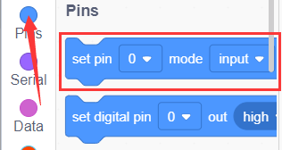
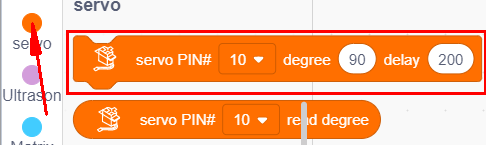
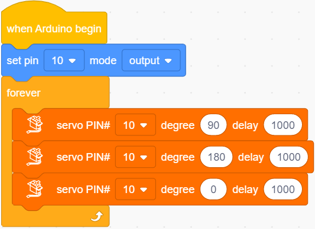
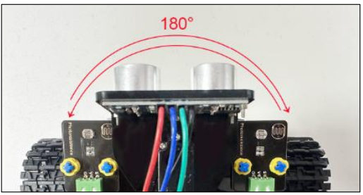

### プロジェクト5: サーボ制御

#### **(1)概要:**

サーボモーターは位置制御型の回転アクチュエーターです。主にハウジング、回路基板、コアレスモーター、ギア、位置センサーで構成されています。その動作原理は、サーボがMCUまたは受信機から送られた信号を受け取り、周期20ms、幅1.5msの基準信号を生成します。次に、取得したDCバイアス電圧をポテンショメーターの電圧と比較し、電圧差出力を得ます。

モーターの速度が一定のとき、ポテンショメーターはカスケード減速ギアを通じて回転駆動され、電圧差が0になり、モーターは回転を停止します。一般的に、サーボの回転角度範囲は0°〜180°です。

サーボモーターの回転角度は、PWM（パルス幅変調）信号のデューティサイクルを調整することで制御されます。PWM信号の標準周期は20ms（50Hz）です。理論上、パルス幅は1ms〜2msの間に分布しますが、実際には0.5ms〜2.5msの間です。この幅は0°〜180°の回転角度に対応しています。なお、ブランドが異なるモーターでは、同じ信号でも異なる回転角度になる場合があります。

一般的に、サーボには茶色、赤色、オレンジ色の3本の線があります。茶色の線はアース、赤色の線はプラス極、オレンジ色の線は信号線です。

サーボの角度：

#### **(2)パラメーター:**

- 動作電圧: DC 4.8V \~ 6V

- 動作角度範囲: 約180°（500 → 2500 μsec時）

- パルス幅範囲: 500 → 2500 μsec

- 無負荷速度: 0.12 ± 0.01 sec / 60（DC 4.8V）　0.1 ± 0.01 sec / 60（DC 6V）

- 無負荷電流: 200 ± 20mA（DC 4.8V）　220 ± 20mA（DC 6V）

- 停動トルク: 1.3 ± 0.01kg · cm（DC 4.8V）　1.5 ± 0.1kg · cm（DC 6V）

- 停止電流: ≦ 850mA（DC 4.8V）　≦ 1000mA（DC 6V）

- 待機電流: 3 ± 1mA（DC 4.8V）　4 ± 1mA（DC 6V）

#### **(3)接続図:**

**注意:** サーボの茶色、赤色、オレンジ色の線は、それぞれシールドのGnd(G)、5v(V)、D10に接続します。サーボの電流が大きいため、外部電源を必ず接続してください。接続しない場合、開発ボードが破損する恐れがあります。

#### **(4)テストコード:**

以下のようにブロックをドラッグしてコードを編集することもできます。

**完全なテストコード**

(**注意:** コードをアップロードする前にBluetoothモジュールを接続しないでください。コードのアップロードもシリアル通信を使用するため、BluetoothのシリアL通信と競合し、アップロードが失敗する場合があります。)

#### **(6)テスト結果:**

コードをアップロードし、電源を接続するとサーボが0°〜180°の範囲で動作します。

