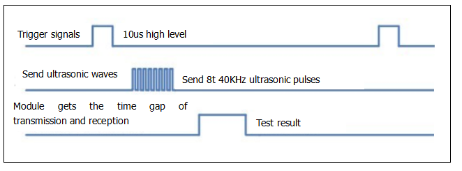
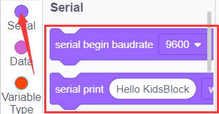
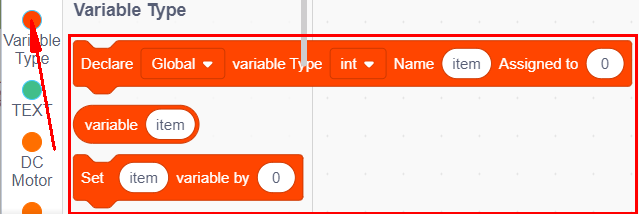
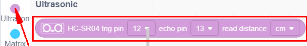
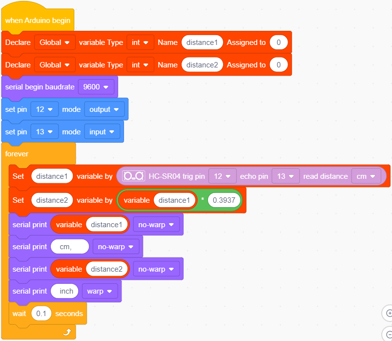
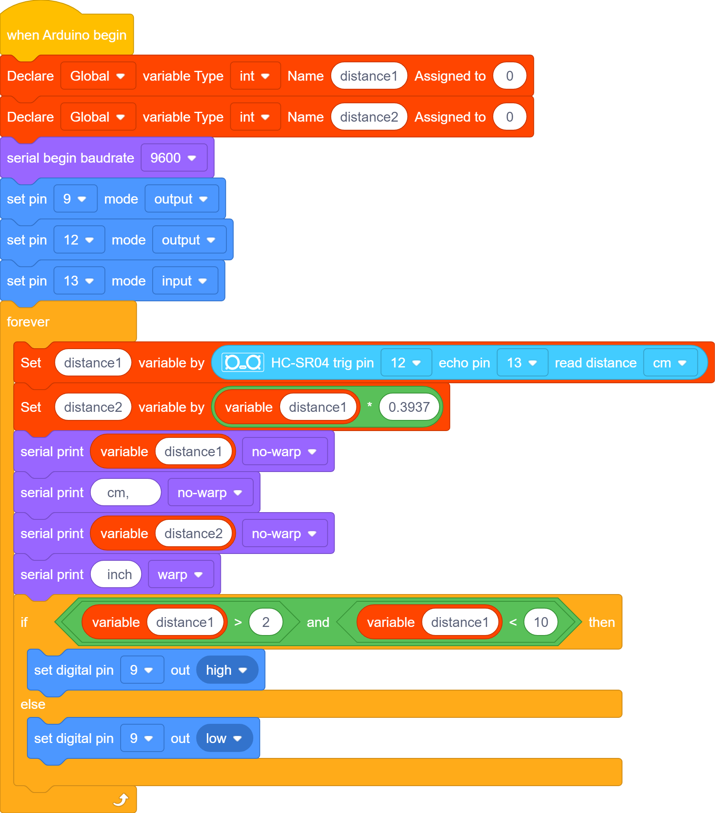
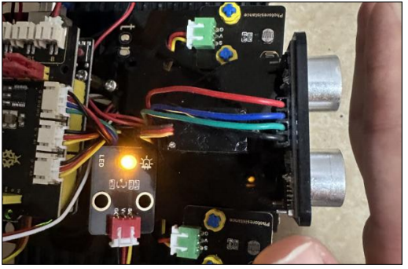

### Proyecto 6: Sensor Ultrasónico

#### **(1)Descripción:**

El sensor ultrasónico HC-SR04 utiliza sonar para determinar la distancia a un objeto, similar a como lo hacen los murciélagos. Ofrece una excelente detección de rango sin contacto con alta precisión y lecturas estables en un paquete fácil de usar. Viene completo con módulos transmisores y receptores ultrasónicos.

El HC-SR04 o sensor ultrasónico se está utilizando en una amplia gama de proyectos electrónicos para crear detección de obstáculos y aplicaciones de medición de distancia, así como otras aplicaciones diversas. Aquí hemos presentado el método sencillo para medir la distancia con Arduino y el sensor ultrasónico, y cómo usar el sensor ultrasónico con Arduino.

#### **(2)Parámetros:**

- Fuente de alimentación: +5V DC

- Corriente en reposo: \<2mA

- Corriente de trabajo: 15mA

- Ángulo efectivo: \<15°

- Distancia de medición: 2cm – 400 cm

- Resolución: 0.3 cm

- Ángulo de medición: 30 grados

- Ancho de pulso de entrada de disparo: 10uS

#### **(3)El principio del sensor ultrasónico:**

Como se muestra en la imagen anterior, es como dos ojos. Uno es el extremo transmisor y el otro es el extremo receptor.

El módulo ultrasónico emitirá las ondas ultrasónicas después de activar una señal. Cuando las ondas ultrasónicas encuentran el objeto y se reflejan de vuelta, el módulo genera una señal de eco, por lo que puede determinar la distancia del objeto a partir de la diferencia de tiempo entre la señal de disparo y la señal de eco.

Aquí, t es el tiempo desde que la señal emitida encuentra el obstáculo hasta que regresa. La velocidad de propagación del sonido en el aire es de aproximadamente 343 m/s, y distancia = velocidad * tiempo. Sin embargo, dado que la onda ultrasónica viaja hacia el obstáculo y de regreso, el tiempo representa el doble de la distancia. Por lo tanto, debe dividirse entre 2. La distancia medida por la **onda ultrasónica = (velocidad * tiempo) / 2**.

1. Método de uso y diagrama de tiempos del módulo ultrasónico:

2. Configurar el tiempo de retardo del pin Trig del SR04 a al menos 10μs, lo que puede activarlo para detectar distancia.

3. Después de la activación, el módulo enviará automáticamente ocho pulsos ultrasónicos de 40KHz y detectará si hay una señal de retorno. Este paso será completado automáticamente por el módulo.

4. Si la señal regresa, el pin Echo generará un nivel alto, y la duración del nivel alto es el tiempo desde la transmisión de la onda ultrasónica hasta su retorno.

Diagrama de circuito del sensor ultrasónico:

#### **(4)Diagrama de Conexión:**

Nota de cableado: El pin VCC del módulo sensor ultrasónico se conecta al 5v(V) de la placa de expansión de control de motor Keyestudio 8833, el pin Trig se conecta al digital D12, el pin Echo se conecta al digital D13, y el pin Gnd se conecta a Gnd(G);

#### **(5)Código de Prueba:**

También puedes arrastrar bloques para editar tu código, como se muestra a continuación.

**Código de Prueba Completo**

(**Nota:** No conectes el módulo Bluetooth antes de cargar el código, porque la carga del código también utiliza comunicación serial, y puede haber conflictos con la comunicación serial Bluetooth, lo que puede causar que la carga falle.)

#### **(6)Resultados de la Prueba:**

Carga el código de prueba en la placa de desarrollo, abre el monitor serial y establece la velocidad de baudios en 9600. La distancia detectada se mostrará en cm y pulgadas. Cuando obstruyas el sensor ultrasónico con tu mano, el valor de distancia mostrado disminuirá.

#### **(7)Práctica de Extensión:**

Acabamos de medir la distancia mostrada por el ultrasonido. ¿Qué tal controlar el LED con la distancia medida? Vamos a intentarlo y conectar un módulo de luz LED al pin D9.

También puedes arrastrar bloques para editar tu código, como se muestra a continuación

**Código de Prueba Completo**

(**Nota:** No conectes el módulo Bluetooth antes de cargar el código, porque la carga del código también utiliza comunicación serial, y puede haber conflictos con la comunicación serial Bluetooth, lo que puede causar que la carga falle.)

Carga el código de prueba en la placa de desarrollo, acerca tu mano al sensor ultrasónico y comprueba si el LED se enciende.

