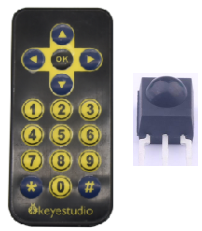
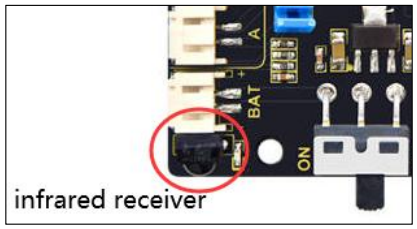
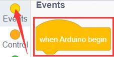
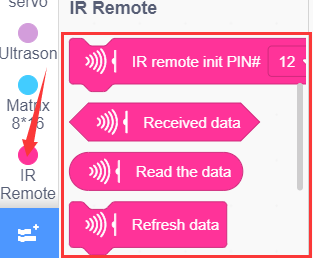
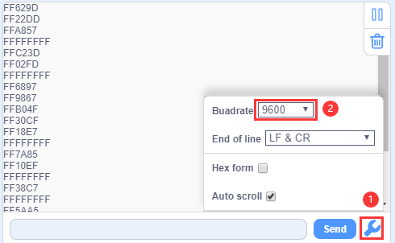
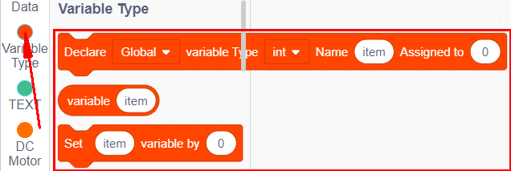
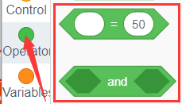
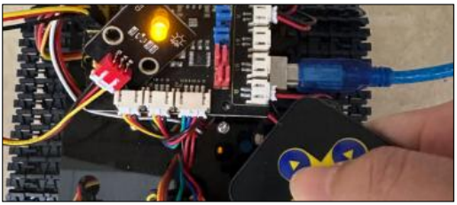

### Proyecto 7: Recepción IR

#### **(1)Descripción:**

Sin duda, el control remoto infrarrojo es omnipresente en la vida diaria. Se utiliza para controlar varios electrodomésticos, como televisores, equipos de sonido, videograbadoras y receptores de señal satelital. El control remoto infrarrojo está compuesto por sistemas de transmisión infrarroja y recepción infrarroja, es decir, un control remoto infrarrojo, un módulo receptor infrarrojo y un microcontrolador capaz de decodificar.

La señal portadora infrarroja de 38K emitida por el control remoto es codificada por el chip de codificación del control remoto. Está compuesta por una sección de código piloto, código de usuario, código inverso de usuario, código de datos y código inverso de datos. El intervalo de tiempo del pulso se utiliza para distinguir si es una señal 0 o 1, y la codificación está formada por estas señales 0 y 1.

El código de usuario del mismo control remoto no cambia, mientras que el código de datos puede distinguir la tecla.

Cuando se presiona el botón del control remoto, éste envía una señal portadora infrarroja. Cuando el receptor IR recibe la señal, el programa decodificará la señal portadora y determinará qué tecla fue presionada. El MCU decodifica la señal 01 recibida, determinando así qué tecla fue presionada en el control remoto.

El receptor infrarrojo que utilizamos es un módulo receptor infrarrojo. Está compuesto principalmente por una cabeza receptora infrarroja, que es un dispositivo que integra recepción, amplificación y demodulación. Su CI interno ha completado la demodulación y puede lograr desde la recepción infrarroja hasta la salida, siendo compatible con señales TTL. Además, es adecuado para control remoto infrarrojo y transmisión de datos por infrarrojos. El módulo receptor infrarrojo fabricado con el receptor tiene solo tres pines: línea de señal, VCC y GND. Es muy conveniente para comunicarse con Arduino y otros microcontroladores.

#### **(2)Parámetros:**

- Voltaje de operación: 3.3-5V（DC）
- Interfaz: 3PIN
- Señal de salida: Señal digital
- Ángulo de recepción: 90 grados
- Frecuencia: 38khz
- Distancia de recepción: 10m

Receptor infrarrojo integrado en la placa de control del motor:

**Nota:** Dado que el receptor IR está integrado en la placa de expansión de control de motor Keyestudio 8833, no se requiere cableado adicional. Los pines del receptor IR en la placa de expansión de control de motor Keyestudio 8833 son G (GND), V (VCC) y D3.

#### **(4)Código de prueba:**

También puedes arrastrar bloques para editar tu código, como se muestra a continuación

**Código de prueba completo**

(**Nota:** No conectes el módulo Bluetooth antes de cargar el código, ya que la carga del código también utiliza comunicación serial y puede haber conflictos con la comunicación serial Bluetooth, lo que puede provocar que la carga falle.)

#### **(5)Resultados de la prueba:**

Carga el código en la placa de desarrollo y configura la velocidad en baudios a 9600. Saca el control remoto, apúntalo hacia el sensor receptor infrarrojo y presiona un botón para enviar la señal. Verás el valor de tecla correspondiente. Si la tecla se mantiene presionada demasiado tiempo, puede aparecer fácilmente el mensaje "FFFFFFFF" en formato ilegible.

A continuación hemos listado cada valor de tecla del control remoto Keyestudio. Puedes guardarlo como referencia.

#### **(6)Práctica de extensión:**

Acabamos de decodificar los valores de tecla del control remoto IR. Ahora vamos a usarlo para controlar el encendido y apagado de un LED. Necesitamos conectar un módulo de luz LED al pin D9, mientras que la posición del pin del receptor infrarrojo permanece sin cambios. Cuando se presione el botón OK del control remoto, el LED conectado a D9 se encenderá, y cuando se presione el botón OK nuevamente, el LED se apagará.

También puedes arrastrar bloques para editar tu código, como se muestra a continuación

（1）

（2）

（3）

(4) 

（5）

（6）

（7）

**Código de prueba completo**

(**Nota:** No conectes el módulo Bluetooth antes de cargar el código, ya que la carga del código también utiliza comunicación serial y puede haber conflictos con la comunicación serial Bluetooth, lo que puede provocar que la carga falle.)

Carga el código en la placa de desarrollo y presiona la tecla "OK" del control remoto para encender y apagar el LED.

