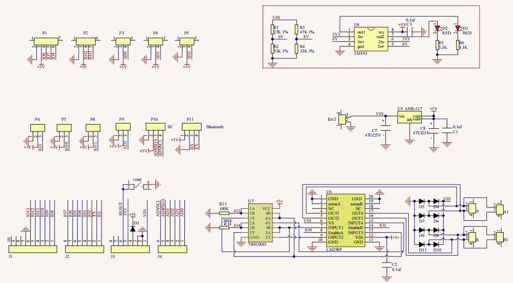
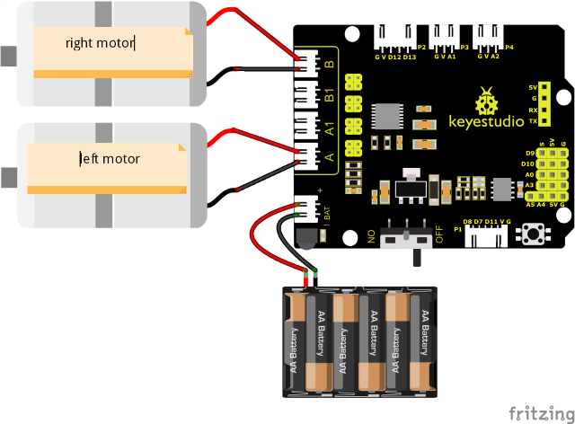
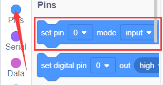
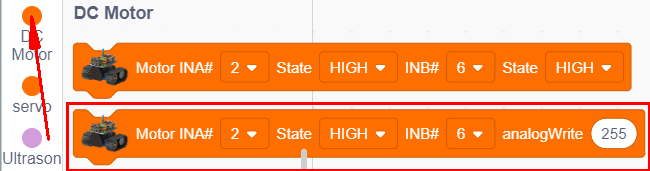
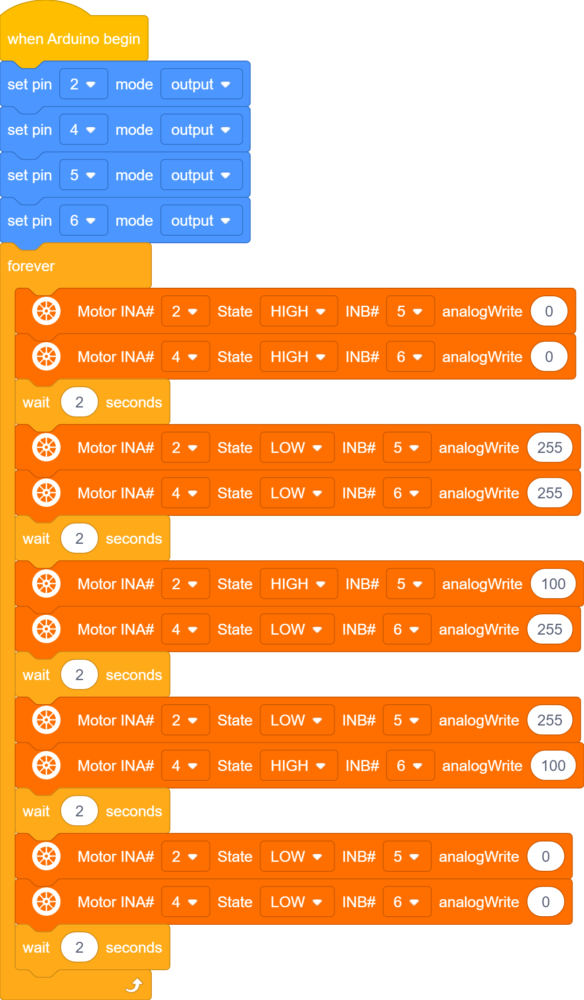
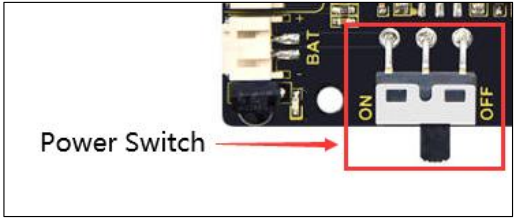

### Project 8: Motor Driving and Speed Control

#### **(1)Description:**

There are many ways to drive motors. Our smart car uses the most common solution called L298P. L298P, produced by STMicroelectronics, is an excellent driving chip specially designed for driving high-power motors . It can directly drive DC motors, two-phase and four-phase motors with the driving current reaching 2A. And the motor’s output terminal adopts 8 high-speed Schottky diodes as protection. We have designed an expansion board based on the L298P circuit of which the laminated design can be directly plugged into the UNO R3 board for use reducing the technical difficulties for users in using and driving the motor.

Stack the expansion board on the board, power the BAT , turn the DIP switch to the ON end, and power the expansion board and the UNO R3 board at the same time via external power supply. In order to facilitate wiring, the expansion board is equipped with anti-reverse interface (PH2.0 -2P -3P -4P -5P) and thus it can be directly plug with motors, power supply, and sensors /modules. The Bluetooth interface of the drive expansion board is fully compatible with the Keyestudio HM-10 Bluetooth module. Therefore, we only need to insert the HM-10 Bluetooth module into the corresponding interface when connecting. At the same time, the drive extension board also uses 2.54 pin headers to extend out some available digital ports and analog ports, so that you can continue to add other sensors and carry out expansion experiments.

The expansion board can be connected to 4 DC motors. In the default jumper cap connection mode, the A and A1, B and B1 interface motors are connected in parallel, and their motion pattern is the same. 8 jumper caps can be used to control the rotation direction of the 4 motor interfaces. For example, when the two jumper caps in front of the motor A interface are changed from a horizontal connection to a vertical connection, the rotation direction of the motor A now is opposite to the original rotation direction.

#### **(2)Parameters:**

-   Logic part input voltage: DC 5V

-   Driving part input voltage: DC 7-12V

-   Logic part working current: ≤36mA

-   Driving part working current: ≤ 2A

-   Maximum dissipation power: 25W (T=75℃)

-   Control signal input level:

    High level: 2.3V ≤ Vin ≤ 5V

    Low level: 0V ≤ Vin ≤ 1.5V

-   Working temperature: -25℃～＋130℃

#### **(3)Drive the robot to move:**

The direction pin of A motor is D2, the speed control pin is D5; the direction pin of B motor is in D4 and the speed control pin is D6,

According to the table below, we can know how to control the movement of the robot by controlling the rotation of two motors through the digital ports and PWM ports . Among them, the range of PWM value is 0-255. The larger the value is, the faster the motor rotates.

|   Function   |  D4  | D6（PWM） | Motor （left）B |  D2  | D5（PWM） | Motor（Right）A |
| :----------: | :--: | :-------: | :-------------: | :--: | :-------: | :-------------: |
| Move Forward | HIGH |     0     |   Rotate Left   | HIGH |     0     |   Rotate Left   |
|   Go Back    | LOW  |    255    |  Rotate Right   | LOW  |    255    |  Rotate Right   |
| Rotate Left  | LOW  |    255    |  Rotate Right   | HIGH |    100    |   Rotate Left   |
| Rotate Right | HIGH |    100    |   Rotate Left   | LOW  |    255    |  Rotate Right   |
|     Stop     | LOW  |     0     |      Stop       | LOW  |     0     |      Stop       |

#### **(4)Connection Diagram:**

Note:

The 4-pinconnector is marked with A, A1, B1 and B. The right rear motor is connected to B of the 8833 board and left front one is connected to A port.

#### **(5)Test Code:**

You can also drag blocks to edit your code, as shown below.

（1）

（2）

（3）

（4）

**Complete Test Code**

(**Note:** Do not connect the Bluetooth module before uploading the code, because uploading the code also uses serial communication, and there may be conflicts with the Bluetooth serial communication, which can cause the upload to fail.)

#### **(6)Test Results:**

After wiring according to the diagram, uploading the test code and powering it up.

the smart car moves forward for 2s, goes back for 2s, turns left for 2s, turns right for 2s and stops for 2s.
