### プロジェクト9: 8×16 表情LEDドットマトリクス

#### **(1)概要:**

ロボットに表情ボードを追加したら楽しくないでしょうか？Keyestudio 8×16 LEDドットマトリクスがその役割を果たします。これを使えば、表情、画像、パターンなどの表示を自分でデザインすることができます。

8×16 LEDボードには128個のLEDが搭載されています。マイクロプロセッサ（Arduino）のデータは、2線式バスインターフェースを通じてAiP1640と通信します。これにより、モジュール上の128個のLEDのオン・オフを制御し、モジュール上のドットマトリクスに必要なパターンを表示させることができます。配線を簡単にするためにHX-2.54 4Pinケーブルが付属しています。

#### **(2)仕様:**

-   動作電圧: DC 3.3-5V

-   消費電力: 400mW

-   発振周波数: 450KHz

-   駆動電流: 200mA

-   動作温度: -40〜80℃

-   通信方式: 2線式バス

#### **(3)知識:**

**8×16 LEDドットマトリクスの回路**

**8×16 LEDドットマトリクスの原理**

8×16ドットマトリクスの各LEDをどのように制御するのでしょうか？各バイトは8ビットを持ち、各ビットは0または1です。0の場合LEDはオフ、1の場合LEDはオンになります。1バイトでLEDの1列を制御でき、16バイトで16列のLEDを制御できます。これが8×16ドットマトリクスです。

**ピンの説明と通信プロトコル**

マイクロプロセッサ（Arduino）のデータは、2線式バスケーブルを通じてAiP1640と通信します。

通信プロトコルの図は以下の通りです（SCLKはSCL、DINはSDAです）。

①データ入力の開始条件: SCLがハイレベルの時にSDAがハイからローに変化します。

②データコマンドの設定方法は以下の図の通りです。

サンプルプログラムでは、**アドレスを自動的に1加算する**方法を選択しており、2進数値は0100 0000、対応する16進数値は0x40です。

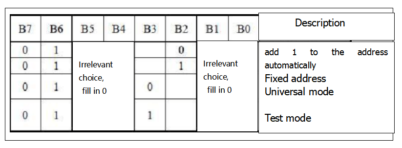

③アドレスコマンドの設定では、以下のようにアドレスを選択できます。

サンプルプログラムでは最初の00Hを選択しており、2進数1100 0000は16進数0xc0に対応します。

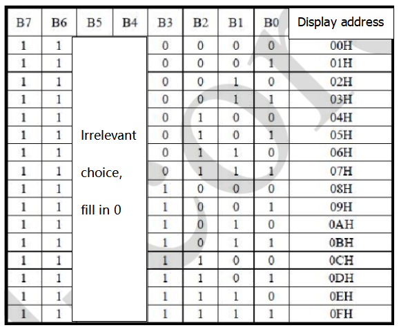

④データ入力の要件として、データ入力時にSCLがハイレベルの場合、SDA上の信号は変化してはなりません。SCLのクロック信号がローレベルの時のみ、SDA上の信号を変更できます。データの入力は下位ビットが先で、上位ビットが後です。

⑤データ転送終了の条件は、SCLがローレベルでSDAがローレベルの時にSCLがハイレベルになり、SDAのレベルがハイになることです。

⑥表示制御として、異なるパルス幅を設定します。パルス幅は以下の図のように選択できます。

例ではパルス幅は4/16で、1000 1010に対応する16進数は0x8Aです。

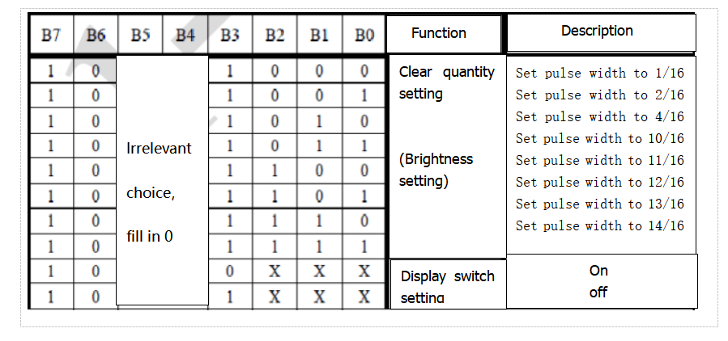

**モジュールツールの使い方の説明**

ドットマトリクスツールはオンライン版を使用します。リンクは以下の通りです: <http://dotmatrixtool.com/#>

①リンクにアクセスすると、以下のようなページが表示されます。

②ドットマトリクスは8×16なので、高さを8、幅を16に調整します（以下の図参照）。

③パターンから16進数データを生成します。

以下の図のように、左クリックで選択、右クリックでキャンセルします。描きたいパターンを描き、「Generate」をクリックすると、必要な16進数データが生成されます。

#### **(4)接続図:**

8×16 LED光ボードのGND、VCC、SDA、SCLは、2線式シリアル通信のために拡張ボードのG(GND)、V(VCC)、A4、A5にそれぞれ接続されています。

(注意: ArduinoのIICピンに接続されていますが、このモジュールはIIC通信用ではありません。ここのIOポートはI2C通信をシミュレートするためのもので、任意の2つのピンに接続できます。)

#### **(5)テストコード:**

ブロックをドラッグしてコードを編集することもできます（以下参照）。

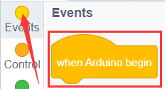

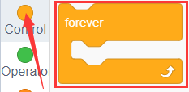

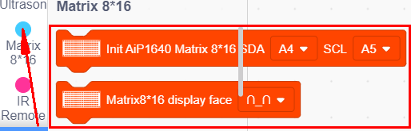

**完全なテストコード**

(**注意:** コードをアップロードする前にBluetoothモジュールを接続しないでください。コードのアップロードにもシリアル通信を使用するため、Bluetoothシリアル通信と競合が発生し、アップロードに失敗する可能性があります。)

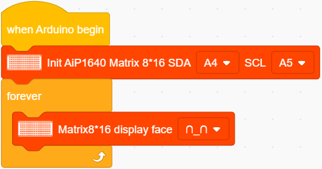

#### **(6)テスト結果:**

テストコードを正常にアップロードし、配線を行い、DIPスイッチをON側に切り替えて電源を入れると、ドットマトリクスに笑顔のパターンが表示されます。

#### **(7)応用練習:**

先ほど学んだモジュールツール [http://dotmatrixtool.com/#](http://dotmatrixtool.com/#) を使って、ドットマトリクスにスタート、前進、停止のパターンを表示させ、その後パターンをクリアします。時間間隔は2000ミリ秒です。

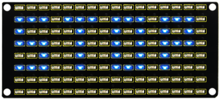

笑顔を表示するブロック

表情を表示するコード

ハートを表示するブロック

前進するコード

後退するブロック

左折するブロック

右折するブロック

停止するブロック

クリアするブロック

ブロックをドラッグしてコードを編集することもできます（以下参照）。

（1）

（2）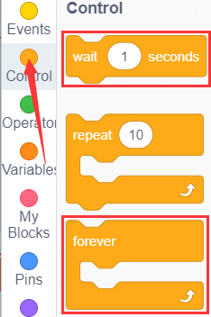

（3）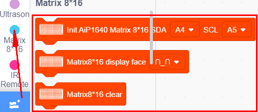

**完全なテストコード**

(**注意:** コードをアップロードする前にBluetoothモジュールを接続しないでください。コードのアップロードにもシリアル通信を使用するため、Bluetoothシリアル通信と競合が発生し、アップロードに失敗する可能性があります。)

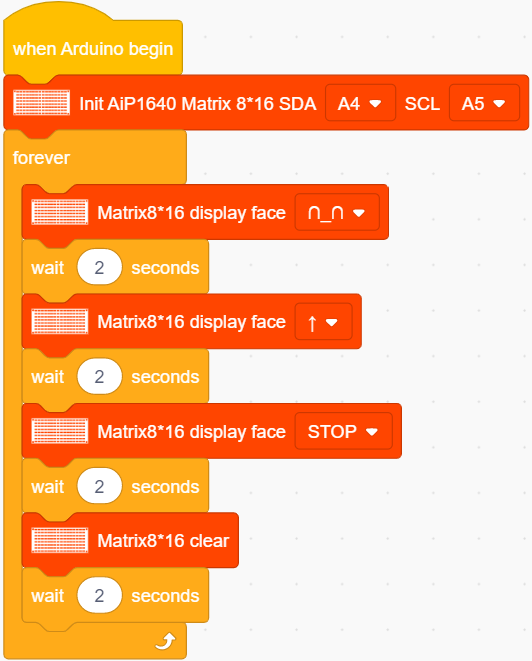

コードを開発ボードにアップロードすると、8×16ボードに以下のパターンが表示されます。

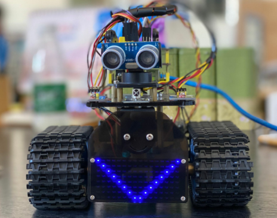

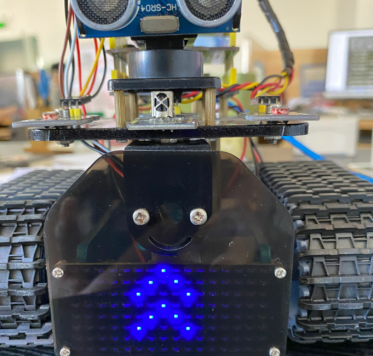

