### Progetto 10: Tank Insegui-Luce

#### **(1)Descrizione:**

Nei progetti precedenti, abbiamo introdotto in dettaglio l'uso di vari sensori, moduli e schede di espansione sul robot smart car. Ora passiamo ai progetti del robot smart car. I robot smart car insegui-luce, come suggerisce il nome, sono robot smart car in grado di seguire la luce.

Possiamo combinare le conoscenze dei progetti sul fotoresistore e sul driver motore per realizzare un robot smart car che cerca la luce. Nel progetto, utilizziamo due moduli fotoresistore per rilevare l'intensità luminosa sul lato sinistro e destro del robot smart car, leggiamo i valori analogici corrispondenti e quindi controlliamo la rotazione dei due motori in base a questi due dati in modo da controllare i movimenti del robot smart car.

La logica specifica del robot smart car insegui-luce è mostrata di seguito.

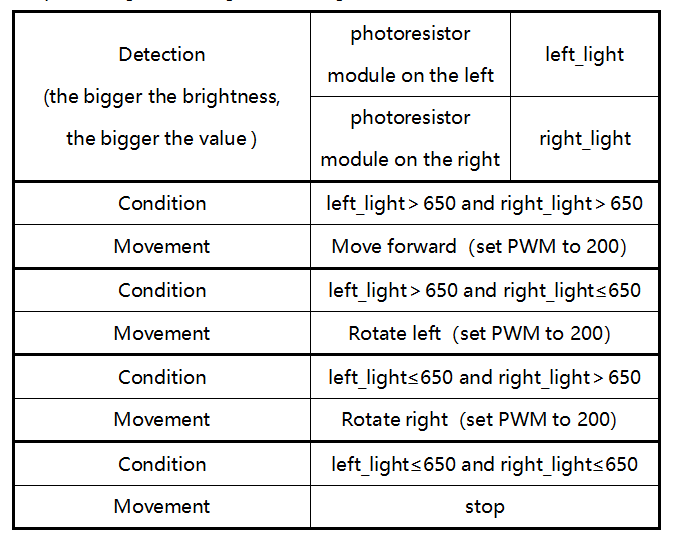

#### **(2)Diagramma di flusso:**

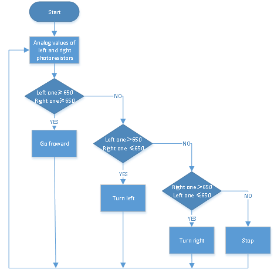

#### **(3)Schema di collegamento:**

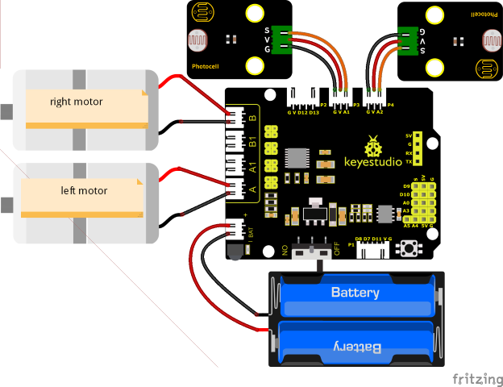

Nota: I pin "G", "V" e S del modulo fotoresistore sinistro sono collegati rispettivamente a G (GND), V (VCC), A1;

I pin "G", "V" e S del modulo fotoresistore destro sono collegati rispettivamente a G (GND), V (VCC) e A2.

Il cavo a 4 pin è contrassegnato con A, A1, B1 e B. Il motore posteriore destro è collegato alla porta B della scheda di espansione driver motore 8833 e il motore anteriore sinistro è collegato alla porta A della scheda di espansione driver motore 8833.

#### **(4)Codice di Test:**

Puoi anche trascinare i blocchi per modificare il tuo codice, come mostrato di seguito.

（1）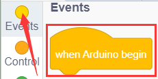

（2）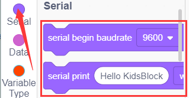

（3）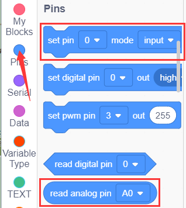

（4）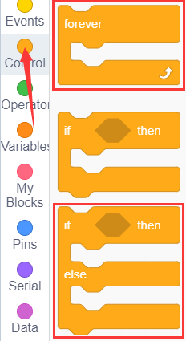

（5）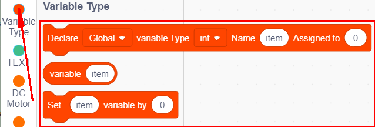

（6）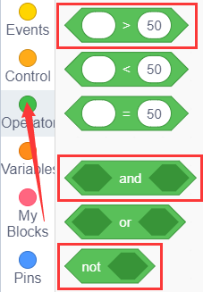

(7) 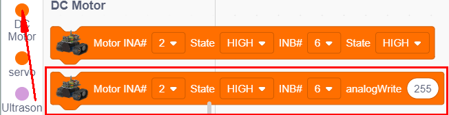

**Codice di Test Completo**

(Nota: La soglia 650 nel codice può essere regolata opportunamente in base all'intensità luminosa specifica.

Non collegare il modulo Bluetooth prima di caricare il codice, poiché il caricamento del codice utilizza anch'esso la comunicazione seriale e potrebbero verificarsi conflitti con la comunicazione seriale del Bluetooth, causando il fallimento del caricamento del codice.)

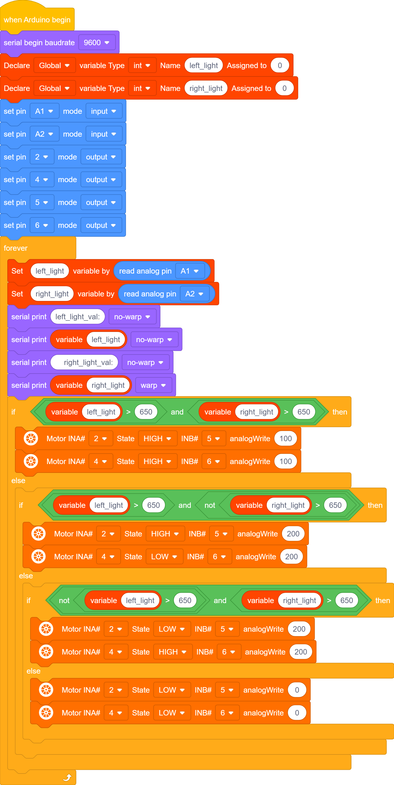

#### **(5)Risultati del Test:**

Dopo aver caricato con successo il codice di test, effettuare i collegamenti, portare il selettore DIP sull'estremità ON e accendere il dispositivo: il robot smart car seguirà la luce per muoversi.

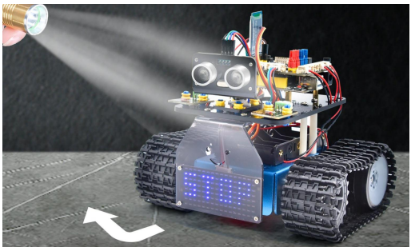