### Projet 11 : Char Suiveur à Ultrasons

#### **(1) Description :**

Dans la leçon précédente, nous avons appris à propos de la voiture intelligente suiveuse de lumière. Dans cette leçon, nous pouvons combiner les connaissances pour fabriquer une voiture suiveuse à ultrasons. Dans ce projet, nous utilisons des capteurs à ultrasons pour détecter la distance entre la voiture et l'obstacle en face, puis nous contrôlons la rotation des deux moteurs en fonction de ces données afin de contrôler les mouvements de la voiture intelligente.

La logique spécifique de la voiture intelligente suiveuse à ultrasons est présentée dans le tableau ci-dessous :

|                        Détection                        |              Paramètre              |
| :-----------------------------------------------------: | :-------------------------------: |
| La distance (cm) entre la voiture et l'obstacle en face | Régler l'angle du servo à 90° |
|                      **Condition**                      |           **Mouvement**            |
|               distance≥20 et distance≤50               |             Avancer              |
|            10＜distance＜20 distance＞50            |               Arrêt                |
|                       distance≤10                       |              Reculer              |

#### **(2) Organigramme :**

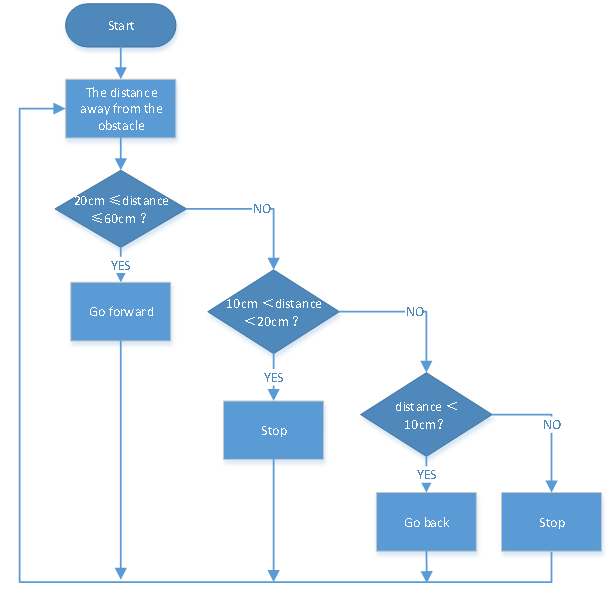

#### **(3) Schéma de connexion :**

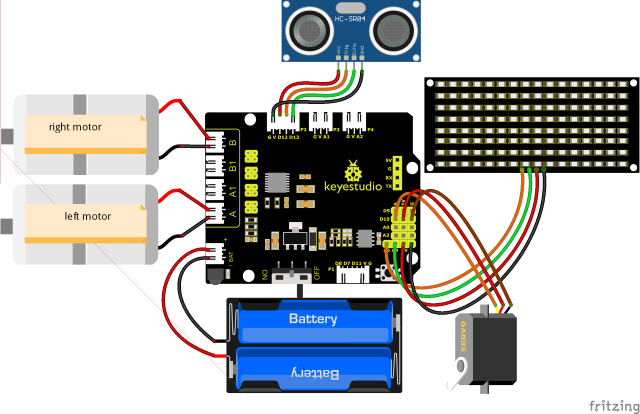

Remarque : Le câblage du capteur à ultrasons, du servo et du moteur est le même que dans l'expérience du projet précédent. Le GND, VCC, SDA et SCL du panneau LED 8x16 sont respectivement connectés à G (GND), V (VCC), A4 et A5 sur la carte d'extension.

#### **(4) Code de test :**

Vous pouvez également faire glisser des blocs pour éditer votre code, comme indiqué ci-dessous.

（1）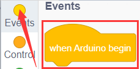

（2）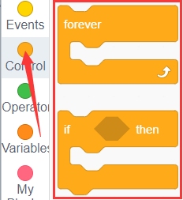

（3）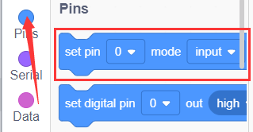

（4）

（5）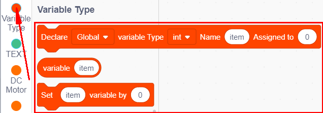

（6）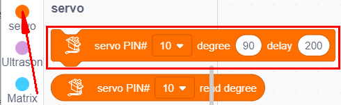

(7) 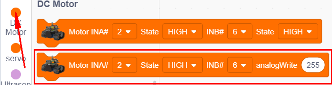

(8) 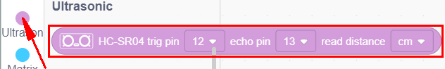

(9) 

(10) 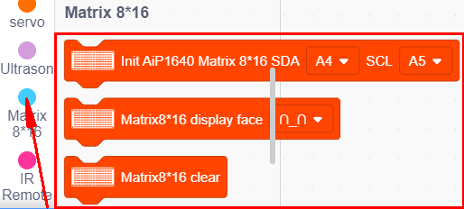

**Code de test complet**

(**Remarque :** Ne pas connecter le module Bluetooth avant de téléverser le code, car le téléversement utilise également la communication série, et il peut y avoir des conflits avec la communication série Bluetooth, ce qui peut entraîner l'échec du téléversement.)

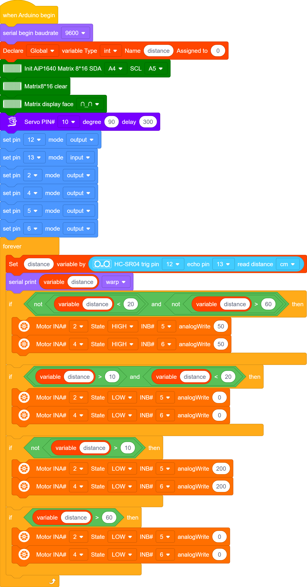

#### **(5) Résultat du test :**

Téléversez le code, mettez sous tension et positionnez l'interrupteur DIP sur ON. Le servo tournera de 90°, le panneau LED 8X16 affichera , et la voiture suivra l'obstacle pour se déplacer.

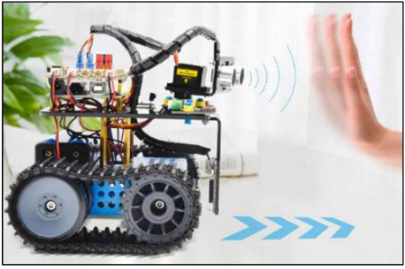