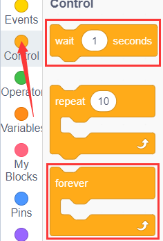
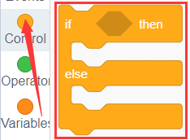
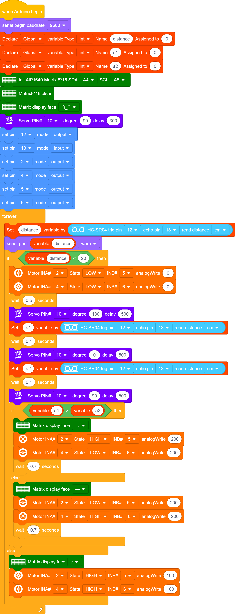
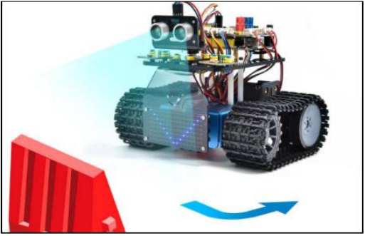

### プロジェクト12：超音波障害物回避タンク

#### **(1)説明：**

前のプロジェクトでは、超音波音声追従スマートカーを作りました。実際には、同じコンポーネントと同じ配線方法を使用し、テストコードを変更するだけで、超音波障害物回避スマートカーに変えることができます。このスマートカーは人の手の動きに合わせて動くことができます。

超音波センサーを使用して、スマートカーと前方の障害物との距離を検出し、このデータに基づいて2つのモーターの回転を制御することで、スマートカーの動きを制御します。

|                          検出                          |         |
| :----------------------------------------------------: | :-----: |
| 前方の障害物との距離（超音波センサーで計測） （サーボの角度を90°に設定） | a (cm)  |
| 右側の障害物との距離（超音波センサーで計測） （サーボの角度を0°に設定） | a2 (cm) |
| 左側の障害物との距離（超音波センサーで計測） （サーボの角度を180°に設定） | a1 (cm) |

**設定：サーボの開始角度を90°に設定**

| 条件1 |        条件2         |      条件3       | 動作                                                     |
| :---: | :------------------: | :--------------: | :------------------------------------------------------- |
| a＜20 |                      |                  | 500ms停止；サーボの角度を180°に設定し、a1を読み取り、100msの遅延；サーボの角度を0°に設定し、a2を読み取り、0.1sの遅延。 |
|       | a1＜50 または a2＜50 | **a1とa2を比較** |                                                          |
|       |                      |      a1＞a2      | サーボの角度を90°に設定し、700ms左回転（PWMを255に設定）し、前進（PWMを200に設定）。 |
|       |                      |      a1＜a2      | サーボの角度を90°に設定し、700ms右回転（PWMを255に設定）し、前進（PWMを200に設定）。 |
|       | a1≥50 かつ a2≥50  |      ランダム      | サーボの角度を90°に設定し、500ms左回転（PWMを255に設定）し、前進（PWMを200に設定）。  サーボの角度を90°に設定し、500ms右回転（PWMを255に設定）し、前進（PWMを200に設定）。 |
| a≥20  |                      |                  | 前進（PWMを100に設定）                                   |

#### **(2)フローチャート：**

#### **(3)接続図：**

(注意： サーボの茶色、赤色、オレンジ色のワイヤーはそれぞれ拡張ボードのG (GND)、V（5V）、D10に接続されます；超音波センサーについては、VCCピンを5v (V)に、Trigピンをデジタル12 (S)に、EchoピンをD13 (S)に、GndピンをGnd (G)に接続します；前のプロジェクトと同様です。）

#### **(4)テストコード：**

以下のようにブロックをドラッグしてコードを編集することもできます。

（2）

（3）

（4）

（5）

（6）

（7）

（8）

（9）

（10）

（11）

**完全なテストコード**

(**注意：** コードをアップロードする前にBluetoothモジュールを接続しないでください。コードのアップロードにもシリアル通信を使用しており、Bluetoothシリアル通信と競合が生じ、アップロードが失敗する可能性があります。)

#### **(5)テスト結果：**

テストコードのアップロードが成功したら、配線し、DIPスイッチをON側に切り替えて電源を入れます。スマートカーは前進し、自動的に障害物を回避します。

