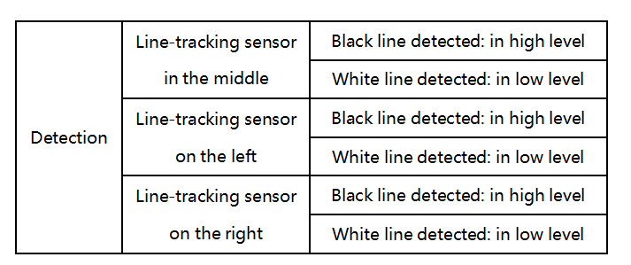
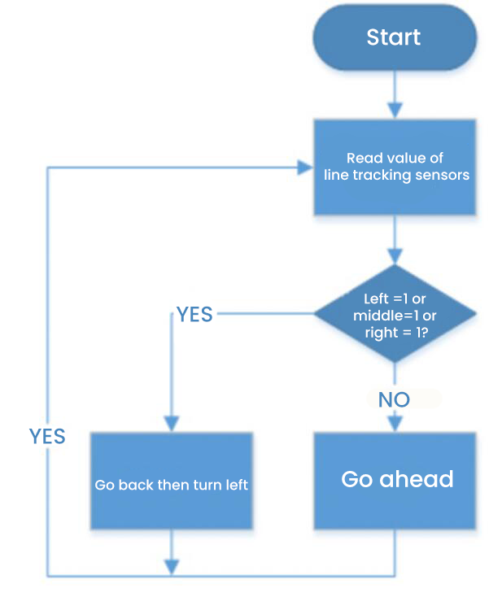
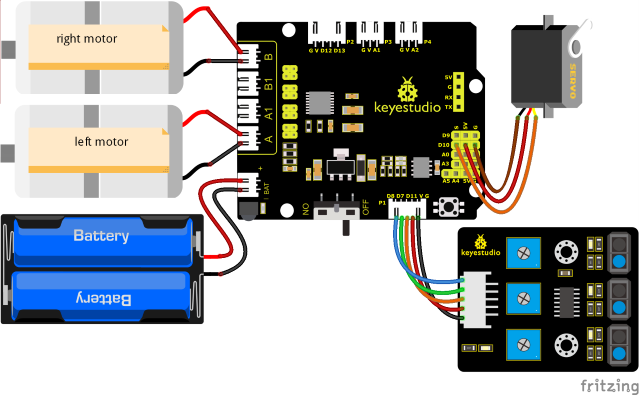
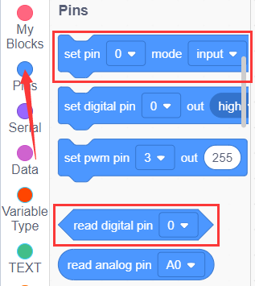
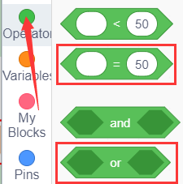
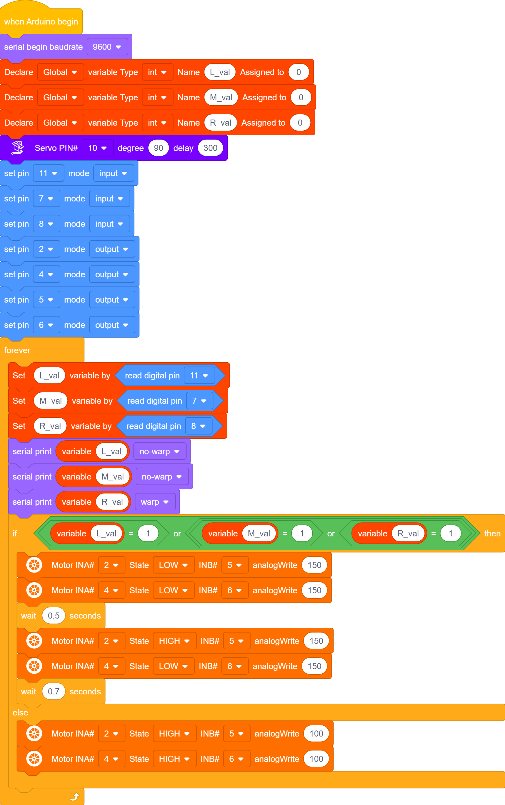
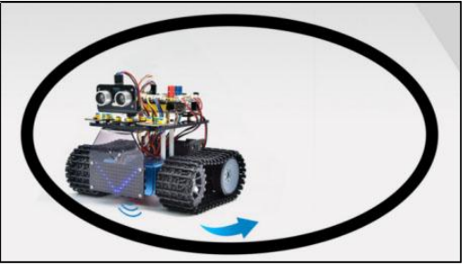

### Projekt 13: Panzer – Bewegung im begrenzten Raum

#### **(1) Beschreibung:**

Die Ultraschall-Verfolgungsfunktion und die Hindernisumfahrungsfunktion des Smart Cars wurden in vorherigen Projekten vorgestellt. Hier beabsichtigen wir, das Wissen aus den vorherigen Kursen zu kombinieren, um das Smart Car auf einen bestimmten Bereich zu beschränken. Im Experiment verwenden wir den Linienverfolgungssensor, um zu erkennen, ob sich eine schwarze Linie um das Smart Car befindet, und steuern dann die Drehung der beiden Motoren entsprechend der Erkennungsergebnisse, um das Smart Car innerhalb eines mit einer schwarzen Linie gezeichneten Kreises zu halten.

Die spezifische Logik des Smart Cars ist in der folgenden Tabelle dargestellt:

|                         Bedingung                         |                         Bewegung                          |
| :-------------------------------------------------------: | :-------------------------------------------------------: |
| Wenn einer der drei Linienverfolgungssensoren schwarze Linien erkennt | Zurückfahren (PWM auf 150 setzen), dann links drehen (PWM auf 150 setzen) |
|             Keiner von ihnen erkennt schwarze Linien              |               Vorwärts fahren (PWM auf 100 setzen)                |

#### **(2) Flussdiagramm**

#### **(3) Anschlussdiagramm:**

#### **(4) Testcode:**

Sie können auch Blöcke per Drag-and-Drop verschieben, um Ihren Code zu bearbeiten, wie unten gezeigt

（1）

（2）

（3）

（4）

（5）

（6）

（7）

（8）

（9）

**Vollständiger Testcode**

(**Hinweis:** Verbinden Sie das Bluetooth-Modul nicht, bevor Sie den Code hochladen, da das Hochladen des Codes ebenfalls die serielle Kommunikation verwendet und es zu Konflikten mit der seriellen Bluetooth-Kommunikation kommen kann, was dazu führen kann, dass das Hochladen fehlschlägt.)

#### **(5) Testergebnisse:**

Nachdem der Testcode erfolgreich hochgeladen und das Gerät eingeschaltet wurde, bewegt sich das Smart Car innerhalb eines mit einer schwarzen Linie gezeichneten Kreises.

