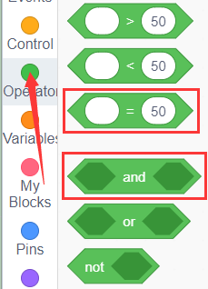
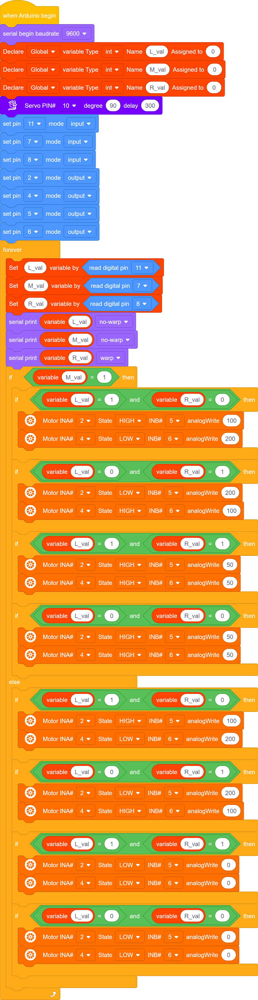
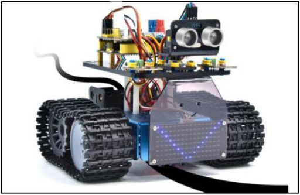

### Project 14: Lijnvolgend Pantservoertuig

#### **(1)Beschrijving:**

Het vorige project liet zien hoe je de slimme auto kunt beperken om binnen een bepaalde ruimte te bewegen. In dit project gebruiken we de eerder geleerde kennis om er een lijnvolgende slimme auto van te maken. In het experiment gebruiken we de lijnvolgsensor om te detecteren of er een zwarte lijn in de buurt van de slimme auto is, en vervolgens regelen we de rotatie van de twee motoren op basis van de detectieresultaten, zodat de slimme auto langs de zwarte lijn beweegt.

De specifieke logica van de slimme auto wordt weergegeven in de onderstaande tabel:

|               Sensor               |                          Detectie                           |
| :--------------------------------: | :----------------------------------------------------------: |
| Lijnvolgsensor in het midden | Zwarte lijn gedetecteerd: hoog niveau Witte lijn gedetecteerd: laag niveau |
|  Lijnvolgsensor aan de linkerkant  | Zwarte lijn gedetecteerd: hoog niveau Witte lijn gedetecteerd: laag niveau |
| Lijnvolgsensor aan de rechterkant  | Zwarte lijn gedetecteerd: hoog niveau Witte lijn gedetecteerd: laag niveau |

|                         Conditie 1                          |                         Conditie 2                          |   Beweging   |
| :----------------------------------------------------------: | :----------------------------------------------------------: | :----------: |
| Lijnvolgsensor  in het midden  detecteert de zwarte lijn | Lijnvolgsensor aan de linkerkant detecteert de zwarte lijn die aan de rechterkant detecteert witte lijnen | Draai links  |
| Lijnvolgsensor  in het midden  detecteert de zwarte lijn | Lijnvolgsensor aan de linkerkant detecteert witte lijnen die aan de rechterkant detecteert de zwarte lijn | Draai rechts |
| Lijnvolgsensor  in het midden  detecteert de zwarte lijn | Beide linker- en rechter lijnvolgsensoren detecteren witte lijnen Beide linker- en rechter lijnvolgsensoren detecteren de zwarte lijn | Vooruit rijden |
| Lijnvolgsensor in het midden  detecteert witte lijnen | Lijnvolgsensor aan de linkerkant detecteert de zwarte lijn die aan de rechterkant detecteert witte lijnen | Draai links  |
| Lijnvolgsensor in het midden  detecteert witte lijnen | Lijnvolgsensor aan de linkerkant detecteert witte lijnen die aan de rechterkant detecteert de zwarte lijn | Draai rechts |
| Lijnvolgsensor in het midden  detecteert witte lijnen | Beide linker- en rechter lijnvolgsensoren detecteren witte lijnen Beide linker- en rechter lijnvolgsensoren detecteren de zwarte lijn |     Stoppen     |

#### **(2)Stroomdiagram:**

#### **(3)Aansluitingsschema:**

#### **(4)Testcode:**

Je kunt ook blokken slepen om je code te bewerken, zoals hieronder weergegeven

（1）

（2）

（3）

（4）

（5）

（6）

（7）

（8）

**Volledige Testcode**

(**Let op:** Sluit de Bluetooth-module niet aan voordat je de code uploadt, omdat het uploaden van de code ook gebruik maakt van seriële communicatie, en er mogelijk conflicten kunnen ontstaan met de Bluetooth seriële communicatie, waardoor het uploaden mislukt.)

#### **(5)Testresultaten:**

Na het succesvol uploaden van de testcode en het inschakelen van de voeding, beweegt de slimme auto langs de zwarte lijn.

