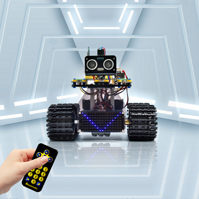
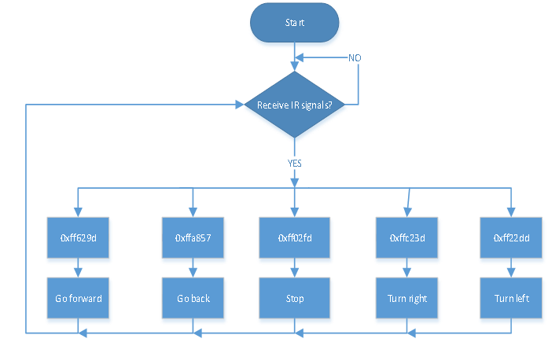
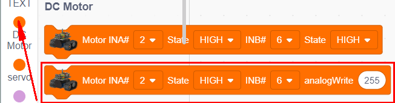
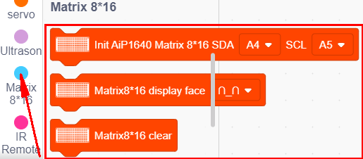
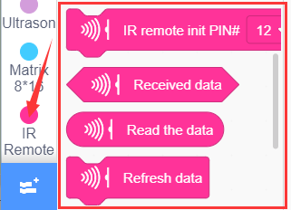
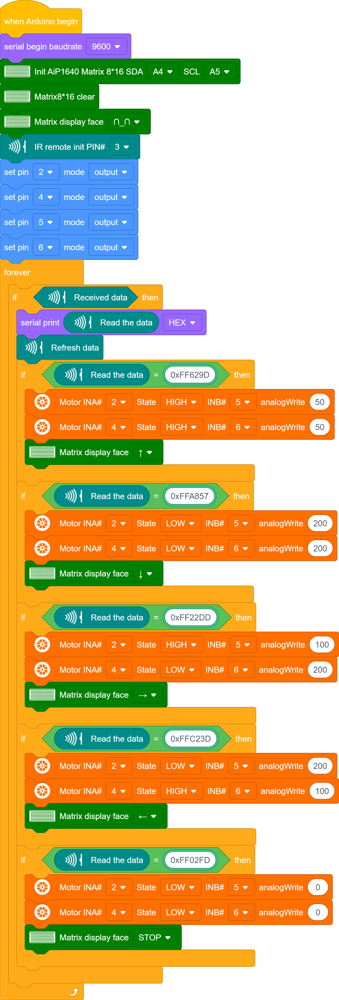
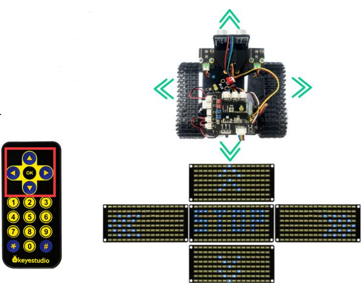

### プロジェクト15：IR（赤外線）リモートコントロールタンク

#### **(1)説明：**

赤外線リモートコントロールは、電動モーター、扇風機、その他多くの家電製品に見られる最も一般的なリモートコントロールの応用の一つです。このプロジェクトでは、これまでに学んだ知識を活用して、赤外線リモートコントロールスマートカーを作製します。

第9回のレッスンでは、赤外線リモコンの各キーに対応するキー値をテストしました。このプロジェクトでは、コード（キー値）を設定して、対応するボタンでスマートカーの動きを制御し、8X16 LEDドットマトリクスに動作パターンを表示させることができます。

スマートカーの具体的なロジックは以下の表のとおりです：

|                 超音波キー                  | キー値 | キーからの指示                                               |
| :---------------------------------------------: | :-------: | ------------------------------------------------------------ |
|  |  FF629D   | 前進（PWMを200に設定） 前進パターンを表示 |
|  |  FFA857   | 後退（PWMを200に設定） 後退パターンを表示 |
|  |  FF22DD   | 左折 "STOP"パターンを表示                     |
|  |  FFC23D   | 右折 左折パターンを表示          |
|  |  FF02FD   | 停止 "STOP"パターンを表示                          |

**初期設定：8X16 LEDドットマトリクスに""パターンを表示**

#### **(2)フローチャート：**

#### **(3)接続図：**

注意：

8x16 LEDパネルのGND、VCC、SDA、SCLは、拡張ボードのG（GND）、V（VCC）、A4、A5に接続されています。

8833ボードにはIR受信機が統合されているため、配線する必要はありません。IR受信機のピンはG（GND）、V（VCC）、D3です。

#### **(4)テストコード：**

ブロックを編集してコードを構築することができます。

（1）

（2）

(3) 

（4）

（5）

（6）

（7）

（8）

（9）

**完全なテストコード**

(**注意：** コードをアップロードする前にBluetoothモジュールを接続しないでください。コードのアップロードにもシリアル通信を使用するため、Bluetoothシリアル通信と競合が発生し、アップロードに失敗する場合があります。)

#### **(5)テスト結果：**

テストコードのアップロードが成功し、電源を入れた後、IRリモートコントロールでスマートカーの動きを制御でき、8\*16には動作に対応するパターンが表示されます。

