### Project 16: Bluetooth Remote Control

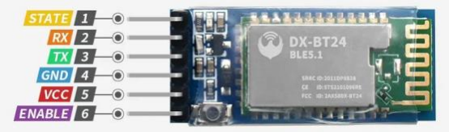

#### **(1)Description:**

In the last several decades, Bluetooth has become the most popular wireless communication module for it is easy to use and has found wide applications in most devices powered by batteries.

In order to adjust with the time and reality and need the needs of customers, Bluetooth has been upgraded several times. In recent years, it embraces lots of transformations in terms of data transfer rate, power consumption of wearable devices and IoT devices, and security systems and others. Here, we plan to learn about DX-BT24 with Arduino board.

#### **(2)Parameter:**

- Bluetooth protocol: Bluetooth Specification V5.1 BLE
- Working distance: In an open environment, achieve 40m ultra-long distance
- Communication Operating frequency: 2.4GHz ISM band
- Communication interface: UART
- Bluetooth certification: in line with FCC CE ROHS REACH certification standards
- Serial port parameters: 9600, 8 data bits, 1 stop bit, invalid bit, no flow control
- Power: 5V DC
- Operating temperature: –10 to +65 degrees Celsius

#### **(3)Application:**

The DX-BT24 module also supports the BT5.1 BLE protocol, which can be directly connected to iOS devices with BLE Bluetooth function, and supports resident running of background programs. Mainly used in the field of short-distance wireless data transmission. Avoid cumbersome cable connections and can directly replace serial cables. Successful application areas of BT24 modules:

※ Bluetooth wireless data transmission; 

※ Mobile phone, computer peripheral equipment; 

※ Handheld POS equipment; 

※ Wireless data transmission of medical equipment;

※ Smart home control; 

※ Bluetooth printer; 

※ Bluetooth remote control toys; 

※ Shared bicycles;

#### **(4)Pins description:**

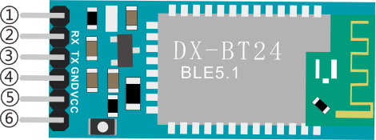

①STATE：state pin

②RX：reception pin

③TX：sending pin

④GND：grounded

⑤VCC：power pin

⑥EN：enable pin

Connect Bluetooth to the development board

| Uno  | BT24 |
| :--: | :--: |
|  TX  |  RX  |
|  RX  |  TX  |
| VCC  |  5V  |
| GND  | GND  |

#### **(5)Connection Diagram:**

#### **(6)Download APP:**

##### **For IOS system**

1\. Open App Store.

2\. Search KeyesRobot in the Apple Store and click download.

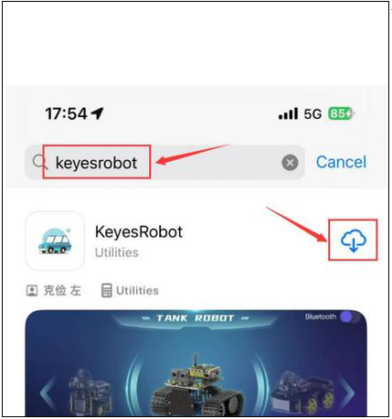

3\. After the app is installed, you will see the following icon on your phone desktop.

**How to connect iOS Phone to Bluetooth module:**

1\. Turn on the Bluetooth and location services on phone through settings.

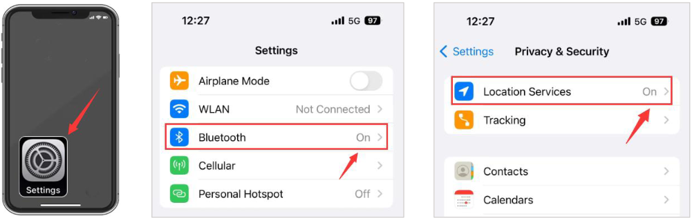

2\. Allow KeyesRobot APP to access Bluetooth through settings.

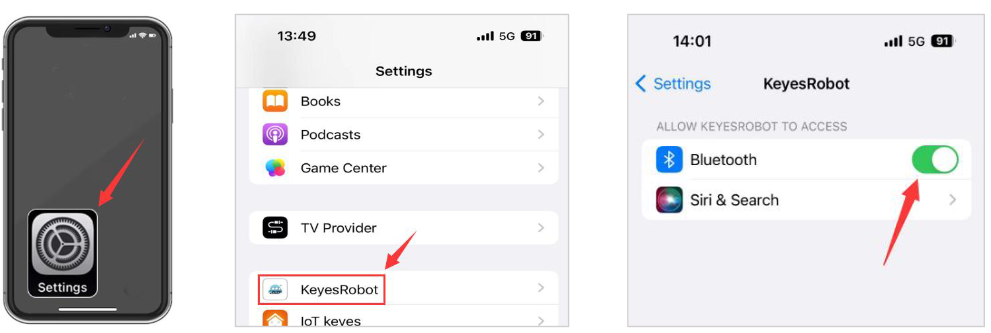

3\. Click to open KeyesRobot App.

4\. KeyesRobot App is a universal APP, which is applied to multiple keyestudio robots. If the interface does not display "TANK ROBOT", you can click the left and right buttons to find "TANK ROBOT".

5\. Click the Bluetooth button in the upper right corner to scan the bluetooth

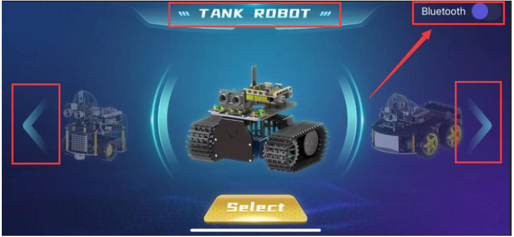

6\. You will see a Bluetooth named **BT24**, click the Connect button.

7\. If the onboard LED on the Bluetooth module stops flashing and stays on, it means your phone is successfully connected to the Bluetooth module.

##### **For Android System**

1\. Search **KeyesRobot** in Google Play, or open the following link to download and install the app. 

[https://play.google.com/store/apps/details?id=com.keyestudio.keyestudio](https://play.google.com/store/apps/details?id=com.keyestudio.keyestudio)

2\. Turn on the Bluetooth and the location services of the mobile phone

3\. Find the KeyesRobot Bluetooth app from settings, click on the permission options of the app, and
enable Location and nearby device permissions.(Note: Some mobile phones do not have nearby device permissions function.)

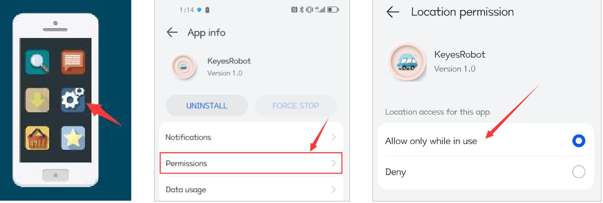

4\. Click to open KeyesRobot App.

5\. KeyesRobot App is a universal APP, which is applied to multiple keyestudio robots. If the interface does not display "TANK ROBOT", you can click the left and right buttons to find "TANK ROBOT".

6\. Click the Bluetooth button in the upper right corner to scan the bluetooth

7\. You will see a Bluetooth named **BT24**, click the Connect button.

8\. When your phone is successfully connected to the Bluetooth module, the onboard LED on the Bluetooth module will stop flashing and stay on.

#### **(7)BT Test Code:**

You can also drag blocks to edit your code, as shown below

（1）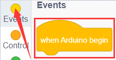

（2）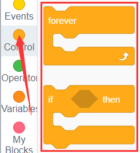

（3）

（4）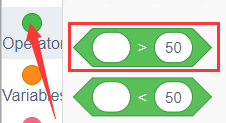

（5）

**Complete Test Code**

(**Note:** Do not connect the Bluetooth module before uploading the code, because uploading the code also uses serial communication, and there may be conflicts with the Bluetooth serial communication, which can cause the upload to fail.)

Upload the code to the development board, then plug in the Bluetooth module, and then connected the mobile phone to the Bluetooth module.

After the mobile phone is successfully connected to the Bluetooth module, click to open the Bluetooth APP and click the Select button on the homepage.

The main interface of the Bluetooth app is shown in the figure below.

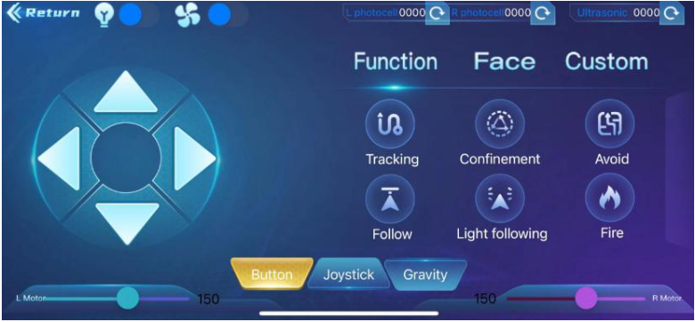

Click and set the baud rate to 9600. Click the icon on the APP interface and the serial monitor will display command sent by button.

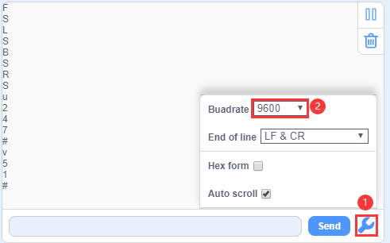

 
 
**Note: The APP connection method is the same as below.**
 
 

#### **(8)Extension Practice:**

In the above project, Bluetooth receives the signal sent by the mobile phone and displays it on the serial port of the development board. Here we use the command sent by the mobile phone to turn on or off an LED. Looking at the wiring diagram, an LED is connected to the D9 pin,

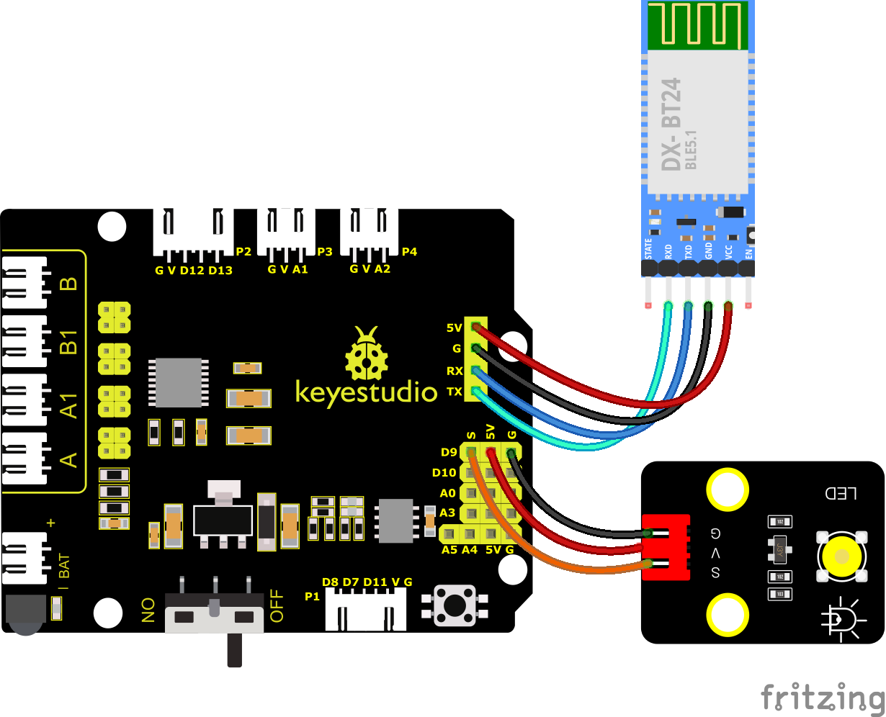

You can also drag blocks to edit your code, as shown below

（1）

（2）

（3）

（4）

(5）

（6）

**Complete Test Code**

(**Note:** Do not connect the Bluetooth module before uploading the code, because uploading the code also uses serial communication, and there may be conflicts with the Bluetooth serial communication, which can cause the upload to fail.)

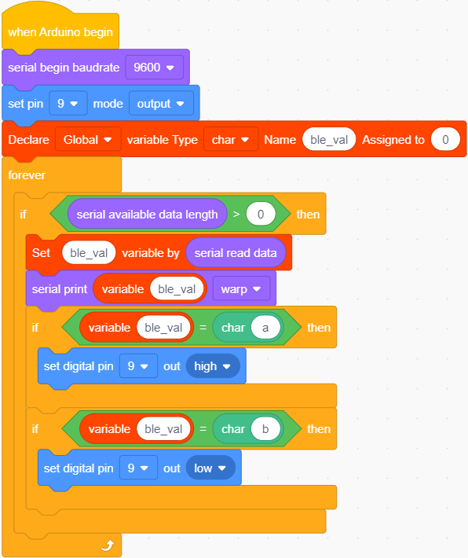

After the code above is successfully uploaded. Click  to control the LED.

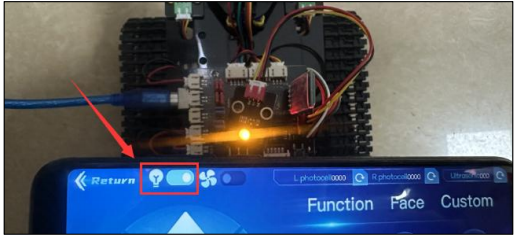

After you finish the BT project, remove it.
