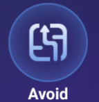
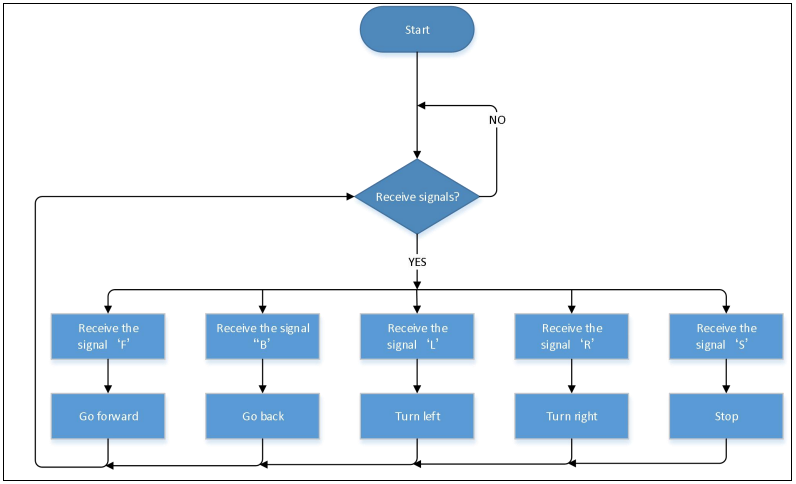
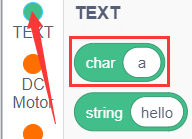
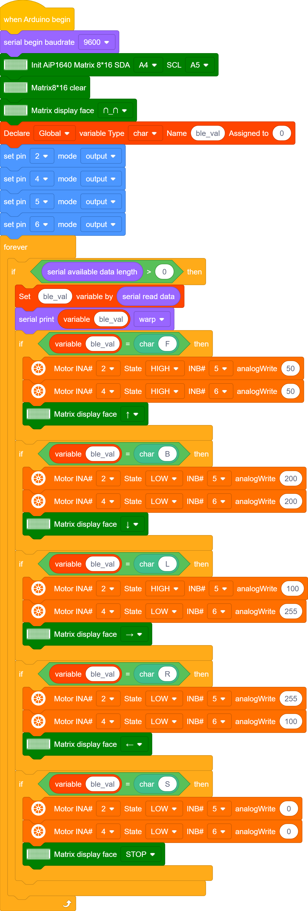
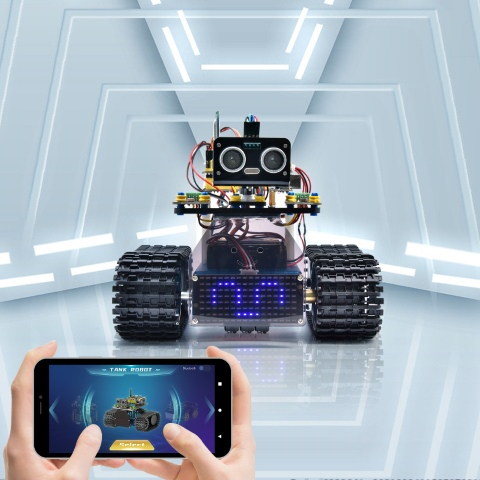
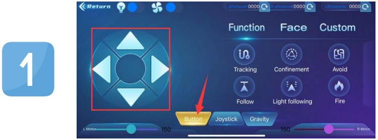
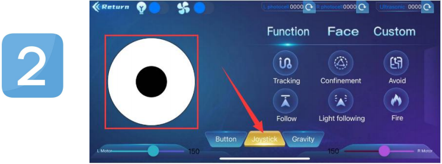
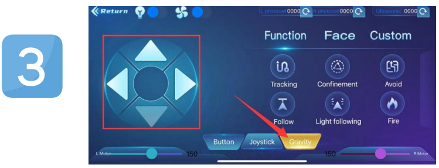

### Proyecto 17: Control de Tanque por Bluetooth

#### **(1)Descripción:**

Hemos aprendido los conocimientos básicos sobre Bluetooth en el proyecto anterior. En esta lección, usaremos Bluetooth para controlar el carro inteligente. Dado que involucra Bluetooth, se necesitan un extremo emisor y un extremo receptor. En el proyecto, usamos el teléfono móvil como emisor (maestro), y el carro inteligente conectado con el módulo Bluetooth HM-10 (esclavo) como receptor.

Aprendimos anteriormente que enviar un bit puede controlar LEDs. Y el principio de controlar este robot carro es el mismo.

Para controlar mejor el robot tanque inteligente, hemos creado especialmente una APP. En esta lección, leeremos todos los valores de las teclas en esta APP a través del código, y luego presentaremos la APP exclusiva de nuestro robot tanque.

#### **(2)Función de las Teclas en la APP:**

La siguiente tabla ilustra las funciones de las teclas correspondientes:

|                      Teclas                       |                                                |                          Funciones                           |
| :---------------------------------------------: | :--------------------------------------------: | :----------------------------------------------------------: |
|  |                                                | Emparejar y conectar el módulo Bluetooth HM-10; hacer clic de nuevo para desconectar |
|  |                                                |                 Seleccionar el robot a operar                  |
|  |                                                |       Controlar los movimientos del robot mediante botones       |
|  |                                                |      Controlar los movimientos del robot mediante joystick       |
|  |                                                |       Controlar los movimientos del robot mediante gravedad       |
|  |   Envía "F" al presionar y "S" al soltar    | El carro avanza cuando se presiona y se detiene cuando se suelta |
|  |   Envía "L" al presionar y "S" al soltar    | El carro gira a la izquierda cuando se presiona y se detiene cuando se suelta |
|  |   Envía "R" al presionar y "S" al soltar    | El carro gira a la derecha cuando se presiona y se detiene cuando se suelta |
|  |   Envía "B" al presionar y "S" al soltar    | El carro retrocede cuando se presiona y se detiene cuando se suelta |
|  |        Envía "u"+dígito+"\#" al arrastrar         |          Arrastrar para cambiar la velocidad del motor izquierdo          |
|  |        Envía "v"+dígito+"\#" al arrastrar         |         Arrastrar para cambiar la velocidad del motor derecho          |
|  |         Seleccionar para entrar a la página de Funciones          |                                                              |
|  | Envía "G" al presionar y "S" al presionar de nuevo | Entra en modo de evitación de obstáculos al presionar y sale al presionar de nuevo |
|  | Envía "h" al presionar y "S" al presionar de nuevo | Entra en modo de seguimiento al presionar y sale al presionar de nuevo |
|  | Envía "e" al presionar y "S" al presionar de nuevo | Entra en modo de seguimiento de línea al presionar y sale al presionar de nuevo |
|  | Envía "f" al presionar y "S" al presionar de nuevo | Entra en modo de movimiento en espacio confinado al presionar y sale al presionar de nuevo |
|  | Envía "i" al presionar y "S" al presionar de nuevo | Entra en modo de seguimiento de luz al presionar y sale al presionar de nuevo |
|  | Envía "j" al presionar y "S" al presionar de nuevo | Entra en modo de extinción de incendios al presionar y sale al presionar de nuevo |
|  | Seleccionar para entrar al modo de visualización de expresiones faciales |                                                              |
|  | Envía "k" al presionar y "z" al presionar de nuevo | Muestra patrón de sonrisa al hacer clic y borra la expresión al hacer clic de nuevo |
|  | Envía "l" al presionar y "z" al presionar de nuevo | Muestra patrón de disgusto al hacer clic y borra la expresión al hacer clic de nuevo |
|  | Envía "m" al presionar y "z" al presionar de nuevo | Muestra cara feliz al hacer clic y borra la expresión al hacer clic de nuevo |
|  | Envía "n" al presionar y "z" al presionar de nuevo | Muestra patrón triste al hacer clic y borra la expresión al hacer clic de nuevo |
|  | Envía "o" al presionar y "z" al presionar de nuevo | Muestra patrón despectivo al hacer clic y borra la expresión al hacer clic de nuevo |
|  | Envía "p" al presionar y "z" al presionar de nuevo | Muestra patrón en forma de corazón al hacer clic y borra la expresión al hacer clic de nuevo |
|  |                                                | Elegir para entrar a la interfaz de funciones personalizadas; hay seis teclas 1,2,3,4,5,6; con estas teclas, puedes ampliar algunas funciones por ti mismo |
|  |               Hacer clic para enviar "w"                | Hacer clic para mostrar el valor analógico detectado por la fotorresistencia izquierda |
|  |                Hacer clic para enviar "y"                | Hacer clic para mostrar el valor analógico detectado por la fotorresistencia derecha |
|  |                Hacer clic para enviar "x"                | Hacer clic para mostrar la distancia detectada por el sensor ultrasónico (unidad: cm) |
|  | Hacer clic para enviar "c"  Hacer clic de nuevo para enviar "d"  |   Presionar para encender el ventilador y presionar de nuevo para apagarlo    |

#### **(3)Diagrama de Flujo:**

#### **(4)Diagrama de Conexión:**

Nota:

GND, VCC, SDA y SCL del panel LED 8x16 están conectados a G（GND), V（5V), A4 y A5 de la placa de expansión. STATE y BRK no necesitan ser conectados. El módulo BT se inserta en la placa de expansión.

#### **(5)Código de Prueba:**

Puedes arrastrar bloques para editar tu código

（1）

（2）

(3) 

（4）

（5）

（6) 

（7）

（8）

（9）

**Código de Prueba Completo**

(**Nota:** No conectes el módulo Bluetooth antes de cargar el código, porque la carga del código también usa comunicación serial, y puede haber conflictos con la comunicación serial Bluetooth, lo que puede causar que la carga falle.)

#### **(6)Resultado de la Prueba:**

Después de cargar el código, conecta el robot al módulo Bluetooth y empareja la APP Bluetooth. Enciende el interruptor de alimentación del escudo del motor. Coloca el robot en el suelo, puedes usar estos botones de la APP Bluetooth para controlar el robot.

1. Las flechas hacia arriba, abajo, izquierda y derecha controlan el robot para moverse hacia adelante, hacia atrás, a la izquierda y a la derecha respectivamente.

2. Haz clic en el botón de joystick y arrastra la dirección del punto negro dentro del círculo blanco para controlar la dirección de movimiento del robot.

3. Haz clic en el botón de Gravedad e inclina el teléfono en las direcciones hacia adelante, hacia atrás, a la izquierda y a la derecha, y el robot se moverá en la dirección hacia la que se inclina el teléfono.

