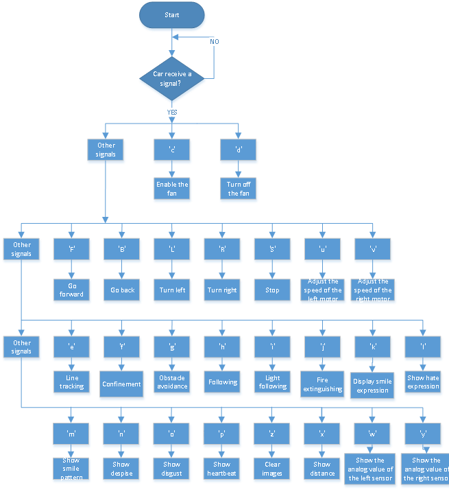

### Project 18: Ultrasonic Tank Robot Meerdere Functies

#### **(1)Beschrijving:**

De slimme auto heeft in elk vorig project één enkele functie uitgevoerd.

Kan het meerdere functies tegelijk weergeven? Ja, dat kan.

In dit laatste grote project willen we een volledige code gebruiken om de slimme auto te besturen en alle functies te demonstreren die in de vorige projecten zijn beschreven. We gebruiken de knoppen op de Bluetooth APP om automatisch te schakelen tussen verschillende functies, wat heel eenvoudig en handig is.

#### **(2)Stroomdiagram:**

#### **(3)Aansluitingsdiagram:**

1\. GND, VCC, SDA en SCL van het 8x16-bord zijn verbonden met G (GND), + (VCC), A4 en A5 van het uitbreidingsbord.

2\. VCC, Trig, Echo en Gnd van de ultrasone sensor zijn verbonden met 5V (V), 12 (S), 13 (S) en Gnd (G).

3\. De bruine draad, rode draad en oranje draad van de servo zijn verbonden met Gnd (G), 5v (V) en D10.

4\. RXD, TXD, GND en VCC van de BT-module zijn verbonden met TX, RX, G (GND) en 5V (VCC). STATE en BRK hoeven niet te worden aangesloten.

5\. De pinnen "G", "V" en S van de linker fotoweerstandsmodule zijn respectievelijk verbonden met G (GND), V (VCC) en A1; de rechter fotoweerstandsmodule is verbonden met G (GND), V (VCC) en A2, respectievelijk.

6\. De distale poorten van de lijnvolgingssensor zijn 11, 7 en 8.

#### **(4)Testcode:**

(**Opmerking:** Sluit de Bluetooth-module niet aan voordat u de code uploadt, omdat het uploaden van de code ook gebruikmaakt van seriële communicatie, en er kunnen conflicten optreden met de Bluetooth-seriële communicatie, waardoor het uploaden kan mislukken.)

**Opmerking:** U kunt de auto niet versnellen via de App.

#### **(5)Testresultaat:**

Voordat u de programmacode uploadt, moet de Bluetooth-module worden verwijderd; anders mislukt het uploaden van de code.

Nadat de code succesvol is geüpload, schakelt u de locatieservices in op uw apparaat en verbindt u vervolgens de Bluetooth-module.

Zodra de Bluetooth-module is aangesloten en ingeschakeld, en de mobiele APP succesvol is verbonden met de Bluetooth, kunnen we de mobiele APP gebruiken om de tankrobot te besturen.