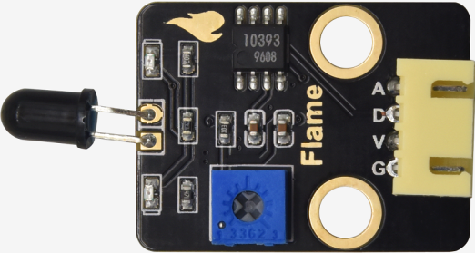
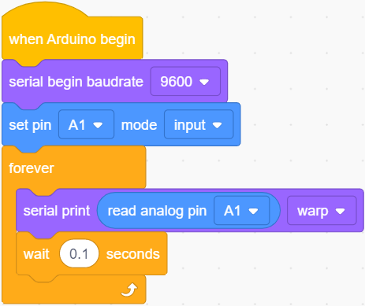
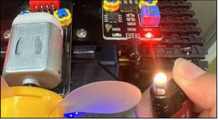
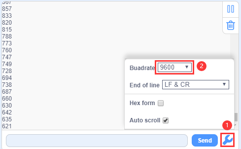
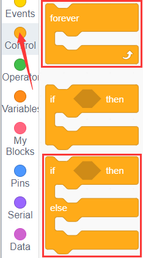
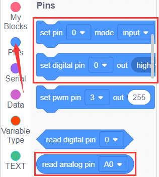
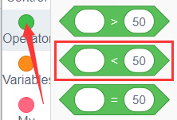
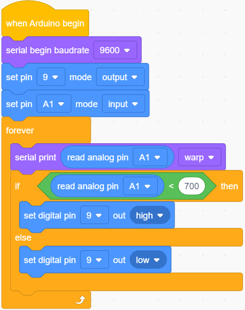
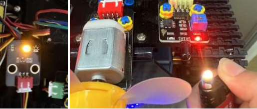

### プロジェクト19: 炎センサー

#### **(1)説明:**

炎センサーはIR受信チューブを使用して炎を検出します。炎の明るさを高低レベルの信号に変換し、中央プロセッサに入力して対応するプログラム処理を行います。炎が近くにあるかどうかによって、アナログポートの電圧値が変化します。

炎がない場合、アナログポートは約0.3Vを読み取ります。炎がある場合、アナログポートは約1.0Vを読み取ります。炎が近いほど、電圧値は高くなります。火源の検出やスマートロボットの構築に使用できます。

炎センサーのプローブは-25℃から85℃の温度範囲しか耐えられないことに注意してください。

使用中は、炎センサーが損傷しないように、火から安全な距離を保つようにしてください。

#### **(2)パラメータ:**

- 動作電圧: 3.3V-5V (DC)

- 電流: 100mA

- 最大電力: 0.5W

- 動作温度: -10°C から +50°C

- センサーサイズ: 31.6mmx23.7mm

- インターフェース: 4ピンから3PINインターフェース

- 出力信号: アナログ信号 A0、A1

#### **(3)接続図:**

2つの光抵抗のピンAはA1とA2に接続されています。炎センサーをA1とA2に接続します。2つの光抵抗と超音波センサーを2つの炎センサーとファンに置き換えると、消火カーが作られます。

**注意:**
1）この実験では火源の使用が必要です。火災を防ぐため、可燃物から離してください。子供は大人の監督のもとで実験してください。安全を確認できない場合は、実験を中止してください。
2）**炎センサーは耐火性ではありません。直接炎で燃やさないでください。**

#### **(4)テストコード:**

以下のようにブロックをドラッグしてコードを編集することもできます

**完全なテストコード**

(**注意:** コードをアップロードする前にBluetoothモジュールを接続しないでください。コードのアップロードもシリアル通信を使用するため、Bluetoothシリアル通信と競合が発生し、アップロードが失敗する可能性があります。)

#### **(5)テスト結果:**

コンポーネントを配線し、コードを書き込んで、シリアルモニターを開き、ボーレートを9600に設定します。

炎センサーのシミュレーション値を確認できます。

炎が近いほど、シミュレーション値は小さくなります。

モジュールのポテンショメーターを調整して、LEDを臨界点に保ちます。センサーが炎を検出しない場合、LEDは消灯しますが、センサーが炎を検出すると、LEDが点灯します。

#### **(6)応用練習:**

**注意:**
1）この実験では火源の使用が必要です。火災を防ぐため、可燃物から離してください。子供は大人の監督のもとで実験してください。安全を確認できない場合は、実験を中止してください。
2）炎センサーは耐火性ではありません。直接炎で燃やさないでください。
炎センサーで外部LEDを制御できます。LEDはD9に接続されたままです。火が検出されると、LEDが点灯します。

以下のようにブロックをドラッグしてコードを編集できます

**完全なテストコード**

(**注意:** コードをアップロードする前にBluetoothモジュールを接続しないでください。コードのアップロードもシリアル通信を使用するため、Bluetoothシリアル通信と競合が発生し、アップロードが失敗する可能性があります。)

ライターの炎を左側の炎センサーの近くで使用できます。炎センサーが炎を検出すると、LEDモジュールが警報として点灯します。

**注意:**
火災を防ぐため、可燃物から離してください。子供は大人の監督のもとで実験してください。安全を確認できない場合は、実験を中止してください。炎センサーは耐火性ではありません。直接炎で燃やさないでください。