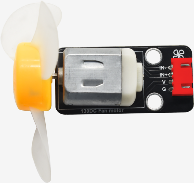
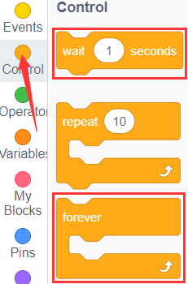
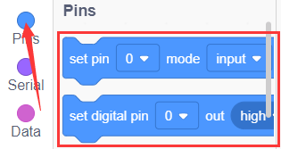
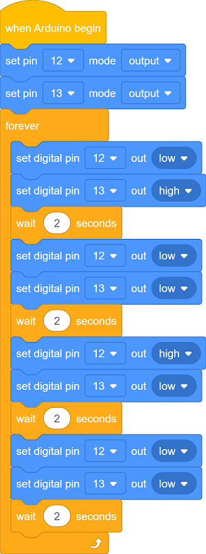
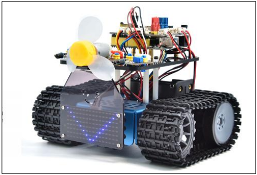
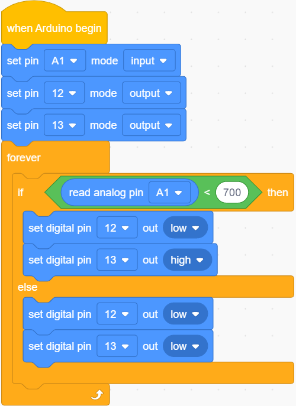
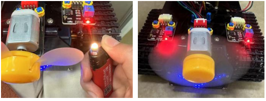

### Projekt 20: Lüfter

#### **(1)Beschreibung：**

Dieses Lüftermodul verwendet einen HR1124S Motor-Steuerchip, einen einkanal H-Brücken-Treiber-Chip, der einen PMOS- und NMOS-Leistungstransistor mit niedrigem Leitwiderstand enthält. Der niedrige Leitwiderstand kann den Stromverbrauch verringern und dazu beitragen, dass der Chip länger sicher arbeitet.

Darüber hinaus macht sein niedriger Standby-Strom und niedriger statischer Arbeitsstrom ihn für den Einsatz in Spielzeug geeignet. Wir können die Drehrichtung und Geschwindigkeit des Lüfters steuern, indem wir IN+- und IN--Signale sowie PWM-Signale ausgeben.

#### **(2)Parameter:**

- Betriebsspannung: 5V

- Strom: 200mA

- Maximale Leistung: 2W

- Arbeitstemperatur: -10 °C bis +50 Grad Celsius

- Größe: 47,6mm \* 23,8mm

#### **(3)Anschlussdiagramm:**

Das Lüftermodul benötigt einen hohen Antriebsstrom; daher installieren wir einen Batteriehalter.

Die Pins GND, VCC, IN+ und IN- des Lüftermoduls sind mit den Pins G, V, 12 und 13 des Shields verbunden.

#### **(4)Testcode:**

Sie können auch Blöcke ziehen, um Ihren Code zu bearbeiten, wie unten gezeigt

**Vollständiger Testcode**

(**Hinweis:** Schließen Sie das Bluetooth-Modul nicht an, bevor Sie den Code hochladen, da das Hochladen des Codes ebenfalls die serielle Kommunikation verwendet und es zu Konflikten mit der seriellen Bluetooth-Kommunikation kommen kann, was dazu führen kann, dass der Upload fehlschlägt.)

#### **(5)Testergebnisse:**

Code hochladen, Komponenten verdrahten, einschalten und den DIP-Schalter auf ON stellen. Der kleine Lüfter dreht sich 2s lang im Uhrzeigersinn, hält 2s lang an und dreht sich dann 2s lang gegen den Uhrzeigersinn.

#### **(6)Erweiterungsübung:**

Wir haben das Funktionsprinzip des Flammensensors verstanden. Als nächstes schließen wir einen Flammensensor in die Schaltung an, wie unten gezeigt. Dann steuern wir den Lüfter so, dass er das Feuer mit dem Flammensensor ausbläst.

Sie können Blöcke ziehen, um Ihren Code zu bearbeiten, wie unten gezeigt

**Vollständiger Testcode**

(**Hinweis:** Schließen Sie das Bluetooth-Modul nicht an, bevor Sie den Code hochladen, da das Hochladen des Codes ebenfalls die serielle Kommunikation verwendet und es zu Konflikten mit der seriellen Bluetooth-Kommunikation kommen kann, was dazu führen kann, dass der Upload fehlschlägt.)

Nach dem Hochladen des Codes schalten Sie den Netzschalter des Motor-Drive-Shields ein. Der Lüfter kann eingeschaltet werden, wenn eine Flamme vom linken Flammensensor des Roboters erkannt wird.

