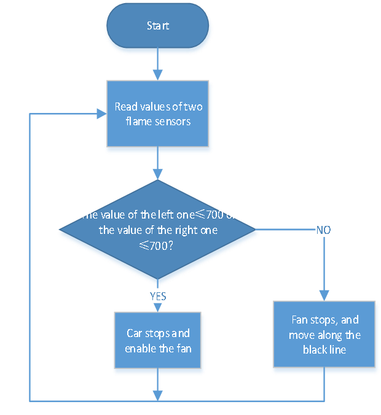
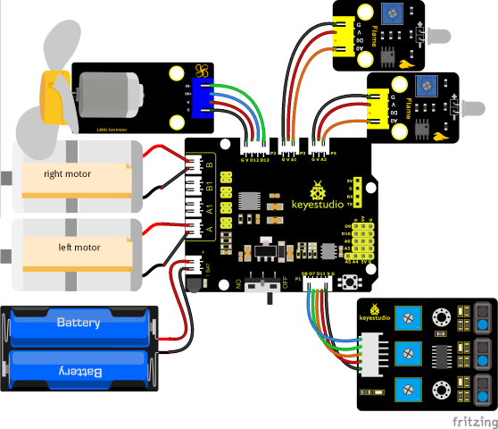
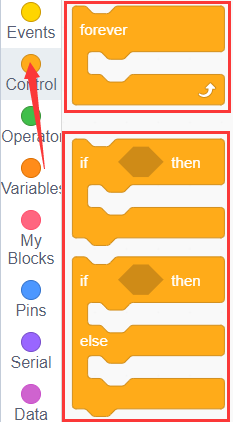
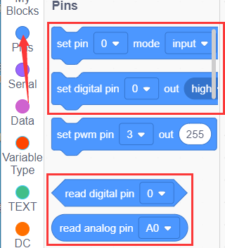
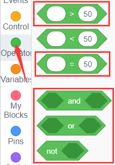
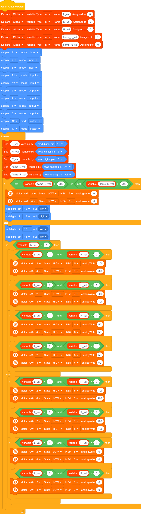
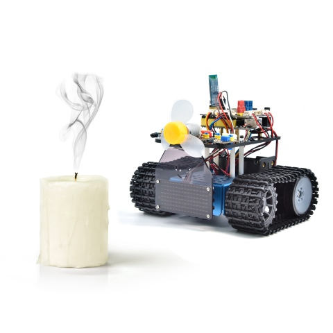

### Projekt 21: Feuerlösch-Panzer

#### **(1) Beschreibung:**

Die Spurverfolgungs-Funktion des Smart-Panzers wurde im vorherigen Projekt erläutert. In diesem Projekt verwenden wir den Flammensensor, um einen Feuerlöschroboter zu bauen.

Wenn das Fahrzeug auf Flammen trifft, dreht sich der Motor des Lüfters, um das Feuer auszublasen. Natürlich müssen wir zuerst den Ultraschallsensor und die beiden Fotowiderstände durch ein Lüftermodul und Flammensensoren ersetzen.

Die spezifische Logik des Smart Cars ist in der folgenden Tabelle dargestellt:

| Linker Flammensensor | Rechter Flammensensor | Status                                                        |
| :------------------: | :-------------------: | :------------------------------------------------------------ |
|        ≤700          |         ≤700          | Auto stoppt, Lüfter beginnt zu drehen, um die Flamme auszublasen |
|        ≥700          |         ≥700          | Auto stoppt, Lüfter beginnt zu drehen, um die Flamme auszublasen |
|        ≥700          |         ≥700          | Auto stoppt, Lüfter beginnt zu drehen, um die Flamme auszublasen |
|        ＞700         |         ＞700         | Lüfter stoppt, Auto bewegt sich                               |

**Hinweis:**
1） Dieses Experiment erfordert die Verwendung einer Feuerquelle. Bitte halten Sie Abstand von brennbaren Gegenständen, um Brände zu verhindern. Kinder sollten das Experiment unter Aufsicht von Erwachsenen durchführen. Wenn Sie sich nicht sicher sind, dass Sie sicher sind, verzichten Sie bitte auf das Experiment.
2） Der Flammensensor ist nicht feuerfest, bitte verbrennen Sie ihn nicht direkt mit einer Flamme.
Wir können eine externe LED mit dem Flammensensor steuern. Die LED ist weiterhin mit D9 verbunden. Wenn Feuer erkannt wird, leuchtet die LED auf.

#### **(2) Flussdiagramm:**

#### **(3) Anschlussdiagramm:**

Hinweis:

GND, VCC, SDA und SCL des 8x16-LED-Panels sind mit G（GND), V（VCC), A4 und A5 verbunden.

G, V und A der beiden Flammensensoren sind mit G（GND), V（VCC), A1 und A2 des Erweiterungsboards verbunden.

#### **(4) Testcode:**

Sie können auch Blöcke per Drag-and-Drop bearbeiten, wie unten gezeigt

（1）

（2）

（3）

（4） 

（5） 

（6）

**Vollständiger Testcode**

(**Hinweis:** Schließen Sie das Bluetooth-Modul nicht an, bevor Sie den Code hochladen, da das Hochladen des Codes ebenfalls serielle Kommunikation verwendet und es zu Konflikten mit der seriellen Bluetooth-Kommunikation kommen kann, was dazu führen kann, dass der Upload fehlschlägt.)

#### **(5) Testergebnisse:**

Nachdem der Testcode erfolgreich hochgeladen wurde, schalten Sie die Stromversorgung ein und stellen Sie den DIP-Schalter auf die ON-Seite. Das Smart Car löscht das Feuer, wenn es eine Flamme erkennt.

**Hinweis:**
Bitte halten Sie Abstand von brennbaren Gegenständen, um Brände zu verhindern. Kinder sollten das Experiment unter Aufsicht von Erwachsenen durchführen. Wenn Sie sich nicht sicher sind, dass Sie sicher sind, verzichten Sie bitte auf das Experiment. Der Flammensensor ist nicht feuerfest, bitte verbrennen Sie ihn nicht direkt mit einer Flamme.