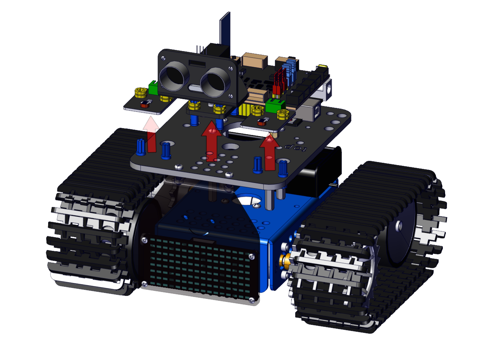
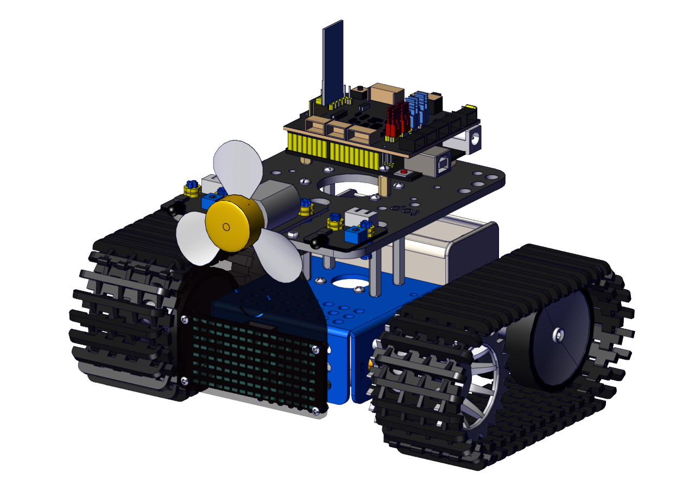
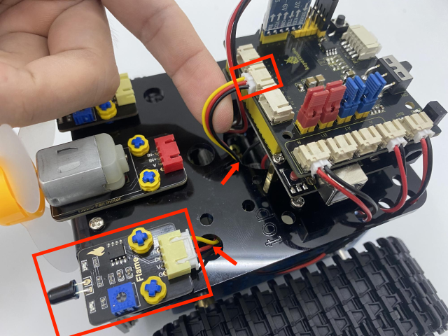
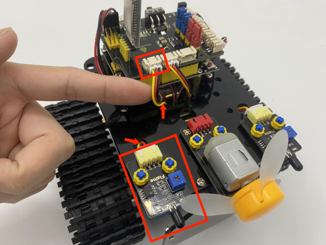
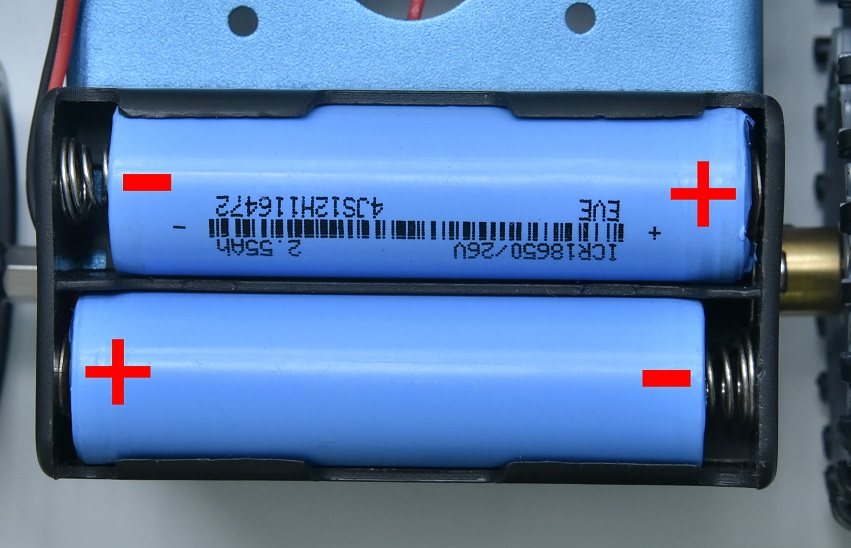

### Assemble Fire Extinguishing Robot

Remove the ultrasonic sensor and two photoresistors

Put on a fan module and two flame sensors

You can make the fan module install further if the fan module and flame sensors interfere

**Wire up**

Wire up the two flame sensors

| Flame Sensor | Keyestudio 8833 Board |
| :----------: | :-------------------: |
|      G       |           G           |
|      V       |           V           |
|      A       |          A1           |

| Flame Sensor | Keyestudio 8833 Board |
| :----------: | :-------------------: |
|      G       |           G           |
|      V       |           V           |
|      A       |          A2           |

Wire up the fan module 

| DC130 Motor | Keyestudio 8833 Board |
| :---------: | :-------------------: |
|      G      |           G           |
|      V      |           V           |
|     IN+     |          D12          |
|     IN-     |          D13          |

------

 **We adopt a model 18650 lithium battery with a pointed positive pole, whose power and capacity are not required.**

